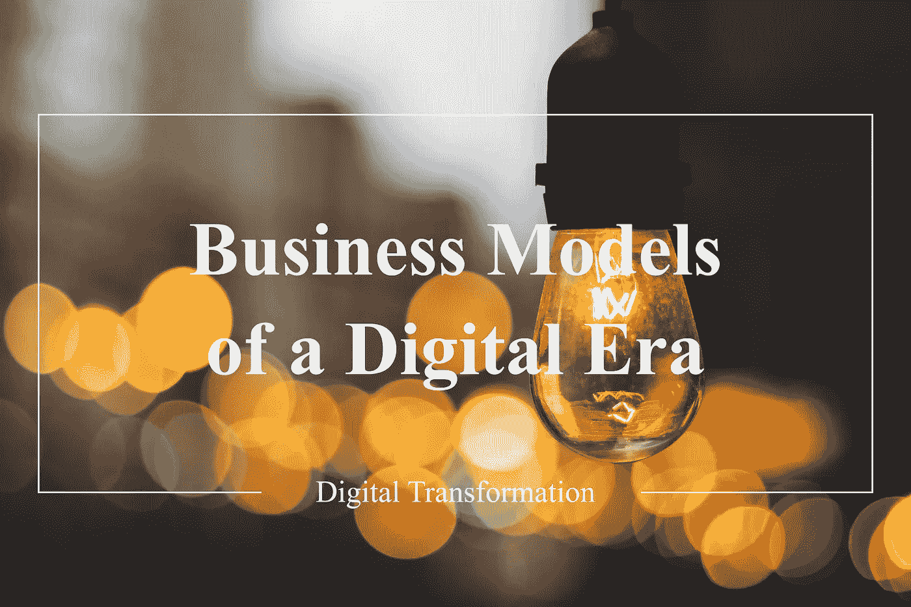
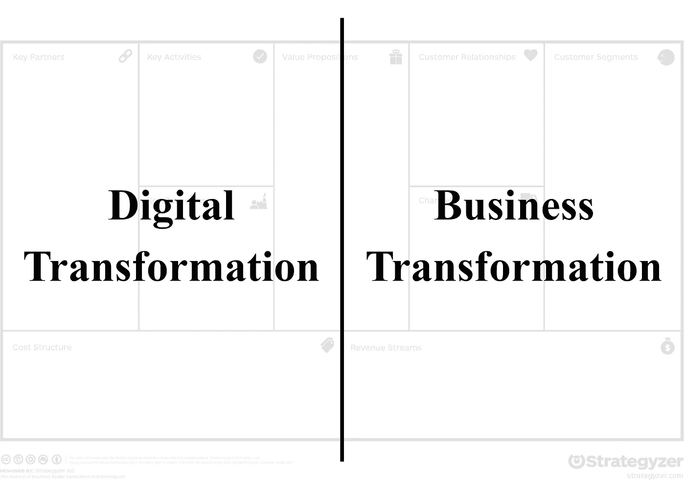

# 数字时代的商业模式

> 原文：<https://medium.datadriveninvestor.com/business-models-of-a-digital-era-5a530ccbd52f?source=collection_archive---------4----------------------->

Business models of a digital era and the role of digital transformation

在关于改变公司现状的主要驱动因素的讨论中,“数字化转型”的说法受到了高度关注。可能是新一代年轻的数字原住民，也可能是经济中的循环波，也称为康德拉蒂耶夫波，在我们的后信息时代，媒体消费或个人可用性等行为正在发生变化。由于这种行为变化，公司必须调整其业务模式以保持竞争力。这篇文章的目标是提高对技术影响新商业模式的认识，并强调已经出现的数字商业模式的可识别模式。

# **数字化转型和业务转型**

虽然数字化转型粗略地描述了可用于使公司开展新业务的新技术的出现，但业务转型是一种从战略上调整业务以适应未来的方式。业务转型的主要目标是彻底更好地满足目标受众的需求。数字化转型和业务转型之间的相互依赖性非常强，因为数字化转型限制了公司转变业务的能力。例如，客户希望在现有的移动应用程序中添加一个高度期待的功能，该公司可能会开发该功能，但由于该应用程序所基于的技术的许可结构，该功能不会盈利。因此，该技术的局限性不仅在于可行性，还在于成本效率和企业决策。另一方面，为了让想法继续下去，企业正在调整技术。随着业务前景的一致，公司会或不会投资开发和发展业务支持技术。

# **数字商业模式**

商业模型是一种用最重要的核心要素和各种使商业想法独一无二的特性来表达商业想法的便捷方式。本文中的业务模型术语遵循业务模型画布(BMC)，这是由 Osterwalder 和 Pigneur 提出的最常见的业务模型框架( [Link](https://amzn.to/2xQabSX) )。BMC 提供了可视化业务模型的结构，并使不同模型的讨论和比较标准化。到目前为止一切顺利，但是数字商业模式呢？数字商业模式反映了受到社会正在经历的数字转型特征影响的模式。这种做作可能是对单个组件的小调整，也可能是对商业模式核心的重大调整。当谈到数字化转型时，BMC 的焦点主要集中在模型的后台，该模型旨在提供向客户交付产品和服务所需的一切。相比之下，业务转型始于前台，通过提供独特的价值主张专注于客户细分。请将此视为一种关系，在这种关系中，业务转型是面向客户的一部分，而数字化转型是从技术上提供客户想要的产品和服务的一部分。

Digital transformation and business transformation in the BMC

# **支持数字商业模式的技术**

为了更好地满足当前的业务需求，信息技术正面临着向新兴技术或现有技术的不断转变。Gartner 的炒作周期是了解市场中可预见的技术趋势的良好工具，有助于评估其成熟度。当前新兴技术的一个例子是高级分析领域的自适应机器学习。机器学习的研究主要是由一个庞大的研究人员和公司社区正在致力于进一步发展这一事实支持的。除了新技术的出现，数字商业模式的主要驱动力是优化技术的发展。云计算就是一个可以在这里列举的例子。它可能不是新技术，但在过去几十年中，它已经从昂贵的按需计算资源进一步发展为提供廉价、高度可用的计算基础设施。熟悉摩尔定律的人可能会更好地理解技术进化的指数过程。

# **商业模式的数字模式**

模式将业务模型分成具有相似或互补特征的类别，因此定义了可重用的架构组件。商业模型模式的一个非常传统的例子是多边平台模型，它将消费者和提供者聚集到一个中间平台上。因此，数字模式显示了反映数字转换组件的业务模型的分类。从传统的商业模式模式来看，订阅和按使用付费模式构成了数字时代模式的基础。以下列表列举了 Gassmann 等人([链接](https://amzn.to/3cVP9Rq))启发的一些模式，这些模式可以分配给数字商业模式:

*   直销电子商务平台
*   开源数据平台
*   人工智能标签众包平台
*   开放的商业生态系统
*   服务高可用性模型
*   超个性化和定制模型
*   资产和货币的数字化模型
*   基于从属关系的社会营销模式
*   销售模型的客户体验
*   基于免费增值的订阅模式

# **例子:Shopify 和 B2C 零售的未来**

在过去的几十年中，B2C 销售模式旨在与零售商合作，向大量潜在买家销售制成品或服务。想到网上零售商，亚马逊和易贝就是突出的例子。公司通过零售商提供的产品与其他品牌的产品相结合，并且不加区别地提供给托管在线平台的用户。在最近的数字时代，销售模式正在偏离通过这样的市场集中提供产品，因为消费者期望更密切的客户关系。虽然通过在线营销可以很容易地接触到目标受众，但越来越多的公司正在建立自己的网上商店，以主动应对他们的目标群体。以直接消费者销售模式提供产品的另一个优势是减轻推动业务的主导零售商的压力。

Shopify 提供多渠道电子商务平台，使企业能够创建直销模式。这家加拿大公司通过创建基于云的直观在线商店，绕过了基础设施、财务和运营等障碍。这些服务将支付、客户关系、营销和运输功能结合到一个最先进的电子商务平台中。Shopify 提供了哪些早期零售平台无法提供的东西？Shopify 使在线商店的设置速度超快，并提供了 SaaS 解决方案，品牌不必考虑托管基础设施。Shopify 正在提供一个充满即用功能的应用商店，以定制商店并为消费者创造客户购物体验。如果需要 100%定制，Shopify 提供使用他们的电子商务后端作为一个无头解决方案，允许你建立自己的前端。Shopify 提供各种价格组合，让每个品牌都有机会为您的在线商店应支持的功能选择最佳方案。对于公司来说，高级版提供了无限的可能性。Shopify 通过更好地满足企业的目标群体，允许通过高利润的收入流更加独立于托管零售平台，从而为企业带来了 B2C 零售革命。

# **重新思考数字时代的商业战略**

企业要想在不断变化的数字环境中取得成功，就需要用新的、更具创新性的组件来更新过时的业务模式，以保持与市场上其他参与者的竞争力。虽然这对小公司和初创公司来说似乎容易得多，但成熟的公司可能不得不考虑不同产品和更复杂的相互依赖关系的几种商业模式。这种情况下的解脱是坚持业务建模的基本原则，定义一个战略业务模型，在一个高层表示中包括所有不同的产品，显示它们的交互点。将高级业务模型分解成不同的面向产品的业务模型，可以揭示出初始业务模型只需要轻微的调整，因为调整的效果将是倍增的。因此，优化商业模式可能是将现有业务优势与新的推动因素(如通过 Shopify 的直销平台)结合起来的关键。除了轻微的调整，商业模式的根本改变在过去已经取得了成功，因此在数字时代也是可行的，因为有如此多的新可能性。

# **结论和最终想法**

数字化转型是企业在前台面临的业务转型的关键驱动力。社会中的行为变化以及新技术或进化技术的出现使我们能够创建具有数字一致组件的商业模式。将业务模型归类到相似的策略中，表明在数字时代存在可以用作架构组件的数字模式。Shopify 的电子商务平台示范性地强调了适应 B2C 零售未来的商业模式。重新思考业务战略是基于产品的复杂性，但可以通过创建一个整体愿景来加以利用，该愿景可以分解为单个基于产品的模型。在讨论数字时代的商业模式时，有更多的东西需要深入研究——这篇文章只会给出一个大概的概述。

# **进一步阅读**

下面的阅读材料可以拓宽和补充上述一些主题的观点。

> **《天生数字:儿童如何在数字时代成长》(** [**链接**](https://amzn.to/2KAvTgh) **)**
> 《天生数字》是了解正在塑造我们经济的第一代数字原住民的必备读物。从消费者的角度来看，他们对信息感知和社会学行为的态度为新的客户需求做出了巨大贡献，并推动了数字化转型。

> **数字化转型行动手册:为数字化时代重新思考您的业务。哥伦比亚商学院出版(** [**链接**](https://amzn.to/2VAiBqy) **)**
> 数字化转型剧本代表的观点是，数字化转型更多的是重新思考一个公司的战略，而不是依靠新技术。思考如何通过在现有业务模式中采用新技术来适应传统公司的数字化转型。