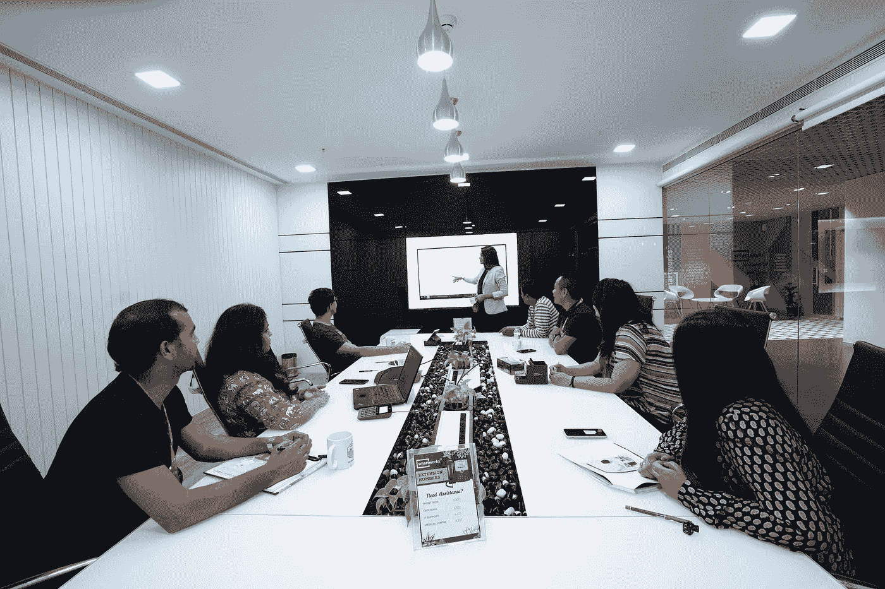

# 商业对商业仍然是个人的

> 原文：<https://medium.datadriveninvestor.com/business-to-business-is-still-personal-15cab40acb5?source=collection_archive---------14----------------------->

## 对自己的个性放松会带来财务上的成功

Photo by Amy Hirschi on Unsplash

从商业中获取商业需要大量的工具:聊天机器人、视频营销、电子邮件营销、个性化交流和人工智能。

许多或所有这些都超出了努力实现收支平衡的一般企业家的才能。

[马莎安诚](https://twitter.com/Shama)不典型。作为 [Zen Media](https://zenmedia.com/) 的首席执行官，她身兼作家和主题演讲人的多重角色，帮助其他企业主在 B2B 营销中取得成功。

 [## 将关系放回商业营销中

### 正如 Jessika Phillips 所描述的那样，她“肩负着让人际关系回归商业前沿的使命……

blog.markgrowth.com](https://blog.markgrowth.com/put-relationships-back-into-business-marketing-b9c8a9d58704) 

她的资历包括被任命为 LinkedIn 营销领域的顶级代言人，以及在 OneDine 担任首席营销官。

在 Krost 的#MillennialTalk Twitter 聊天中，Hyder 与千禧专家、顶级营销和品牌代言人、全球发言人 [Chelsea Krost](https://twitter.com/ChelseaKrost) 进行了交谈。他们讨论了如何将 B2B 营销转化为财务成功。

反映整体趋势，B2B 营销可能会更加重视视频。Hyder 还注意到这些不断增长的实践:

*   影响者营销。到目前为止，这是最热门的趋势之一，也是真正有效的策略。我们确实看到了巨大的成果，尤其是在 B2B 层面——企业希望通过利用影响者营销向小型企业营销。
*   远程事件。在 Zen Media，我们在 B2B 体验领域做了大量工作。我们发现，在全球流行病中，人们比以往任何时候都更关注数字。
*   B2B 公关。公共关系不是一个“好东西”，而是一个必须品。我无法告诉你我们现在有多忙，帮助我们的客户在重大危机前走在前面。这是一家公司能够真正建立信任并主导行业对话的时候。

除了这些趋势，Krost 还看到了自己动手虚拟培训的激增。她指出，MarketProfs 列举了去年的这些顶级营销目标:

*   创造品牌认知度(86%)
*   教育观众(79%)
*   建立信誉和信任(75%)

与此同时，越来越少的 B2B 营销人员表示，他们的努力实现了以下目标:

*   建立订阅受众(45%)
*   创造销售或收入(53%)
*   与现有客户和顾客建立忠诚度(63%)

# **化繁为简**

人工智能是发展最快的趋势之一，最常见于聊天机器人的“人”。这些将在市场营销中变得更受欢迎，因为它们更具人情味。

“人工智能不必复杂，”海德尔说。“这个想法非常简单。

她说:“以 [Lumen5](https://twitter.com/LumenFive) 或者宣传片为例。“你可以用人工智能创建视频，将书面内容与正确的剪辑相匹配，然后将其转化为视频。”

 [## 人工智能在你眼皮底下出奇的聪明

### 你已经和人工智能互动了，却不知道

medium.datadriveninvestor.com](/ai-is-surprisingly-smart-right-under-your-nose-58550d9d397c) 

Hyder 还盯上了由 rand fishkin 开发的[spark toro](https://twitter.com/sparktoro)，它使用数据和人工智能来找到谁在谈论一个给定的话题。

“尽管人工智能听起来非常未来化和高科技，但人工智能将有助于通过个性化使商业更像人类，”克罗斯特说。“这将使医疗保健更加准确，成本更低。

“聊天机器人在匹配人类对话方面会变得更加准确，”她说。

然后是机器人流程自动化。

“根据麦肯锡全球研究所的一项研究，到 2055 年，我们将近一半的工作任务将由某种形式的机器人来完成，”Krost 说。“人工智能将能够自动化任何例行或重复的工作。”

随着企业在 B2B 营销中更多地使用聊天机器人，聊天机器人将变得更加突出。

克罗斯特说:“在这个时间就是金钱的世界里，多亏了聊天机器人，你可以保持你的业务全天候运行。”

“医疗保健、金融服务、酒店、房地产、零售、电子商务、娱乐和出版等基于服务的行业都开始使用人工智能来个性化、发展和自动化大小商业任务，”她说。

Krost 发现了小型企业在聊天机器人的帮助下成长的最佳方式:

*   客户服务和回答常见问题
*   影响决策
*   简化支付

“聊天机器人可以根据从简单问题和以前的互动中收集的数据为用户提供建议，”Krost 说。“人工智能和聊天机器人可以增加社交媒体上的客户参与度。这可以提高你的产品和服务的知名度和流量。”

# **对话开始者**

Hyder 补充说，聊天机器人让企业家在潜在客户所在的地方会见潜在客户。

“B2B 买家甚至在与你聊天之前，已经完成了销售过程的 60%以上，”她说。“他们已经决定了。聊天机器人是帮助更快开始对话的好方法。

海德尔说:“我们在 Zen Media 利用漂移与我们的潜在客户和媒体建立联系。“这是关于在人们所在的地方与他们见面。”

 [## 分享无限的愿景

### 使用视频将有助于小企业脱颖而出

medium.datadriveninvestor.com](/share-a-vision-without-limits-b3fdeb7890df) 

营销中最有效的视频利用人们来抓住故事的核心。与其说这涉及到技术，不如说是真正的情感。

“视频营销可能是一种非常有效的营销工具，因为这是讲故事、展示和讲述的最佳机会，”Krost 说。根据 Wyzowl 的调查，66%的消费者更喜欢看视频而不是阅读产品介绍。

“制作贯穿客户生命周期的视频，”她说。“把他们从陌生人变成忠诚的顾客。创建案例研究和证明。”

Photo by Smartworks Coworking on Unsplash

视频在不太明显的平台上取得了长足的进步。

“T2 的 LinkedIn 是视频和 B2B 的天赐良机，”Hyder 说。“如果你是一家 B2B 公司，自己做不了视频，找一个 LinkedIn 的影响者帮你做。绝对不要坐失良机。

“如果有人想[看到一个活生生的例子](https://www.linkedin.com/in/shamahyder/)，我已经在 LinkedIn 上分享视频两年了，”她说。“我有 62 万订户。”

付费广告占营销预算的百分比并不是一个固定的数字。很像选择哪个社交媒体平台，答案是，看情况。

“与其说你花了多少钱，不如说你知道你的观众在哪里，”克罗斯特说。“一定要把你的广告费花在目标受众最多的平台上。

“我喜欢建立在我的广告预算上，”她说。“首先，用较小的预算试水。一旦平台或广告证明表现良好，就进行测试、改进并增加预算。”

# **成功的公式各不相同**

Krost 报告了这些统计数据:

*   B2B 公司通常每年花费总收入的 6.4%到 6.8%用于营销。
*   97%的 B2B 营销人员使用 LinkedIn 进行内容营销。
*   78%的 B2B 营销人员认为 LinkedIn 是内容营销的有效工具。
*   59%的 B2B 营销人员表示，LinkedIn 为他们的业务带来了商机。

 [## 获得你的 2 美分价值:预算营销

### 以很少甚至免费的方式宣传你的业务

blog.markgrowth.com](https://blog.markgrowth.com/get-your-2-cents-worth-marketing-on-a-budget-801786370414) 

“你的营销预算实际上取决于你的总体投资回报，”Hyder 说。“对于一些品牌来说，付费广告效果很好，而另一些则不太好。对于 B2B 公司来说，营销资金必须比以往任何时候都更好地融入漏斗。

“LinkedIn 和谷歌都是 B2B 付费广告的绝佳平台，”她说。

安诚也非常看重有影响力的人。

“影响者营销绝对是付费消费的一个很好的用途，”她说。“我们已经取得了巨大的成功。”

人们常说，电子邮件是赚钱的地方。从当前的联系人开始，添加您在网上或亲自遇到的联系人。[销售线索磁铁](https://blog.markgrowth.com/lead-magnets-attractive-ways-to-get-your-foot-in-the-door-2005d8be6f96?source=friends_link&sk=486e392d0e5fa857a8efc14adaae5512)是建立电子邮件列表的好方法。

Krost 将这些“巨大的好处”添加到电子邮件营销中:

*   邮件营销性价比高。
*   你可以自动发送电子邮件，并培养这个过程。
*   电子邮件让你个性化你的信息。
*   您可以创建交互式或多媒体电子邮件来增加参与度。
*   跟踪回复和打开率，了解受众行为。

“73%的营销人员同意电子邮件营销是他们业务的核心，比社交媒体有效 40 倍，”Krost 说。"就投资回报而言，电子邮件营销继续被列为最佳渠道."

正如马克·吐温可能说过的，关于电子邮件死亡的报道被大大夸大了。

“电子邮件根本没有消亡，”海德尔说。“这必须比以前更加深思熟虑，因为营销人员会毁掉一切。

“从你的观众和更大的目标开始，”她说。“工具很简单。内容和一致性是更难的部分。”

Hyder 推荐了电子邮件营销的伟大范例，敦促人们注册 [Chris Brogan](https://twitter.com/chrisbrogan/) 、 [Ann Handley](https://twitter.com/annhandley/) 和 [CB Insights](https://twitter.com/CBinsights/) 。

“这些家伙做得对，”海德尔说。

# **从 SEO 开始跳转**

搜索引擎优化有利于增加在搜索中被发现的机会。诀窍是首先要了解 SEO。可以在家里尝试，但是和专家一起工作会有帮助。

“第一印象和第一次搜索很重要，”克罗斯特说。“SEO 有助于让你的企业出现在网络搜索的第一页。如果你的企业不是这些结果之一，那就意味着其他人是，而且这个人很可能是你的竞争对手之一。

“搜索引擎优化是最被低估但却是获取客户最有力的工具之一，”她说。" 60%的人在网上购物前会做调查."

 [## 对于 SEO 来说，文字是关键

### 通过了解搜索引擎优化的基础知识来利用

medium.datadriveninvestor.com](/for-seo-the-words-are-key-691ed1fb8d1e) 

Hyder 声称没有需求生成就没有[销售线索生成](https://www.datadriveninvestor.com/2019/03/18/lead-generation-starts-from-day-1/)。

“你必须创造意识，”她说。“潜在客户的研究比以往任何时候都多。

“SEO 是一个漫长的游戏，但非常值得一玩，”Hyder 说。“我们与一个客户合作，通过结合 SEO、内容和公共关系，他们的年收入从几百万美元增长到了 9600 万美元。这是一家私人家族企业——不是一家大型企业。”

随着 B2B 电子商务的兴起，她说这使得搜索引擎优化对这些品牌更加重要。

营销预算少的企业应该利用手头最便宜的营销工具:他们的员工。直接或通过家人和朋友认同公司愿景和使命的忠诚员工是[品牌最大的支持者](https://blog.markgrowth.com/company-cheerleaders-shout-your-praises-b0b24ca1014c?source=friends_link&sk=b483a1421ba1b7085ffa14a7bb758e0c)，让冰冷的线索瞬间变暖。

“一切不是时间就是金钱，”Hyder 说。“如果你有更多的时间，播客和创造有思想的内容是一个成功的策略。创意是免费的。大规模的创新是要花钱的。

“太多人将金钱视为一种资源，”她说。“不是的。这是当务之急。它会去品牌认为会有回报的地方。”

Krost 表示，资金最好用于电子邮件营销、社交媒体、直播、免费网络研讨会、播客、Twitter 聊天和电子书。

# **个性化**

公司可以比以往更加个性化他们的 B2B 营销工作。根据 [Salesforce](https://www.salesforce.com/) 的客户关系管理专家的说法，72%的买家希望 B2B 公司能够个性化沟通。同时，69%的购买者愿意为更个性化的体验支付更多的钱。

“根据机会、规模和适合度对你的目标受众进行细分，”Krost 说。“确保你的网站与你的客户相关。你的电子邮件活动应该针对当前和潜在客户的需求。

“当涉及到战略和品牌信息时，要时刻牢记用户体验，”她说。“通过在多个上下文中重新定位，利用顺序消息传递来个性化您的活动。比如他们看了你的视频。或许你下一步可以用图像广告来锁定他们。”

 [## 对于视频，关注你的业务

### 创造伟大的内容需要思考，客户也能看出来

contentgrind.com](https://contentgrind.com/for-video-focus-on-your-business-c3e9385ed63b) 

解决方案可能没有那么难，也没有那么昂贵。

“其中一些很简单，比如为销售人员提供更好的材料和培训，”Hyder 说。“我给销售部门做了很多主题演讲。然后他们看到这是多么容易。

“那里有很多工具，”她说。“然而，更大的问题是同理心和可扩展性。一家公司必须足够关心他们的买家，他们必须找到一种可持续发展的方式。”

Hyder 发现 LinkedIn 销售导航器是 B2B 个性化营销的一个很好的工具。

从潜在客户那里收集个人信息是一个信任的问题，这是移情和关怀的自然结果。如果你在商业实践中是真诚的，人们会关注并响应你的行动号召。

以下是 Krost 建立信任的步骤:

*   [先听](https://medium.com/datadriveninvestor/strategic-social-listening-is-real-life-90c8a07b7c3f)。
*   针对个人。
*   要透明。
*   保持一致。
*   证明你的能力。
*   要真实。

# **权衡便利**

“根据 IDC 的数据，65%的 B2B 买家通常只有在他们已经做出购买决定后才会聘请销售代表，”Krost 说。“对于 75%的 B2B 公司来说，需要一到六个月的时间。

“根据 Acquity Group 的数据，83%的 B2B 买家在决策过程中会查看供应商的网站，”她说。"这意味着与你的网站建立信任是关键."

 [## 把负面宣传变成你的优势

### 公司可以克服负面因素，但这需要时间

medium.datadriveninvestor.com](/turn-bad-publicity-into-your-strength-5cd1f1466d78) 

这关系到每个人最珍贵的商品。

“我们每天都在用隐私换取便利，”Hyder 说。“关键是提供价值和保持透明。

“信任很难获得，很容易失去，而[几乎不可能重新获得](https://www.datadriveninvestor.com/2019/08/30/turn-bad-publicity-into-your-strength/)，”她说。“第一次就做对。”

Hyder 的阅读清单上最重要的是她认为 Chris Brogan 的“伟大”和“高度相关”的书， [*“信任代理人:利用网络建立影响力，提高声誉，赢得信任。”*](https://www.amazon.com/Trust-Agents-Influence-Improve-Reputation/dp/0470635495)

她还在 Zen Media 兜售她的 B2B 宣言。

**关于作者**

吉姆·卡扎曼是拉戈金融服务公司的经理，曾在空军和联邦政府的公共事务部门工作。你可以在[推特](https://twitter.com/JKatzaman)、[脸书](https://www.facebook.com/jim.katzaman)和[领英](https://www.linkedin.com/in/jim-katzaman-33641b21/)上和他联系。