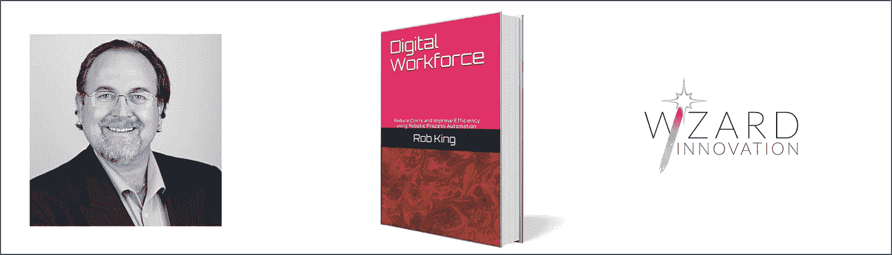

# 业务转型？需要突破性的变革

> 原文：<https://medium.datadriveninvestor.com/business-transformation-breakthrough-change-is-needed-607b312fa08a?source=collection_archive---------12----------------------->

Photo by [Sammie Vasquez](https://unsplash.com/@sammieeev?utm_source=medium&utm_medium=referral) on [Unsplash](https://unsplash.com?utm_source=medium&utm_medium=referral)

战略是一个具有挑战性的课题；在过去的几年里，我会见了一些组织并向他们咨询，当谈到战略时，似乎有两个常见的陷阱:

1.  首先难以形成清晰的愿景，或者
2.  实现愿景的困难。

一年前我遇到的一家大型科技公司就是一个很好的例子；他们制定了一个大胆的愿景，以巩固现有的客户基础。*到目前为止，一切顺利……*

现在，根据定义，“ ***一个大胆的愿景*** ”应该是极具挑战性的，很可能超出现有组织的现有能力。如果不是这些东西，那就既不大胆，也没有特别伟大的眼光！在你今天拥有的和你将来需要的之间总会有一些能力差距。*我们正在进行一场有趣的讨论……*

 [## 一个企业在肚子上移动:如何照顾直觉|数据驱动的投资者

### 事实证明，直觉不仅仅是一种感觉。科学很清楚:你的直觉比你知道的更多…

www.datadriveninvestor.com](https://www.datadriveninvestor.com/2018/11/09/a-business-moves-on-its-stomach-how-to-make-allowances-for-gut-feelings/) 

但是现在橡胶上路了。企业期望一个重大的"*"突破性变革可以通过做你今天所做的事情来逐步实现，只有更多/更快/更好才会失败。问题不在于愿景，而在于交付(或能力)。问题是，当这种差距被忽视或根本没有认识到。*这就是我们的讨论变得有趣的地方……**

***原因是权利***

*当增量更改不再提供任何性能优势时，流程到达 ***授权*** 。在这种情况下，提高性能的唯一方法是彻底重新思考流程是如何执行的。这就是所谓的 ***的突破性变革，*** 的突破当前工艺约束的玻璃天花板。*

*回到我们的科技行业，一个大胆的愿景要想成功，就需要彻底的变革。需要彻底的整体变革，而不是简单地修补几个程序。听到所需变革的广度令他们感到意外，这并不奇怪。将愿景转化为交付是理解成功所需的新能力，如何获得这些技能，以及它们在未来的部署位置。*然而，并不是每个企业都准备好听到这个消息……**

***大胆地走***

*这家公司希望复制同行业竞争对手的成功，但成功的企业正在收获他们两年或两年多前所做决策的回报。那些渐进式思考的组织，现在正试图在两年后模仿成功的选择，只会更加落后。如果这是你的选择，规避风险的战略是好的，但不要与 ***转型战略*** 相一致，以与市场领导者竞争。你不能再只是模仿竞争对手了。*太晚了…**

*接下来发生了什么？*

*我们的讨论就此结束，12 个月后，我对我们的科技公司没有取得任何重大市场进展并不感到惊讶。他们继续走在中间，徘徊在人群的中间。他们有一个大胆的愿景，但并不真正了解将愿景付诸行动所需的变革水平，也没有这样做的意愿。事实上，他们厌恶风险，也没有准备好采取转型变革的措施。*伟大的愿景，可能对他们来说是错误的愿景，以及糟糕的跟进…**

*突破性的改变仍然是可能的，不是通过模仿，而是激进的思维和彻底改造。他们是否有足够的动力在未来的某个时候进行一次彻底的飞跃，以加速他们在市场中的地位，还有待观察。*

*如果你正在制定一个 ***业务转型愿景*** ，那么要明白渐进式变革不会让你成功，你需要对重大的文化和能力变革有兴趣… ***突破性变革****

*抢劫*

**

*Rob King, Author of Digital Workforce and Consultant on Improvement, Change and Innovation*