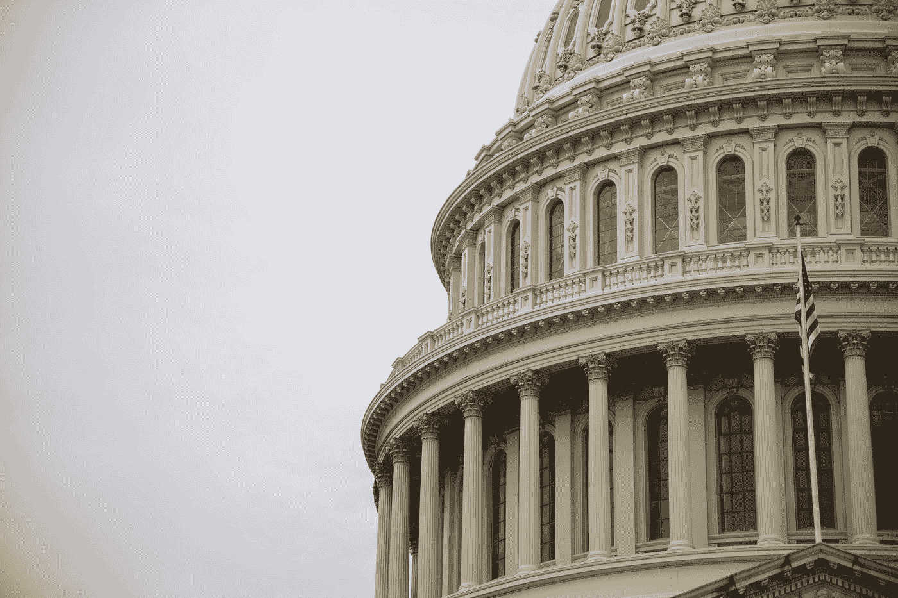
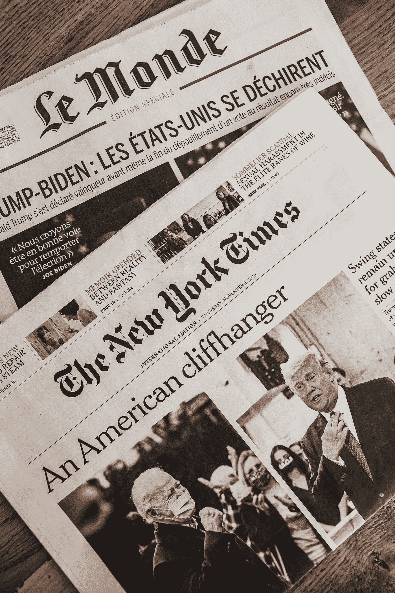

# 企业倒闭，数百万人失业……那么，为什么股市会反弹呢？

> 原文：<https://medium.datadriveninvestor.com/businesses-closed-millions-were-left-unemployed-so-why-did-stocks-rally-275264956a6e?source=collection_archive---------6----------------------->

Photo by [Robert Bye](https://unsplash.com/@robertbye?utm_source=medium&utm_medium=referral) on [Unsplash](https://unsplash.com?utm_source=medium&utm_medium=referral)

> “…我们是在泡沫中吗？”

许多投资者和股票市场的一般追随者对当前市场的未来有些担忧。

自从疫情的冲击导致最初的回调以来，我们只看到了看涨的反弹和增长。自那以后，投资者向股市投入了数十亿美元，现在空气中弥漫着一种情绪，认为这一切似乎好得难以置信。

**一切都要崩溃了吗？**

一年多前，我们将经历一场全球性的疫情，导致成千上万的企业倒闭，数百万人失业，世界大部分地区受到封锁的限制，这种想法似乎相当疯狂。

但是，尽管对我们来说，这是充满了许多曲折、转折和下跌的忙乱的一年，但股市自 3 月份以来一直在飙升。

为什么在经济动荡的时候，股市却在增长？失业率一直处于历史最高水平，世界各地的企业都被迫关闭，人们被锁在家里，支出大大减少，但股市仍在快速增长，这怎么可能？

## **这实际上没有你想象的那么奇怪。**

为了让事情看起来更清楚，我们需要问正确的问题。如果 4900 万美国人申请失业救济，那么是什么在推动市场中的资本增长，它来自哪里？如果每个人都在失业，经济萎缩，那么这些钱从哪里来？

自 3 月份股市首次下跌以来，只有富裕的高净值投资者和政府才抓住机会投资股市，这一点或许很容易区分。

但是，当世界各地的企业纷纷倒闭或停工时，投资者为什么要将资金投入市场呢？

# 科技巨头们

在我们不可避免地走向自动化和广泛使用技术的过程中，全球疫情起到了催化剂的作用。感谢 Zoom、Alphabet、微软、苹果这样的公司；我们似乎在白领行业中保持了相当高的生产率水平，这为“新常态”铺平了道路，这种“新常态”很可能会持续下去，甚至在疫情全面结束后也是如此。

你不再需要出现在办公室，也不需要飞到世界各地参加会议。尽管整体经济状况不佳，但这些关键事实鼓励投资者将数十亿美元投入最优秀的全球科技公司，这些公司在将全球指数基金带入极其乐观的领域方面发挥了重要作用。

> 前五大科技股占标准普尔 500 指数总市值的 20%以上。

然而，尽管这回答了我们的问题，即为什么投资者继续向股市投入数十亿美元，但它仍然没有告诉我们所有这些钱来自哪里。

# 量化宽松

量化宽松是政府和中央银行用来刺激经济的政策。

Photo by [Joshua Sukoff](https://unsplash.com/@joshuas?utm_source=medium&utm_medium=referral) on [Unsplash](https://unsplash.com?utm_source=medium&utm_medium=referral)

当经济像今年这样放缓时，央行开始印更多的钱，然后用这些钱购买政府债券等固定利率证券。这种新的货币供给最终会降低货币成本，同样，任何产品供给的增加最终都会降低需求，从而影响产品的价值。

**这就是为什么今天你的银行账户利率为零。**

由于经济中货币供应量的增加，银行不再希望/需要向你提供有吸引力的利率来鼓励你将钱存入账户。

不要太专业，这种量化宽松政策和政府的财政刺激政策，就像美国的刺激检查和英国政府的休假；是什么导致了新的现金流进入股票市场。

毕竟，经济中有更多的现金流入世界各地普通人的手中，他们不再从银行获得任何增长激励，将现金存入他们的账户。**因此，这些政策旨在抑制储蓄，增加个人和企业的支出。**

然而，对于那些仍然希望有效地储蓄和增长他们的钱的人来说；除了投资股市还有什么地方可以放？毕竟，将资金存入利率低于 2%通胀率的固定利率投资和银行账户会适得其反。

# 这对未来意味着什么？

对于那些仍处于被动收入和退休财务旅程积累阶段的人来说，如果你打算把现金放在银行或其他低息环境中，你会发现很难看到投资有任何增长。

鉴于目前的经济状况，预计低利率在相当一段时间内不会回到适度水平。对我们来说不幸的是，中央银行和政府需要长期鼓励支出，以刺激经济达到可持续的水平——因此将利率保持在 0%的激励将保持不变。

> 预计未来五年利率不会超过 1%。

这意味着，未来五年，我们很可能会看到股市进一步上涨，因为投资者有更大的动力将资金从低息环境和银行账户中撤出。

但是这不是我们期待更多增长的唯一原因。

Photo by [Markus Spiske](https://unsplash.com/@markusspiske?utm_source=medium&utm_medium=referral) on [Unsplash](https://unsplash.com?utm_source=medium&utm_medium=referral)

近几个月来，美国大选在整个市场持续存在的不确定性中扮演了重要角色。

虽然众所周知，唐纳德·特朗普(Donald Trump)有时会被证明有些不可预测，但许多人担心共和党失败或胜利对选举结果的影响——在他失败后，当他威胁要将此事诉诸法庭时，这变得越来越理性。

无论是共和党人还是民主党人，这都会给我们的经济带来不确定性，并导致全球股市更加动荡。

***美元代表整个全球经济的 25%。***

如今，乔·拜登(Joe Biden)当选美国总统，唐纳德·特朗普(Donald Trump)似乎也开始接受自己的失败，美国大选造成的任何波动都已经开始停止。

随着这种不确定性被排除在等式之外，尽管我们预计很快就会生活在民主政策之下，但我们可能会看到投资者对投资于市场增长感到更放心。

> 与流行的观点相反，股票市场在历史上在民主党总统任期内表现更好。

然而，这与任何一个政党的政策都没有关系，更多的是与民主党当选的时间有关。

从历史上看，民主党派是在社会动荡和经济不稳定时期当选的。选民倾向于对更倾向于社会主义的民主政策更有信心，而对承担个人风险则信心不足。

**这是许多投资者预期增长的另一个关键指标，他们认识到我们经济的周期性，并了解我们当前的无息环境。**

Photo by [JC Gellidon](https://unsplash.com/@jcgellidon?utm_source=medium&utm_medium=referral) on [Unsplash](https://unsplash.com?utm_source=medium&utm_medium=referral)

**增长的最后一个障碍最终是疫情。**

我们最近得到了多种疫苗有望取得进展的消息；特别是辉瑞疫苗**，研究表明其在试验中有超过 90%的有效性。**

**辉瑞公司的首席执行官 Albert Bourla 宣布，如果该疫苗获得 FDA 的紧急使用授权，他们将在今年年底前获得 5000 万剂疫苗，并在明年年底前获得 13 亿剂疫苗。**

**上个月早些时候，这一消息已经在市场上引起了巨大的反应，当时股市开始看到投资者抛售 Zoom 和网飞等科技公司的股票，并开始购买达美航空和其他旅游公司的股票。**

**这是一个微妙的迹象，表明如果一种疫苗被 FDA 批准，市场会有什么反应。截至今天，英国已正式批准辉瑞疫苗，并预计在未来几周内推出。**

****这将极大地改变许多不同行业的机会和增长基础。****

# **我们的“新常态”**

**随着安全疫苗的开发和分发有望在明年(甚至更早)在全球范围内实现，我们很可能会看到生活的许多要素回归到我们曾经知道的正常状态。**

**人们将返回工作岗位，餐馆和酒吧将再次营业到深夜；社交活动、音乐节和环球旅行将再次成为常态。**

****但是这里还有什么可留恋的呢？****

**在主导市场十多年后，我们知道技术对我们在封锁期间的生活方式的影响比其他任何领域都大。**

**鉴于行业的进步以及在疫情任期内向亚马逊、微软和 Alphabet 等公司投入的数十亿美元；我们可以肯定的是，我们越来越依赖于技术，以及它对我们日常生活方式的影响，这意味着它肯定会继续存在。**

****在我们团队最近开展的一项民意调查中，我们发现 42%的投票者认为可持续能源将成为未来 10 年的主导领域:****

****

****可持续能源和技术将可能成为未来市场的驱动力；鉴于当前的经济形势和我们的低利率环境，你可以预计投资者将在 2021 年继续做多市场。****

# ****最终想法:****

**股票市场并不总是反映当前的经济状况，尽管在波动性较小的时期，两者之间有很大的相关性。重要的是要记住，股票市场是我们如何相信我们的经济在我们今天集体拥有的资源的情况下未来会是什么样子的一个投影。**

**这就是为什么科技股在疫情持续增长，而旅游业却在各个方面都遭受重创。当事情开始以更快的速度发展时，我们可能会看到在疫情期间被搁置的行业有更多的增长，同时也会看到随着新公司和现有公司试图适应新的世界，市场朝着不同的方向发展。**

****截至今天，2020 年 2 月 12 日，英国已正式批准辉瑞疫苗，并将在未来几周内推出。****

**让我们看看这将如何影响我们的市场。**

# **你对当前的市场有什么看法？你认为我们会在 2021 年看到更多增长吗？作为投资者，你对哪些行业最感兴趣？**

**在 LinkedIn 上与我聊天:**

** [## Jacob Thompson -商务助理-西班牙 deVere | LinkedIn

### 我通过增加回报和减税来帮助人们增加财富。

www.linkedin.com](https://www.linkedin.com/in/jacob-thompson-34076b1a9/)** 

******本文仅供参考。******