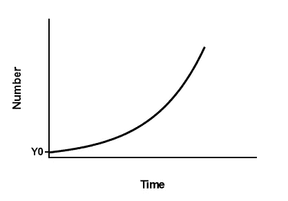

# 生意兴隆

> 原文：<https://medium.datadriveninvestor.com/businesses-on-steroids-14bb80306adf?source=collection_archive---------9----------------------->

创业公司是打了类固醇的企业。为了加速超越自然极限的增长过程，初创公司经常以资本的形式注入类固醇。如果成功，创业公司将几十年的增长压缩到几年内。然而，如果他们错过了成长的里程碑，他们将努力寻找类固醇，打破旧习惯并不容易。

创业之路是挑战现有体制的一种方式，要么在给定的市场中超越现有者，要么创造新的市场。创业的方式并不是建立一个和平且有利可图的企业来养活家人的最佳方式。

Exponential growth curve

最近，由于乐观的市场环境，我们到处都能看到指数图。另一方面，风险投资家和企业家已经熟悉这种图表有一段时间了。你遇到的每一个企业家都会向你展示一个指数增长图( *y 轴可以是从客户到收入*的任何东西)，并且会注意到这是一个保守的预测。

指数增长曲线完美地代表了创业心态。初创公司的目标是将几十年的增长压缩到几年内。他们在最初几年注入大量人力和金融资本，目标是无论如何都要快速增长。企业家想象一个未来的世界，在这个世界中，初创公司是一个成功的大公司，并找出达到这种未来状态的方法。在这个过程中，企业家向其他利益相关者推销她的梦想，如员工和投资者，并以过去的成就记录支持她的梦想。创业公司的每个利益相关者都有一个共同的梦想。对梦想的信念是由过去的成长支撑的。

如果创业公司错过了成长的里程碑，就很难找到创业公司旅程的信徒。创业公司将努力吸引资本和人才，这意味着不再有类固醇。此外，对于一家初创公司来说，转型为一家自负盈亏的公司并不容易。为了创造一个想象中的未来状态，初创企业欠下了当前状态的债。创业公司的支出超过了收入。产品的单位经济性(*商业模式的收入和成本与单个单位的关系*)大部分时间都需要改进。投资者拥有[流动性偏好](https://www.investopedia.com/terms/l/liquidation-preference.asp)，这降低了低于目标估值时提前退出对创业者的吸引力。

指数增长思维也体现在风险投资公司对投资组合公司的质量要求上。他们寻找新的方法来解决市场上现有的解决方案。如果你在同样的事情上做得稍微好一点，你可以建立一个好的企业或者发展一个现有的企业，但是你不可能在短时间内超越大市场。已知的解决方案有更好的成功概率，但在成功的情况下回报较低。风险资本家更喜欢创新:成功的概率较低，但成功的回报较高。此外，风险投资人非常关心团队。由于初创企业的目标是实现快速登顶，许多高风险决策会在短时间内累积起来。你需要强有力的决策者来带领你从一无所有走向胜利，而且没有时间和资源来雇佣一群额外的人。

我们认为所有的初创公司都是由风险投资公司资助的软件公司，将这些分开是有用的:风险投资是一种股权融资，初创公司是一种业务，软件是一种产品。我们看到很多反例。有许多自助创业公司(*筹集很少或没有资金，通过收入推动增长*)。我们也看到许多具有运营特征的创业公司或非创业软件公司。

风险资本是一种股权融资，出现于 20 世纪 70 年代，为初创阶段需要大量资本注入的美国半导体公司提供资金。后来，事实证明，以积极的商业心态投资软件企业是有用的。对于很多企业来说，创业的方式并不是最好的方式。对于许多企业来说，债务和自举是风险资本更好的融资选择。