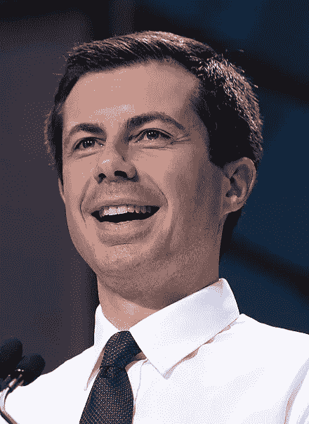
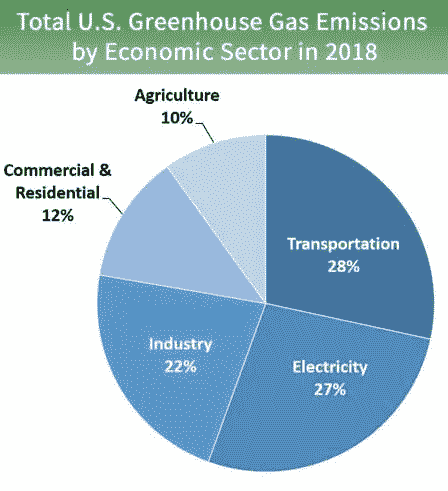

# 但是 tigieg 是我们的飞机、火车和汽车秘书！！！

> 原文：<https://medium.datadriveninvestor.com/buttigieg-is-our-secretary-of-planes-trains-and-automobiles-316f632b8e97?source=collection_archive---------18----------------------->

## Pete 市长确认要改造我们的基础设施(在此过程中密切关注特斯拉)…

Pete Buttigieg in 2019 (Wikimedia Commons)

印第安纳州南本德市前市长、冉冉升起的民主党新星皮特·布蒂吉格现在是乔·拜登总统的交通运输部长，掌管着新政府的一项重大变革政策。昨天(2021 年 2 月 2 日),美国参议院以 86 比 13 的投票结果批准了该法案。

我在彼得市长被拜登提名后，也就是他在这里得到确认之前，写了一篇关于他的文章:

 [## 但是交通部长的职位被选中了

### 拜登提名他的主要对手之一市长皮特…

medium.com](https://medium.com/predict/buttigieg-tapped-for-transportation-secretary-4cba2c8479d) 

现在让我们来看看皮特市长担任交通部长后，我们的国家将走向何方。

# **1。** **拜登的交通计划……**

乔·拜登总统除了首先将美国从疫情拯救出来之外，还将通过创造数百万个高薪职位来重建我们国家的基础设施，从而重振我们的经济。拜登计划的一大部分是对美国交通基础设施进行现代化投资，并减少我们对气候变化的影响。实施这些举措将主要落在皮特·布蒂吉格的肩上。

拜登计划中以某种方式触及交通的领域包括:

*   基础设施——道路、桥梁、绿地、供水系统、电网、宽带互联网。
*   汽车行业——从材料和零件到成品车的国内汽车供应链，重点是电动汽车，包括电动汽车充电基础设施。
*   公交——零排放公共交通，包括轻轨、公共汽车以及自行车和行人基础设施。
*   电力——可再生碳无污染发电。
*   创新——清洁能源技术，包括电池存储、负排放、建筑材料、可再生氢和先进核电。
*   环境正义——消除弱势群体(主要是穷人和少数民族)中不成比例的污染。

这些计划背后有强大的力量，预算在 10 年内达到 1.3 万亿美元。

拜登的许多政策领域都直接或明显受到交通部长美国运输部(DOT)下属联邦机构的影响。

Buttigieg 现在监管着 DOT 内十几个机构中的 55，000 名员工。其中包括一些最熟悉的大公司，如 [FAA](https://www.faa.gov/) (联邦航空管理局，预计预算为[175 亿美元](https://www.transportation.gov/sites/dot.gov/files/2020-02/FY%202021%20FAA%20President%27s%20Budget.pdf))，以及 [FHWA](https://highways.dot.gov/) (联邦公路管理局，预计预算为[493 亿美元](https://www.transportation.gov/sites/dot.gov/files/2020-02/FHWA%20FY%202021%20President%27s%20Budget%20%282%204%2020%29.pdf))。但是 DOT 也包括像 FTA(联邦运输管理局控制着 145 亿美元的预算)和 NHTSA(国家公路交通安全管理局运营着 9 . 65 亿美元)这样的机构。

但是 Buttigieg 也很可能通过国会正在审议的 1.9 万亿美元的冠状病毒救助计划来影响其他政策。该支出法案包括以下与交通相关的项目:

*   从 3500 亿美元的州和地方援助计划中划出 200 亿美元用于公共交通
*   从用于 K-12 和高等教育的 1700 亿美元中，一些将用于增加运输能力

# **2。** **《变形金刚》…**

一些最大的社会变革目前正在交通领域发生，包括特斯拉大力推动交通电气化和自动化，以公交、优步和 Lyft 为代表的移动即服务(MaaS)，物联网(IoT)和互联交通的爆炸，等等。

我写过关于特斯拉电动汽车(ev)革命的文章，包括以下内容:

 [## 特斯拉的平流层发射继续进行

### 回顾历史数据，展望 2020 年第 3 季度收益电话会议

medium.com](https://medium.com/datadriveninvestor/teslas-stratospheric-launch-continues-b0d242497cf2)  [## 特斯拉的爆炸性销售相比，汽车行业

### 今年到目前为止，谁是销售额最高的人？

medium.com](https://medium.com/datadriveninvestor/teslas-explosive-sales-compared-to-the-auto-industry-5cdf9a81e7dc) 

特斯拉的首席执行官 Elon Musk 将他的公司专注于电动汽车，因为交通是美国温室气体(GHG)排放的最大来源。因此，Buttigieg 处于一个非常有利的位置，对全球变暖产生巨大的影响，而不仅仅是官僚主义地增加公共汽车和火车的城市预算(哈欠)。

(Image from [EPA](https://www.epa.gov/ghgemissions/sources-greenhouse-gas-emissions))

事实上，[拜登的计划](https://joebiden.com/clean-energy/)表明了他们通过加速美国电动汽车生产来减少 GHG 排放的承诺:

> “……拜登将利用联邦政府的所有杠杆……将**美国定位为电动汽车及其原材料和零部件制造的全球领导者**。拜登将大力执行贸易规则...在美国国内，他将刺激工厂车间的扩张和现有制造能力的重组，并在汽车制造、汽车供应链和汽车基础设施领域创造 100 万个新工作岗位。他将确保这些工人有高薪工作，并可以选择加入工会。从 1979 年的[到 2018 年的](https://www.epi.org/productivity-pay-gap/)，美国工人的生产率提高了 70%，而他们的实际工资只增长了 12%…”
> 
> (科学强调)

拜登进一步详述了联邦政府将如何刺激需求，从而鼓励美国公司供应清洁电动汽车:

> “……利用联邦采购的力量增加对美国制造、美国采购的清洁汽车的需求。作为其增加采购投资的历史性承诺的一部分，拜登将做出重大联邦承诺，为联邦、州、部落、邮政和地方车队购买清洁车辆，确保我们保留运营和维护这些车队所涉及的关键工会工作。通过提供直接、明确和稳定的需求来源，这一采购承诺将有助于大幅提高美国生产清洁汽车和零部件的工业能力，同时加快这些车队中 300 万辆汽车的升级换代……”

The [Verge](https://www.theverge.com/2021/1/25/22249237/biden-electric-vehicle-government-fleet-ev) 指出，仅联邦政府就拥有超过 64.5 万辆汽车，其中包括 24.5 万辆民用汽车、17.3 万辆军用汽车和 22.5 万辆邮局汽车。

今年 1 月 28 日，通用汽车董事长兼首席执行官[玛丽·巴拉首次宣布](https://www.nbcnews.com/business/autos/gm-go-all-electric-2035-phase-out-gas-diesel-engines-n1256055)该公司将在 2035 年前逐步淘汰汽油发动机。通用汽车此前从未公布过逐步淘汰汽油发动机的艰难日期。

将天然气驱动的经济转变为电力驱动令人兴奋，但我们不能让数百万辆电动汽车在没有基础设施为它们充电的情况下上路。特斯拉在充电基础设施上投入了大量资金，我在这里写道:

 [## 特斯拉的全球增压器网络

### 特斯拉的超级充电站网络遍布全球，以对抗全球变暖…

medium.com](https://medium.com/datadriveninvestor/teslas-global-supercharger-network-526705822bac) 

拜登的计划特别呼吁大幅增加电动汽车充电站:

> “……对汽车基础设施进行重大公共投资，包括 500，000 个电动汽车充电站，以在支持汽车电气化的行业创造良好的就业机会……”

为了让最好的、最经济的电动汽车上路，并且比燃气汽车运行成本更低，电池存储技术必须是同类最佳的，并且比现在便宜得多。同样，特斯拉在电池技术上投入了大量资金，目前在行业中处于领先地位，我在这里写道:

 [## 特斯拉的能源产品

### 看看特斯拉的能源组合以及它们可能的发展方向

medium.com](https://medium.com/datadriveninvestor/teslas-energy-products-29ebae2aa687) 

拜登的计划在这里明确提出了储能问题:

> “……加快电池技术的研究，支持国内生产能力的发展。中国政府和其他国家一样，利用国家补贴和产业战略来促进自身利益。美国必须加快自己的 R&D，重点发展国内电动汽车供应链。拜登历史性的 R&D 和采购承诺的一个具体重点将是电池技术——用于电动汽车和我们的电网，作为太阳能和风能等技术的补充——提高耐用性，减少浪费，降低成本，同时推进新的化学和方法。拜登将确保这些电池是由美国工人在工会的良好工作下在美国制造的……”

拜登的计划还呼吁零排放公交车，加强燃油经济性标准，以及为清洁发电提供数百万个就业机会。

虽然拜登没有提出移动即服务或共乘，但他的计划在更大范围的市政交通和零排放选择中包含了 MaaS:

> “……大多数美国人无法获得负担得起的、可靠的公共交通的高质量和零排放选择；在有交通的地方，通常需要修理。因此，工人和家庭依赖汽车和卡车，这可能是一个很大的经济负担，并堵塞道路。拜登的目标是到 2030 年为人口超过 10 万的城市的所有美国人提供优质的公共交通。他将分配灵活的联邦投资和强有力的劳工保护，帮助城镇安装轻轨网络，改善现有的交通和公交线路。他还将帮助他们投资基础设施，为行人、骑自行车的人、电动滑板车和其他微型交通工具的驾驶者提供服务，并整合机器学习优化交通灯等技术。此外，拜登将努力确保新的快速发展地区的设计和建设考虑到清洁和有弹性的公共交通。具体来说，他将创建一个新项目，从一开始就为快速扩张的社区提供建设公共交通选项的资源……”

虽然无线宽带不在交通部长的职权范围内，但宽带技术将成为交通技术不可或缺的一部分，这一点我们也可以从特斯拉的例子中看出。特斯拉是目前世界上唯一一家可以通过无线软件更新来不断升级和改善整个车队性能的汽车公司。此外，特斯拉对完全自动驾驶技术的承诺和对车辆性能的持续反馈，甚至可能是车对车的通信，都依赖于宽带的可用性。拜登的计划侧重于这一基本的国家基础设施需求:

> “……认识到数百万无法接入宽带的家庭被挡在越来越依赖虚拟协作的经济之外。无法访问的社区无法利用下一代“智能”基础设施。正如新冠肺炎危机所揭示的那样，世界各地的美国人都需要普遍、可靠、负担得起的高速互联网来工作，平等地参与远程学校学习并保持联系。从低收入的城市学校到美国农村，到许多年长的美国人以及那些生活在部落土地上的人，这种数字鸿沟需要在任何地方被弥合。就像几代人之前的农村电气化一样，普及宽带早就应该实现，而且对广泛共享的经济成功至关重要……”

# **3。** **自动驾驶汽车……**

拜登的计划没有明确提出自动驾驶汽车。然而，这是一项必不可少的技术，因为交通事故是 5-29 岁儿童和年轻人的头号杀手。据估计[全球每年有 135 万](https://apps.who.int/iris/bitstream/handle/10665/277370/WHO-NMH-NVI-18.20-eng.pdf?ua=1)人死于交通事故，2019 年美国有超过 3.6 万人死于车祸。

DOT 的首要任务是安全，潜在的整体安全的最大驱动力将是自动驾驶汽车，通过消除人类驾驶和杀人。

几家媒体猜测拜登对这项重要技术的计划。[机器人商业评论](https://www.roboticsbusinessreview.com/opinion/the-biden-presidency-and-the-future-of-autonomous-driving/)指出，拜登的计划优先考虑基础设施、电动汽车、道路维修和美国有利的测试法规。尽管如此，RBR 并没有指出拜登加速自动驾驶汽车技术的具体计划。

[汽车和司机](https://www.caranddriver.com/features/a35266863/biden-administration-transportation-energy-policy/)报道称，通用汽车成立了一个新的防务部门，该部门希望拜登能够专注于电动汽车和自动驾驶汽车技术，特别是军用汽车。《汽车与司机》也无法指出拜登直接针对自动驾驶汽车的具体政策或计划。

这是一个令人着迷的盲点，因为自主技术是公司和学术界投入如此多精力的领域，并不断取得诱人的进步。尽管马斯克一再承诺自动驾驶技术的日期，但我们尚未实现。同样，特斯拉在这方面遥遥领先，拥有超过 100 万辆汽车的车队，在全球各种天气条件下收集了价值数十亿英里的数据。这正是成功的自动驾驶汽车所必需的训练数据类型。在技术、数据或车队方面，没有其他公司或团队能与特斯拉相提并论。

但这正是 Buttigieg 的影响力所在，也许能够加速这种救生技术的接受。

要考虑的一个重要领域不仅是自动驾驶汽车的明显标准和法规，还包括整合保险和数据，以全面推动大规模采用。事故数据将表明，自动驾驶汽车的事故率将大大低于人类驾驶员的事故，因此应该有资格获得明显更低的保险。保险折扣之上的联邦折扣可能有助于激励和显著加快这项重要技术的采用。

# **4。** **一言以蔽之……**

前市长皮特·布蒂吉格是第一位公开同性恋身份的内阁部长。作为交通部长，他将掌管一个通常沉闷而不可靠的联邦部门——交通部。尽管如此，在经历了上届政府的灾难后，拜登试图推动经济恢复健康，但 tigieg 可能是变革性发展的主要推动力。

但 tigieg 将实施拜登的基础设施计划，这些计划至关重要，因为它们是全国性的，雇用数百万人进行维修和建设，同时通过将高薪工作直接纳入解决方案来帮助我们应对气候变化的困难挑战。这些解决方案包括将奄奄一息、僵化的汽车行业转变为世界领先的电动汽车制造商，并建设让这些汽车无缝融入我们生活所需的物理、充电和宽带基础设施。

# 附录 DOT 机构及其预算列表…

以下是运输部长管理的 DOT 内的机构列表:

*   [FAA](https://www.faa.gov/) —联邦航空管理局
*   FHWA —联邦公路管理局
*   [FMCSA](https://www.fmcsa.dot.gov/) —联邦汽车运输安全管理局
*   联邦铁路管理局
*   [FTA](https://www.transit.dot.gov/) —联邦运输管理局
*   圣劳伦斯航道开发公司
*   [马拉德](https://www.maritime.dot.gov/) —海事管理局
*   [NHTSA](https://www.nhtsa.gov/) —国家公路交通安全管理局
*   [OIG](https://www.oig.dot.gov/) —督察长办公室
*   交通部长办公室
*   [PHMSA](https://www.phmsa.dot.gov/)——管道与危险品安全管理局
*   [研究与技术助理部长办公室](https://www.transportation.gov/administrations/assistant-secretary-research-and-technology/office-assistant-secretary-research-0)
*   [BTS](https://www.bts.gov/) —运输统计局
*   Volpe 中心——国家运输系统中心

这些机构的 2021 财年预算估计如下:

*   美国联邦航空局——175 亿美元
*   FHWA——493 亿美元
*   FMCSA 7.02 亿美元
*   [法国](https://www.transportation.gov/sites/dot.gov/files/2020-02/FRA%20FY%202021%20Budget%20Estimates%20-%20508%20Compliant%20PDFA.PDF)——19 亿美元
*   自由贸易协定——145 亿美元
*   SLSDC——2000 万美元
*   马拉德山:7.94 亿美元
*   NHTSA 9.65 亿美元
*   OIG:9800 万美元
*   原价 28 亿美元
*   PHMSA——2.76 亿美元