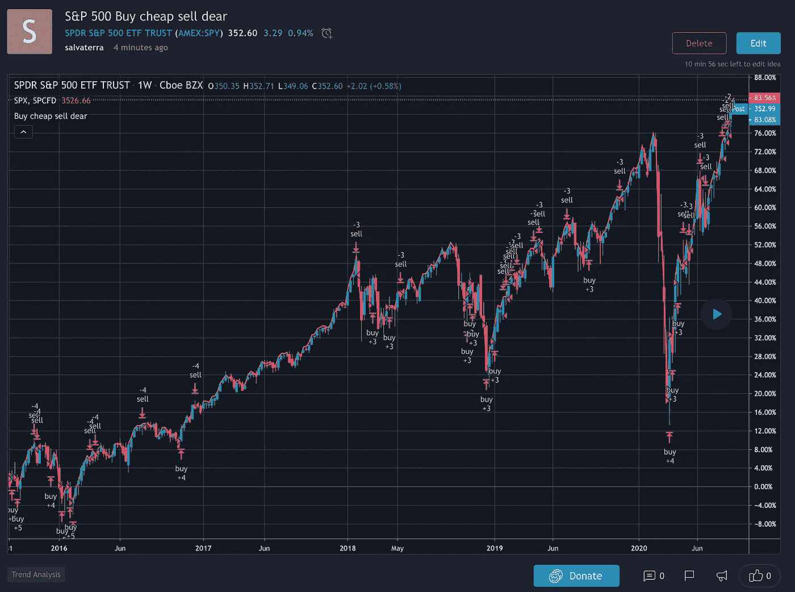
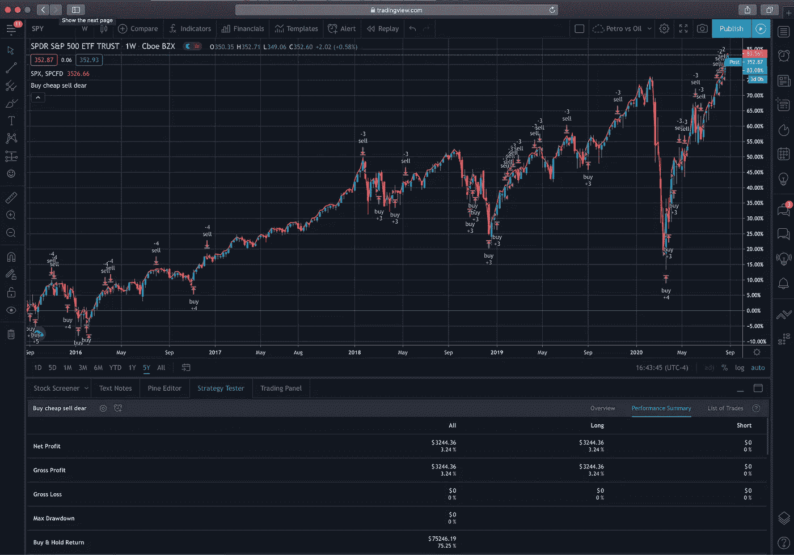

# 便宜买，贵卖是一个神话

> 原文：<https://medium.datadriveninvestor.com/buy-cheap-sell-dear-is-a-myth-ae528ec55815?source=collection_archive---------14----------------------->



## 使用 TradingView 模拟您的策略

**以下不是理财建议**

如果你在几个月前失去了股市中的“出售”机会，不要担心。我们经常听到“贱买贵卖”的口头禅。然而下面建一个*回测*能不能证明这是一个神话。

[](https://www.datadriveninvestor.com/2020/08/18/close-but-no-cigar-stock-market-targets-record-highs-amidst-stalled-covid-relief/) [## 收盘，但没有雪茄-股票市场目标在停滞的 COVID 救济中创新高|数据驱动…

### 专家聊天程序:一个协作市场，在这里人们可以和能够解决他们问题的专家聊天。是……

www.datadriveninvestor.com](https://www.datadriveninvestor.com/2020/08/18/close-but-no-cigar-stock-market-targets-record-highs-amidst-stalled-covid-relief/) 

这里有一个常用的策略。在这个例子中，我们将使用标准普尔 500 交易所交易基金。

*   如果股票下跌 3%或更多，购买价值 1000 美元的股票
*   如果股票上涨了 5%或更多，卖出价值 1000 美元的股票(不做空)

我们可以调整百分比和名义值。此外，我们可以交易总金额，而不是交易固定金额。最后，盈利或亏损可能会在几天内累积——在这种情况下，我们使用的是一周。

您可以尝试使用 [TradingView](https://www.tradingview.com/chart/SPY/UKARXxpb-S-P-500-Buy-cheap-sell-dear/) 中的 Pine 编辑器或点击链接。这是代码。

```
//@version=4
strategy("Buy cheap sell dear", overlay=true)
timeFilter = (year >= 2015) and (month >= 1) and (dayofmonth >= 1)days = 5
perc_up = 0.05
perc_down = 0.03get_min(min_src, min_len) =>
    ret_val = 1000.0
    for i = 1 to min_len
        if min_src[i] < ret_val
            ret_val := min_src[i]
get_max(max_src, max_len) =>
    ret_val = 0.0
    for i = 1 to max_len
        if max_src[i] > ret_val
            ret_val := max_src[i]max_daily_close = get_max(security(syminfo.tickerid, "D", close), days)
min_daily_close = get_min(security(syminfo.tickerid, "D", close), days)
daily_close = closelongCondition = ((daily_close-max_daily_close)/max_daily_close) < -perc_down
shortCondition = ((daily_close-min_daily_close)/min_daily_close) > perc_upif longCondition
    strategy.order("buy", true, 1000/close, when = longCondition and timeFilter) 
if (strategy.position_size > 0)
    strategy.order("sell", false, 1000/close, when = shortCondition and timeFilter)
```

结果如下:

*   **策略**净利润为 3.24%
*   相比**买入并持有** 75.25%



这种模拟忽略了交易成本，这可能会进一步降低 Pnl。

为什么会这样？我们永远不知道什么时候便宜是真便宜，什么时候贵是真贵。通过限制风险和不允许做空，2017 年我们没有股票可买，因为它一直在上涨，我们也没有东西可卖，因为我们的投资组合是空的，错过了一个伟大的上涨趋势。

尝试调整参数，看看你是否得到不同的结果，并在评论部分告诉我们。

**访问专家视图—** [**订阅 DDI 英特尔**](https://datadriveninvestor.com/ddi-intel)