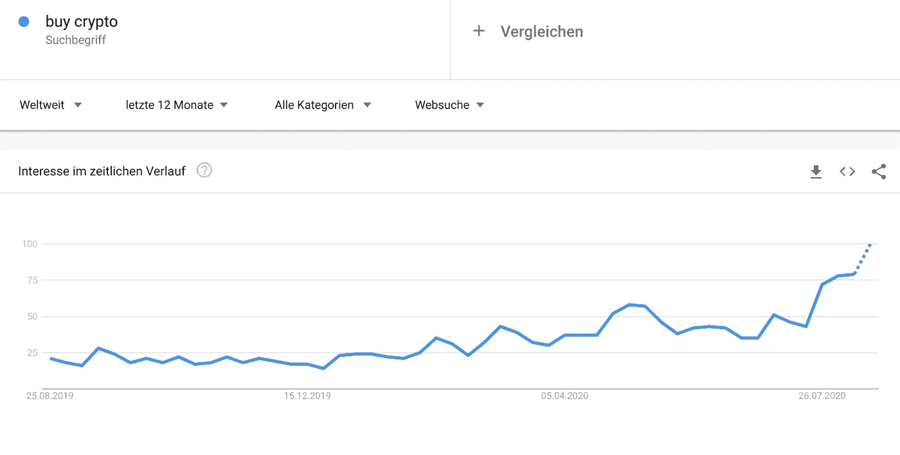

# 购买加密搜索词在谷歌趋势中爆炸——私人投资者进入市场

> 原文：<https://medium.datadriveninvestor.com/buy-crypto-search-terms-explode-on-google-trends-private-investors-push-into-the-market-82fc9f1b36f9?source=collection_archive---------10----------------------->

围绕比特币和加密的兴趣似乎又增加了。至少谷歌趋势的数据是这样显示的。受益目前主要在以太坊、Defi、Crypto 方向。相比之下，比特币的受欢迎程度有所下降，但仍高于年初。我们现在面临可能的牛市吗，或者谷歌趋势数据会说些什么？

# 在 Google Trends 上，Defi 和比特币搜索查询正在上升

你可能已经从汇率中注意到，对比特币和其他加密货币的需求正在增加。值得注意的是，在过去的几周和几个月里，各种 Defi 项目可能会大幅增加。但同样，比特币和以太坊并没有减速，而是有了势头。

来自 Google Trends 的数据显示，现在世界上大多数人都在寻找“购买加密”最近几周，搜索查询呈爆炸式增长，达到了两年来的最高水平。

“购买比特币”的搜索量在今年减半后有所下降，但自 7 月底以来又有所上升。几天前以太坊的搜索量甚至达到了年度新高。整个市场目前正处于上升期，这种趋势没有理由停止。

 [## 加密过山车 ETH2.0 测试网的麻烦，动荡的市场，美联储谈论 CBDCs |数据…

### 是只有我这么想，还是外面的情况越来越乐观了？从酒吧凳体育创始人戴夫波特诺伊泵他最喜欢的…

www.datadriveninvestor.com](https://www.datadriveninvestor.com/2020/08/20/crypto-rollercoaster-trouble-on-the-eth2-0-testnet-volatile-markets-the-fed-talks-cbdcs/) 

# 为你选择最好和最安全的股票市场

选择合适的供应商并不总是容易的。因此，我们建议你看看我们的比特币经纪人和交易所比较。在全球最安全、最好的交易所进行交易！为了比较

购买加密搜索达到 2018 年初的水平
这已经是一个明显的迹象，即“购买加密”的搜索查询处于 2017 年底和 2018 年初的水平。因为那个时候，正是大部分项目达到历史高点的高峰期。因此，我们目前可能面临类似的情况。但是，当然，兴趣上升是有原因的。股价上涨吸引了越来越多的私人投资者和市场，这也导致谷歌搜索量上升。

熊市进入后，大多数加密货币下跌了约 95%—99%。由此，兴趣也突然消失，并在一年多的时间里保持在低水平。直到 2019 年年中，当比特币价格短暂达到 14000 美元大关时，人们的兴趣才再次上升。然而，后来它又以同样快的速度消失了。

所以目前，我们再次看到趋势逆转，这将吸引更多的投资者进入市场。这最终也会影响比特币，因为加密货币被认为是加密空间的安全投资。以太坊可能也会感受到这种影响，因为几乎所有的 Defi 应用程序都在区块链联邦理工学院上运行。

我们很好奇这种趋势是否会长期存在，以及价格会对新资金做出怎样的反应。我们将一如既往地向您提供最新消息。

我在每月一期的 [**简讯中分享了更多私密的想法，你可以在这里**](https://mailchi.mp/bf8f8e8ed697/keep-in-touch-with-lukas) 查看。请在评论中告诉我，并在各种社交媒体平台上加入我:

[**推特**](https://twitter.com/WiesfleckerL)●[**insta gram**](https://www.instagram.com/lukaswiesflecker/)●[**脸书**](https://www.facebook.com/lukaswiesfleckerr)●[**Snapchat**](https://www.snapchat.com/add/luggooo)**●[**LinkedIn**](https://www.linkedin.com/in/lukas-wiesflecker-1b11251a5/)**

**无论你做什么，都要带着爱和激情去做！**

****访问专家视图—** [**订阅 DDI 英特尔**](https://datadriveninvestor.com/ddi-intel)**