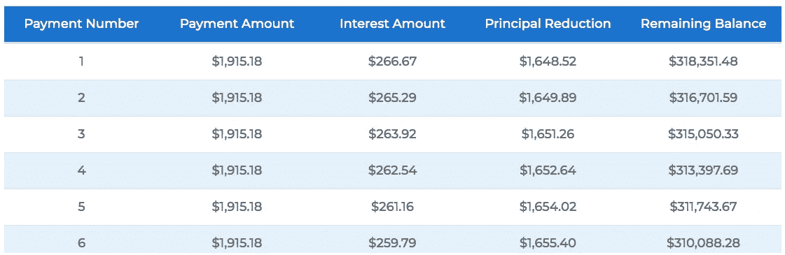
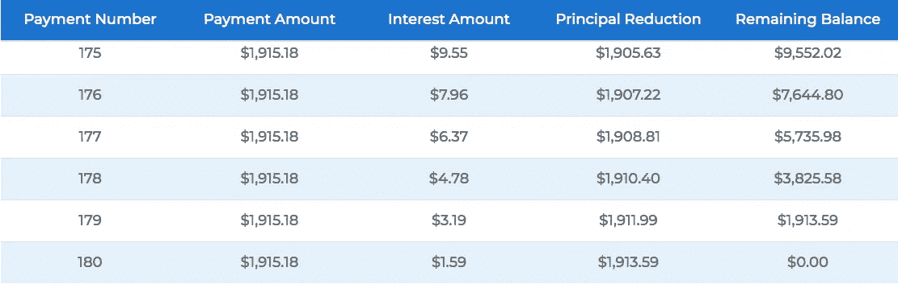
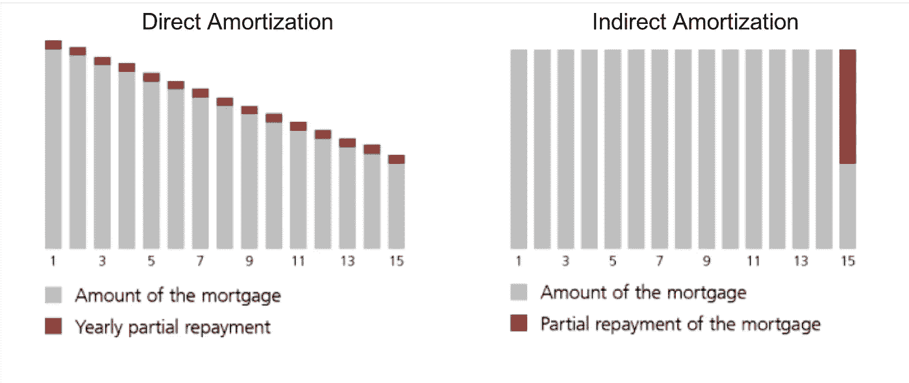

# 购买房产:直接还是间接摊销？

> 原文：<https://medium.datadriveninvestor.com/buying-a-property-direct-or-indirect-amortisation-1b1cf0a7f26a?source=collection_archive---------6----------------------->

这两种摊销方法都会对你产生财务影响，明智地选择吧。

source: Getty Image

当谈到财产购买，除了负荷，另一件事你需要仔细考虑的是摊销。因为直接或间接摊销如果没有根据自己的情况做出明智的选择，会对你产生一些机会成本。这可能会是一条长期的道路，你必须坚持下去。本文将解释它们是什么，并比较利弊。然后你会更好地了解情况，做出正确的决定。

 [## 利用股市相关性的最佳方式|数据驱动的投资者

### 当阿尔弗雷德·温斯洛·琼斯开创了世界上第一个“对冲”基金(后来“d”被去掉了)时，他让其他投资者大吃一惊…

www.datadriveninvestor.com](https://www.datadriveninvestor.com/2020/02/02/the-best-way-to-use-stock-market-correlations/) 

# **什么是摊销**

摊销是逐渐减少资产或贷款账面价值的会计过程。在购买房产时，分期偿还计划是一个减少你贷款的计划。例如，如果你购买价值 400，000 美元的房产，你支付 20%或 80，000 美元作为首付，然后你从银行贷款 320，000 美元。你想如何偿还这 320，000 美元是摊销计划。利息是在这笔付款之上的。

简单地说，你从银行贷款，期限为 15 年、20 年或任何年限。为了还钱，你需要有两种付款方式:

1.  **内息。银行借钱给你是为了利息，这就是他们赚钱的方式。通常借款期限越长，利率越高。因为长期借款比短期借款增加了风险，这种风险反映在利率上。**
2.  **摊销。**随着时间的推移，你会慢慢“回购”房产。因为一开始，你“拥有”20%，银行“拥有”80%。通过分期偿还，你增加了你的所有权。然而，每个国家都有自己的要求。在瑞士，人们不需要“回购”100%的房产，如果贷款少于房产价值的 2/3，他们可以选择只支付未偿还贷款的利息。

# 直接摊销

顾名思义，直接摊销就是你每隔一段时间直接向银行偿还未偿贷款。让我们在这里使用相同的例子，并假设数字是:

财产价值:40 万美元

首付:8 万美元

贷款:32 万美元

利率:1%

房贷期限:15 年(180 个月)，180 期。

如果你直接摊销，你的未偿贷款将逐年减少。如果你每月支付固定金额，包括利息和摊销。那么两者的混合可能是 86%摊销，14%利息。随着时间的推移，摊销的百分比将增加，利息的百分比将减少到接近于 0。

图表显示了前 6 次付款和后 6 次付款。你可以看到每个月支付的利息在减少，因为你的未偿还贷款越来越少。

source: [https://www.hsh.com/amortization-calculator.html](https://www.hsh.com/amortization-calculator.html)

在瑞士，人们不必偿还所有未偿还的贷款。但他们已将贷款金额减少到不到总房产价值的 2/3 (66.7%)。如果一个人付 20%的首付，然后从银行贷款 80%。他或她需要在 15 年内或直到退休年龄(以先到者为准)通过分期偿还支付财产价值的 13.3% (80%减去 66.7%)。剩下的 66.7%房产价值是贷款，不需要还。但之后的利息支付将永远不变。

我们来看看直接摊销的利弊。

优点:

*   随着时间的推移降低利息支付
*   降低债务

骗局

*   由于利息支付在瑞士是免税的，降低利息意味着潜在的更高的税级。因此更多的税收。
*   投资的机会成本。如果选择直接摊销，钱付给银行。如果你选择间接摊销，你可以将它们投资并获得高于利率的回报(如果可能的话)，并将此抵押给银行。所以你可以从投资回报和利息之间的差额中获得收益。通过直接摊销，你可能会有机会损失。
*   财富税。在瑞士或其他国家，如果你的资产超过一定数额，你需要缴纳财富税。通过直接摊销，你增加了你的资产，这可能使你有资格或支付更多的财富税。

# **间接摊销**

你可以通过保险产品或投资来抵押付款，而不是直接向银行支付现金。这就好比你向银行承诺，你将来会支付摊销，但你现在不支付，你用你的投资或者一个保险产品作为担保或者抵押。最有可能的是，你必须定期为这项投资存款。下图显示了不同之处。

source: ubs.com/ch

该图没有显示利息金额。它只显示未偿还贷款是如何减少的。15 年后，他们会有同样的结果。如果你选择不偿还所有未偿贷款，比如瑞士的情况。15 年后，无论你用哪种方法摊销，你都将拥有房产总价值的相同百分比。唯一的区别是利息支付。还记得上表显示的利息是如何逐年递减的吗？在间接摊销中，利息保持不变，直到第 15 年。因为你没有实际偿还贷款，所以你的贷款额保持不变，因此利息也保持不变。如果你支付的利息比使用直接摊销多，为什么人们会选择间接摊销呢？我们来看看利弊。

优点:

*   3 税收优惠。

1.  不要用钱来还，可以每个月投入一个支柱 3a 保险或者支柱 3a 投资。支柱 3a 是一个自愿养老基金，缴款是免税的。欲了解更多信息，请参考关于瑞士养老基金和 T2 支柱 3a 和 T3 的文章。它类似于美国的罗斯个人退休帐户。但是当你从 pillar3a 中取出钱的时候，它的税率要低得多。你只能为了某些目的并且每 5 年提一次钱。此栏 3a 投资或保险用于间接摊销。
2.  财富税。由于你的未偿贷款仍然保持在较高的数额，你的总资产将少于直接摊销，因此潜在的财富税较低。
3.  利息支付是免税的。有了同样多的利息，你可以从应税收入中减去。与直接摊销相比，你的扣除额正在减少，你可能会受益于较低的税收，因为相同数额的利息支付。

*   通过投资获得收益。如果你的支柱 3a 投资给你带来了 1%以上的估计(在我们的例子中假设利率)，让我们说 3%。那么你的回报是 2%。1%来支付利息。15 年后，你的 pillar3a 投资的平均回报率为 2%。但是你怎么知道你的投资回报会不会高于利率呢？嗯，你不知道，但是你可以做一个计算的估计。瑞士银行目前提供的利率约为 1%。(我知道与其他许多国家相比，这是非常低的)。过去 10 年，Vanguard VT total world ETF 的年回报率为 8.73%。瑞士市场指数在过去 10 年中获得了 8.02%的年回报率。([https://www . ishares . com/ch/individual/en/products/261154/ishares-SMI-ch-fund](https://www.ishares.com/ch/individual/en/products/261154/ishares-smi-ch-fund))。我的意思是，要么你买一个大盘指数，甚至是一个 total world diversified ETF，回报高于 1%。或者你的利率高于 1%，只要你能找到一个你有信心回报会高于利率的投资，那么它就有优势。否则这一点不算亲。
*   保险范围。如果你选择购买有投资成分的保险。然后你可以用它进行间接摊销，为你和你的家人获得保险保障。在投资方面类似于上一点。取决于你的预期回报，把钱放在那里可能是好的。

骗局

*   一致的利息支付金额。
*   受市场波动影响的投资

# 如何选择

从分析中你可以看出，很大一部分决定因素在于你的个人情况。你的应税收入是多少，你拥有多少资产，你缴纳多少财富税，你的利率有多高，如果你需要在 15 年内摊销 13.3%的价值，你的年龄是多少。你对支柱 3a 有选择的投资并能产生好的回报吗？

你需要做的是计算税收，利息支付，回报。比较两种情况，你就会知道哪一种更适合你。

让我知道你选择哪种方法，为什么。

— — —

如果你喜欢这类内容，比如个人理财，生产力，瑞士生活…请关注我的账号。我会和你分享更多的个人经历。我希望你能在这里找到一些有用的信息。

— — —

**资源:**

摊销计算:【https://www.hsh.com/amortization-calculator.html 

 [## 先锋 ETF 简介|先锋

### 编辑描述

investor.vanguard.com](https://investor.vanguard.com/etf/profile/overview/vt)  [## iShares SMI ETF (CH) | CSSMI

### 显示的数字与过去的业绩有关。过去的业绩不是当前或未来结果的可靠指标…

www.ishares.com](https://www.ishares.com/ch/individual/en/products/261154/ishares-smi-ch-fund) 

**支柱 3a**T6**投资工具:VIAC**

我推荐的书:

[**智能投资者**](https://amzn.to/2z2GE8t)

[**金钱高手游戏:财务自由的 7 个简单步骤**](https://amzn.to/2VUj6vE)

**访问专家视图—** [**订阅 DDI 英特尔**](https://datadriveninvestor.com/ddi-intel)