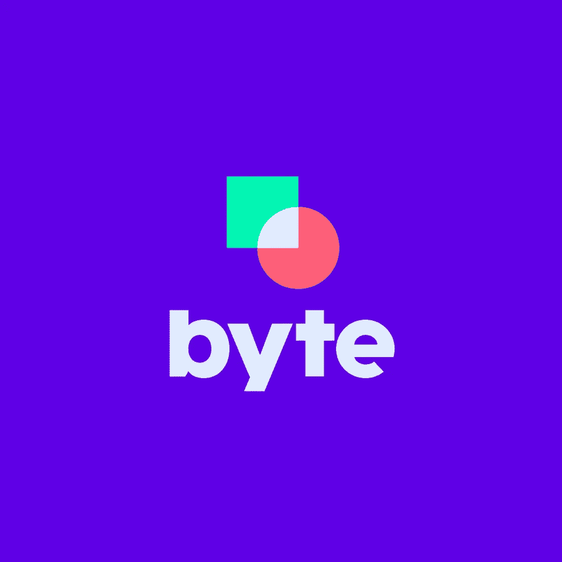
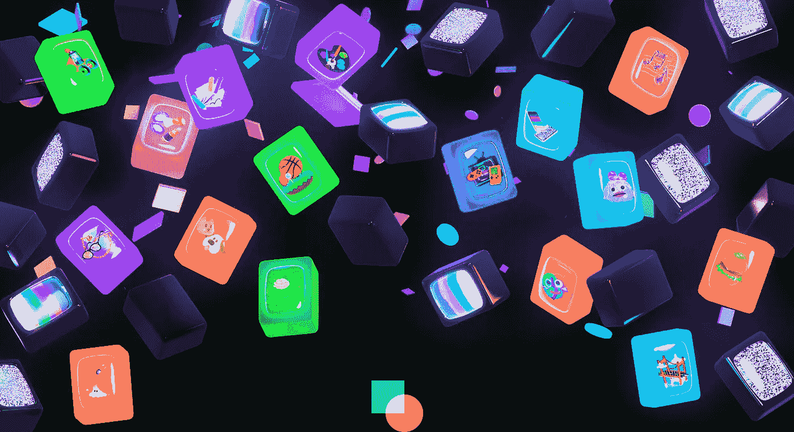
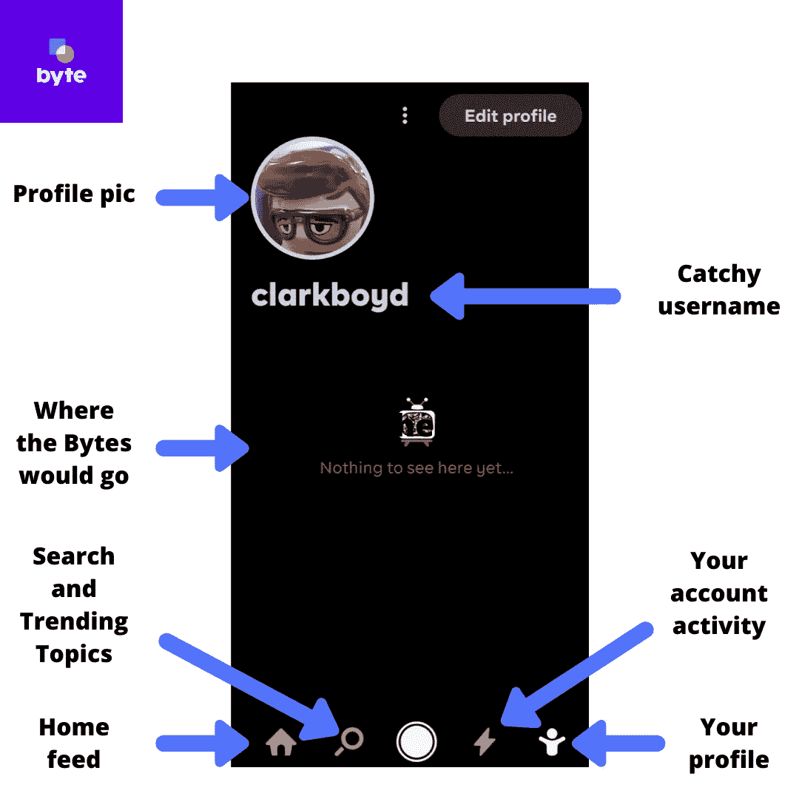
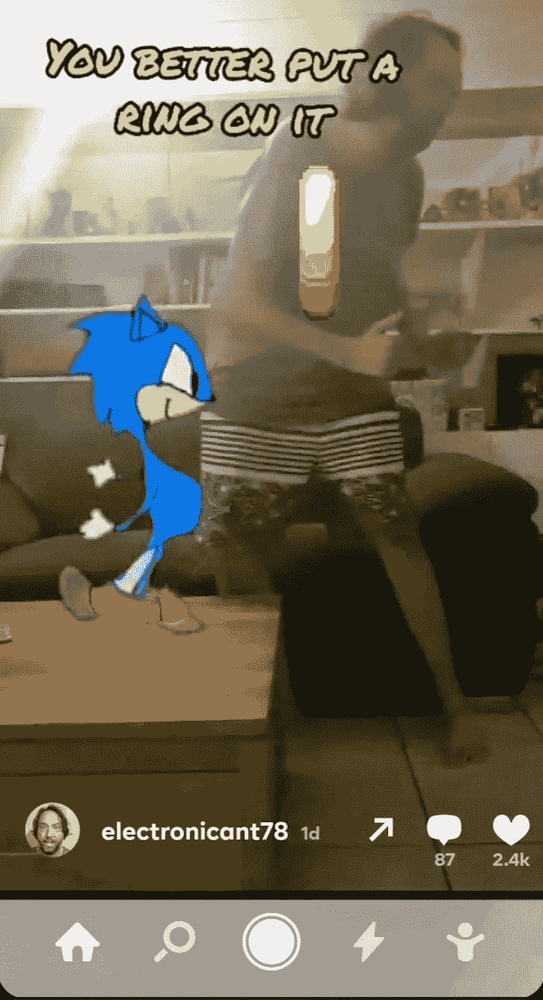
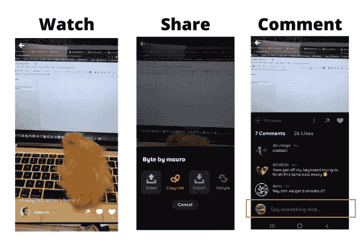
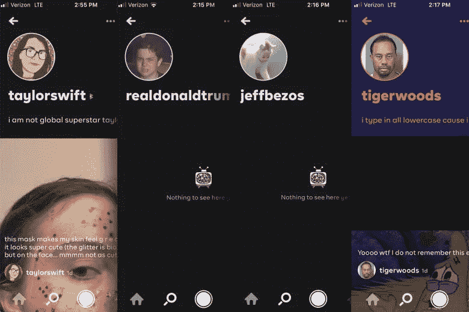
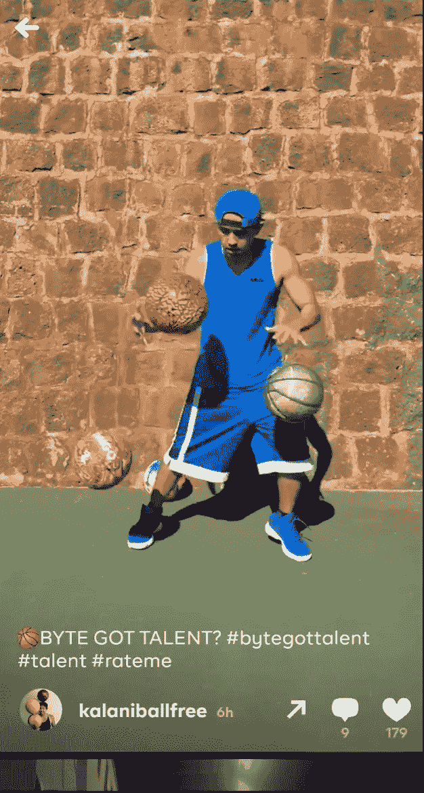
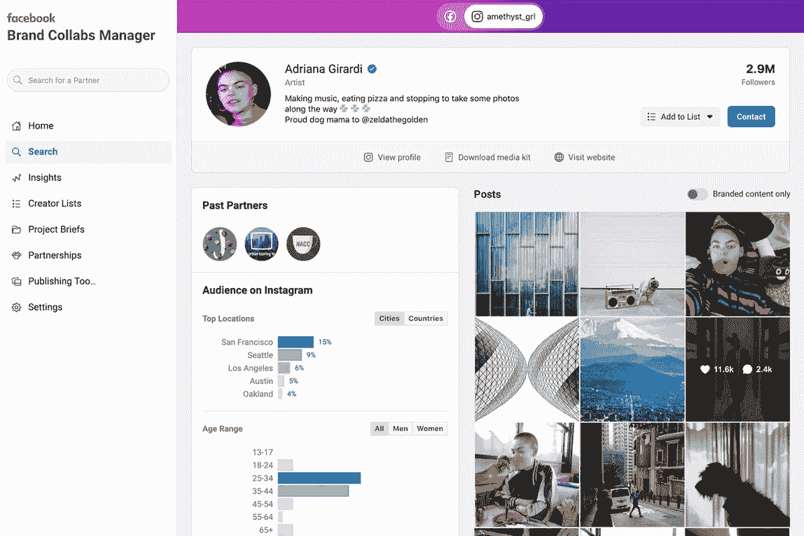

# 字节:社交媒体的下一件大事？

> 原文：<https://medium.datadriveninvestor.com/byte-the-next-big-thing-in-social-media-8a9739a76680?source=collection_archive---------6----------------------->

## 藤蔓回来了。但是我们还需要它吗？

Byte 是众多社交媒体应用程序中的最新成员，它比其他新来者有一个明显的优势。

你看，字节真的是六秒视频 app Vine 的复活版。

Vine 对我们的文化经典有着巨大的影响，其格式的僵化激发了许多创造力。只有六秒钟的循环视频。附庸风雅的人总是在一些规则得到执行时表现最好，不是吗？

你可以在这里 [**看到 50 棵最好的藤蔓**](https://punkee.com.au/best-vines-of-all-time/52184) 。

Twitter 在 2012 年收购了 Vine，但没有花大力气将其格式与越来越多的竞争对手区分开来。Twitter 在 2016 年关闭了 Vine。

它的部分被 Instagram 和 Snapchat 等公司复制，这两家公司都至少在一定程度上归功于 Vine。

 [## 社交媒体收听让您随时了解|数据驱动型投资者

### 虽然社交媒体倾听是一种顶级趋势，但它应该是每个现代营销策略的一部分。保持和谐…

www.datadriveninvestor.com](https://www.datadriveninvestor.com/2019/02/26/social-media-listening-keeps-you-plugged-in/) 

人们带着喜爱记住藤蔓。

在一个完美模仿 Vine 核心 USP 的开发中，Byte 重复了完全相同的公式。六秒钟的无限循环视频又回来了。

来自 Vine 的剩余商誉当然只能带 Byte 到此为止。

自从 Vine 的好时光以来，观众们已经向前看了吗？在竞争激烈的行业中，Byte 会纠正这些早期的错误吗？

让我们来看看。

# 字节字节数:

*   **六秒钟视频**即回放，或称‘循环’。
*   第一周就有 130 万的下载量。
*   该公司的口号是'**创意第一'**，这可以被解读为与其他应用程序区分的一个突出标志。
*   **社区**和**协作**也是 Byte 的焦点。社区( [**此处**](https://community.byte.co/) )是 Byte 用户和开发者之间的开放交流。
*   然而，对受欢迎的视频创作者来说，主要的诱惑是公平的收入分享计划的承诺。

# 那么，Byte 是如何工作的呢？

每个用户的个人资料是这样的:

A Byte profile.

主页上的视频占据了整个屏幕。理论上，这将根据您的偏好进行定制，但这似乎很随意。

我今天早上的“家庭”视频是刺猬索尼克让这个家伙求婚:

除非你采取行动或者你的电池没电了，否则精彩的内容将永远循环下去。

你可以按下屏幕暂停播放，或者向上滑动进入下一个视频。

向左滑动可以回到上一个视频，向右滑动可以打开评论区。

我用一个花栗鼠在笔记本电脑键盘上爬行的视频来演示下面的字节视频浏览器选项:

Your options during a Byte.

正如你在中间的图片中所看到的，有复制，“Rebyte”，导出或共享视频的选项。

在右边，我们看到过去的评论和喜欢。Byte 引导观众“说些好听的”，这是值得称赞的，但可能无助于平息当今普通“互联网用户”的尖酸刻薄。

Byte 缺乏抖音或 Instagram 的魅力，这也是它魅力的一部分。

然而，它也缺乏处理社交网络今天面临的不可避免的问题的能力。

Byte 在第一周就被垃圾邮件机器人淹没了，它们都要求“关注”和“喜欢”。

当然，从 Byte 赚钱的潜力(我们将在下面讨论)吸引了垃圾邮件发送者。

我们也看到了对有利可图的用户名的争夺。

我不能确定，但我不认为以下是真实的账户:

Probably not genuine accounts.

也许老虎伍兹的是，但其他的看起来是假的。

你知道你经常读一个故事，它会让你难以忘怀吗？不像 911 之类的，只是一个有着惊人持久力的小故事。

对我来说，就是 [**2010 年的故事**](https://www.theguardian.com/technology/2010/sep/14/twitter-user-sells-israel-username) 以色列(这个国家)向一个西班牙人支付了“六位数的巨款”，换来了后者的@Israel 推特账号。

Israel Meléndez 在 2007 年很无辜地开设了这个账户。他只是因为一个前女友在他的另一个 Twitter 账户上骚扰他才设置的。

以色列(国家)取得了联系，一旦他交出密码 deets，他们给了他一张支票。这是显而易见的；不管怎样，他已经厌倦了所有反犹太人的辱骂。

白给的钱。

我立刻后悔没有在进展顺利的时候把@BBCNews、@美国消费者新闻与商业频道之类的网站打包。

以色列(该国)声称和解金额实际上是 3000 美元，但对于开设一个 Twitter 账户来说，这仍然是一天的好工资。

所以，我可以理解为什么这些投机者在 Byte 上追逐它，即使它注定要失败。正如我经常思考的那样，我们中没有人会像伊斯雷尔·梅伦德斯那样幸运。

不管怎么说，Byte 的内容多得令人难以置信。它擅长在短短六秒钟内捕捉那些令人惊讶、满足和甜蜜的时刻。

这些视频中的许多非常适合永无止境的循环格式。你想再看一遍；或者说，你无法停止观看。

如果内容很无聊或令人讨厌，只需向上滑动，就会播放一个非常不同的视频。

举个例子，这个家伙能弹起三个篮球:

Three basketball guy on Byte.

我真的很想知道人们是否会创造内容来利用下一个视频的微小片段，你总是可以在屏幕底部看到它。

这似乎是一个吸引人们注意力并鼓励他们消费的好机会。

从我一周的丰富经验来看，我可以说内容没有抖音的舞蹈动作和上演的“喜剧”那么严肃。

你可能还记得， [**我最近写了我在抖音的经历**](https://hi-technology.news/editions/tiktok-music-industry) 。令人高兴的是，一些字节视频的存在只是为了取笑更值得畏缩的抖音特技。

早期的字节用户知道得更多，也更有自知之明，但该平台确实希望鼓励用户和品牌从抖音转向其他地方。

或许它已经从这里吸取了教训。

Vine 最初设法将一些品牌合作关系货币化，当时许多人质疑公司是否应该使用这样的媒体。然后，脸书拿走了那些预算。

Byte 有一个不同的想法:直接奖励内容创作者用他们的视频吸引和维持观众。这个计划还没有开始，因为没有钱进入平台。

当然，这不是一个突破性的想法。Medium 已经在博客帖子上这么做了，YouTube 也向其创建者回馈了一些东西，即使金额通常相当低。

然而，这对于一个社交网络来说是新奇的。

Instagram 的创作者正在向这个社交网络施加压力，为他们最成功的帖子提供直接支付。它已经通过向更多用户开放品牌协作管理器做出了回应，允许他们通过该应用程序直接与赞助商合作。

毕竟，社交媒体人物没有理由坚持使用一个平台。品牌忠诚度，这个经常被神话的概念，在这里是不存在的。

本周我们发现[T5谷歌也在考虑为其在搜索结果中使用的内容向新闻出版商付费。](https://www.inc.com/jason-aten/google-could-soon-start-paying-publishers-for-their-content-after-years-of-saying-it-wouldnt.html)

潮流正在转向；这些平台是没有我们内容的空容器，他们被迫通过向创作者付费来承认这一点。

# 最后的咀嚼:Byte 会腾飞吗？

虽然社交媒体应用程序世界看起来很拥挤，但实际上还有很大的空间留给创新的进入者。像脸书这样臃肿的公司有如此多的弱点和如此多不满意的客户，这应该是字节的机会。

抖音广受欢迎，但它已经受到政府干预隐私法规的威胁。

Byte 向用户提出了一个明确的挑战:6 秒，仅此而已。它还会征求他们的建议，并迅速实施改进。更重要的是，他们甚至可以从内容中赚钱。

它首先吸引平台的供应方，吸引需求方。如果最好的视频在 Byte 上，人们会想看的。

如果出现这种情况，品牌将希望参与进来。他们的赞助费可以通过用户群重新分配。

这是个不错的理论。

尽管如此，人们不禁会觉得，Byte 的影响很可能会在其他社交网络上感受到，这些网络需要以对创作者更公平的条款做出回应。他们已经有钱了；他们只是把它留给自己。

Byte 可以通过采取反对人气日益下降的现有公司的立场来赢得用户，但后者有资源通过复制新进入者的功能并参与竞争来挤压新进入者。

在这个过程中，Byte 可能会成为另一个备受喜爱的替代品，但却不能完全进入主流。

## 我们以前看过这个视频。会循环多少次？