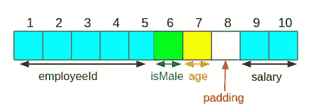
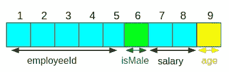
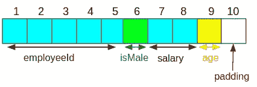
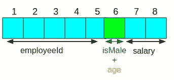

# c 编程技巧 3:深入研究内存对齐和位字段

> 原文：<https://medium.datadriveninvestor.com/c-programming-hacks-3-diving-deep-into-memory-alignment-and-bit-fields-457b31dbd3e1?source=collection_archive---------1----------------------->

## 更高级的结构设计概念和位域介绍


Photo by [Fabian Grohs](https://unsplash.com/@grohsfabian?utm_source=medium&utm_medium=referral) on [Unsplash](https://unsplash.com?utm_source=medium&utm_medium=referral)

让我用一个例子来演示一些高级的内存对齐概念，并介绍位字段及其用途。假设你被一个组织雇佣来编写一个软件，其中第一步是存储雇员的详细信息。要求是存储雇员 ID、性别、年龄和工资。

**第一步:**你决定创建一个`struct`

让我们假设 employeeId 只有 5 个字符长，2 个字节足以保存工资值。

```
**typedef struct** employee {
    **char** employeeId[5];
    **bool** isMale;
    uint8_t age;
    uint16_t salary;
} Employee;
```

如果使用打印该结构的大小，

```
Employee employee1;
printf("Size of struct employee is %zu \n", **sizeof**(employee1));
```

该结构的大小将是 10 个字节。

> employeeId -> 5 字节，isMale -> 1 字节，age -> 1 字节，salary -> 2 字节。

总共 9 个字节(5 + 1 + 1 + 2)。*等等，什么！！！！*

**第二步:**检查内存对齐情况



由于 salary 是 2 字节长，所以它的内存地址应该是 2 的倍数[这个概念的详细解释](https://medium.com/dev-genius/c-programming-hacks-01-memory-efficient-struct-design-8e7252c2b986)。因此，您修改您的`struct`如下

```
**typedef struct** employee {
    **char** employeeId[5];
    **bool** isMale;
    uint16_t salary;
    uint8_t age;
} Employee;
```



如果您再次打印该尺寸，您会惊叹不已，因为尺寸仍然是 10。*为什么会这样？*

第三步:你深入挖掘

根据海湾合作委员会的文件，

> 请注意，ISO C 标准要求任何给定结构或联合类型的对齐至少是该结构或联合的所有成员的对齐的最低公倍数的完美倍数。

在 out `struct`设计中，最低公倍数为

> [sizeof(char)，sizeof(bool)，sizeof(uint16_t)，sizeof(uint8_t)]

是 2(由于 uint16_t 占用 2 个字节)，这就迫使我们的`struct`的大小为 10。

实际情况是，在末尾添加了 1 字节的填充，如下图所示。



# 位字段

我们能做进一步的修改来减少内存消耗吗？是的，我们可以！！！

为了表示性别，我们只需要一位(1 =男性，0 =女性)(只考虑男性和女性，只是为了举例)。你不需要 8 位来表示年龄。没有人活过 256 (2⁸)岁:-)。这就是位域有用的地方。看看下面的结构设计。

```
**typedef struct** employee {
    **char** employeeId[5];
    **bool** isMale : 1;
    uint8_t age : 7;
    uint16_t salary;
} Employee;
```

使用位域，你可以让编译器知道你想为每个变量使用多少位。在我们的例子中，isMale 将只占用 1 位，而 age 将占用 7 位。现在内存对齐看起来像这样，



如果你打印我们的`struct`的大小，它将只有 8 个字节。

## 位字段的其他应用

假设您必须创建一个包含 10 个整数变量的结构，其中每个变量只需要 40 位。但是，40 位整数没有标准的 C 数据类型。因此，剩下的唯一选择就是使用 64 位整数。

```
**struct** sample {
    **long** integer1;
    **long** integer2;
    //....
    **long** integer10;
};
```

我们将使用 640 位(10 x 64 ),而只需要 400 位。使用位域可以解决这个问题。

```
**struct** sample2 {
    **long** integer1 : 40;
    **long** integer2 : 40;
    //....
    **long** integer10 : 40;
};
```

现在，`struct`的大小只有 400 比特。

## 使用位域的限制

主要的限制是您不能使用位域创建数组。例如，不能创建每个元素为 40 位的数组。

[](https://www.datadriveninvestor.com/2019/04/22/strategic-or-tactical-programming-the-road-ahead-for-software-engineers/) [## 战略或战术规划？软件工程师的未来之路|数据驱动的投资者

### outer hout(2018)在他的书《软件设计哲学》中提到了一些原则，以便更深入地挖掘…

www.datadriveninvestor.com](https://www.datadriveninvestor.com/2019/04/22/strategic-or-tactical-programming-the-road-ahead-for-software-engineers/) 

希望你喜欢这篇文章！！！

**进入专家视图—** [**订阅 DDI 英特尔**](https://datadriveninvestor.com/ddi-intel)