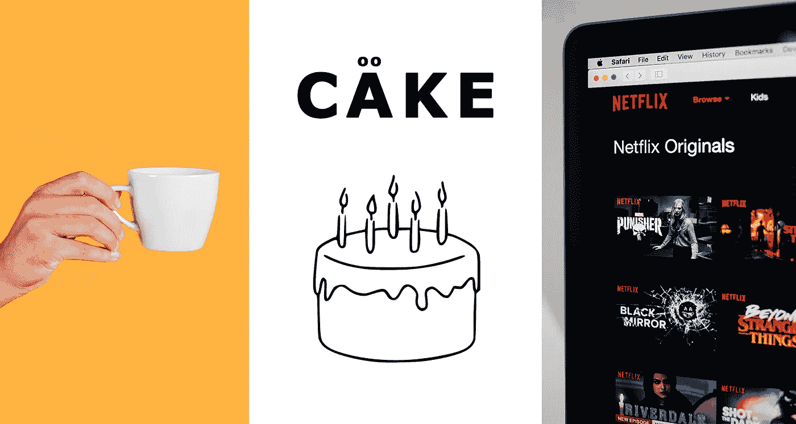

# 蛋糕可以教我们营销和心理学

> 原文：<https://medium.datadriveninvestor.com/cake-can-teach-us-about-marketing-and-psychology-5518674b4053?source=collection_archive---------4----------------------->

## 咖啡杯、网飞和宜家有什么共同点？

Far Left Photo from [Freepik](http://www.freepik.com) | Illustration by Author | Far Right Photo by [Charles Deluvio](https://unsplash.com/@charlesdeluvio?utm_source=unsplash&utm_medium=referral&utm_content=creditCopyText) on [Unsplash](https://unsplash.com/s/photos/netflix?utm_source=unsplash&utm_medium=referral&utm_content=creditCopyText)

你见过这个迷因在流传吗？

蛋糕。一切都是小菜一碟。你的世界观碎了吗？很好。穿过泪水去亲吻你的妻子。哦，等等，你不能——她也是蛋糕。

**美国 40 年代的家庭主妇**不是蛋糕做的。事实上，这是速食蛋糕粉刚刚被介绍给大众的时代。

当他们第一次推出时，他们所要做的就是将混合物倒入一个碗中，加水搅拌，放入烤箱，然后 yabba-dabba-doo-蛋糕！

听起来像天堂，对吧？不对。尽管速食蛋糕组合很方便，但销售却举步维艰。所以制片人接手了这个案子:

是因为味道吗？❌:蛋糕很好吃。

包装？❌，那也不是。

然后他们挖到了金子:这太容易了。

烘焙这些蛋糕几乎没费什么力气，很难说“这是我做的蛋糕”。感觉就像你从商店里买的一样。

修复？他们从混合粉中取出牛奶和鸡蛋。现在，你必须先敲碎鸡蛋，然后再加入牛奶。转眼间。

现在是你的蛋糕。

# 如何创建所有权

这个故事说明了行为经济学家所说的禀赋效应。(又名**宜家效应**！)

当我们能够扩大某种形式的所有权时，我们会更加珍惜它。这意味着我们愿意支付更多的钱。

所有权可以通过几种方式产生——一种是纯粹的曝光。

## 曝光☕

Photo by [Rebecca Lane](https://unsplash.com/@rebeccajeanettelane?utm_source=medium&utm_medium=referral) on [Unsplash](https://unsplash.com?utm_source=medium&utm_medium=referral)

**在一项名为** [**触摸的力量**](https://www.researchgate.net/publication/5140687_The_power_of_touch_An_examination_of_the_effect_of_duration_of_physical_contact_on_the_valuation_of_objects)**(也是埃尔·詹姆斯下一部小说的名字)的研究中，研究人员发现，参与者拿着咖啡杯的时间越长，他们在网上拍卖中出价越高。**

**更有趣的是:*这个效果只花了 30 秒。***

**这就是为什么汽车经销商会让你在决定购买前开一天车。这就是为什么 Spotify 前三个月要 99 英镑，网飞前 30 天免费的原因。**

**免费试用是一种很好的方式，让人们在购买之前就感觉自己拥有了一样东西。Spotify 和网飞是有趣的例子，因为他们通过额外的秘密武器——*定制来建立所有权。***

## **用户化🎬**

****

**Photo by [Mollie Sivaram](https://unsplash.com/@molliesivaram?utm_source=medium&utm_medium=referral) on [Unsplash](https://unsplash.com?utm_source=medium&utm_medium=referral)**

**你可能听说过网飞的推荐引擎有多棒。你的网飞主页可能和你妻子(她仍然是蛋糕做的)的个人资料看起来很不一样。**

**在 30 天内，网飞可以很好地了解你喜欢看什么，并提供高度个性化的体验。这是有价值的。**

**15 美元/月有点价值。**

**Spotify 的 Discover Weekly +它的其他个性化播放列表也做同样的事情。这就是为什么人们会花数百美元在珠宝上刻上自己的名字。**

**但有时候，*卖家*不用费心定制。如果买方这样做，它通过*的努力建立所有权。***

## **🛠的努力**

****

**Photo by [Semen Borisov](https://unsplash.com/@devsnice?utm_source=medium&utm_medium=referral) on [Unsplash](https://unsplash.com?utm_source=medium&utm_medium=referral)**

****我们再次回到宜家效应。**你做过宜家家具吗？你读过可爱的瑞典象形文字吗？你有没有想过为什么有这么多该死的螺丝钉？**

**没关系。因为一旦你把你的血、汗和泪(+一个下午)倾注到那个结构不稳定的后现代书架上，你就变得依恋了。**

**这就把我们带回了蛋糕配料。**

**简单地添加牛奶和鸡蛋似乎并不需要太多的努力，但这已经足够了。足以让它感觉像是你的蛋糕。**

**这是你可以收费的。**

# **利用禀赋效应进行销售**

1.  ****曝光:**最适用于实体零售。让客户有机会拿着产品或试驾。**
2.  ****定制:**非常适合数码产品或在线商店。搭建一个推荐算法或者虚拟定制平台。**
3.  ****努力:**将这个想法应用到实物上——可食用的产品、玩具、装饰品。而不是服务；这些应该尽可能不费力。**

# **最后一点…**

**我们可以把这种想法延伸到我们的工作生活中，雇主和雇员都一样。**

**自主是有意义工作的一个组成部分——它也有助于获得所有权，并最终获得更快乐的工作生活。**

**给你的团队尝试独立项目的机会，并对他们的工作给予肯定。重视他们的自主权，他们就会重视机会。**

**当然，除非它们是蛋糕。当然，除非…**

***你*是蛋糕？**