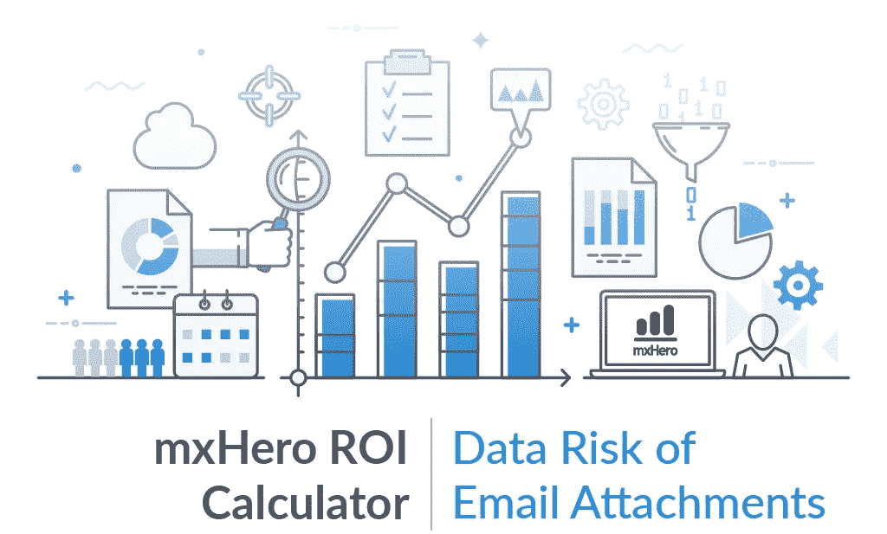
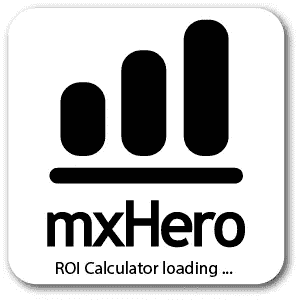
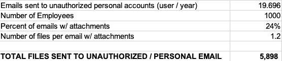
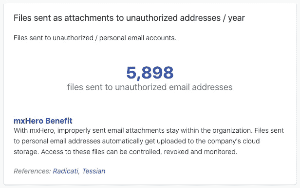

# 计算数据风险:通过电子邮件意外发送文件

> 原文：<https://medium.datadriveninvestor.com/calculating-data-risk-accidental-file-delivery-via-email-6d3027ccf604?source=collection_archive---------26----------------------->

*一种将可用数据与您组织的指标相结合的新工具揭示了您因意外发送电子邮件而面临的数据风险。*

First in a series showcasing results of the [mxHero ROI Calculator](https://tools.mxhero.com/roi)

在过去十年的大部分时间里，mxHero 一直致力于电子邮件和云存储服务(如 Box、Egnyte、OneDrive 等)的交叉领域。).在此期间，[发表了](https://medium.com/datadriveninvestor/why-we-cant-secure-our-data-with-business-as-usual-b4d13bfcf7d3)关于电子邮件对公司安全、治理、生产力和成本节约的影响的研究。我们关注的一个领域是电子邮件附件对数据风险和网络安全的影响。

电子邮件附件通常被认为是无害的，但绝不是。在一个充满挑战的世界里，网络安全被证明是难以捉摸的，并且正在削弱各种规模的组织。越来越多的重要资源被转移到保护我们的数字资产上。尽管在网络安全方面的投资达到创纪录水平，但我们看到了创纪录数量的违规行为和向网络罪犯支付的创纪录金额。人们有理由认为今天的网络安全努力是徒劳的。[ [DDI](https://www.datadriveninvestor.com/2020/04/10/the-futility-and-hope-of-cybersecurity-in-todays-organizations/) ]根据我们的观察，习惯性地使用电子邮件附件这一有 50 年历史的技术，是当今组织站不住脚的根本原因。

> 基于我们的研究，我们创建了一个[在线计算器](https://tools.mxhero.com/roi)，允许组织输入他们自己的指标，并衡量电子邮件附件如何影响数据安全和基础设施成本等。

我们旨在揭示持续使用不安全电子邮件附件的真实成本和危险。基于我们的研究，我们创建了一个[在线计算器](https://tools.mxhero.com/roi)(移动应用: [iOS](https://apps.apple.com/app/id1536870481) ， [Android](https://play.google.com/store/apps/details?id=com.mxhero.roi) )，允许组织输入他们自己的指标，并衡量电子邮件附件如何影响数据安全和基础设施成本，以及其他方面。计算器生成一个可自由访问的电子表格，包括方法、公式和结果，以允许进一步的调整和分析。

Access the mxHero Calculator at: [https://tools.mxhero.com/roi](https://tools.mxhero.com/roi) (source spreadsheet available for download). Mobile app versions are also available for [iOS](https://apps.apple.com/app/id1536870481) and [Android](https://play.google.com/store/apps/details?id=com.mxhero.roi).

本文是第一篇讨论计算器关键发现背后的方法论的文章。在本文中，我们重点关注两种数据风险统计，即“作为附件发送给非预期收件人的文件/年”和“发送给未授权个人帐户的电子邮件(用户/年)”换句话说，有多少错误的和未经授权的文件传递是因为电子邮件。这是一个关键指标。我们大多数人都会本能地联想到这种风险，因为我们自己也曾被误导过电子邮件。令人惊讶的是这种情况经常发生。在《CISO》杂志引用的 Tessian 的一项研究中，在大型企业中，意外发送的电子邮件平均每周发生 130 次！[ [泰森](https://www.tessian.com/blog/data-protection-day-why-you-need-to-protect-your-people/)，[西索马克](https://cisomag.eccouncil.org/employees-send-over-130-emails-to-wrong-recipients-every-week-report/)

 [## 面向企业转型的 AWS:顶级云架构师的秘密|数据驱动型投资者

### “您使用云实现企业转型的方法是什么？”是人们一直问我的问题，自从我…

www.datadriveninvestor.com](https://www.datadriveninvestor.com/2020/07/15/aws-for-enterprise-transformation-secrets-of-top-cloud-architects/) 

通过将通过电子邮件传输的文件数量数据与意外发送的邮件数量数据相结合，我们得出了一家拥有 1，000 名员工的公司的以下统计数据。计算如下:

211 files being sent to the wrong recipients per year in an organization with 1,000 employees. Estimated by multiplying the number of misdirected emails/person/year, number of employees, percent of emails with attachments, and the number of attachments per email.

将上面的每个条目相乘可以发现，对于一个拥有 1，000 名员工的组织，大约有 211 个文件被发送给了错误的收件人。在一个文件可能意味着高额罚款、泄露战略或危及安全的时代，这些数字令人担忧。

对附件的未授权交付数量进行类似的计算，我们得到:

5,898 files being sent to unauthorized email accounts per year in an organization with 1,000 employees. Estimated by multiplying the number of unauthorized emails/person/year, number of employees, percent of emails with attachments, and the number of attachments per email.

对于处理敏感信息(无论是受监管的个人身份信息(PII)、知识产权(IP)还是其他敏感信息)的组织来说，这种影响令人警醒，并有助于解释数据泄露的日常新闻周期。

Screenshot from the mHero ROI Calculator. Estimation based on an organization with 1,000 users.

## 如何保护数据免受用户错误的影响

好消息是，组织可以通过停止使用已有 50 年历史的电子邮件附件技术并采用现代文件共享(也称为云存储)来显著减少因电子邮件附件而导致的数据意外丢失。一旦按下发送按钮，电子邮件附件就不提供任何追索权。与电子邮件附件不同，云存储文件链接允许访问控制和撤销，即使在交付之后。使用 mxHero 的 Mail2Cloud 平台等工具，可以根据发件人、收件人和内容自动分配适当的访问控制。当 mxHero 被添加到同类最佳的云内容平台(如 Box)时，会提供额外的安全性。 [Box 云存储](https://www.box.com/home)增加了扫描 PII(个人身份信息)文件的能力，并针对不同的监管制度(如 FINRA、GDPR 等)对内容进行自动分类。-自动确保附件受到正确限制。对于标准的电子邮件附件来说，这些都是不可能的。

mxHero leverages popular cloud storage services to ensure that an email accidentally sent to amy@competitor.com (instead of amy@company.com) automatically prevents inappropriate access to files.

## 不应再使用电子邮件附件

70 年代早期设计的电子邮件附件不再适合今天的业务环境中的文件共享。现代的选择是云存储文件链接的形式。有了 mxHero 这样的工具，组织可以远离不安全的电子邮件附件，而不需要用户采用新的用户习惯。

## 获得专家视图— [订阅 DDI 英特尔](https://datadriveninvestor.com/ddi-intel)