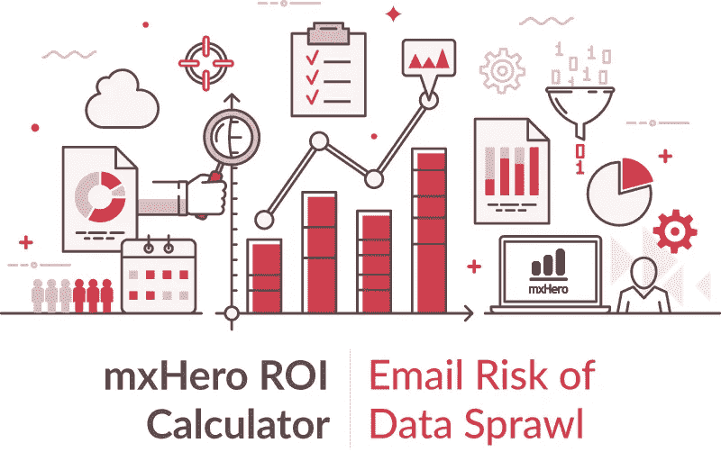
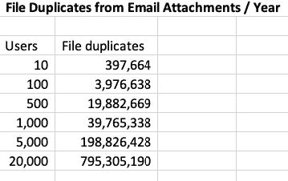
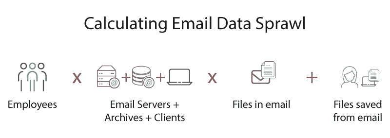
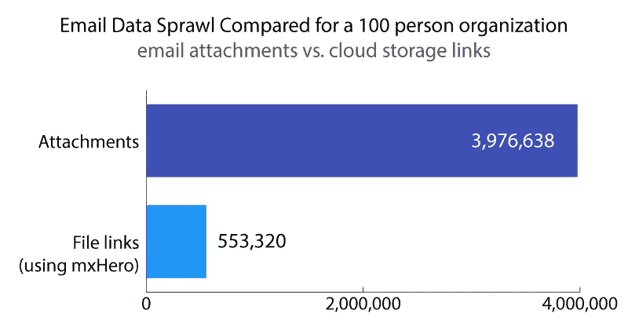

# 计算数据风险(第 2 部分):通过电子邮件的数据蔓延

> 原文：<https://medium.datadriveninvestor.com/calculating-data-risk-part-2-data-sprawl-via-email-b8cd5f21f43?source=collection_archive---------17----------------------->

*我们继续使用 mxHero 的计算器对电子邮件的未知风险进行数据驱动的探索，这一次我们将检查电子邮件内容激增导致的数据风险*。

Second in a series showcasing results of the [mxHero ROI Calculator](https://tools.mxhero.com/roi)

在我们[的上一篇帖子](https://medium.com/datadriveninvestor/calculating-data-risk-accidental-file-delivery-via-email-6d3027ccf604)中，我们仔细查看了 [mxHero ROI 计算器](https://tools.mxhero.com/roi/#/)对地址错误的电子邮件导致的意外文件交付的估计。本文主要关注最令人吃惊的估计之一，即电子邮件导致的数据激增。正如我们在之前写的[，电子邮件的架构以病毒般的效率复制内容。这是因为电子邮件及其嵌入的文件附件在传递链的每个阶段都会被复制。对于电子邮件中的所有收件人，包括发件人以及“收件人”、“抄送”和“密件抄送”中的所有人，都会自动执行这种复制。](https://medium.com/datadriveninvestor/why-we-cant-secure-our-data-with-business-as-usual-b4d13bfcf7d3)

> 电子邮件有效地保证了公司的知识产权、商业秘密或受监管的用户数据可以方便地获得，无论是从远程员工的移动设备、工作站、笔记本电脑，还是从供应商的电子邮件服务器上。

当使用电子邮件发送文件时，数据蔓延的影响是惊人的。对于电子邮件中涉及(涉及)的每个人，都会创建一份完整的副本，并在发送过程中多次复制。从一开始，副本就被放在发送者的发件箱中。每个收件人的收件箱中都有一份副本。对于发件人和每个收件人，副本也将存在于他们各自的电子邮件系统中，通常跨越冗余的电子邮件服务器。此外，归档电子邮件时会创建新的副本。最后，当收件人保存电子邮件中的文件时，会在本地设备上创建更多副本，在当今世界中，这通常意味着潜在的多台设备，无论是笔记本电脑、手机还是其他设备。

Files sent through email are duplicated at multiple stages. Copies are created when emails are stored to redundant email servers and archives, sent to external systems (e.g., CRM), received by the recipients in To, Cc, and Bcc, and when saved to potentially multiple devices.

因此，当考虑到许多数据重复点时，mxHero Calculator 显示，即使对于 10 个用户的小型组织，每年因电子邮件附件而重复的文件数量也达到了惊人的 397，664 份。这个结果假设没有服务器或归档冗余(这是非典型的)。对于更大的组织，估计是惊人的。我们的一个客户是一家拥有 20，000 名员工的企业，据计算，由于电子邮件附件的使用，每年会产生令人难以置信的 795，305，190 个文件副本。难怪组织无法控制他们的敏感数据。

## **方法论**

该计算器考虑以下关键数据点:员工数量乘以电子邮件服务器数量，再加上电子邮件归档数量，以计算电子邮件基础架构中的邮件副本。在上面的计算中，我们假设只有一个电子邮件服务器和一个存档，如前所述，这是不典型的。通常，组织采用冗余。这意味着，估计的重复已经低估了现实。根据用户和机器的数量，我们有一个粗略(低估)的电子邮件副本数量。现在，我们需要获得这些电子邮件中包含的文件的估计数量。为此，我们使用了由 [Radicati](http://www.radicati.com/wp/wp-content/uploads/2009/05/email-stats-report-exec-summary.pdf) 进行的一项研究的结果，即每个员工每天收发 53 封带有附件的电子邮件，然后乘以每封电子邮件的估计文件数 1.2。最后，我们估计保存到用户本地设备的文件数量。例如，用户通过电子邮件收到一个 excel 文件。他们下载 excel 文件并将其保存到工作文件夹中。

 [## 将数据隐私转化为你的优势，重建消费者的信任:下一个投资前沿

### 抖音的使用在疫情期间激增，全球大约有 8 亿用户使用该平台…

www.datadriveninvestor.com](https://www.datadriveninvestor.com/2020/09/18/turn-data-privacy-to-your-advantage-and-rebuild-consumers-trust-the-next-investment-frontier/) 

上述方法不考虑下载到用户电子邮件客户端的文件副本(例如，Outlook，而不是 OWA 或 GSuite，因为这些客户端在云中)。它只考虑电子邮件服务器和归档中的副本。也不假设用户可能将文件下载到多个设备，例如移动设备和膝上型电脑。如果我们调整模型，将用户计算机电子邮件客户端(如 Outlook)中的电子邮件副本考虑在内，并假设 10%的文件被下载到替代设备，那么一家 100 人的公司每年因电子邮件附件而复制的文件数量将从 3，978，493 个增加到 5，690，999 个，几乎增加 50%。不幸的是，根据计算器的保守估计，数据蔓延在现实中可能要糟糕得多。

Conservatively, we can calculate the amount of file duplication caused by email by multiplying the number of employees by the sum of email servers, archives, and local email clients times the number of files sent in email per employee plus the number of files saved from emails to local devices.

## **为什么电子邮件数据激增如此重要**

网络安全被认为是未来十年世界经济面临的最大威胁。越来越多的资源被转移到数字安全领域，而不是教育、卫生和研究等生产性和社会必要性投资。尽管安全投资增加，网络安全形势继续恶化。正如我们在这里所展示的，通过电子邮件附件共享文件会产生巨大的威胁面。这个表面是如此的宽广、宽广和深邃，以至于所有提高安全性的尝试都是徒劳的[。通过电子邮件发送文件是一个特别有害的挑战。作为文件交换的媒介，电子邮件 50 年的设计使得数据完全不受保护、广泛分散、不受控制且不可撤销。电子邮件系统或用户收件箱的漏洞不仅不会被发现，还会导致对其所有内容的无限制访问。电子邮件有效地保证了公司的知识产权、商业秘密或受监管的用户数据易于获取——无论是从远程员工的移动设备、工作站、笔记本电脑，还是从供应商的电子邮件服务器](https://www.datadriveninvestor.com/2020/04/10/the-futility-and-hope-of-cybersecurity-in-todays-organizations/)[上获取。这些数据是网络犯罪攻击长期使用和重复使用的素材——这些数据是有价值的，可以在](https://techcrunch.com/2020/03/01/visser-breach/)[暗网](https://www.darkreading.com/attacks-breaches/stolen-data-the-gift-that-keeps-on-giving/a/d-id/1338645)上交易。此外，不必要的数据复制会带来高昂的成本，不仅是监管罚款、声誉受损和知识产权丢失。电子邮件数据复制在存储基础架构甚至碳排放方面的成本，我们将在下一篇文章中探讨这些主题。

在我们日益数字化的世界中，疫情加速了这一进程，在可预见的未来，远程协作将成为常态。随着组织在地理上分散其工作人员，数字化协作的需求也在增加。电子邮件的数据激增模式旨在确保连接不确定时代的数据传输，但对于当今被理解为过度可访问性的数据不安全现实而言，这种模式完全不够。转向现代文件共享，如安全云存储链接(如[框](https://www.box.com/home)、OneDrive 等)。)，是至高无上的。将文件作为链接共享到单个存储库中的单个副本，避免了不必要的数据复制，同时提供了传统电子邮件附件模型所没有的访问限制和可见性。像 [mxHero](https://mxhero.com) 这样的技术可以让电子邮件附件顺利过渡到云存储链接，而不需要最终用户的努力。

This graph compares annual file duplication resulting from the use of email attachments vs. cloud storage file links (e.g. Box, OneDrive, etc.) for an organization with 100 users. Technologies like mxHero, automatically ensure that all attachments are shared as cloud storage links. The result is a dramatic reduction in data sprawl and concomitant data risk. Source: [mxHero ROI Calculator](https://tools.mxhero.com/roi)

## 看不见的危险

通常，最能伤害我们的是那些我们看不到的东西。电子邮件就是这种情况。长期以来，电子邮件一直是我们工作过程中不可或缺的一部分，就像水管一样，我们并不真正知道墙后面发生了什么。正是出于这个原因，我们建立了 mxHero 计算器，以帮助组织通过他们自己的墙壁和管道窥视…有漏洞。

[**阿历克斯**](https://www.linkedin.com/in/apanagides/)[*https://mxhero.com*](https://mxhero.com/)

Alex Panagides 是著名的电子邮件技术先驱，也是 mxHero 的创始人兼首席执行官，mxHero 是一家硅谷初创公司，为所有人提供支持和增强电子邮件的尖端解决方案。Alex 在 2012 年与一支技术高超的团队一起推出了 MX hero，以改善公司日常面临的电子邮件问题，如电子邮件数量和大小的增加、病毒和安全威胁以及全球可访问性。mxHero 团队不断创新，以应对企业和个人的电子邮件和数据存储挑战。Alex 之前曾与他人共同创立了当今巴西领先的电子邮件技术公司之一 Inova International Inc .,该公司不断发展壮大，为该地区的政府机构、电信提供商和跨国公司以及其他组织提供服务。Alex 是一名 IT 专家，致力于解决与电子邮件棘手问题相关的实际问题，除此之外，他还担任过华盛顿特区和巴西的世界银行顾问。总之，Alex 为 mxHero 带来了超过 25 年的技术、运营和管理领导力和愿景，与当今的领先公司建立了合作伙伴关系，包括 Google、Box、Dropbox、微软和 Citrix。

## 访问专家视图— [订阅 DDI 英特尔](https://datadriveninvestor.com/ddi-intel)