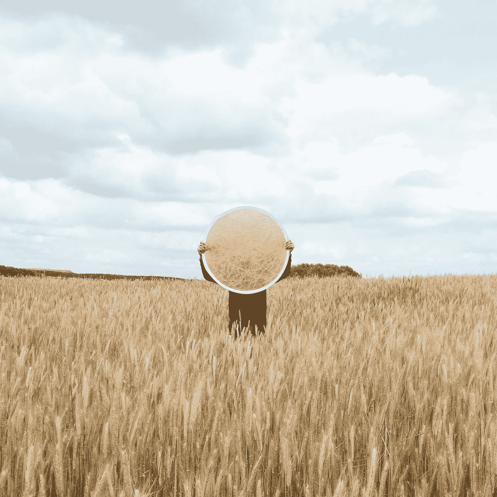

# 呼吁使用备用互联网

> 原文：<https://medium.datadriveninvestor.com/call-for-an-alternate-internet-74cdac10de01?source=collection_archive---------6----------------------->

## 嘶…只给知识分子

Photo by [Maksim Goncharenok](https://www.pexels.com/@maksgelatin?utm_content=attributionCopyText&utm_medium=referral&utm_source=pexels) from [Pexels](https://www.pexels.com/photo/person-holding-a-mirror-on-an-open-field-4412934/?utm_content=attributionCopyText&utm_medium=referral&utm_source=pexels)

还有 10 亿人将加入互联网，我想知道会增加哪些数据。答案就在于近期涨了什么内容。众所周知，它预示着 Tik Tok、Instagram、Snap 等网站的崛起。大量的自拍照，人们跳舞的视频，而不是会促进人类进步的数据。对更好的科学，更好的健康，更好的艺术，更好的融合来说没什么。

**垃圾数据的兴起**

我们还想要更多这样的…

*   舞蹈视频
*   假新闻
*   巨魔
*   阴谋论
*   早上好消息
*   敌意

也许是小剂量的，因为它让一个人保持联系。它确实给了弱势群体受教育的机会。也许是这样，但是互联网的起源并不是为了这个。那是在科技大厅里。

**负面网络效应**

互联网预示着网络效应。使用一个系统的人越多，每个人受益就越多。这是真的吗？暂停…

*   一个谷歌搜索会产生数百万个结果…你上一次通读这百万个结果是什么时候？
*   单个视频搜索就给出几百万个视频…哪一个是真正的专家
*   每个人都是专家，每个人都是专业网络上的故事讲述者
*   创业导师和顾问比专业网络上的创业公司要多
*   比真正做过的人更多的远见卓识者和战略思想家

天哪，希望我能找到真正的数据，真正的专家会推动针。网络效应越来越导致负面垃圾数据。

我们越来越像是大海捞针。现实在哪里？真正的专业知识在哪里？真相在哪里？什么理论是真实的？不偏不倚的观点呢？

**脱离互联网**

需要脱离互联网。现有的范例可以保留，并且可以被想要它的人所享受。迫切需要一种可以保持圣洁的分裂。这在现有的结构中是可能的。以下是一些可能的变化…(在“从→到”格式中介绍了现有技术如何可能做到这一点的想法…技术只是一个想法/触发器)

*   从:数据精选基础喜欢→到:数据精选基础专业知识、内容质量(技术:考虑基于内容的推荐，而不是协作)
*   从:躲在假名后面的人→到:用真名发帖的人(技术:选择加入，不加入的排除在外)
*   从:不能撤销数据→到:撤销已发布的数据及其踪迹(技术:这里存在许多研究，包括内容的安全密钥标记，以便在密钥被内容创建者禁用时擦除)
*   从:推送推荐→到:订阅某些推荐引擎(技术:公开推荐的基本原理和过滤器，以便人们可以适当地订阅)
*   从:有数百万个结果的关键词搜索→到:意义、历史和基于上下文的搜索(技术:基于人工智能领导的嵌入技术的搜索)
*   From: #tags → To: filters… ex:不订阅#machinelearning(这些天被随机标记)，而是在平台上发布机器学习下的特定类型的内容(tech: filters +基于内容的推荐)
*   从:病毒式基础喜欢和参与→到:病毒式基础对世界内容来说是新的(技术:当嵌入/文本和图像的向量聚集时的异常值检测)
*   从:大技术控制所有数据→到:通过 API 开源所有数据(技术:要求和规范数据 API，而不是公司)……这将确保新的创造者、新的创业公司有一个平等的竞争环境
*   从:人类生成的内容→到:机器策划的内容(技术:文本和图像是数字的，算法可以生成新的内容…想想 GANs)…确保无偏见的观点，以补充并在必要时反驳人类的观点
*   从:更多内容→到:经过事实检验的内容(技术:为每个平台考虑 Wiki 系统)
*   从:没有智慧→到:利用智慧…例如:像舒适地住在酒店这样的评论对不同的人来说意味着不同的东西，实际上是没有用的…理解我的舒适和推荐(技术:横向人物角色来理解品味，而不是纵向人物角色来理解交易)

**呼叫**

互联网越来越多地由机器驱动，我们所有人都与这个矩阵相连……我们的日常新闻、购物模式、音乐播放列表都是由机器驱动的。矩阵不能用干草堆填充。让我们建立一个分离，并确保这个矩阵更智能，更安全，更透明。是时候换个互联网了。是时候只注射针头了。