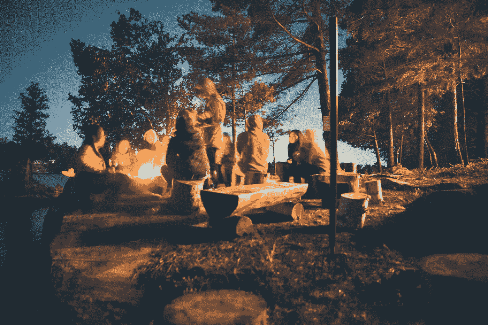

# 营火领导

> 原文：<https://medium.datadriveninvestor.com/campfire-leadership-43fe5bbb8a8e?source=collection_archive---------7----------------------->

## 生火开公司

Photo by [Marko Horvat](https://unsplash.com/@lemondyt?utm_source=medium&utm_medium=referral) on [Unsplash](https://unsplash.com?utm_source=medium&utm_medium=referral)

在树林里，远离城市的喧嚣，你可能会发现自己在收集树枝和砍木头，这样你就可以得到一点温暖。围坐在篝火旁，凝视火焰，分享温暖和故事，是一件神秘的事情。即使它只是后院的一个火坑。

就连一个业余点火手都知道，如果你试图点燃一大堆木头，那是行不通的。取而代之的是，用一些纸或干草(或用打火机液体欺骗一下)，建造一个简单的木制结构，让连续大小的易燃物和火种流通。一旦你有了足够的三种原料——燃料、热量、氧气——你就可以添加更大的原木。

创业在某些方面是相似的。从一个想法的小火花开始，轻轻地培养它，看看它是否流行。试图做一件太大太早的事情是不可能的，很像直接点燃一根木头。因此，相反，我们添加一点火种，保护火免受太多的风，轻轻地吹，使火增长。

在火周围流动的空气对保持余烬燃烧至关重要。对我来说，这代表了信息的流动以及与企业周围环境的互动。与早期采用者和客户建立联系，并在组织的各个层面上分享这一点，可以带来保持业务活力的能量。早期公司的每个人都需要一起工作。

 [## 领导力。赢得|数据驱动型投资者需要更广阔的视角

### 不管他们愿不愿意，领导者都是快速运转的机器中的齿轮，这就要求他们夹住自己的爪子…

www.datadriveninvestor.com](https://www.datadriveninvestor.com/2020/02/07/leadership-it-takes-a-wider-perspective-to-win/) 

木柴——火的燃料——代表着组织的结构。是资本、人和设备让火的炼金术得以发生。将所有这些放在一起，加上正确的结构以及互动和信息的流动，就能让火焰呼吸和生长。

Photo by [Courtnie Tosana](https://unsplash.com/@courtniebt13?utm_source=medium&utm_medium=referral) on [Unsplash](https://unsplash.com?utm_source=medium&utm_medium=referral)

热量是公司的产出。奇怪的是，火的热量只有在有一定量的热量时才会产生。因此，它提醒我们，一个企业正在不断地建立在它以前的成就上，或者处理它最近的失败。延续一场火要比从头开始容易得多。我们必须控制增长！否则，大火会吞噬周围的一切，并以极其短暂的火焰形式消失。

# 建立信任

也许我们已经达到了隐喻的极限。在一个组织中有一个我无法用篝火来表达的重要因素:信任。

一个组织的每一个部分都必须在更大的图景中适应它的角色，以实现它的目标。没有来自人们真正一起工作的潜在信任，这是区分一个企业和无生命的火的化学反应的原因。这是一个人的因素，来自于建立一个团队，互相支持，朝着共同的目标努力。或许是柴火和火焰共同作用，只是他们不知道罢了。永远不要忘记，你有一个由需要被欣赏和信任的人类组成的活生生的公司。

没有一个公司仅仅是化学反应。

作为领导者，我们必须为一个成功的组织创造条件。你不能直接为他们做每个人的工作。我们必须依次建立活动、人员、资本和设备的正确顺序。我们必须确保信息自由准确地流动。我们必须调整和添加燃料，以保持燃烧，同时避免不受控制的增长。

如果我们足够幸运，让火燃烧起来，与世界分享它的温暖，我们可以和我们的团队坐在一起，分享微笑和故事。这提醒我们，我们的公司到底是什么:一个共同建设的社区。

Photo by [Tegan Mierle](https://unsplash.com/@tegan?utm_source=medium&utm_medium=referral) on [Unsplash](https://unsplash.com?utm_source=medium&utm_medium=referral)