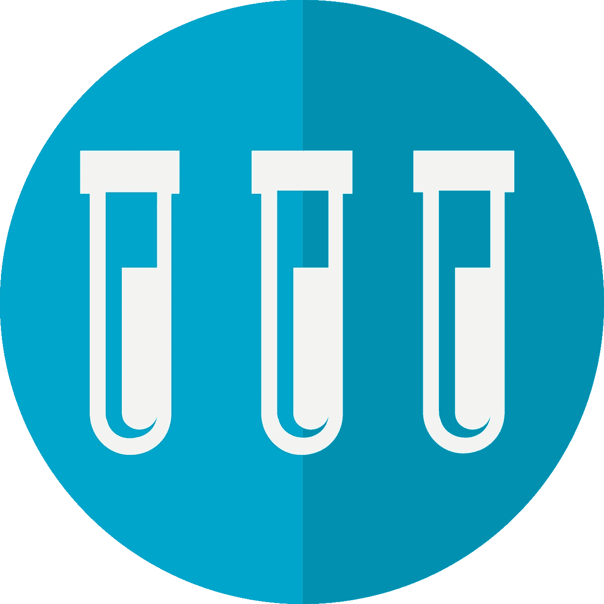
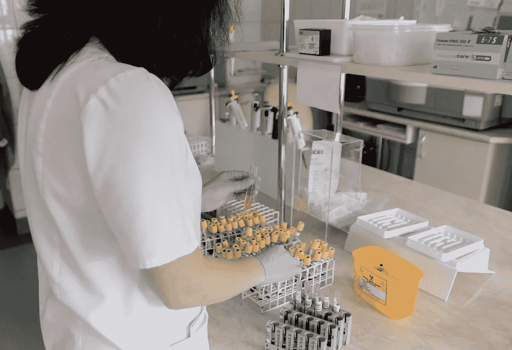

# 雅培实验室能从冠状病毒中赚钱吗？—市场疯人院

> 原文：<https://medium.datadriveninvestor.com/can-abbott-laboratories-make-money-from-coronavirus-market-mad-house-ad7c8327d2f0?source=collection_archive---------30----------------------->

**雅培实验室(纽约证券交易所:ABT)** 声称在 2020 年 4 月，它可以每天提供 50，000 次冠状病毒测试。因此，许多投资者将重新审视这家医疗用品公司。

彭博[报道](https://www.bloomberg.com/news/articles/2020-03-27/abbott-launches-5-minute-covid-19-test-for-use-almost-anywhere)，美国美国食品药品监督管理局(FDA)批准使用雅培实时新型冠状病毒 EUA 测试。雅培的分子仪器 m2000 实时系统将运行测试，新闻稿[表示](https://www.abbott.com/corpnewsroom/product-and-innovation/abbott-launches-novel-coronavirus-test.html)。

雅培声称将运送 150，000 份新冠肺炎病毒检测报告给医院。此外，到 3 月底，雅培诊断公司正在将其实时新型冠状病毒 EUA 测试产量扩大到一百万个测试。

# 雅培公司如何从冠状病毒中获利

彭博声称，在测试中，测试人员将使用 ID Now 系统一个重量不到 7 磅的小盒子。为了得到要测试的材料，测试人员将使用鼻拭子。

 [## 投资区块链前要问的三个简单问题(也是一个困难的问题)|数据…

### 现在是了解区块链的最佳时机。不同货币之间的增长率，比如…

www.datadriveninvestor.com](https://www.datadriveninvestor.com/2020/03/12/three-simple-questions-and-one-difficult-one-to-ask-before-investing-in-a-blockchain/) 

由于冠状病毒的隐蔽性，对新冠肺炎测试的需求将会很高。特别是，据彭博[报道](https://www.bloomberg.com/news/articles/2020-03-28/dutch-hospital-workers-show-insidious-nature-of-coronavirus)，对荷兰卫生工作者的调查显示，冠状病毒“意外的高流行率”表明隐藏的社区传播。

马里恩·库普曼告诉彭博，冠状病毒测试是必要的，因为感染是轻微的。解释一下，库普曼是“鹿特丹伊拉兹马斯大学医学中心病毒科学部的主任。”

微生物学家 Jan Kluytmans 告诉彭博说:“有一系列疾病还没有被完全认识到。因此，医生需要检测新冠肺炎隐藏光谱的方法。

因此，我认为对雅培实验室的测试会有巨大的需求。此外，山姆大叔会支付测试费用。2020 年 3 月 27 日，国会通过了唐纳德·川普总统(纽约州共和党人)签署了一项 2 万亿美元的冠状病毒支出计划，*商业内幕* [报道](https://www.businessinsider.com/trump-signs-coronavirus-economic-relief-aid-bill-checks-for-americans-2020-3)。

因此，雅培的产品有很高的需求和政府资助。

# 雅培公司赚钱了吗？

有趣的是，**雅培制药(纽约证券交易所代码:ABT)** 在冠状病毒出现之前就开始赚钱了。例如，雅培在 2019 年 12 月 31 日报告了 48.8 亿美元的季度毛利。

此外，在截至 2019 年 12 月 31 日的季度，Abbot 获得了 13.89 亿美元的运营收入和 10.49 亿美元的共同净收入。此外，雅培报告同一季度的收入为 83.14 亿美元。此外，雅培报告该季度收入增长率为 7.07%。

然而，雅培在 2019 年 12 月 31 日报告了 2.31 亿澳元的期末现金流。然而，雅培的钱柜里有大量现金。雅培当天公布了 24.16 亿美元的运营现金流。

# 雅培是价值投资吗？

此外，我认为雅培拥有很高的安全边际，因为它在 2019 年 12 月 31 日拥有 41.4 亿美元的现金和短期投资。此外，雅培同日总资产为 678.87 亿美元。

因此，我认为市场先生在 2020 年 3 月 29 日低估了雅培(纽约证券交易所:ABT)每股 79.34 美元的价值。此外，我预测雅培的股价会因为对新冠肺炎测试难以置信的需求而飙升。

特别是，对新冠肺炎病毒的分子检测需求会很高。雅培声称是新冠肺炎病毒分子测试的领导者。因此，雅培可以开发更多的冠状病毒测试产品。

除此之外，测试[雅培](https://en.wikipedia.org/wiki/Abbott_Laboratories)生产各种医疗设备、诊断和营养产品。此外，雅培是仿制药的主要参与者。例如，雅培拥有智利的 CFR 制药公司，这是一家仿制药制造商。

# 雅培是好的分红股票吗？

**雅培制药(纽约证券交易所:ABT)** 是一只很好的分红股票。例如，雅培股份将于 2020 年 4 月 14 日支付 36₵股息。

令人印象深刻的是，Dividend.com 将 47 年的股息增长归功于雅培。总体而言，截至 2020 年 3 月 30 日，雅培提供的股息收益率为 1.93%，年化派息为 1.44 美元，派息率为 40.63%。因此，我认为雅培公司是一个很好的成长股。

归根结底，我喜欢雅培公司，因为它能带来收入增长、丰厚的股息和高安全边际。如果你正在寻找冠状病毒时代的安全股票，你需要调查雅培实验室。

*原载于 2020 年 3 月 30 日*[*【https://marketmadhouse.com】*](https://marketmadhouse.com/can-abbott-laboratories-make-money-from-coronavirus/)*。*