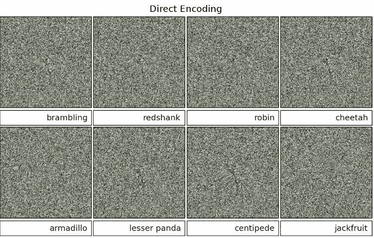
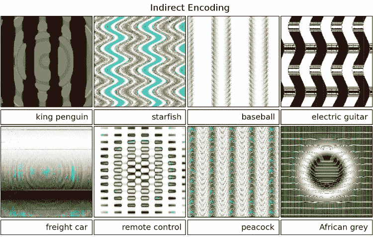

# AI 会被忽悠吗？

> 原文：<https://medium.datadriveninvestor.com/can-ai-be-fooled-722f59bb2e9a?source=collection_archive---------14----------------------->

在过去的几十年里，计算机能够像人类一样观察世界的前景已经成为越来越感兴趣的话题。通过多年的研究，我们已经了解了人类视觉系统的复杂性，以及在机器中复制这些过程将会多么令人印象深刻。为了复制人类“看”世界的方式，计算机必须破译多维数据，并识别数据中的模式。当然，这并不容易。

深度神经网络(DNN)是一种前馈型网络，用于模拟各种复杂的非线性关系。在计算机视觉方面(更具体地说是图像识别)，经过训练识别交通标志的 DNN 将使用给定图像的数据来计算图像中的标志是某个交通标志的概率。最近，DNNs 已经在许多任务中实现了接近人类的性能，例如视觉分类和模式识别。

 [## AI 将军是否已经超过了人类的智力容量？数据驱动的投资者

### 不仅在游戏中，而且在劳动力市场上，机器都比人类聪明。在今天的许多领域，使用…

www.datadriveninvestor.com](https://www.datadriveninvestor.com/2020/02/12/has-general-ai-exceeded-the-intellectual-capacity-of-humans/) 

现在，鉴于 dnn 能够如此好地分类图像，问题就出现了:人类和计算机视觉之间有什么区别吗？有没有可能存在人类看似无法识别，但计算机却相当明显的图像？反之亦然。你可能很高兴听到人类视觉在某些领域仍然超过计算机视觉。最近的研究表明，DNNs 可以被愚弄，而且事实上相当容易。一项[研究](http://www.evolvingai.org/fooling)显示，有可能创造/进化出人类无法识别的合成图像(例如电视静态图像)，但计算机有很高的把握将其归类为熟悉的物体。

有两种方法来发展这些“愚蠢”的形象。首先通过直接编码图像:这是通过独立地优化每个像素中的颜色值来完成的。直接编码的图像输出类似白噪声的视觉效果(或者对我们人类来说是电视静电噪声)。DNN 已经将下面的图像归类为熟悉的物体。

第二，人们可以用间接编码来发展图像，间接编码使用更规则的模式来产生图像。这些类型的图像可以被人类和 DNA 识别。类似地，下面的图像对人类来说是不可识别的，但是 DNNs 还是以某种方式对它们进行了高度确定的分类。

## 为什么 DNNs 会犯这样的错误？

这一切都与 DNN 关注的焦点有关。在直接编码图像的情况下，DNNs 可能会看到模糊地类似于它所训练的图像的集中的彩色像素。在其他情况下，图像可能具有某一类别的正确颜色或图案，这表明一个无法识别的图像是一个熟悉的对象。

## 为什么愚弄 DNNs 很重要？

想象一个场景，部署一个面部识别系统来检测哪些员工有权访问某些文件。犯罪分子可能会通过制作合成图像来欺骗或绕过系统。这是一个相当大的安全风险，并向我们表明，在能够取代人类之前，计算机视觉还有很长的路要走

*参考文献*

[阮一甲](http://anhnguyen.me/)，[林斯基 J](http://yosinski.com/) ，[克卢恩 J](http://jeffclune.com/) 。深度神经网络很容易被忽悠:对无法识别的图像的高置信度预测。《计算机视觉和模式识别》(CVPR 2015 年)，IEEE，2015 年。( [pdf](http://www.evolvingai.org/files/DNNsEasilyFooled_cvpr15.pdf) )