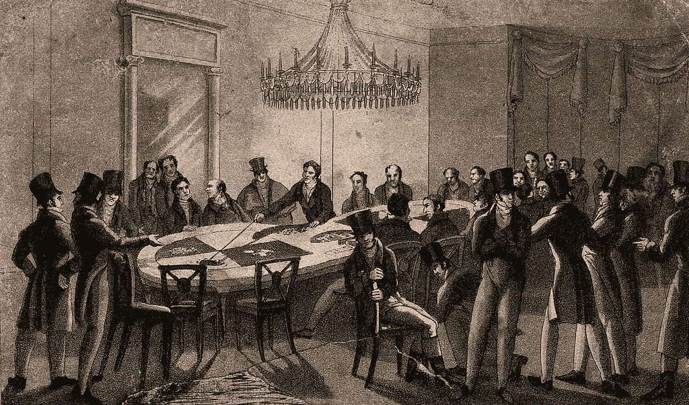
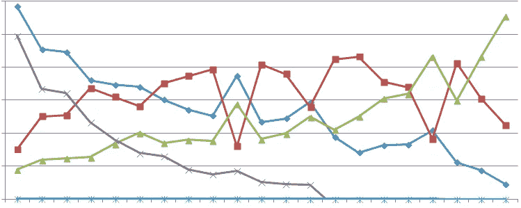
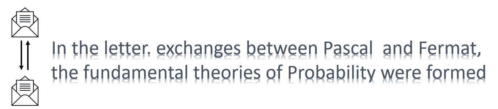
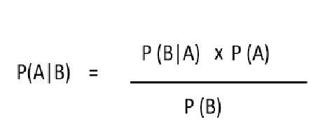

# AI 能赢一场赌博比赛吗？

> 原文：<https://medium.datadriveninvestor.com/can-ai-win-a-gambling-match-4fd161ce4d3a?source=collection_archive---------10----------------------->

Image by OpenClipart-Vectors from pixbay.com

他用力地玩弄手中的骰子，一小群人因好奇而欢呼，看谁会赢。一滴汗水从他的额头滴下，天气并不温暖，但他的心在狂跳。他知道他必须赢得这场赌博。他必须在两个骰子上都出现 6 才能赢。很多钱处于危险之中，他今晚已经输了很多。如果这次赌博失败，他将陷入困境。他对自己说，我不能失去这个，我已经计算好了，这是我发财的地方。他让骰子滚动，当骰子在垫子上滚动时，对他来说似乎是永恒的。当骰子停下来时，他可以听到欢呼的人群变化的声音，慢慢地他意识到他又输了。

Image by Wellcome Images from commons.wikimedia.org

在失败之夜的前几天，1654 年的一位法国贵族正在星空下数他的奖金。Méré赢了几个回合，其中一个骰子要掷 4 次，他必须至少掷一次 6。他常常设法在 4 个演员中找到 6 个。他认为没有什么比胜利更甜蜜的了。他们再也不会回来和我玩同样的游戏了，他想，我怎样才能保持连胜呢？很快，他想到了一个主意，他认为我可以用不同的方式设置相同的游戏，然后再赢一次。如果我必须在 4 个回合中掷出 6，我有 6 分之 4 的机会(4/6)做得很好。如果我邀请他们玩一个有两个骰子的游戏，我必须在每个骰子上掷出一个 6。现在我们有 6x6 = 36 种可能性，而不是每次施法有 6 种可能性。如果我掷骰子 24 次，那将是 24/36 = 4/6，和之前的赔率一样。

虽然他的计算非常合理，但究竟是哪里出了问题呢？他是如何失去他的财富的呢？不知道答案，他是不会罢休的。他开始给当时著名的发明家之一布莱士·帕斯卡写一封信。帕斯卡有许多贡献，包括发明了以他名字命名的机械计算器。

 [## 人工智能、区块链和智能合约:为什么我们都需要拥抱创新|数据驱动的投资者

### 区块链是一个抓住了我的想象力的行业，有助于为更大的利益改造社会。我开始…

www.datadriveninvestor.com](https://www.datadriveninvestor.com/2020/08/03/ai-blockchain-and-smart-contracts-why-we-all-need-to-embrace-innovation/) 

在我们结束这个故事并试图回答这个问题之前，如果一个人工智能系统可以赢得一场赌博比赛。为什么我们要在一篇关于人工智能的文章中谈论这个故事？让我们考虑几个例子，

一个自动驾驶系统正以每小时 90 英里的速度在双向高速公路上行驶。它突然注意到前面行驶的卡车已经停了下来。如果系统继续以同样的速度行驶，它会撞上停止的卡车。如果系统试图突然停止，可能会对乘客造成伤害。它也可能被后面驶来的汽车撞到。系统可以决定移动到相邻车道并继续前进。在这种情况下，它可能会被迎面而来的车辆撞上，视线被前面的卡车挡住。

Image from pikist.com

那么，自动驾驶系统应该怎么做呢？这个问题没有明确的答案。该系统必须采取对乘客和道路上的其他驾驶员最安全的选择。更重要的一点是，人工智能经常需要处理不确定性。

让我们看另一个例子，考虑一个可以爬山的自动化人工智能系统。该系统可以像人类一样使用安全带来避免坠落造成的伤害。如果系统不能处理不确定性，有两种可能性。首先，它可能认为它在攀爬时肯定会掉下来，在这种情况下，它可能根本不攀爬以避免伤害。第二，如果它假设自己肯定不会掉下去，那么它就会在没有安全带的情况下攀爬。实际情况是，不确定在攀登过程中是否会有坠落。

这种情况不仅限于处理物理世界的 AI 系统。考虑一个网络监控系统的例子。假设系统注意到负载峰值导致性能下降。系统必须增加资源以保持性能水平。系统还必须优化成本。如果系统资源增加，并且很少或没有峰值出现，这可能是成本上的浪费。如果资源没有增加，并且负载出现峰值，这将导致糟糕的用户体验。无法确定是否会出现负载峰值。

既然我们已经确定了一个人工智能系统将面临一个不确定的情况。

让我们回到我们的故事。当帕斯卡收到关于赌博问题的信时，他非常着迷。他给另一位著名数学家皮耶·德·费玛写了一封信。他们两人交换了几封信，解决了这个问题。

问题本身是通过计算失败的概率来解决的。在第一种情况下，1 个骰子被掷出 4 次，可能的结果总数为(4 轮中每轮 6 种可能性)6x6x6 = 1296。在这 5 个不是 6 的结果中。这意味着 5x5x5x5 = 625 个非 6 的结果。失败的概率是 625/1296，结果是 0.48，所以有 52%的机会获胜。

当涉及 2 个骰子时，每个骰子有 36 种可能性。如果我们有 24 次投掷，那么总的可能性是 36×36..24 次。每掷 35 分是不可取的(也就是说它不是双 6)。24 次投掷中非预期结果的数量是 35x 35x…24 次。输的概率是 35x 35x…24 次/36x36x..乘以 24 得出 0.508。这意味着在第二轮比赛中只有不到 50%的胜算。这解释了为什么有一个高得多的概率会失去两个骰子。

现在来回答“AI 能赢一场赌博游戏吗？”即使是人工智能系统也不可能保证赢。人工智能系统可以利用概率和其他智能决策技术来最大化获胜的可能性。

回到更大的问题，人工智能系统如何处理不确定性？人工智能系统可以使用许多技术来处理不确定性。一些流行的方法如下，

1.  贝叶斯理论:这是基于概率，利用随机变量的条件和边际概率分布

Bayes’ Theorem (deals with conditional probabilities)

2.基于规则的专家系统(MYCIN):这涉及到由专家提取或设计的规则，这些规则可以链接起来以得出最佳决策

3.模糊集:它们与集合相似，但是每个元素都有不同程度的隶属度

4.谢弗-登普斯特的信念函数:系统使用独立的信息或证据来计算概率

5.推理假设理论:该理论使用数学方法进行推理，不使用认识论方法([我之前关于这个话题的讨论，柏拉图连接](https://medium.com/datadriveninvestor/the-plato-connection-knowledge-representation-in-ai-44d59d323268)

6.背书理论:这是一种定性的方法，其中的方法是考察与某一事件或背书相关的因素，以解决不确定性，这些都有一些根源

还有更多…

总之，人工智能正在获得牵引力，并从研究实验室走向现实世界。在现实世界中，人工智能将不得不处理许多不确定性。这将是令人兴奋的，让我们看到这些系统的工作。我欢迎你系好安全带，享受旅程。

**访问专家视图—** [**订阅 DDI 英特尔**](https://datadriveninvestor.com/ddi-intel)