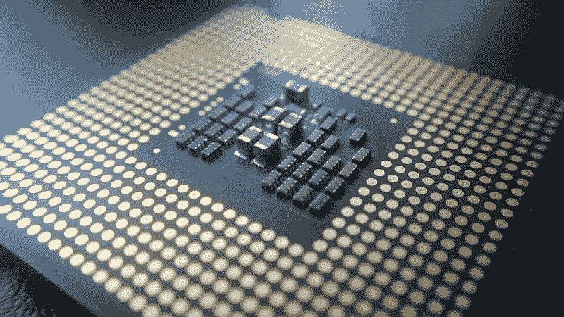

# Ambarella (AMBA)能从自动驾驶汽车中赚钱吗？—市场疯人院

> 原文：<https://medium.datadriveninvestor.com/can-ambarella-amba-make-money-from-self-driving-cars-market-mad-house-36e12ed43670?source=collection_archive---------21----------------------->

Ambarella Inc .(纳斯达克股票代码:AMBA) 可能是从自动驾驶汽车中赚钱的最佳股票？

解释，设计和制造帮助自动驾驶汽车观察和导航的处理器和芯片。Ambarella 的专长包括[高分辨率成像和神经网络处理](https://www.ambarella.com/applications/automotive/)。

Ambarella 的处理器可以运行智能电子后视镜、行车记录仪、车队管理解决方案、ADAS(高级驾驶辅助系统)摄像头等。Ambarella 技术的其他用途包括广播电视、高清视频、仪表板摄像机、无人机、警用可穿戴摄像机、安全摄像机和包括 NEST 在内的消费安全设备。

Ambarella 声称其技术可以实现全自动驾驶汽车。Ambarella 的主要领域包括人工智能处理器、安全 IP 摄像机、运动摄像机、无人机摄像机等。*

# Ambarella 如何帮助机器看东西

Ambarella 的标志性产品包括低功耗摄像机、立体视觉、UHD 图像质量和 CVflow。例如，Ambrrealla 为计算机视觉算法设计了其 [CVflow 芯片架构](https://marketmadhouse.com/can-ambarella-amba-make-money-from-self-driving-cars/#cvflow)。CVflow 作为专用的视觉处理引擎，具有高级算法描述。因此，CVflow 帮助自动驾驶汽车、机器人、无人机和其他机器“看见”。

Ambarella 公司声称其相机的效率是竞争对手产品的五倍。Ambarella 的立体视觉处理将 2D 图像转换为 3D 图像。因此，立体视觉可以从低功率相机生成 3D 图像。

Ambarella 汽车专用产品包括汽车记录仪、带停车辅助功能的 360°全景系统、驾驶员监控系统、车内监控系统、前置 ADAS 摄像头和智能电子后视镜。

# 安布拉贝拉和亚马逊

**Ambrabella (AMBA)** 是支持亚马逊 AWS Panorama 机器学习设备和软件开发工具包(SDK)的两家硬件制造商之一。

一份新闻稿称， [AWS Panorama](https://marketmadhouse.com/can-ambarella-amba-make-money-from-self-driving-cars/machine%20learning%20Appliance%20and%20Software%20Development%20Kit%20(SDK)) 为数码相机增加了计算机视觉(CV)。亚马逊网络服务(AWS)声称 Panorama 允许平台使用数码相机的 CV 图像进行预测。

AWS 将基于 Panorama 推出两款产品。这些产品是 AWS Panorama 设备和 AWS Panorama 设备 SDK。

“亚马逊网络服务声称，AWS Panorama 设备是一种硬件设备，允许你将 CV 添加到不是为适应计算机视觉而构建的互联网协议(IP)相机中。“AWS Panorama 设备将您现有的摄像机转变为智能摄像机，可以在多个并发视频流上运行 CV 模型。"

因此，工厂经理可以使用 AWS Panorama 设备监控工厂车间发生的一切，而无需更换摄像机。

“AWS Panorama Device SDK 是一个软件包，它使第三方制造商能够构建新的相机，在边缘运行更有意义的 CV 模型，用于对象检测或活动识别等任务，”AWS 新闻稿称。" AWS 全景兼容相机的工作与 AWS 机器学习服务开箱即用."

例如，安全官员可以在机场使用 AWS Panorama 设备 SDK 和兼容 AWS Panorama 的摄像机来发现携带武器的人。同样，警察可以使用 AWS 全景兼容摄像机来发现没有戴口罩的人或犯罪嫌疑人。

**Ambarella(纳斯达克:AMBA)** 和 **NVIDIA (NVDA)** 正在与**亚马逊**合作，为 AWS Panorama 设备生产处理器。因此，Ambarella 可以进入一个巨大的新市场。

 [## 面向企业转型的 AWS:顶级云架构师的秘密|数据驱动型投资者

### “您使用云实现企业转型的方法是什么？”是人们一直问我的问题，自从我…

www.datadriveninvestor.com](https://www.datadriveninvestor.com/2020/07/15/aws-for-enterprise-transformation-secrets-of-top-cloud-architects/) 

# 市场先生喜欢 Ambarella

许多投资者喜欢安巴雷拉(AMBA) ，因为它的股票比英伟达(NVDA)**的**便宜。例如，2020 年 12 月 7 日，市场先生为英伟达支付了 544.27 美元，为 AMBA 支付了 90.47 美元。

2020 年，Ambarella 的股价从 1 月 2 日的 62.76 美元涨到 12 月 3 日的 89.18 美元，再涨到 2020 年 12 月 7 日的 90.49 美元。因此，Ambarella 是市场先生喜欢的成长型股票。

然而，我不认为 Ambarella 的财务状况证明了市场先生为其支付的价格是合理的。

# Ambarella 赚钱了吗？

事实上，Ambarella 几乎不赚钱。例如，Ambarella 报告截至 2020 年 7 月 31 日的季度收入为 5011 万美元。

有趣的是，Ambarella 报告这些收入的季度毛利为 3096 万美元。Ambarella 亏损，截至 2020 年 7 月 31 日，其季度运营亏损为-1569 万美元。

此外，Ambarella 报告 2020 年 7 月 31 日的季度运营现金流为负 242 万美元。此外，Ambarella 报告 2020 年 7 月 31 日的季度末现金流为负-1594 万美元。

Ambrealla 亏损烧钱。奇怪的是，Ambarella 在 2020 年 7 月 31 日有 4.1071 亿美元的现金和短期投资。

而且，Ambarella 价值不大。例如，Ambarella 在 2020 年 7 月 31 日的总资产为 5.334 亿美元。

归根结底，我认为 Ambarella 是一只赔钱的糟糕股票，没有什么价值。我建议投资者避开安巴雷拉(AMBA)公司(T1)，调查像 T2 英伟达(NVDA)T3 这样赚钱的芯片制造商。

*[https://3 vpstm 1 HC 6 e 52739 x 31131 p 2-WP engine . net DNA-SSL . com/WP-content/uploads/ambarella-company-fact-sheet-3 . pdf](https://3vpstm1hc6e52739x31131p2-wpengine.netdna-ssl.com/wp-content/uploads/ambarella-company-fact-sheet-3.pdf)

*原载于 2020 年 12 月 7 日 https://marketmadhouse.com**[*。*](https://marketmadhouse.com/can-ambarella-amba-make-money-from-self-driving-cars/)*

***访问专家视图—** [**订阅 DDI 英特尔**](https://datadriveninvestor.com/ddi-intel)*