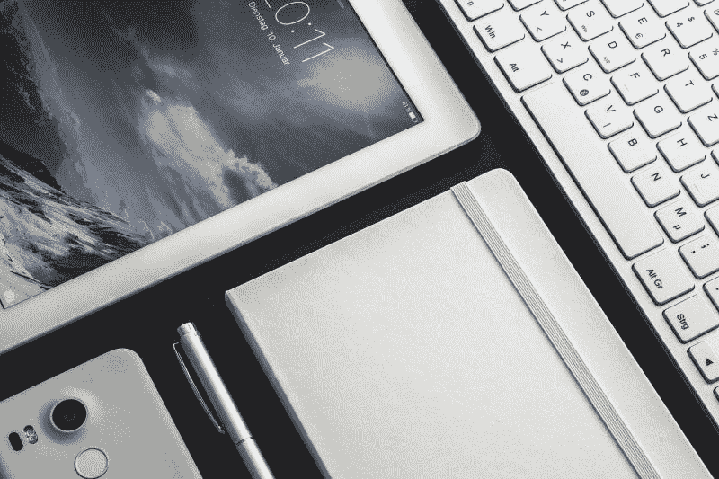

# 苹果(纳斯达克代码:AAPL)能挺过冠状病毒吗？—市场疯人院

> 原文：<https://medium.datadriveninvestor.com/can-apple-nasdaq-aapl-survive-coronavirus-market-mad-house-2b51d416569c?source=collection_archive---------16----------------------->

冠状病毒可能威胁任何股票；包括**苹果(纳斯达克股票代码:AAPL)** 。苹果硬件销售额从 2019 年第二季度的 311 亿美元降至 2020 年第二季度的 289.6 亿美元。

令人难以置信的是，Mac、iPhone 和 iPad 的销量都因为冠状病毒、 *TechCrunch* 而下降。特别是苹果商店，苹果公司最明显的销售渠道，都被关闭了。

然而， *TechCrunch* 估计，苹果的服务收入从 2019 年第二季度的 115 亿美元增长到 2020 年第二季度的 133 亿美元。这些服务包括 Apple TV+和 Apple Music。

可以预见的是，苹果可穿戴和家用产品的销量正在增长。例如，TechCrunch 估计，HomePod 的销售额从 2019 年第二季度的 51 亿美元增长到 2020 年第二季度的 63 亿美元。此外，苹果的可穿戴硬件销售额同期从 115 亿美元增长到 133 亿美元。

因此，我认为苹果需要改变其商业模式来应对冠状病毒。

 [## 数据驱动投资的兴起|数据驱动投资者

### 当 JCPenney 报告其 2015 年 2Q 的财务结果时，市场感到非常震惊。美国零售巨头…

www.datadriveninvestor.com](https://www.datadriveninvestor.com/2019/02/28/the-rise-of-data-driven-investing/) 

# 冠状病毒如何帮助和伤害苹果

此外， *TechCrunch* 声称，冠状病毒引起的供应链问题可能会使 5G iPhone 的发布推迟一个月。

我不认为 5G iPhone 的延迟会伤害苹果，因为呆在家里会减少对新手机的需求。解释一下，有社交意识的人被困在家里，所以他们没有必要用一部漂亮的新手机来打动他们的朋友和同事。

然而，我认为 HomePod、AirPods 和 Apple Watch 的延迟可能会伤害苹果。详细来说，这些产品的需求是因为冠状病毒。

例如，人们希望苹果手表监测他们的健康状况，以发现冠状病毒症状。此外，人们希望 AirPods 屏蔽掉他们的亲戚在家里讨论的废话。另外，被困在家里的家庭可能想要一个 HomePod。

因此，冠状病毒对苹果来说既是危机也是机遇。机会在于对其产品和服务的需求增加。这场危机破坏了供应链，降低了对一些产品的需求。

例如，一名办公室工作人员不再希望在通勤期间在火车上玩 iPhone。然而，这位办公室职员现在想要一台 HomePod，让家里的生活更加舒适。

# 冠状病毒对 Apple Pay 有好处

有趣的是，冠状病毒正在加速 Apple Pay 的采用。比如**瑞银集团股份公司(NYSE:UBS)**；瑞士最大的银行，终于可以支持 Apple Pay，*朝九晚五 Mac* 。

出于安全考虑，瑞银一直回避 Apple Pay。然而，一条推文表明，瑞银可能很快就会支持 Apple Pay。

同样，澳洲第二大银行**西太平洋银行(纽约证券交易所:WBK)** 于 2020 年 4 月 28 日开始支持 Apple Pay，*极客紧缩评论*。因此澳大利亚所有的四大银行；NAB、西太平洋银行、英联邦银行、澳新银行集团(ANZ)都支持 Apple Pay。

因此，Apple Pay 现在几乎适用于所有澳大利亚人，因为大多数澳大利亚人都在四大银行之一开户。由于冠状病毒的担忧，西太平洋银行开始支持 Apple Pay。

解释一下，很多人出于对冠状病毒暴露的恐惧，希望避免接触收银员和银行柜员。此外，许多人担心纸币会传播新冠肺炎病毒。

# 特朗普和贸易战如何伤害苹果

唐纳德·川普总统(佛罗里达州共和党)幼稚的贸易战可能会伤害**苹果公司(纳斯达克代码:AAPL)。**

中国政府可以通过监管行动来限制苹果的运营。中国监管机构可能会针对苹果，以报复特朗普政府阻止向中国电信巨头华为运送半导体的计划。

中国报纸*环球时报*声称:“中国将对这些公司发起一轮又一轮无休止的调查，就像悬在他们头上的剑一样。”。“这将打击投资者的信心，挤压他们在中国市场的收入。"

美国商务部禁止美国半导体和其他电子产品向华为发货。特朗普政府官员认为华为太大太强大。

# 特朗普和中国如何伤害苹果

中国政府可能会通过关闭中国的苹果商店、限制 iPhone 在中国的销售或限制苹果中国工厂的出口来伤害苹果。中国官员希望通过削减苹果公司的利润向特朗普施压，导致华尔街转向总统。

与此同时，特朗普需要被视为对中国强硬，以鼓励他狂热的民族主义基础。然而，特朗普的行动可能会适得其反，因为大多数美国人喜欢 iPhones，但不太关心中国。

我预测，如果苹果价格上涨或苹果产品短缺，特朗普将会退缩。我认为唐纳德最不想看到的就是在选举日之前的几周内苹果产品短缺。

# 苹果仍然是一台赚钱机器

苹果公司(纳斯达克股票代码:AAPL)仍然是一台赚钱机器。例如，据报道，亚马逊在 2020 年 3 月 31 日的收入为 583.13 亿美元，季度毛利为 223.7 亿美元。

相比之下，苹果公司报告称，截至 2019 年 3 月 31 日，季度毛利为 218.21 亿美元，季度收入为 580.15 亿美元。因此，亚马逊的收入和毛利比去年略有增长。

此外，苹果报告截至 2020 年 3 月 31 日的季度营业收入为 128.54 亿美元，普通净收入为 112.49 亿美元。相比之下，亚马逊报告的季度共同收入为 115.61 亿美元，去年同期的季度运营收入为 134.15 亿美元。

因此，苹果的财务数据在过去的一年里没有太大变化。我认为这使得苹果成为一项价值投资，因为它证明了苹果可以在困难的条件下赚钱。

而且，苹果上个季度的收入增长比 2019 年要好一些。具体来说，2020 年前三个月，Stockrow Apple 的营收增长率为 0.51%。相比之下，苹果的收入在 2019 年的前三个月缩水了-5.11%。

# 苹果产生了多少现金？

很容易理解为什么沃伦·巴菲特推崇苹果公司(纳斯达克股票代码:AAPL)。苹果仍然产生大量现金。

例如，截至 2020 年 3 月 31 日，苹果公司报告的营业现金流为 133.11 亿美元，投资现金流为 90.13 亿美元，期末现金流为 13.84 亿美元。相比之下，苹果去年同期的运营现金流为 111.55 亿美元，投资现金流为 133.48 亿美元，期末现金流为-49.54 亿美元。

归根结底，苹果仍然是一家现金充裕的公司。截至 2020 年 3 月 31 日，苹果拥有 940.51 亿美元的现金和短期投资。这一数字比 2019 年 3 月 31 日的 800.92 亿美元有所增长。

我的结论是，苹果有很高的安全边际，因为它产生并保留了大量现金。那些为我们混乱的时代寻找安全股票的人需要研究一下苹果。

# 苹果定价过高吗？

我认为市场先生在 2020 年 5 月 19 日将**苹果公司(纳斯达克股票代码:AAPL)** 的价格定在了 315.83 美元。

此外，苹果的股价在疫情期间一直保持良好。苹果 2020 年 1 月 2 日以 300.35 美元开始，2020 年 3 月 23 日跌至 224.37 美元的低点，5 月 15 日上涨 307.71 美元，至 2020 年 5 月 19 日的 315.83 美元。

因此,“市场先生”表明苹果是一只安全的股票，即使面对极端事件也能保持大部分价值。

# 苹果仍然是价值投资

我认为**苹果(纳斯达克股票代码:AAPL)** 仍然是一个价值投资，因为它是安全的，并保持其价值。

此外，我认为苹果是一只优秀的分红股票。苹果股票在 2020 年 5 月 8 日支付了 82₵季度股息。5₵从 77₵获得的股息增长于 2020 年 2 月 7 日支付。

总体而言，每股苹果股票的股息率为 1.07%，年化派息为 3.28 美元，派息率为 26.61%。此外，Dividend.com 认为苹果公司连续七年实现了股息增长。

# 苹果的价值

此外，苹果是我称之为 NAMPOF 的一批科技股之一。NAMPOF 由 **NIVIDIA(纳斯达克:NVDA)** 苹果、**微软(纳斯达克:MSFT)** 、 **PayPal(纳斯达克:PYPL)** 、**甲骨文(纽约证券交易所:ORCL)** 和**脸书(纳斯达克:FB)** 组成。

这个 [NAMPOF](https://marketmadhouse.com/nampof-an-alternative-to-fang-stocks/) 是我对被高估的方的替代；(脸书，**亚马逊(NASDAQ: AMZN** )， **Nefltix (NASDAQ: NFLX** )，以及**谷歌(NASDAQ: GOOG)** 。我把 NAMPOF 想象成一个科技收藏的集合；苹果和脸书，潜在的增长领导者 PayPal，以及被低估的公司(微软、甲骨文和英伟达)。

如果你正在寻找一种价格合理、股息丰厚的安全价值投资，苹果值得考虑。总之，即使在冠状病毒时代，这家全球最受欢迎的设备制造商仍是一支优秀的股票。

*原载于 2020 年 5 月 19 日 https://marketmadhouse.com**的* [*。*](https://marketmadhouse.com/can-apple-nasdaq-aapl-survive-coronavirus/)