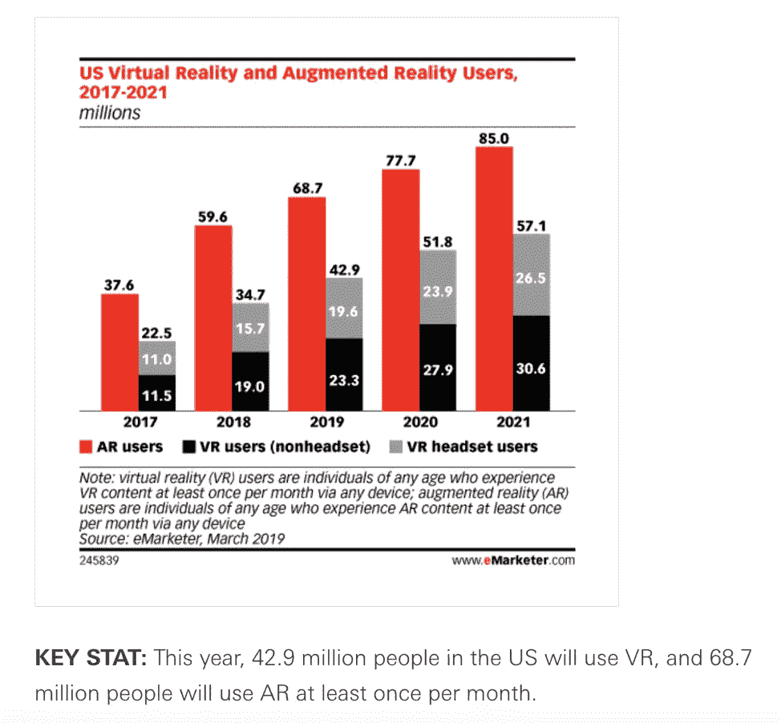
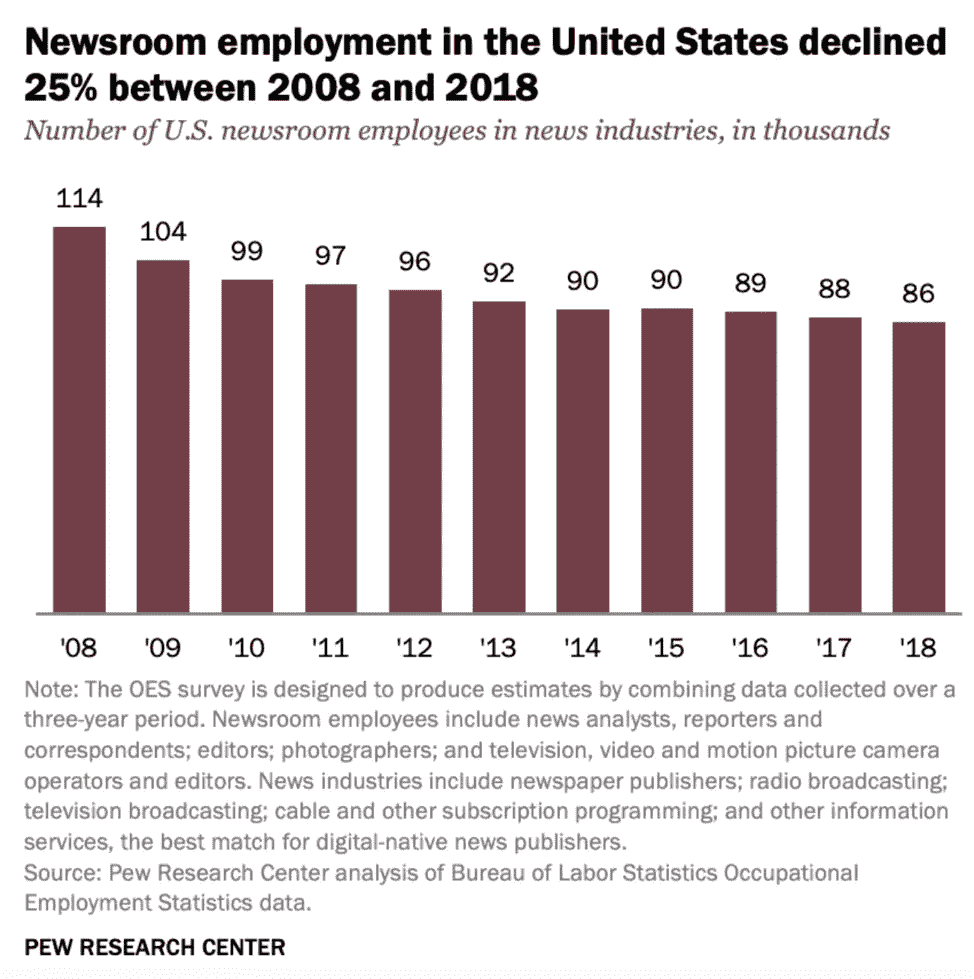
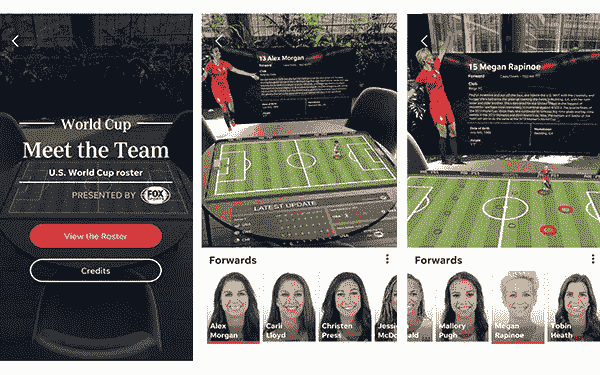

# 增强现实能否帮助一个苦苦挣扎的行业生存下去？

> 原文：<https://medium.datadriveninvestor.com/can-augmented-reality-help-a-struggling-industry-survive-a71494ac7623?source=collection_archive---------12----------------------->

根据 eMarketer 的数据，到 2021 年，8500 万美国人将每月至少使用一次增强现实(AR ),比 2017 年的使用人数增加了 126 %:

Source: eMarketer

AR 正在增长，因为它可以帮助用户以最小的努力将体验融入背景并分享，更不用说它可以帮助公司解决业务问题。但是 AR 真的能帮助拯救一个苦苦挣扎的行业吗？

# 对新闻业来说，有坏消息，也有好消息

你很难找到比新闻业更混乱的行业(不，甚至不是零售业)。2019 年，[皮尤研究中心](https://www.pewresearch.org/fact-tank/2019/07/09/u-s-newsroom-employment-has-dropped-by-a-quarter-since-2008/)报告称，自 2008 年以来，新闻编辑室的就业人数下降了四分之一，降幅最大的是报纸:

Source: PEW Research

2008 年至 2018 年间，报纸编辑部的员工人数下降了 28%，从约 7.1 万人降至 3.8 万人。但也有一线希望:自 2008 年以来，数字原生新闻编辑室员工的数量增加了 82%，从约 7400 名员工增加到 2018 年的约 13500 名。

 [## 人工智能和虚拟现实的融合-你能期待什么|数据驱动的投资者

### 在技术领域，融合是合乎逻辑的一步。就在几十年前，你可能需要一个专门的…

www.datadriveninvestor.com](https://www.datadriveninvestor.com/2018/08/30/the-convergence-of-ai-rv-what-you-can-expect/) 

为什么数字新闻编辑室正在兴起？我认为 AR 提供了一个非常有力的线索。

# 《今日美国》:用 AR“朝着正确的方向前进”

《今日美国》应用程序提供了一部分通过 AR 交付的内容。观众可以通过 AR 体验深入了解新闻事件，从阿波罗 11 号任务 50 周年到抵达美国的第一艘奴隶船的虚拟再现。【Journalism.co.UK 报道】T2，

自从该出版物在 2018 年 7 月发表了第一篇 AR 故事以来，*《今日美国》*的用户参与度非常高。它的女子世界杯项目吸引了 20 万次观看，而去年奥斯卡项目的平均时间几乎是 4 分钟——标准内容平均达到 90 秒左右。

Source: USA Today

《今日美国》网络新兴技术总监 Raymond Soto 告诉 Journalism.co.UK，“这让我们大吃一惊，告诉我们在 AR 互动讲故事方面，我们正朝着正确的方向前进。”

创造 AR 体验需要《今日美国》应用从讲故事、新闻到动画和编码的各种技能([回答了一个长期存在的问题，即记者是否应该知道如何编码](https://www.theatlantic.com/education/archive/2013/10/should-journalism-schools-require-reporters-to-learn-code-no/280711/))。报道像奥斯卡这样的活动让《今日美国》有更多的跑道来准备(该出版物花了三周时间为 2019 年奥斯卡制作 AR 内容)。但《今日美国》也可以相对迅速地在 AR 中报道突发新闻:在八个小时内，该出版物就创造了一种 AR 体验，以解释 2019 年的巴黎圣母院大火。可以肯定的是，八个小时在互联网时间里是一个永恒。但数字新闻编辑室中 AR 的意义在于通过体验为观众提供更多背景和更深入的理解，而不仅仅是实时报道突发新闻。

此外，AR 的出现应该有助于出版商对内容采取更谨慎的方法。将 AR 作为一种选择必然会引发一些问题，比如:什么样的内容最能引起观众的共鸣？AR？视频？写作？平面意象？这些内容形式都不是满足不同受众需求的唯一答案。确保上下文和信息听起来真实，需要一个更周到的方法来将故事与格式结合起来。

# AR 在整个行业流行开来

《今日美国》有一些公司。[纽约时报](https://www.nytimes.com/interactive/2018/02/01/sports/olympics/nyt-ar-augmented-reality-guide.html)和[华盛顿邮报](https://digiday.com/media/washington-post-diving-augmented-reality/)几年来一直在使用 AR 为观众提供更身临其境的对时事的理解[。2019 年，《纽约客》开始在 AR](https://www.newyorker.com/cartoons/cartoon-desk/introducing-new-yorker-cartoons-in-augmented-reality?verso=true) 制作其标志性漫画。[从 Quartz 到 W 的出版物也加入进来](https://arpost.co/2019/01/07/journalists-using-ar-next-level-news/)，因为报纸和杂志正在寻找方法与在线渠道的爆炸式增长(博客是一个明显的例子)竞争，这些网络渠道通过免费报道挑战优质内容(更不用说需要考虑假新闻的积累问题)。

作为《华盛顿邮报》的战略倡议总监，杰里米·吉尔伯特在 2018 年说[，“在过去的两年里，*邮报*一直在为读者完善增强现实体验，尝试使用这项技术的新方法，让他们沉浸在一个地方或一个主题中。从带读者走进世界上最具标志性的建筑，到在 2018 年冬季奥运会期间为他们提供类似游戏的体验，AR 让我们能够以几乎无摩擦的方式将故事带入生活。”](https://www.editorandpublisher.com/feature/augmented-reality-is-changing-how-newspapers-and-readers-are-seeing-things/)

# AR 在新闻业的下一步是什么？

新闻业的 AR 绝不是救世主。正如 Digiday [报道的](https://digiday.com/media/publishers-plot-augmented-reality-2019/)，AR 体验的分发被原子化的应用生态系统打破，内容的货币化仍然是一个挑战。另一方面，AR 拥有大量的内容出口:任何拥有智能手机并能访问 AR 应用程序的人都可以体验它。在数字改变一切之前，我们的移动设备相当于我们的前门台阶，曾经欢迎纸质报纸的交付。

正如德勤(Deloitte)数字现实部董事总经理艾伦·v·库克(Allan V. Cook)所说的那样，[每隔 10 到 15 年，我们之间的互动方式以及互动水平就会发生翻天覆地的变化。如果 10 年前我告诉你，你会一天用 100 次电话，你会说我疯了。现在，普通人每天与手机互动 2600 次。十年前，我们无法想象单个设备的影响力会有多大。”](https://www.wired.com/wiredinsider/2018/08/digital-reality-and-the-revival-of-journalism/#slide-1)

正如库克所言，AR 正在正确的时间大步前进:在移动设备上消费和分享内容的一代观众已经达到了临界质量。事实上，出版商几乎没有触及 AR 可以为以移动为先的一代讲述故事的表面。

AR 为出版商提供了一种讲述故事的新方式，一种抓住读者的新方式，因为他们加入了记者对真相和信息的征服。事实证明，吸引读者是报纸和杂志吸引广告客户并最终保持盈利所需要的。简单的问题依然存在:他们的动作够快吗？读者会越来越喜欢基于 AR 的新闻体验吗？