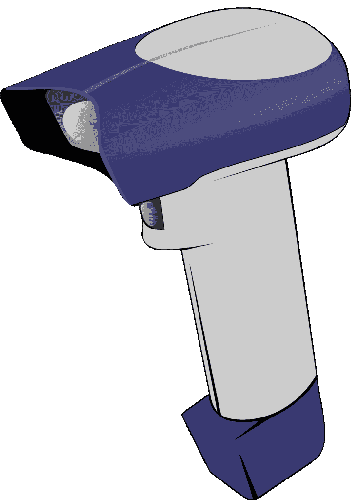
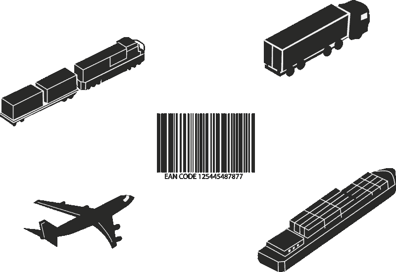
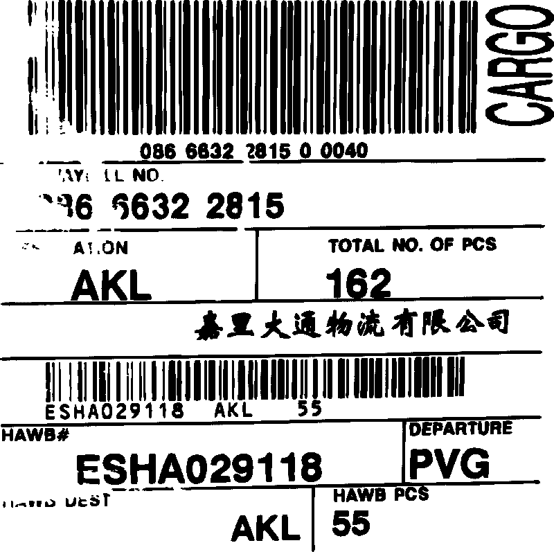
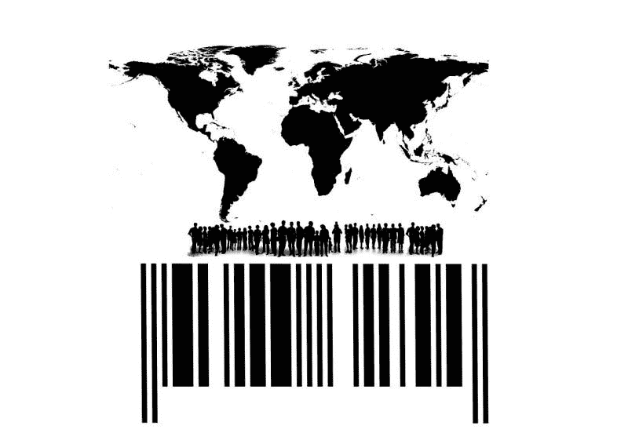
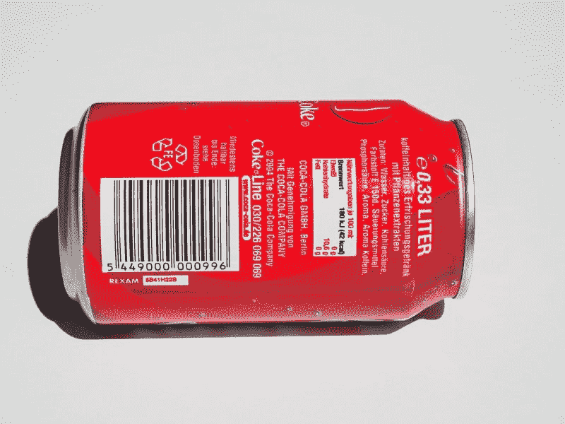
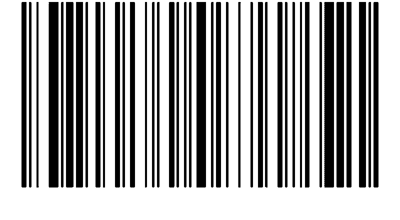

# 条码在斑马科技(纳斯达克代码:ZBRA)能赚钱吗？—市场疯人院

> 原文：<https://medium.datadriveninvestor.com/can-barcodes-make-money-at-zebra-technologies-nasdaq-zbra-market-mad-house-8de8a4c995bf?source=collection_archive---------8----------------------->

斑马技术公司(NASDAQ: ZBRA) 可能是一项价值投资，因为它提供了一项大多数人没有想到的重要技术:条形码。

解释一下，[斑马的产品](https://www.zebra.com/us/en/products.html)包括:条码扫描仪和条码打印机。此外，Zebra 还生产用于读取条形码的移动电脑和平板电脑。斑马公司的其他产品包括:射频识别(RFID)标签、定位技术、交互式信息亭以及 OEM 1D 和 2D 扫描引擎和设备。

因此，Zebra 制造了履行中心运作所需的许多设备。例如，履行中心使用 RFID 标签和条形码来跟踪包裹、产品和货物。

# 斑马科技如何与亚马逊一起成长

例如，亚马逊(NASDAQ: AMZN) 或奥卡多 **集团(LON: OCDO)** [履行中心](https://marketmadhouse.com/kroger-kr-and-ocado-plan-robotic-warehouse-in-ohio/)的[机器人](https://www.aboutamazon.com/amazon-fulfillment/our-innovation/what-robots-do-and-dont-do-at-amazon-fulfillment-centers/)可以通过读取条形码来识别他们拉的产品。此外，**沃尔玛(纽约证券交易所:WMT)** 正在测试通过读取条形码来监控库存水平的机器人。

此外，亚马逊和 **UPS(纽约证券交易所代码:UPS)** 送货人员使用条形码扫描仪来跟踪他们交付的包裹。送货是一项不断增长的业务，尤其是在亚马逊。

PYMNTS.com[声称](https://www.pymnts.com/amazon-delivery/2019/amazons-delivery-fleet-reaches-30k-cargo-vehicles/)亚马逊的送货车车队在 2019 年 12 月增长到 3 万辆。亚马逊的增长可能会帮助 Zebra，因为每一辆送货车都需要条形码扫描仪、平板电脑或移动电脑。

# 斑马科技是好股票吗？

市场先生是一头**斑马(纳斯达克代码:ZBRA)** 公牛。2020 年 6 月 8 日，他以每股 277.06 美元的价格收购了斑马公司。

自冠状病毒疫情开始以来，斑马公司的股价一直在增长。斑马公司的股票从 2020 年 1 月 2 日的 259.14 美元开始，到 2020 年 6 月 5 日和 6 月 8 日分别上涨到 277.55 美元和 277.06 美元。因此，斑马在疫情赚了更多的钱。

我认为冠状病毒对斑马有利，因为它正在增加交付和电子商务的使用。因此，新冠肺炎为斑马的产品创造了更多的需求。

# 斑马技术公司赚钱了吗？

斑马公司的收入、收入和毛利在 2020 年第一季度萎缩。例如，斑马公司的季度收入从 2019 年 12 月 31 日的 11.92 亿美元缩减至 2020 年 3 月 31 日的 10.52 亿美元。

此外，斑马公司同期的季度毛利从 5.44 亿美元降至 473 美元。此外，斑马公司的季度营业收入从 1.88 亿美元缩水至 1.51 亿美元。

值得注意的是，Stockrow 估计，在截至 2020 年 3 月 31 日的季度中，Zebra 的收入增长萎缩了 1.31%。相比之下，斑马在截至 2019 年 12 月 31 日的季度增长了 4.84%。

最后，Stockrow 的季度共同净收入从 2019 年 12 月 31 日的 1.69 亿美元下降到 2020 年 3 月 31 日的 8900 万美元。

# 斑马有多少现金？

斑马公司的季度运营现金流从 2019 年 12 月 31 日的 2.65 亿美元降至 2020 年 3 月 31 日的 1.08 亿美元。然而，斑马公司的期末现金流从 2019 年 12 月 31 日的-300 万美元上升至 2020 年 3 月 31 日的 2400 万美元。

重要的是，我认为斑马公司在 2020 年第一季度没有借钱。值得注意的是，2020 年前三个月，斑马公司的融资现金流从-2.45 亿美元上升至-9800 万美元。

不幸的是，斑马技术公司的现金更少。例如，斑马公司的现金和短期投资从 2019 年 3 月 31 日的 6100 万美元降至 2019 年 12 月 31 日的 3000 万美元，再降至 2020 年 3 月 31 日的 2400 万美元。

总体而言，截至 2020 年 3 月 31 日，斑马公司的总资产为 45.40 亿美元。相反，斑马公司的总资产价值从 2019 年 12 月 31 日的 47.11 亿美元下降。

# 对斑马产品的需求增长

因此，斑马公司的现金和价值都减少了，但其股价却大幅上涨。我的猜测是，投资者认为随着沃尔玛和亚马逊等在线零售商的扩张，Zebra 将会增长。

值得注意的是，对在线零售解决方案的需求正在急剧增长。例如，亚马逊在 2020 年 4 月将新的杂货交付客户列入等候名单，*《今日美国》*《T2》报道。此外，Kroger 正在建设三个创新的客户履行中心(CFC ),并计划再建设三个。

在 CFCs 中，Kroger 将使用 Ocado 机器人和人工智能(AI)来拉动和包装杂货订单。具体来说，克罗格计划在五大湖、西北太平洋和西部地区建立新的 CFC，*连锁店时代* [报道](https://chainstoreage.com/kroger-confirms-three-new-locations-next-gen-fulfillment-centers)。

# 斑马有增长潜力

克罗格正在佛罗里达州的格罗夫兰、俄亥俄州的门罗和马里兰州的弗雷德里克斯堡建造氯氟化碳。Kroger 计划在威斯康星州普莱森特普雷里、亚特兰大地区和达拉斯-沃斯堡地区增加 CFC。

理论上，随着电子商务产品需求的增加，对斑马产品的需求也在增加。因此，斑马公司是一家从日益增长的零售业启示中获利的公司。

如果你正在寻找一只具有增长潜力和一些价值属性的默默无闻的科技股，**斑马科技(纳斯达克股票代码:ZBRA)** 值得研究。另一方面，我认为市场先生在 2020 年 6 月 8 日将斑马的价格定在了 277.06 美元。

我相信价格使得斑马太贵，太不安全，普通投资者买不起。

*原载于 2020 年 6 月 8 日*[*【https://marketmadhouse.com】*](https://marketmadhouse.com/can-barcodes-make-money-at-zebra-technologies-nasdaq-zbra/)*。*