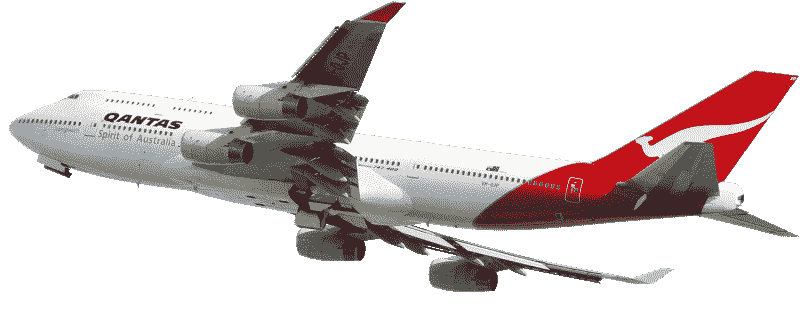
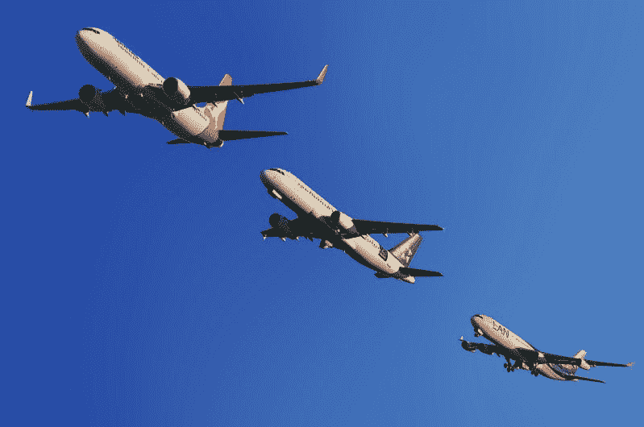
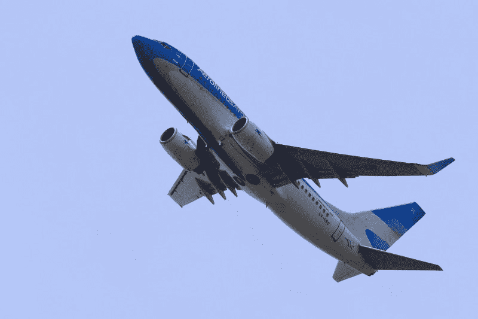
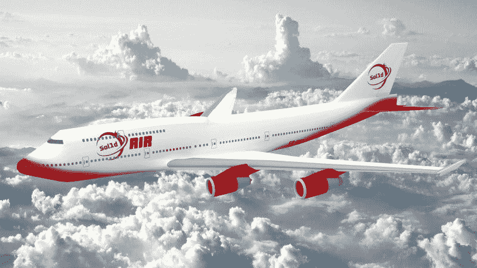
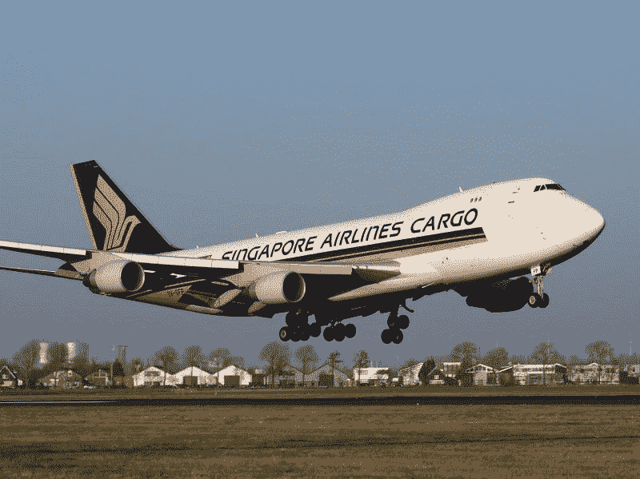
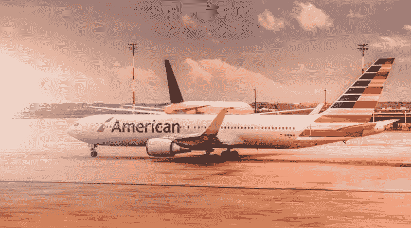
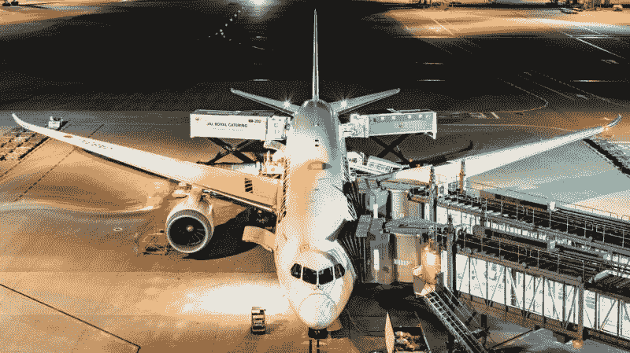

# 波音还能赚钱吗？—市场疯人院

> 原文：<https://medium.datadriveninvestor.com/can-boeing-still-make-money-market-mad-house-12e227d500fe?source=collection_archive---------22----------------------->

冠状病毒对波音公司来说可能是致命的，因为对客机的需求正在崩溃。

例如，*西雅图时报*报道，爱尔兰飞机租赁公司 Avolon 取消了 75 架 737-MAX 客机的 38 亿美元订单。*西雅图时报* [称](https://www.seattletimes.com/business/boeing-aerospace/boeing-takes-new-blow-with-avolon-scrapping-8-billion-order/) Avolon 是波音公司的 20 大客户之一。

据《西雅图时报》报道，Avolon 公司正在削减 40%的订单，并终止多达 25 架其他波音飞机的订单。因此，波音公司只有 55 架 737 MAX 飞机的订单。

# 波音无限期停产并恢复生产

波音公司(纽约证券交易所代码:BA)正在恢复一些生产，同时无限期关闭一家工厂。

因此，波音公司可能会召回 2500 名员工从事两项军事合同的工作。这些合同是美国海军的 P-8 反潜机和美国空军的 KC-46 飞行加油机。此外，一些与 737 MAX 生产相关的维护工作可能会恢复。

因此，波音公司仍然在经营并服务于它最可靠的客户:五角大楼。

# 航空旅行正在消亡吗？

波音公司可能处于危险之中，因为航空业正在崩溃。

据彭博新闻报道，美国航空旅客人数下降了 95%，不足 10 万人。具体来说，运输安全管理局(TSA)估计 2020 年 4 月 7 日有 97，130 人通过美国机场。彭博美国航空旅行正处于 20 世纪 60 年代以来的最低水平。

不可思议的是，第二天航空乘客人数下降到 94931 人，*分家伙* [估计](https://thepointsguy.com/news/when-will-we-start-traveling-again/)。相比之下，美国运输安全管理局估计，2019 年 4 月 8 日有 220 万乘客。

 [## 利用股市相关性的最佳方式|数据驱动的投资者

### 当阿尔弗雷德·温斯洛·琼斯开创了世界上第一个“对冲”基金(后来“d”被去掉了)时，他让其他投资者大吃一惊…

www.datadriveninvestor.com](https://www.datadriveninvestor.com/2020/02/02/the-best-way-to-use-stock-market-correlations/) 

# 旅游泡沫破裂，波音注定要失败吗？

因此，美国人正在学习不用飞机旅行的生活。这对波音和航空公司来说可能是致命的，因为我认为航空旅行和旅游业在新冠肺炎疫情爆发前是泡沫。

我认为托马斯·库克的崩溃表明，旅行和旅游业是在新冠肺炎之前就已经破裂的泡沫。疫情没有让旅游业泡沫破裂，而是把它吹走了。

如果旅行已经死亡，波音公司的未来就不确定了，因为该公司的标志性产品是客机。因此，对客机的需求可能会低得多。

# 波音完蛋了吗？

**波音(纽约证券交易所代码:BA)** 冠状病毒之前麻烦大了。例如，波音公司报告 2019 年 12 月 31 日的季度毛利为负-7.84 亿美元。

此外，波音公司报告 2019 年第四季度运营亏损 22.04 亿美元，共同净亏损 10.07 亿美元。此外，斯托克罗波音公司的收入增长在同一季度下降了 36.8%。

此外，波音公司报告该季度运营“现金流”为-22.2 亿美元，期末现金流为-2.78 亿美元。与此同时，波音公司报告 2020 年 12 月 31 日的融资现金流为 14.03 亿美元。因此，波音公司当季借款 14.03 亿美元。

这些数字表明，在冠状病毒之前，波音公司损失惨重。因此，我看不出没有某种形式的政府救助，波音如何生存。

# 波音有什么价值？

然而，波音仍然有很多价值。例如，波音公司在 2019 年 12 月 31 日拥有 100.3 亿美元的现金和短期投资。

令人印象深刻的是，波音公司在 2019 年 12 月 31 日的总资产为 1336.25 亿美元。不幸的是，这些资产中有许多是没有市场的客机。此外，这些资产中有许多是生产客机的工厂。

值得注意的是，**达美航空**封存了 600 架飞机，*新闻周刊*。因此，在未来十年内，客机可能不会有市场。

# 亚马逊能拯救波音免于被遗忘吗？

奇怪的是，波音(NYSE: BA) 可能会有一个不太可能的救世主，那就是**亚马逊(NASDAQ: AMZN)** 。亚马逊像野草一样成长，在航空客运崩溃的时候购买货机。

# 亚马逊可能是波音的未来

因此，在快速增长的亚马逊，波音产品的市场也在不断增长。

因此，亚马逊雇佣了 Sun Country Airlines 在 CBNC 运营 10 架改装的波音 737–800 客机。有趣的是，Sun Country 从事旅游或休闲旅游业务，但它正在向货运业务转型。因此，在新冠肺炎之前，至少有一家航空公司正在从客运向货运转型。

在这种情况下，我认为波音新的大业务将是把封存的客机转变成货运机。对这些货运公司的需求会很大，因为亚马逊正以疯狂的速度增长。

Vox Recode 称，值得注意的是，3 月份谷歌对亚马逊的搜索量接近假期水平。此外，亚马逊最大的美国竞争对手**沃尔玛(纽约证券交易所代码:WMT)** 的销售额正在飙升。

# 在线零售是波音的未来

此外，Facteus 的数据显示，2019 年 3 月至 2020 年 3 月，亚马逊的消费者支出增长了 35%。Facteus 是一家数据分析公司，声称每天调查超过 3000 万笔信用卡交易。很明显，亚马逊在 2020 年 3 月和 4 月雇佣了 80，000 名新员工来满足其履行中心的需求， *Recode* 声称。

因此，亚马逊拥有美国零售，它将需要波音公司可以提供的货机。除了亚马逊，沃尔玛等其他零售商也将发展他们的在线业务，需要更多的货机。

另一方面，我们不知道亚马逊和竞争对手将购买或使用多少架货机。值得注意的是，航空货运系统的扩展存在严重障碍。

例如，乘客航空旅行的需求限制了履行中心和货运机场的数量。然而，美国有几十个机场空着。因此，许多地方政府将试图把它们的机场转变成货运枢纽。因此，对货机的需求可能会增加。

# 波音有前途吗？

是的，波音(纽约证券交易所代码:BA) 有一个未来，但是这个未来充满了坎坷和不确定性。因此，我认为市场先生在 2020 年 4 月 15 日将波音公司的价格定在了每股 145.98 美元。

另一方面，波音公司在 2020 年 2 月 13 日支付了 2.055 美元的季度股息。因此，我认为波音仍然是一只值得投资者关注的股票。我的建议是，如果波音股价跌至 100 美元以下，就买入它。

*原载于 2020 年 4 月 15 日*[*【https://marketmadhouse.com】*](https://marketmadhouse.com/can-boeing-still-make-money/)*。*