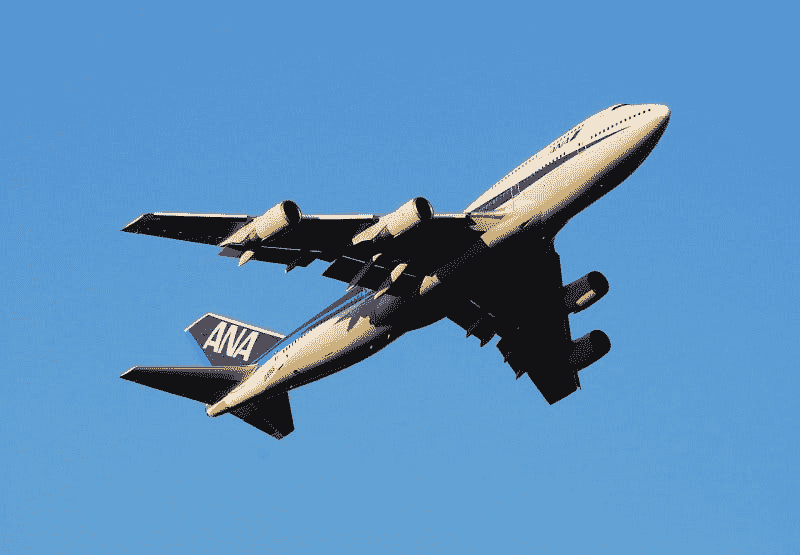
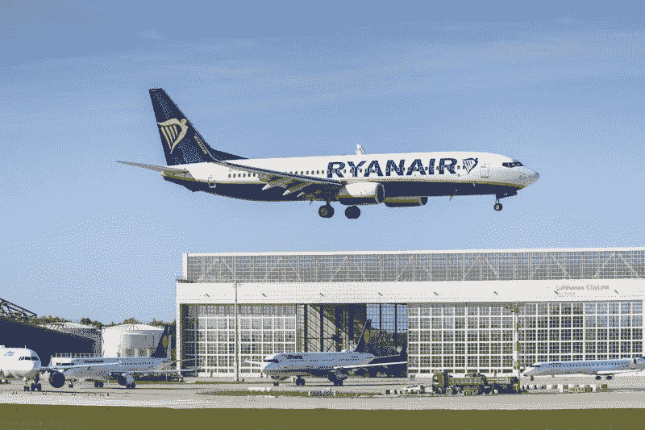
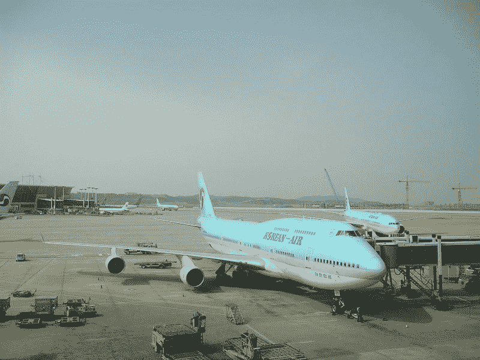
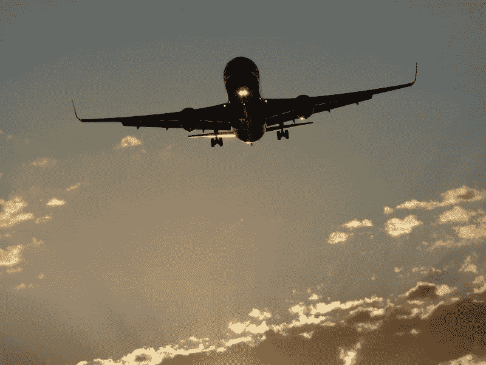
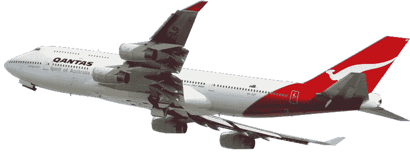
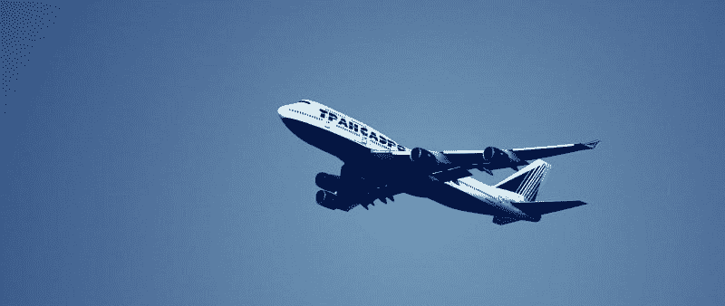
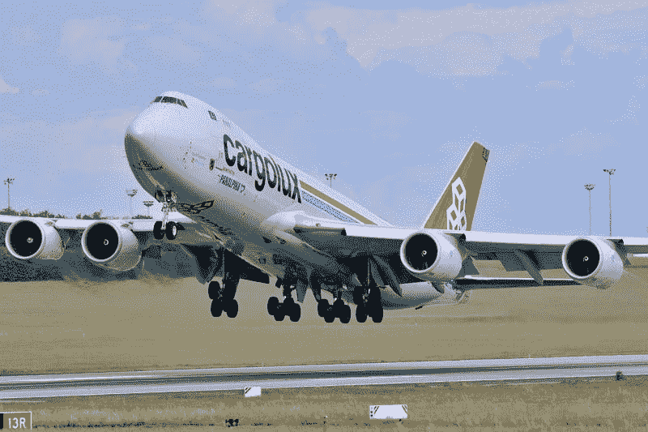

# 波音能在航空业的末日中幸存吗？—市场疯人院

> 原文：<https://medium.datadriveninvestor.com/can-boeing-survive-the-airline-apocalypse-market-mad-house-c583f9ccdaf8?source=collection_archive---------0----------------------->

新冠肺炎主导的航空业末日可能会摧毁波音公司。波音公司管理层承认他们将不得不裁员 3 万人。

此外，**波音(纽约证券交易所代码:BA)** 将停止生产其标志性产品之一；[747 客机](https://www.theguardian.com/business/2020/jul/29/boeing-to-end-production-of-its-747-airliner-in-2022)，2021 年*《卫报》报道*。相反，波音公司正集中精力让其陷入困境的 737 Max 型号重新投入使用。

在冠状病毒疫情爆发之初，波音公司在 2020 年 4 月削减了 1.6 万个工作岗位。管理层在 7 月份裁员 747 人，将裁员人数扩大到 19，000 人。据《卫报》报道，现在管理层承认将不得不削减额外的 11，000 个职位，使裁员人数达到 30，000 人。因此，波音的员工人数可能会从 16 万降至 13 万。

# 航空启示录

日益严重的航空灾难让波音的未来变得扑朔迷离。例如，由于客流量下降，欧洲 193 个商业机场面临破产。

日益严重的航空灾难让波音的未来变得扑朔迷离。例如，由于客流量下降，欧洲 193 个商业机场面临破产。

Jankovec 是欧洲国际机场理事会(ACI Europe)的总干事。《卫报》透露，ACI 欧洲是欧洲 740 个商业机场的贸易组织。在许多欧洲国家，机场是营利性企业。

ACI Europe 估计，2019 年 9 月至 2020 年 9 月，欧洲机场的客运量下降了 75%。ACI Europe 估计，欧洲机场的乘客数量比去年减少了 13 亿。

此外，ACI Europe 声称，欧洲前 20 大机场已经向€借了 160 亿欧元(188 亿美元)，以资助他们在冠状病毒疫情期间的运营。扬科维奇称，机场的债务相当于正常年份收入的 60%。

数据显示，航空公司或机场不太可能复苏。据美国有线电视新闻网商业预测，国际航空旅行量可能会从 2019 年的 45 亿人次下降到 2020 年的 23 亿人次。航空业内人士预计，在 2024 年之前，航空旅行不会恢复到 2019 年的水平。

# 冠状病毒激增航空旅行死亡

*周日电讯报*称，在英国，情况如此糟糕，以至于保守党政府威胁要将伦敦希思罗机场国有化以保留该机场。然而，英国民航局声称*星期日电讯报的*报道是假的。

我认为 ACI Europe 的数据显示，航空问题不会很快恢复。事实上，我预测，随着冠状病毒感染率上升，航空客运将再次大幅下降。

美国有线电视新闻网商业预测，可怕的是，全球航空相关的经济活动可能下降 52%。CNN Business 声称，冠状病毒将导致航空业失去 130 万个工作岗位和 1.8 万亿美元的全球国内生产总值(GDP)。

世界卫生组织(世卫组织)估计，在 10 月 12 日至 19 日这一周，欧洲冠状病毒病例数量上升了 33%。此外，《华盛顿邮报》声称，在美国 22 个州和波多黎各，冠状病毒感染率增长了 50%以上。此外，美国在 2020 年 10 月 28 日创下了 50 万例新型冠状病毒病例的记录。

航空旅行减少了，因为大多数国家对旅行者有限制。例如，据 CNN 报道，英国要求美国游客接受 14 天的隔离。与此同时，欧盟禁止美国游客入境。此外，美国人不能去日本和加拿大旅行。

# 航空启示录会杀死波音吗？

可以预见的是，**波音(NYSE: BA)** 正在为生存而挣扎。例如，波音公司在 2020 年损失了超过一半的股票价值。

具体来说，市场先生在 2020 年 1 月 2 日为波音股票支付了 333.32 美元，在 2020 年 10 月 30 日为波音支付了 144.39 美元。投资者正在抛售波音，原因显而易见。

2020 年 6 月 30 日，波音公司报告季度毛利为负 11.6 亿美元，季度运营亏损为-29.64 亿美元。此外，波音的季度收入从 2020 年 12 月 31 日的 179.11 亿美元下降到 2020 年 3 月 31 日的 169.08 亿美元，再到 2020 年 6 月 30 日的 118.07 亿美元。

此外，波音公司从 2020 年开始，截至 2019 年 12 月 31 日，季度运营亏损为-22.04 亿美元。该季度运营亏损在 2020 年 3 月 31 日降至-13.53 亿美元，在 2020 年 6 月 30 日增长至-29.64 亿美元。

# 波音在我们眼前萎缩

令人惊讶的是，Stockrow 估计，在截至 2020 年 12 月 31 日的季度中，波音公司的[收入增长萎缩了 36.8%](https://stockrow.com/BA/financials/income/quarterly) 。截至 2020 年 3 月 31 日的季度收入增长收缩 26.22%，截至 2020 年 6 月 30 日的季度收入增长收缩 25.04%。

波音的业务和现金流正在我们眼前萎缩。波音公司在 2020 年开始时，2020 年 12 月 31 日的季度现金流为负-22.2 亿美元。负季度现金流在 2020 年 3 月 31 日降至-43.02 亿美元，在 2020 年 6 月 30 日降至-52.8 亿美元。

此外，波音公司正在借入巨额资金以维持业务。**波音(BA)** 报告称，2020 年 3 月 31 日，季度融资现金流为 102.8 亿美元。该季度融资现金流在 2020 年 6 月 30 日增长至 224.62 亿美元。

我认为波音公司在 2020 年 6 月 30 日只有 49.53 亿美元的期末现金流，因为它借了所有的钱。

# 为什么波音会生存下来

波音(Boeing)将会生存下来，因为它是一家现金充裕的公司。截至 2020 年 6 月 30 日，波音公司拥有 324.3 亿美元的现金和短期投资。波音的现金和短期投资从 2020 年 3 月 31 日的 155.27 亿美元和 2019 年 12 月 31 日的 100.3 亿美元增长。

此外，波音的总资产从 2019 年 12 月 31 日的 1336.25 亿美元增长到 2020 年 3 月 31 日的 1430.75 亿美元，再到 2020 年 6 月 30 日的 1628.72 亿美元。因此，波音似乎是一项价值投资，因为它的股价在下跌，但现金和价值在上升。

然而，自 2020 年 2 月 13 日以来，波音公司一直没有支付股息，当时它每季度支付 2.055 美元。因此，波音公司是一只便宜的分红股票。

# 波音有什么未来？

我认为波音公司会有一个光明的未来，因为它的军事和航天产品。然而，其中一些产品的未来值得怀疑。

波音公司有一些令人印象深刻的项目正在进行中，如 CST-100 Starliner 太空舱。然而，他们还没有测试 Starliner，不像它的竞争对手 SpaceX Dragon。“龙”已将宇航员送往国际空间站并成功返回。

此外，宇航员克里斯托弗·弗格森[已经退出了首次载人](https://www.theverge.com/2020/10/7/21505912/boeing-astronaut-nasa-chris-ferguson-withdraws-starliner-flight) Starliner 任务。相反，三名美国宇航局宇航员将进行这次飞行， *The Verge* 报道。

# 波音可疑的未来

因此，波音公司的标志性产品之一前途未卜。弗格森的退出增加了一种可能性，即导致 737 Max 停飞的设计缺陷可能会破坏 Starliner 项目。

投资者需要考虑的一个显而易见的情况是，波音公司不再有能力完成 Starliner 和 737 Max 等技术复杂的项目。另一方面，如果波音(Boeing)能够齐心协力，我认为它可以成为一个赚钱的公司。

投资者需要避开**波音(纽约证券交易所代码:BA)** ，直到这个航空巨头能够证明它已经解决了自己的问题。如果波音公司能够从客机制造商转型到航天和国防领域

*原载于 2020 年 10 月 30 日*[*https://marketmadhouse.com*](https://marketmadhouse.com/can-boeing-survive-the-airline-apocalypse/)*。*