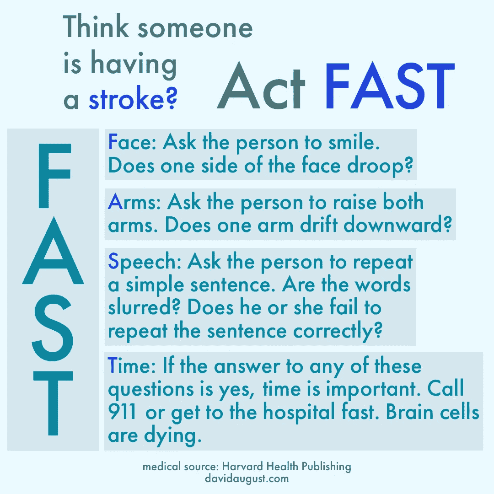

# 新冠肺炎能给年轻人中风吗

> 原文：<https://medium.datadriveninvestor.com/can-covid-19-give-young-people-strokes-1c842d055a68?source=collection_archive---------13----------------------->

## 也许是太短和不满意的答案

[Luke Jones](https://unsplash.com/photos/YmpC_Avl_7g)/Unsplash

现在让我们尽可能地弄清楚新冠肺炎和中风。几个月前，人们首次发现了引发新冠肺炎病的新型冠状病毒病毒。小说《科罗诺病毒》让我们都站在了科学的前沿，关于它对人体的影响，我们还有很多要了解的。这令人沮丧，但我们都处在不确定之中。随着时间的推移，更多的细节和共识会到来。“当大脑部分的血液供应中断或减少，阻止大脑组织获得氧气和营养时，就会发生中风。脑细胞在几分钟内开始死亡，”[梅奥诊所](https://www.mayoclinic.org/diseases-conditions/stroke/symptoms-causes/syc-20350113)说。不管是不是新型冠状病毒导致的，这对你都是有害的。

患有新冠肺炎的人通常不太容易中风。这是不寻常的，可能超过正常的 6 倍。[《新英格兰医学杂志》称，](https://www.nejm.org/doi/full/10.1056/NEJMc2009787)“五名患者(50 岁以下)新冠肺炎检测呈阳性”，并出现中风症状。在之前的同一时期，遇到了“0.73 名小于 50 岁的大血管中风患者”。

 [## 冠状病毒；惊慌失措；字里行间的 z |数据驱动的投资者

### 围绕冠状病毒的话题；更准确地说，新冠肺炎几乎占据了整个新闻预报的头条…

www.datadriveninvestor.com](https://www.datadriveninvestor.com/2020/03/23/coronavirus-a-to-panic-z-between-the-lines/) 

六倍增长不好。最近，在 T4，纽约市的家庭死亡人数达到了正常水平的 6 倍。六倍的增长。市长比尔·白思豪[对路透社](https://www.reuters.com/article/us-health-coronavirus-fdny/at-home-covid-19-deaths-may-be-significantly-undercounted-in-new-york-city-idUSKBN21P3KF)说，“假设绝大多数与冠状病毒有关是正确的。”《纽约时报》指出,“疫情的广泛影响也可能通过医疗能力的过度扩展、急救服务的延误和其他因素间接增加了死亡人数。”。有些可能是因为人们害怕去医院会感染新冠肺炎病毒，所以没有就医。如果你需要帮助，就去寻求帮助。

其他城市也出现了在家死亡人数的增加。也许永远也不会确切知道这些增加的死亡人数是否来自新冠肺炎和斯托克，因为许多人没有进行尸检。有可能这些增加中至少有一部分是由新冠肺炎病毒在没有其他症状的人群中引发的中风引起的。

这很可怕，就像这个疫情的大部分一样。

所有人都可能患中风，无论年龄、体质、风险因素或生活方式如何。这是坏消息。好消息是我们可以做一些事情来增加我们的机会。**如果你认为有人中风了，就要寻求医疗救助**；快速医疗救助可以挽救某人的生命和大脑功能。

image by author

## **压缩袜有助于预防中风吗？**

我问希拉·马丁斯，中风神经学家，巴西中风网络主席和世界中风组织副主席，他们是否可以。"使用压缩袜没有问题，但是它不能防止中风."她接着说，压缩袜有助于防止血液凝块在腿部静脉中形成，即深静脉血栓形成(DVT)。深静脉血栓可能会进入肺部并阻塞血管(肺栓塞)。这会导致低氧水平和全身损伤。

这一点现在变得更加重要，因为休斯顿德克萨斯大学健康科学中心的神经病学住院医生苏哈斯·巴杰古尔(Suhas Bajgur)指出:“隔离/封锁可能导致一种极端形式的久坐生活方式，”而减少走动与深静脉血栓形成和肺栓塞(DVT/PE)有关。疾病控制中心(CDC)同意(T7):他们也将“长时间坐着，尤其是交叉双腿”包括在深静脉血栓/肺栓塞的风险因素中。他们接着说，他们“经常被诊断不足，病情严重，但可以预防。”

Bajgur 进一步阐明，腿部凝血有时会导致中风。因此，预防深静脉血栓/肺栓塞不仅对你的血管和肺有好处，对你的大脑也有好处。因为你的大脑在很大程度上依赖于你的血管和肺，无论如何，保持它们的健康听起来是个好主意。

不幸的是，对“冠状病毒会让我中风吗”的答案“也许”并不令人欣慰，但我们每个人都可以做些事情来降低中风风险。这有助于我们保持健康，无论我们遇到什么病毒或其他东西。

image by author

## **如何降低中风和深静脉血栓/肺栓塞的风险？**

事实证明相当多。第一件事很简单:不要静止太久。

长时间坐着不健康，站起来有助于保持血液流动。更好的方法是变换位置，四处走动。这也有其他好处。

> “根据研究，打破长时间坐着来活动肌肉对我们所有人来说都是明智之举，所以试着在你的一天中建立更多的活动。设置一个计时器，提醒你经常起床走动。站着接电话。尝试为您的电脑安装一个可调节的立式办公桌。看电视时不要坐在扶手椅上，而是坐在稳定球上，这样可以让你用肌肉保持直立。”— [哈佛健康出版社](https://www.health.harvard.edu/pain/the-dangers-of-sitting)

多运动是降低中风风险的好方法。您还可以:

*   保持血压健康。如果它很高，和你的医生一起想出一个个人策略把它降到正常范围。这可能包括保持健康的体重，吃得好(少吃盐/饱和脂肪，多吃水果和蔬菜，以增加饮食中的钾)，多锻炼。
*   少抽烟或者戒掉。吸烟会升高血压，使你的血液更容易凝结，并增加向大脑供血的动脉的堵塞。你的医生可以帮你戒烟。
*   适量饮酒。大量饮酒和狂饮会导致许多不健康的后果，包括更高的中风风险。
*   少服用违禁药物。许多药物，如可卡因和甲基苯丙胺，会增加中风的风险。
*   积极运动。这一点的好处值得重复，因为这是我们现在可以控制的事情，即使在封锁期间。在你的房子周围走走，或者在与他人保持安全距离并戴上口罩的情况下，在你的社区周围走走。

为了帮助防止你腿部血栓的形成，[疾病预防控制中心建议](https://www.cdc.gov/ncbddd/dvt/facts.html):

*   每隔 2 到 3 个小时起来走走
*   坐着的时候锻炼你的腿:抬起和放下你的脚后跟，脚趾放在地板上，抬起和放下你的脚趾
*   坐着时收紧和放松腿部肌肉
*   穿宽松的衣服。

你现在越健康，你就会越健康。与你的医生一起保持你的血压、胆固醇、体重和饮食健康。要积极。也要坚持治疗你的任何疾病，如心脏病、肺病、癌症、糖尿病、炎症性肠病(克罗恩病或溃疡性结肠炎)以及其他任何疾病。

在这个疫情过去很久以后，在遥远的将来，我们仍然可以做这些事情来变好。同时，尽可能呆在家里，洗手。当你不能呆在家里时，戴上口罩，与他人保持至少 6 英尺的距离，并洗手。积极主动，身体健康。

## 关于我

大卫·奥古斯特是一位屡获殊荣的演员、作家、导演和制片人。他在电影《依赖者的一天》中扮演了一个角色，该片在影院上映后，现在已经在亚马逊 Prime 上播出。他出现在美国广播公司的吉米·基梅尔直播节目、电视节目《鬼城》和许多其他节目中。荧屏之外，他曾在广告公司、初创公司、制作公司和大型工作室工作，帮助他们讲述顾客和客户崇拜的故事。他曾在南加州大学马歇尔商学院做关于互联网的客座演讲。

[网站](http://www.davidaugust.com/)|[insta gram](https://instagram.com/davidaugust)|[YouTube](https://www.youtube.com/davidaugust)|[Twitter](https://twitter.com/DavidAugust)