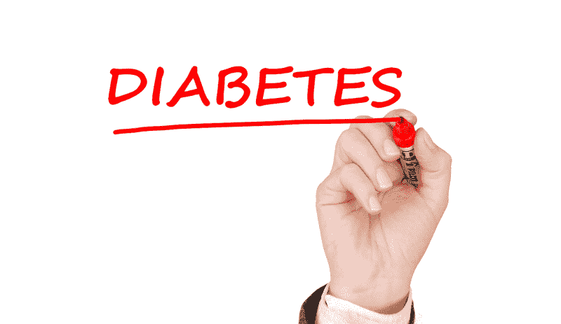
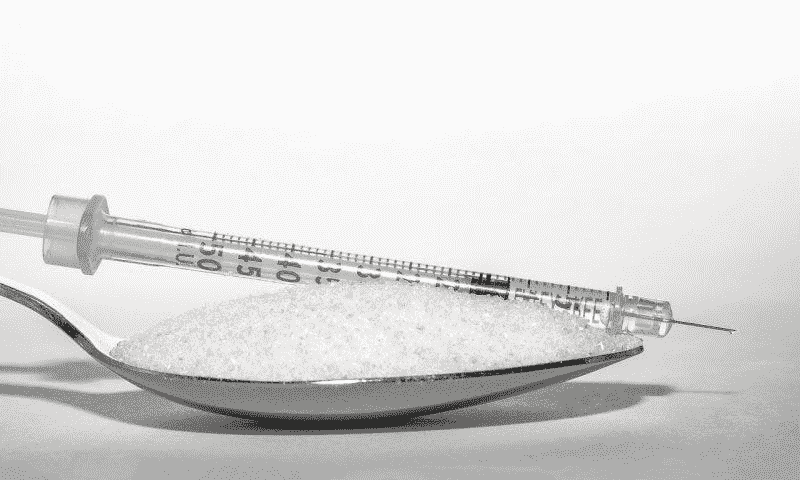
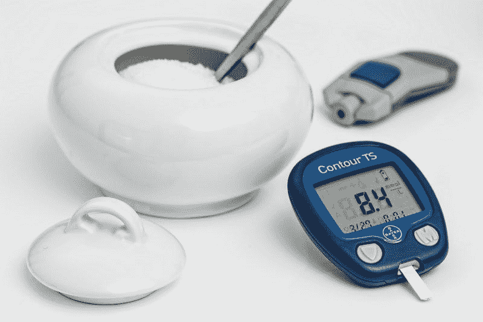
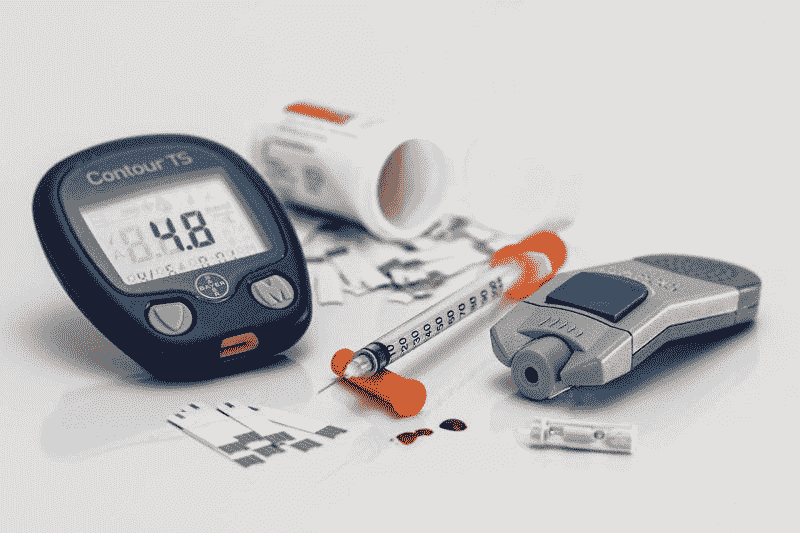
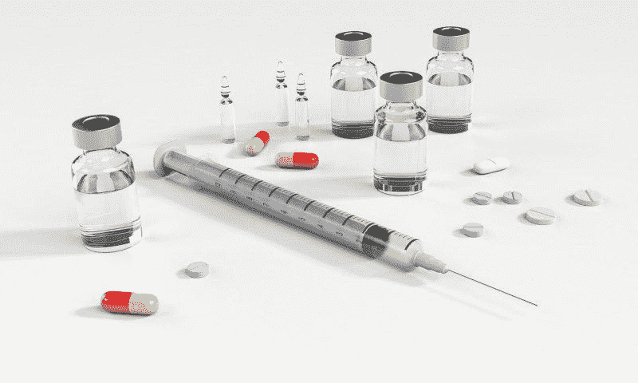
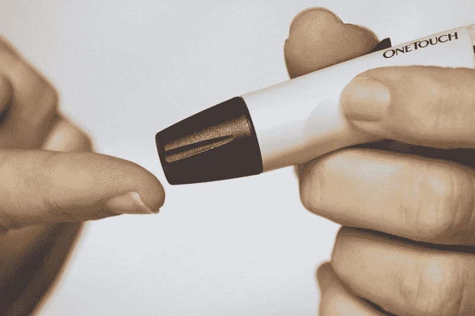
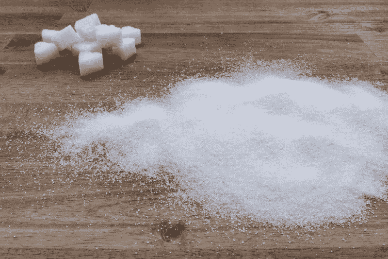
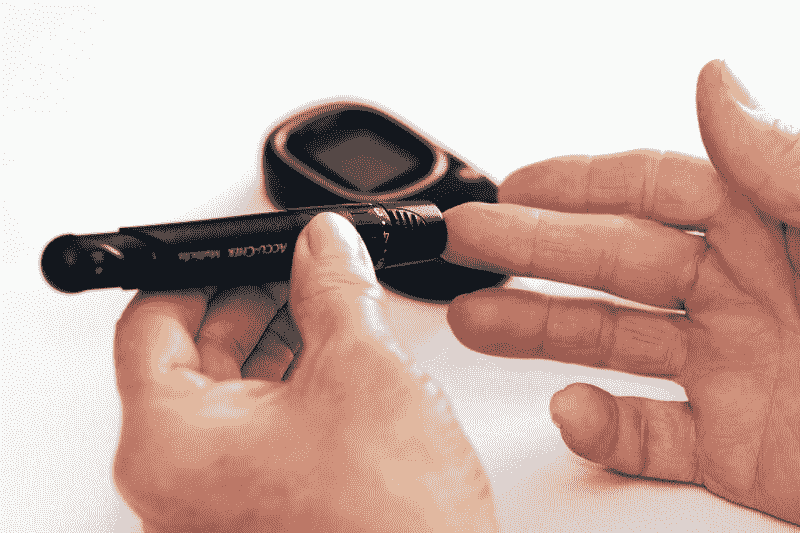

# 达维塔能从糖尿病中赚钱吗？—市场疯人院

> 原文：<https://medium.datadriveninvestor.com/can-davita-make-money-from-diabetes-market-mad-house-81bbec484455?source=collection_archive---------16----------------------->

令人不安的是，达维塔公司(纽约证券交易所代码:DVA) 可以从美国的坏习惯和糟糕的健康状况中赚钱。

解释 [DaVita](https://www.davita.com/about) 为肾脏疾病提供透析和综合护理。肾脏疾病的主要原因是糖尿病和代谢综合征。肥胖和缺乏锻炼是代谢综合症和糖尿病的主要原因。

 [## 医疗保健的未来正在被一场大型技术入侵所塑造|数据驱动型投资者

### 过去十年，全球经济的所有部门都经历了大规模的数字颠覆，而卫生部门现在…

www.datadriveninvestor.com](https://www.datadriveninvestor.com/2018/11/02/the-future-of-healthcare-is-being-shaped-by-a-big-tech-invasion/) 

关于美国健康的令人沮丧的数据让 DaVita 的未来变得光明。例如，[疾病控制和预防中心估计](https://www.diabetesresearch.org/diabetes-statistics)2015 年有 3030 万美国人或 9.4%的美国人口患有糖尿病。

# 糖尿病是达维塔的价值投资吗？

令人震惊的是，疾病预防控制中心估计有 8410 万美国人患有糖尿病前期。糖尿病前期或代谢综合征是一种可能导致二型糖尿病的疾病。疾病预防控制中心声称糖尿病前期通常会导致五年内的二型糖尿病。

因此，8410 万美国人是达维塔服务的潜在客户。此外，山姆大叔还通过医疗保险和医疗补助来支付戴维塔的许多服务费用。因此，达维塔拥有一个不断增长的市场，其产品的资金来源有保证。

因此，美国人对软饮料的喜爱和对锻炼的厌恶可能会使 DaVita 成为一项价值投资。为了解释，医生认为缺乏锻炼和不良饮食(大量糖分)会导致糖尿病前期。

疾病预防控制中心[估计](https://www.cdc.gov/nchs/fastats/obesity-overweight.htm)2015-2016 年，71.6%的美国成年人超重。此外，疾控中心声称，2015-2016 年，39.8%的美国成年人肥胖。鉴于这些数字，我认为达维塔的市场将会扩大。

# 达维塔赚钱了吗？

**达维塔(纽约证券交易所代码:DVA)** 正在从其业务中赚钱。例如，DaVita 报告截至 2019 年 9 月 30 日的季度毛利为 9.1291 亿美元，收入为 29.05 亿美元。

此外，DaVita 报告同一季度的营业收入为 3.7834 亿美元，税后收入为 2.0853 亿美元。然而，DaVita 报告该季度净收入为 2.0169 亿美元。

令人印象深刻的是，DaVita 在 2019 年 9 月 30 日报告了 6.4071 亿美元的季度运营现金流。然而，DaVita 在同一天报告了一个季度的期末现金流——23.26 亿美元。

# 达维塔在赔钱吗？

因此，达维塔的运营消耗了大量现金。然而，DaVita 在 2019 年 6 月 30 日报告了 31.21 亿美元的期末现金流。

我认为达维塔的现金流会波动，因为它依赖于保险、医疗保险和医疗补助支付。因此，戴维塔在一年的不同时间收到不同数量的钱。

解释一下，在美国，保险公司、医疗保险和医疗补助为戴维塔的服务付费。澄清一下，医疗保险是美国为老年人提供的单一支付者健康保险计划。与此同时，医疗补助是一项由州政府管理的针对穷人的健康保险计划。

依靠这样的来源:以及其他国家的类似项目，可能会使戴维塔的收入不稳定。Stockrow 估计，在截至 2019 年 9 月 30 日的季度中，DaVita 的收入增长率为 1.99%。然而，上一季度 DaVita 的收入以-1.53%的速度萎缩。

# 达维塔是价值投资吗？

尽管如此，达维塔的生意可以产生大量现金。特别是，DaVita 在 2019 年 9 月 30 日拥有 14.58 亿美元的现金和短期投资。

这个数字可能会波动，因为 DaVita 在 2019 年 6 月 30 日有 36.88 亿美元的现金和短期投资。因此，我认为达维塔不是一个价值投资，因为它的现金是波动的。

波动的现金给达维塔的安全边际太低了，让我很不舒服。特别是，我认为市场先生在 2020 年 1 月 24 日将达维塔定价过高，为 82.03 美元。然而，一些投资者可能会欣赏达维塔。

# 达维塔是好的分红股票吗？

我认为达维塔的股票很糟糕，定价过高，因为它不支付股息。此外，我认为达维塔是一只道德上有问题的股票。

达维塔在道德上是有问题的，因为它得益于糟糕的健康状况。许多，也许是大多数，DaVita 的“顾客”需要它的产品，因为他们过度消费并拒绝锻炼。

我认为从这种习惯中获利并抬高医疗费用是错误的。达维塔甚至更有问题，因为纳税人为其运营提供资金。

# 美国医疗保健可持续吗？

避开达维塔的另一个原因是，人们普遍认为美国的医疗体系在财务上是不可持续的。

许多观察者；包括沃伦·巴菲特在内的许多人认为，医疗费用增长过快，难以为继。“医疗保健费用的膨胀就像美国经济中饥饿的绦虫，”巴菲特告诉 CNN 财经频道。

美国有线电视新闻网商业[估计](https://money.cnn.com/2018/01/30/news/economy/health-care-costs-eating-the-economy/index.html)，美国医疗支出从 1960 年占美国经济的 5%增长到 2016 年的 17.9%。此外，医疗保险和医疗补助服务项目医疗保健中心将在 2025 年占美国国内生产总值(GDP)的 19.9%。

我认为这样上涨的成本会引起强烈反对。我认为许多保险公司和雇主会因为费用问题而停止提供健康保险。

# 是的，全民医保即将到来

这将增加对单一支付者健康保险的鼓动；美国全民医疗保险。在单一付款人制度下，政府充当了大多数公民的保险公司。这给了政府压低价格的购买力。

重要的是，民主党总统初选中的所有候选人都声称想要一个单一支付体系。比如，美国参议员[伯尼·桑德斯](https://www.politico.com/news/2020/01/27/democrats-bernie-sanders-rise-105825)(I-佛蒙特州)；最受欢迎的竞争者，想要一个完整的政府健康保险系统。

与此同时，前副总统乔·拜登(D-Delaware)；所谓的领先者，想要一个“公共选择”根据公共选择，所有公民都有机会参加医疗保险或医疗补助。我认为公共选择单支付者，因为我认为大多数人会选择更便宜的政府保险。

# 达维塔能从单一支付者身上赚钱吗？

因此，我认为单一付款人健康保险几乎在美国出现了。我认为单一支付者将彻底颠覆美国的医疗保健。DaVita 将很难从这种破坏中赚钱。

我认为，从长远来看，单一支付者可以帮助达维塔，因为全民医保可以帮助更多的人负担得起达维塔的服务。另一方面，单一付款人保险可能会通过限制价格来降低 DaVita 的利润。

归根结底，我认为投资者需要避开达维塔，因为医疗保健太不稳定，不是价值投资。

*原载于 2020 年 1 月 27 日*[*【https://marketmadhouse.com】*](https://marketmadhouse.com/can-davita-make-money-from-diabetes/)*。*