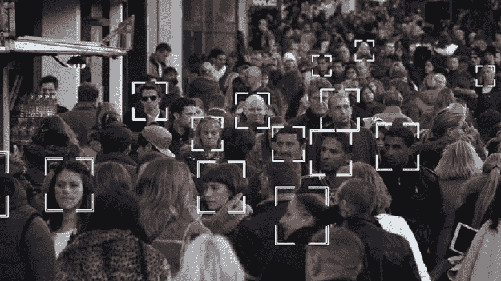
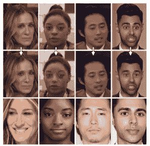

# 去身份化能保护你的网络隐私吗？

> 原文：<https://medium.datadriveninvestor.com/can-de-identification-protect-your-online-privacy-77eba5504679?source=collection_archive---------13----------------------->

## 去识别:反监视技术

Image from [ProlificLondon](https://www.prolificlondon.co.uk/news/tech/2019/01/met-police-spent-%C2%A3200k-controversial-facial-recognition-tech)

在过去的几年中，全球人口对隐私的关注有所增加。在 2016 年美国大选的脸书丑闻之后，人们开始意识到他们的数据有多么宝贵。但是实现的太少是不是太晚了？

大多数人已经有了脸书、推特或 Instagram 账户。那么你的隐私已经被侵犯了吗？

答案是，*大概*不会。拥有社交媒体账户并不**自动**意味着你的隐私被侵犯。

根据定义，隐私意味着个人隐藏自己信息的能力。从而允许所述个体选择性地表达自己。所以，这取决于**你在网上分享什么**。

在 Instagram 上分享照片，除了给这些大型科技公司提供数据之外，不会给你带来太大的风险。因为当服务免费时**你就是产品**。但是我如何防止我的数据被用来对付我呢？我如何对抗大型科技霸主？

嗯，一个答案是考虑使用去认同。如果你担心你的照片/视频会被用来对付你。也许去除照片的身份是一个解决办法。

# 什么是去身份化

去识别或 D-ID 是一种模糊数据的技术，使其不能用于个人身份的识别。可以被去识别的数据通常是生物统计数据，例如面部和声音数据。D-ID 是在现代[人工智能](https://www.datadriveninvestor.com/glossary/artificial-intelligence/)的兴起中日益发展起来的。因为人们认为 D-ID 是保护他们隐私的一种方法。

我在写关于我们如何使用 D-ID 来保持我们的身份匿名。我之所以选择写 D-ID 在我们脸上的使用，是因为基于我们在互联网上分享的内容，大规模监控的潜力越来越大。

Example of De-Identification, Image retrieved from [Facebook Research](https://research.fb.com/wp-content/uploads/2019/10/Live-Face-De-Identification-in-Video.pdf)

在上图中，您可以看到去标识的实现。面部去识别集中于从对象中去除面部特征。如您所见，一些结果可能比其他结果更微妙。在很多情况下，我们可以使用 D-ID 技术使数据匿名。

# 去识别的用例

2014 年，美国政府发布了一份关于大数据和隐私的新闻报道。该报告称，收集和分析数据的技术效率的提高超出了人们的预期。看起来，即使像 D-ID 这样的技术可以用作保护隐私的方法，但这可能还不够，需要制定隐私政策来做技术上不可行的事情。

## 保护敏感的公司数据

在介绍中，我提到了一些社交媒体巨头，如脸书、Instagram 和抖音。我提到它们是因为使用这些平台会有危险的隐私风险。尤其是你的面部生物特征数据。

一些存储我们的生物特征数据的公司有相当大的泄露风险。这并不意味着我们不应该在需要时提供我们的数据，这只是意味着公司需要在存储员工数据的内容和方式方面采取更多的预防措施。

## 公共数据集中的隐私

我想到的最后一个用例是保护公共数据集。 [AI](https://www.datadriveninvestor.com/glossary/artificial-intelligence/) 研究人员需要大量的数据。最好的数据集是从野外获取的。一个自动识别人脸的程序可以帮助他们匿名。任何人都可以检索公共数据集，因此为了保护主体隐私，需要在发布数据集之前实施去身份验证。

# 现代 D-ID 解决方案

提供这些解决方案的初创公司最近取得了很大进展。2020 年 5 月 26 日，一家来自特拉维夫的 D-ID 初创公司获得了[超过 1350 万美元的资金](https://www.deidentification.co/news/d-id-secures-over-13-5-million-to-protect-against-mass-surveillance/)。

在报告中，投资者认为面部识别的性能越来越好令人担忧。它强调了隐私保护在 21 世纪的重要性。D-ID 在这个行业的目标是从一个人的脸上去除关键特征，只保留他们的性别、年龄和情感。这项新技术将帮助企业实施保护用户数据的程序，这与全球新的隐私法相一致。

# 结论

我写这篇文章的原因是为了让人们更多地了解这些技术。因为现代科技让我们既能做伟大的事情，也能做可怕的事情。大规模监控的风险是真实的，人们应该更加意识到这一点。D-ID 是我们在网上保持匿名的一个机会。保护我们的隐私。

到我写这篇文章的时候，据我所知还没有任何免费或开源的解决方案。所以，唯一能让你脱颖而出的方法就是通过阅读研究论文来实施这项技术。

*原载于 2021 年 1 月 28 日*[*【https://www.datadriveninvestor.com】*](https://www.datadriveninvestor.com/2021/01/28/can-de-identification-protect-your-online-privacy/)*。*