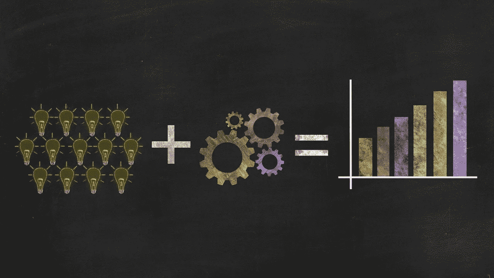

# 分散金融(DeFi)能拯救 Crypto 吗？

> 原文：<https://medium.datadriveninvestor.com/can-decentralized-finance-defi-save-crypto-80eba192766d?source=collection_archive---------11----------------------->

*为什么分散融资可能(或不可能)使加密相关*

Taken from [pixabay](https://pixabay.com/illustrations/success-strategy-business-solution-2081168/)

抵制审查。把货币自由还给人民。这些是区块链和加密死硬派在讨论这一新生资产类别时通常宣扬的一些承诺。

不幸的是，加密货币充其量被视为一种投机资产类别，最糟糕的是一种缺乏合法性的骗局。

比特币的价格远未稳定，没有一个区块链项目在不牺牲去中心化的情况下实现了商业水平的可扩展性，而且你在这里经常遭遇多次盗窃和黑客攻击。

这些和更多的因素导致许多人质疑区块链和加密货币是否是一个“失败的实验”，永远不会兑现其将去中心化带给大众的承诺。

进入**分权财务** (DeFi)。

不要误会，DeFi 绝不是加密货币和区块链行业的救世主。它离成品还很远，包含着固有的风险，其中一些风险威胁着它的生存能力。

 [## 害怕，非常害怕...为什么菲亚特害怕数字货币是正确的|数据驱动的投资者

### 本文的目的是为我们最近(以及即将到来的)欧盟 H2020 拨款中的一个部分提供额外的视角…

www.datadriveninvestor.com](https://www.datadriveninvestor.com/2019/03/04/be-afraid-be-very-afraid-why-fiat-is-right-to-fear-digital-currency/) 

今天，我想说明为什么 DeFi 在发展似乎停滞不前、潜在突破仍在酝酿之中的时候，给该行业带来了新的希望。

继续读下去，让我知道你的想法！

# 新旧结合

自从人类开始相互进行交易以来，金融的概念一直是一个不断发展的概念。从进行易货贸易到交易衍生品，说到金融这个话题，变化是唯一不变的。

分散金融不会重新发明金融概念的轮子。在大多数情况下，它只是增加了一个技术层面，去掉了中间环节。

我是不是把事情过于简单化了？在某种程度上，我可能让 DeFi 听起来比实际更简单。

From fiat to crypto

然而，在宏观层面上，我们必须记住，对等借贷、预测市场和筹资等概念并不是新引入市场的概念。

这可以从 DeFi 是迄今为止最广泛采用的区块链应用中看出来，就在今年，近[7 亿美元的 ETH 被 DeFi](https://coincodex.com/article/6540/all-ethereum-held-in-decentralized-finance-surges-to-3-million-eth/) 持有。

盈利是市场新进入者了解 DeFi 并实现飞跃的巨大动力。比权力下放的承诺和抵制审查的钱要多得多。此外，DeFi 不仅限于散户投资者。