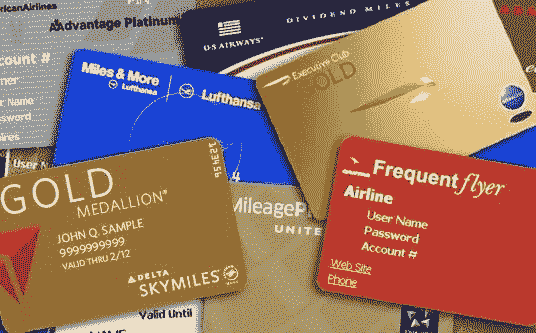

# 常旅客里程能拯救航空公司吗？

> 原文：<https://medium.datadriveninvestor.com/can-frequent-flyer-miles-save-the-airlines-acade3b0c250?source=collection_archive---------17----------------------->

安东尼·布隆伯格

由于疫情和旅行限制，如果长期不考虑飞行，你可能会担心你的常旅客里程会过期。但如果说航空公司会努力保护他们的商业惯例的一部分，那就是他们的里程计划。

*下面是为什么*。

虽然这些计划被宣传为客户忠诚度计划，但它们是航空公司的主要摇钱树，航空公司将这些计划出售给为您的常旅客里程支付高额费用的银行。航空公司通常每英里赚 1.25 到 1.5 美分。零钱？远非如此。

**2018 年上半年，常旅客里程计划为美国七大航空公司带来了近 40 亿美元的收入。**

这是根据投资银行公司 Stifel 的航空业分析师 Joseph DeNardi 的研究。正是这些数字让专家们认为，一些航空公司 50%以上的收入来自你口袋里的品牌信用卡。换句话说，忠诚计划比实际运送人们从一个地方到另一个地方更能让航空公司赚钱。这些项目代表了航空业利润的很大一部分。

根据国际航空运输协会(International Air Transport Association)的数据，在航空业预计 2020 年亏损超过 3000 亿美元的时候，由于空中的人很少，这些项目对航空公司来说更加重要。这是因为航空公司可以回到银行，预售数十亿英里的里程，以获得现金来维持运营。从这个意义上来说，在财政上，这些项目很可能在他们的生存中扮演一个非常重要和有意义的角色。它们是生命线。由于这些将是直接交易，它们也不会附带航空公司不得不接受的联邦政府 250 亿美元行业救助的许多条件。救助的一部分将作为贷款，财政部将获得购买航空公司股票的认股权证。

毫无疑问，鉴于航空公司在谈判中的不利地位，它们将不得不以很高的折扣向银行出售积分。但这并非没有先例。2004 年，达美航空从美国运通获得了 6 亿美元的里程预付款，而联合航空从大通银行获得了类似的 6 亿美元现金积分。银行很有可能通过提升过去的关系来帮助航空公司。

 [## 2020 年最佳短期投资选择精选资源|数据驱动型投资者

### 投资是增加你净财富的一个好方法。如果你通过遵循一个严格的…

www.datadriveninvestor.com](https://www.datadriveninvestor.com/2020/03/28/handpicked-resources-for-the-best-short-term-investment-options-of-2020/) 

有一个巨大的卫星产业围绕着推广这些航空公司附属信用卡——网站从每次注册中赚取佣金——来自像 Points Guy 这样的中型公司，根据 3 月份的 Business Insider 简介，去年获得了令人瞠目结舌的 5000 万美元的利润。然而，这些公司中的许多也已经停飞，因为银行暂停了他们的附属奖金计划。

这次银行的考量有所不同，因为它们也在遭受损失……这可能会让它们不愿预付现金，尤其是在不确定哪些航空公司将在大规模失业、衰退性股价下跌和严格的旅行限制的灾难性交汇中幸存下来的情况下。毕竟，如果一家蓝筹股航空公司突然倒闭，他们可以买下里程数，却只能眼睁睁地看着它们变得一文不值。

几乎每家航空公司都削减了忠诚度计划的费用，或者延长了合格日期，并降低了成为精英会员的要求。尽管如此，这不会改变乘客的好消息——航空公司将竭尽全力向银行展示他们的常旅客计划仍然强劲。几乎每家航空公司都削减了忠诚度计划的费用，或延长了资格日期，并降低了达到精英会员资格的要求，承认他们的大多数高级乘客都因全球关闭而停飞。西南航空公司已经为一些客户将其广受欢迎的同伴通票计划延长了几个月，而其他公司，如达美航空公司和联合航空公司，正以大幅折扣的价格直接向消费者出售里程。业内专家写道，即使在打折时，用现金兑换积分也几乎不是什么好的金融交易。

随着消费者信心的动摇，第一批重返天空的乘客很可能是那些最积极的顾客……因此航空公司的短期成功几乎肯定取决于他们如何保持忠诚度。此外，在大流行后更加不确定的世界里，专家预测，购票人会对不可退票的机票三思而行，因为他们已经看到他们的计划很容易被他们无法控制的力量打乱。

因为大多数忠诚度计划已经提供了比普通机票更大的灵活性，它们可能会成为整个行业整合灵活性的典范——这就是为什么专家们认为奖励计划能够帮助航空公司走出目前的低谷。

更多财经和行业新闻，请关注我，查看我的独家网站:[https://www.anthonyblumberg.com/](https://www.anthonyblumberg.com/)