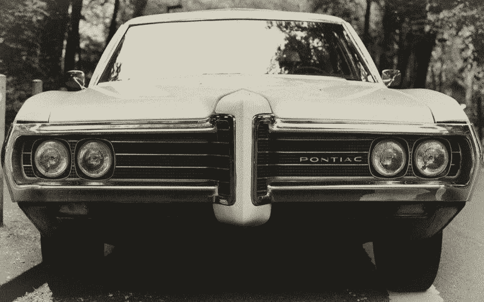
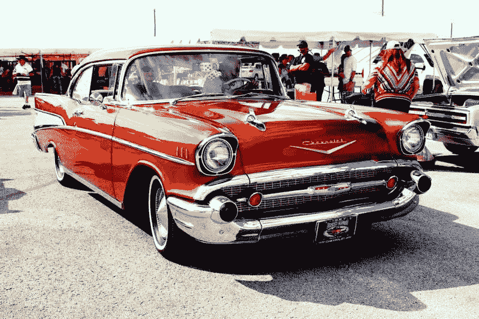
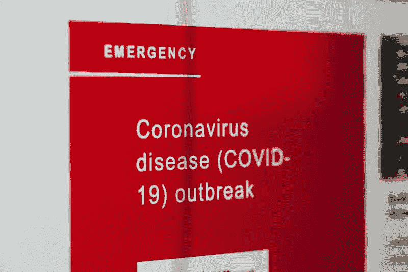

# 通用汽车能挺过冠状病毒吗？—市场疯人院

> 原文：<https://medium.datadriveninvestor.com/can-general-motors-survive-coronavirus-market-mad-house-8ed21bfddd71?source=collection_archive---------20----------------------->

早在冠状病毒到来之前，通用汽车(纽约证券交易所代码:GM) 就陷入了大麻烦。现在，通用汽车可能在不到 15 年的时间里第二次面临灾难。

值得注意的是，通用汽车报告了截至 2019 年 12 月 31 日的季度 5.54 亿澳元的运营亏损和 2.7 亿澳元的净亏损。此外，通用汽车在同一季度的收入增长下降了-19.72%。

此外，通用汽车首席执行官玛丽·巴拉和她的团队仍在清理过去通用汽车领导层留下的烂摊子。例如，通用汽车将支付 1.2 亿美元来解决更多关于点火开关故障导致事故、*汽车和司机*的索赔。

# 通用汽车仍在为点火开关丑闻买单

从积极的一面来看，*汽车和司机*声称 1.2 亿美元只是原告律师哈根斯·伯曼要求的 120 亿美元的 1%。

不利的一面是，通用汽车在 2014 年预留了 6.25 亿美元来解决 124 起死亡和 275 起受伤索赔。这些索赔也是由点火开关故障引起的。

 [## 投资区块链前要问的三个简单问题(也是一个困难的问题)|数据…

### 现在是了解区块链的最佳时机。不同货币之间的增长率，比如…

www.datadriveninvestor.com](https://www.datadriveninvestor.com/2020/03/12/three-simple-questions-and-one-difficult-one-to-ask-before-investing-in-a-blockchain/) 

此外，还有另外 2.75 亿美元的支出与相同的点火系统有关。因此，我估计仅点火开关诉讼一项，通用汽车就可能支付 10.2 亿美元。

通用汽车正在支付诉讼费用，因为点火故障导致一些汽车突然熄火和加速。当车辆停止或失控时，就会造成事故。

# 通用汽车与特朗普的争斗

现在，**通用汽车(NYSE: GM)** 与唐纳德·j·特朗普总统(R-Florida)发生巨大冲突。

川普批评了通用汽车公司和文泰克生命系统公司为医院制造呼吸机的努力，以及彭博的努力。医疗机构可能需要呼吸机来治疗冠状病毒患者。通用声称它和 Ventec 可以在科科莫工厂每月生产 10，000 台通风机。

通用汽车和 Ventec 计划在印第安纳州科科莫的一家零件厂制造这种通风机。然而，特朗普希望通用汽车重新开放俄亥俄州洛兹敦的一家关闭的汽车工厂，以生产这些机器。

像我这样的愤世嫉俗者会认为特朗普在努力拉选票；他需要赢得这个州来实现 11 月的连任，而不是制造呼吸机。值得注意的是，印第安纳州是特朗普可能在 11 月赢得的忠诚的共和党或红色州。相反，俄亥俄州有很深的政治分歧。

因此，特朗普正在与通风机玩政治，并在此过程中攻击通用汽车及其工人。民主党人将指控特朗普冒着生命危险购买选票。

积极的一面是，通用汽车公司声称，它可以在两周内每天生产 50，000 个外科口罩，最终每天生产 100，000 个口罩。因此，通用汽车可以利用其制造能力在冠状病毒上获利。然而，政治可能会破坏这些努力。

# 通用汽车赚钱了吗？

财务数据显示**通用汽车公司**能够赚钱。

例如，通用汽车公司报告 2019 年 12 月 31 日的季度利润为 17.28 亿美元。此外，通用汽车报告称，截至 2019 年 12 月 31 日，季度运营现金流为 34.73 亿美元，期末现金流为 4400 万美元。

令人印象深刻的是，通用汽车在 2019 年 12 月 31 日拥有 232.43 亿美元的现金和短期投资。尽管问题重重，通用汽车还是积累了大量现金。因此，通用汽车仍然是一家现金充裕的公司，在 2019 年底拥有 1530.45 亿美元的资产。

因此，我认为通用汽车有生存的资源。然而，生存将是艰难的。

# 通用汽车有什么未来？

值得称赞的是，巴拉和她的团队正在做出艰难的决定，以确保通用汽车的生存。

特别是，通用汽车在 2017 年出售了境况不佳的欧洲业务。通用汽车的欧洲子公司沃克斯豪尔和欧宝在 2001 年至 2017 年间损失了 180 亿美元， *The Verge* 。此外，通用汽车公司已经取消了销售不佳的车型，并关闭了工厂。

重要的是，通用汽车正在对自动驾驶汽车进行巨额投资。事实上， *The Verge* 通用汽车的巡航自动驾驶汽车项目在 2019 年 5 月价值 190 亿美元。

令人印象深刻的是，通用汽车在 2019 年春季为 Cruise 获得了 11.5 亿美元的投资， *The Verge* 报道。通用汽车对 Cruise 的目标是开发一款完全自动驾驶的汽车。Cruise 的主要投资者包括**软银(OTC: SFTBY)** 。据 The Verge 报道，软银在 2018 年向 Cruise 投资了 22.5 亿美元。

# 通用汽车是价值投资吗？

我认为市场先生在 2020 年 4 月 2 日低估了通用汽车(纽约证券交易所代码:GM)19.02 美元的价值。

详细来说，我认为通用汽车是一家现金充裕的公司，有很大的增长潜力。然而，我相信通用汽车需要承受很多痛苦和损失，因为它恢复了。

有趣的是，通用汽车公司在 2020 年 3 月 5 日支付了 38₵股息。我认为通用汽车有很高的安全边际，因为有股息。总体而言，2020 年 4 月 2 日，每股通用汽车股票的股息收益率为 7.89%，年化股息为 1.52 美元，股息支付率为 39.66%。

如果你正在寻找一只冠状病毒时代的廉价股票，通用汽车公司值得研究。就我个人而言，我不喜欢通用汽车，但这个汽车巨头有很高的安全边际和良好的赚钱潜力。

*原载于 2020 年 4 月 2 日*[*【https://marketmadhouse.com】*](https://marketmadhouse.com/can-general-motors-survive-coronavirus/)*。*