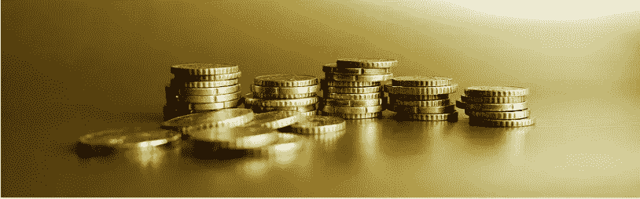
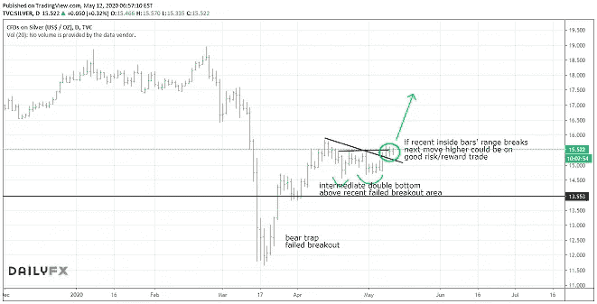
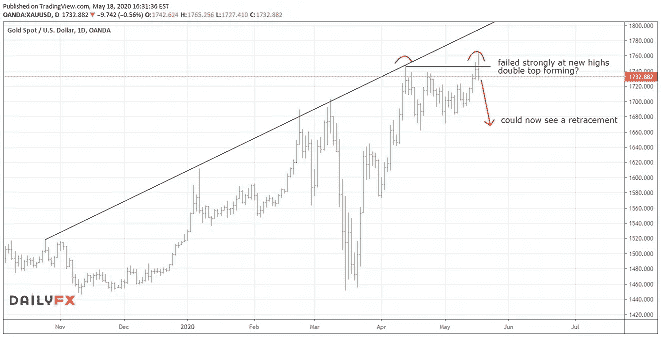

# 黄金能创出历史新高吗？还是我们会看到一个惊喜…？

> 原文：<https://medium.datadriveninvestor.com/can-gold-make-all-time-highs-or-are-we-going-to-see-a-surprise-e6326d79edd1?source=collection_archive---------17----------------------->

黄金最近一直在上涨，是迄今为止 2020 年表现最好的资产。一段时间以来，我一直普遍看好黄金和贵金属。

最近，我写了一篇关于白银新兴机会的文章。在我谈论贵金属接下来可能会发生什么之前，我想让你注意这个例子，因为有一些有趣的地方需要注意。

白银图表在视觉上被巨大的双顶所主导，仅在几周前，该双顶将价格推低了很多。这些图表模式，尤其是当它们如此清晰的时候，对未来的价格走势有很大的影响。

然而，事情没那么简单。

仅仅因为我们看到一个大的双顶，并不意味着价格会下跌。这是许多专业人士和散户都会犯的错误。

**我们必须转而关注价格对这些模式的反应。**

价格最初脱离了双顶，但这个例子中的关键部分是白银未能守住最近创下的多年新低。在突破该关键价格区域后，它迅速反弹，然后收盘回到 14 美元上方。这告诉我们一些非常重要的事情，我在最近的文章中强调了这一点。

*它在告诉我们，要准备好迎接另一个方向的冲击。*

这正是我几周前预测的。我甚至和一位基金经理通了电话，他坚持认为双顶太强大了，不允许这样的变动。

经过小幅盘整后，白银价格周五上涨 5%，周一盘中又上涨 5%，当天收盘上涨 2%。虽然我和我的许多学生都很享受从最近的举动中获益，但我现在看到了一些别的东西…

长期而言，我仍然非常看好白银和黄金，但本周，我看到了一个从另一个方向获利的短期机会……特别是在黄金方面。

最近黄金的波动性大幅增加，这通常发生在方向改变之前。最近，我们一直在近期高点盘整。周一，我们打破了新高，但无法坚持，卖方最终战胜了买方，将价格推低，收于当天的低点，在这个关键的价格区域。

黄金也没能到达图表上显示的上升阻力线。

虽然趋势仍然强劲走高，但我认为，如果周一的低点被打破，我们很有可能会快速逆势走低。

你想得到培训和指导，让交易对你有利可图吗？

现在，我们提供*整整一个月的 100%免费培训和指导服务。这是我们在这个世界面临挑战的时刻向你们提供支持的方式。*

在你一个月的免费训练结束后，没有条件也没有义务继续。

点击[此处](http://go.mangrovetrading.com/corona)了解更多信息，如有任何问题，请联系我们。

祝大家一周快乐健康。

*又及:你愿意一个月 100%免费参加我们的自由交易培训和指导计划吗？点击* [***此处***](http://go.mangrovetrading.com/corona)**了解更多，立即开始。**

*-*

***请注意，一如既往，这不是投资建议，您应该在做出任何投资决定之前咨询您的财务顾问。我不是财务顾问，提供这些信息只是为了提供信息和教育目的。***