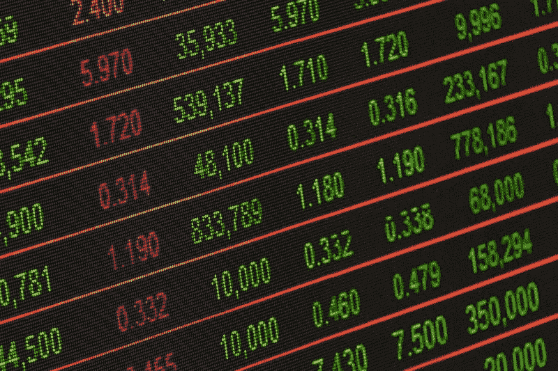
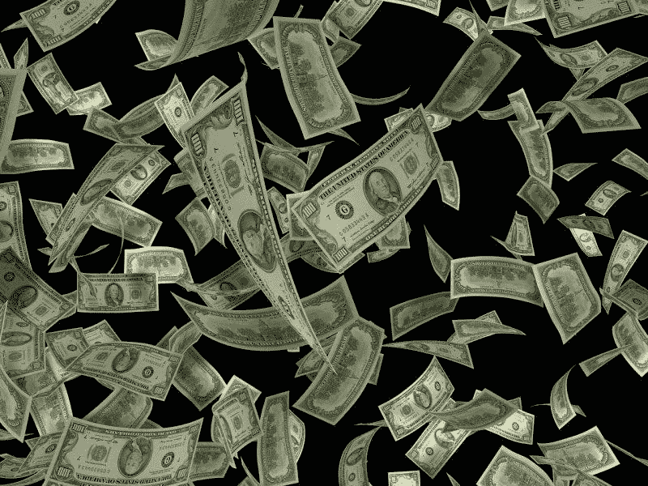
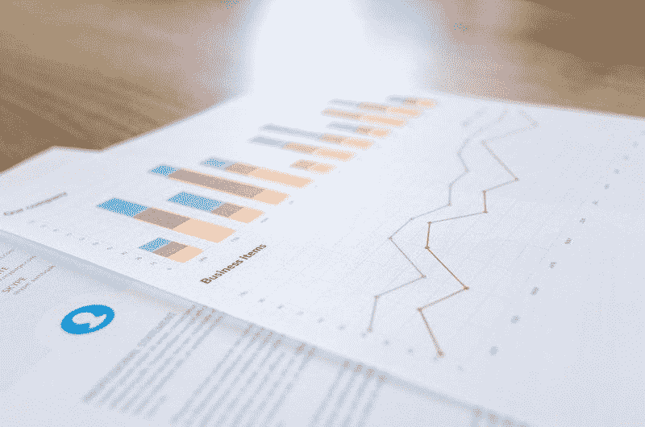
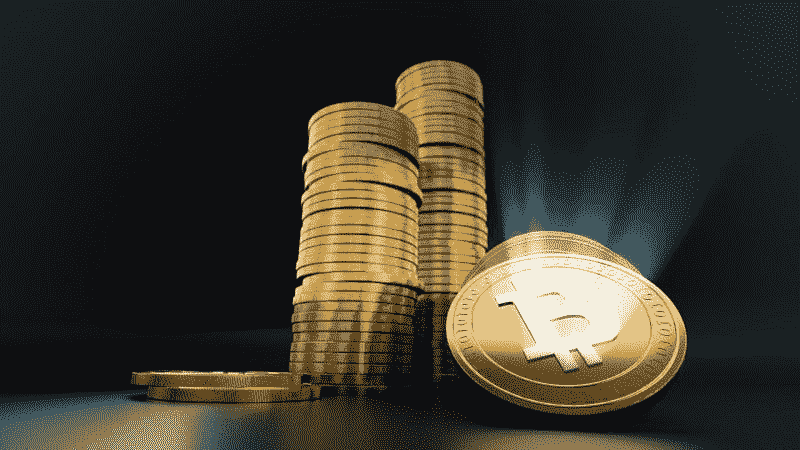
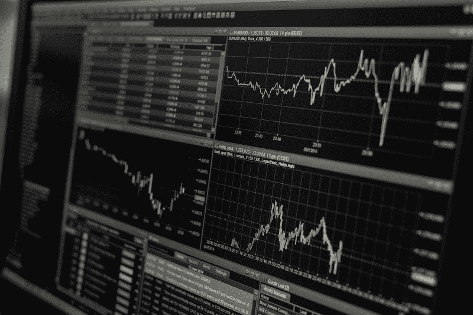
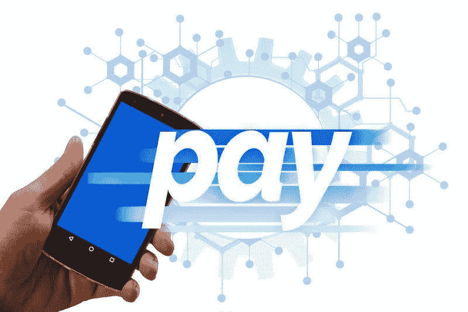

# 高盛(GS)能挺过冠状病毒吗？—市场疯人院

> 原文：<https://medium.datadriveninvestor.com/can-goldman-sachs-gs-survive-coronavirus-market-mad-house-953d902ffb34?source=collection_archive---------14----------------------->

没有哪家企业比高盛集团(Goldman Sachs)更受美国经济明显下滑的威胁。

许多人认为历史悠久的投资银行是华尔街。然而，我认为世界金融中心刚刚转移到上海。解释一下，上海的明星市场正在举办今年的 IPO:蚂蚁集团(Ant Group)的 IPO。

蚂蚁集团周围最大的新公司试图在上海和香港举行其[345 亿美元的首次公开募股(IPO)](https://marketmadhouse.com/ant-group-helps-shanghai-become-global-financial-capitol/) ，而冷落纽约。

# 高盛错过了当年的 IPO 吗？

令人惊讶的是，据 Markets Insider 估计，STAR Market 的交易员出价 2.9 万亿美元(19.1 万亿元人民币)收购蚂蚁集团。此外，香港买家出价 1680 亿美元(1.3 万亿元人民币)收购蚂蚁股份。

令人难以置信的是，交易者超额认购了蚂蚁金服上海上市的 872 倍*市场内部人士*声称。此外，交易商超额认购了蚂蚁金服在香港发行的 389 倍。

蚂蚁集团声称，它的首次公开募股将比历史上任何一次募股筹集到更多的现金。然而，高盛(NYSE: GS) 却置身事外，因为他们计划在上海和香港举行蚂蚁的首次公开募股。

然而，中国监管机构在 2020 年 11 月 3 日阻止了蚂蚁集团的 IPO。路透社(Reuters)称，官员们阻止 IPO 是因为共产党对马云批评中资银行感到愤怒。路透社推测，中国官员可能会将蚂蚁集团的 IPO 推迟几个月。

我怀疑中国人民银行(PBOC)停止 IPO 是因为担心蚂蚁的金融产品可能不稳定，并拖垮整个中国经济。我认为，中国领导人担心中华人民共和国可能会变得过于依赖不稳定的金融产品。对这类产品的依赖导致了美国 2007—2008 年的金融崩溃。

高盛的大部分业务来自其作为纽约顶级投资银行的声誉。然而，纽约不再是世界金融中心。高盛可能不得不改变业务来应对这一现实。

抑制蚂蚁集团的首次公开募股是否会让金融市场回到纽约仍然是个未知数。尽管我个人怀疑市场将转向伦敦或新加坡。这将有利于在这些城市设有办事处的高盛公司。

# 高盛赚了多少钱？

高盛仍然是最赚钱的公司之一。截至 2020 年 9 月 30 日，高盛报告季度毛利为 98.7 亿美元，季度营业收入为 45.49 亿美元。

令人印象深刻的是，高盛的季度运营收入从 2020 年 6 月 30 日的 12.91 亿美元上升到了 2020 年的 12.91 亿美元。然而，高盛的季度毛利从 2020 年 6 月 30 日的 123.50 亿美元下降。值得注意的是，高盛的季度毛利高于 2019 年 9 月 30 日报告的 74.7 亿美元。

高盛的季度收入从 2020 年 6 月 30 日的 132.95 亿美元降至 2020 年 9 月 30 日的 107.81 亿美元。因此，尽管截至 2020 年 9 月 30 日，高盛的营业收入为 15.86 亿澳元，但它仍是一台令人印象深刻的赚钱机器。

# 高盛仍然有巨大的价值

不幸的是，Stockrow 没有提供高盛 2020 年 9 月 30 日的现金流数字。

截至 2020 年 9 月 30 日，高盛拥有 3820 亿美元的现金和短期投资。现金和短期投资从 2020 年 6 月 30 日的 4062.25 亿美元。

此外，高盛的总资产从 2020 年 6 月 30 日的 11.42 亿美元降至 2020 年 9 月 30 日的 11.32 亿美元。因此，高盛仍有巨大的价值。因此，我认为高盛是一个价值投资，尽管全球金融中心转移到了上海。

# 蚂蚁集团威胁高盛

奇怪的是，蚁族；支付宝的所有者可能是亚洲**高盛**的最大威胁。具体来说，蚂蚁已经成为亚洲财富管理的主要参与者。

蚂蚁的财富管理单元；据 Techcrunch 报道，InvestTech 在 2020 年 3 月管理的资产总额为[5.7 亿美元(4 万亿)](https://techcrunch.com/2020/07/14/ant-alibaba-1-3-billion-users/#:~:text=Alipay%2C%20the%20brand%20of%20Ant's,active%20users%20as%20of%20March.)。彭博估计，2020 年，蚂蚁的余额宝自有货币市场基金有 1730 亿美元。路透社称，余额宝是世界上最大的自营货币市场基金。蚂蚁的保险技术部门与 90 多家中国保险公司合作。

Ant 提供来自 20 家管理公司的共同基金，包括美国巨头 Invesco 和 Vanguard。截至 2020 年 6 月，蚂蚁金服旗下的 InvestTech 部门通过余额宝促成了价值 4.1 万亿元人民币(合 6100 亿美元)的投资。余额宝和 InvestTech 提供 170 家资产管理公司的第三方产品。

# 高盛是一家金融科技公司

因此，蚂蚁集团正在打造理财产品，与高盛的[马库斯](https://www.marcus.com/us/en?prd=pl&chl=ps&schl=psg&cid=979005057&agp=52483360750&cre=340493356241&kid=goldman%20sachs%20marcus&mtype=e&adpos=&gclsrc=ds&gclsrc=ds)产品竞争。解释一下，Marcus 是高盛的人工智能储蓄和借贷平台。

目前，蚂蚁集团在美国经营可能是非法的。然而，Ant 可以收购一家美国公司或银行，或者将其算法授权给另一家公司。

一个类似的威胁是 **PayPal(纳斯达克代码:PYPL)** 可能会推出一款理财产品。值得注意的是**广场(SQ)** 允许人们通过其现金应用程序投资加密货币和股票。

# 高盛面临的真正威胁

因此，对高盛的真正威胁可能是金融科技公司，如 Ant、PayPal、Square 和 Robin Hood。因此，高盛雇佣数千名工程师是明智之举。

同样，高盛(Goldman Sachs)的一个明智之举可能是利用其巨额现金收购 Square、罗宾汉、比特币基地和布洛克。一个，甚至贝宝。高盛的另一个明智之举可能是成为蚂蚁的美国合作伙伴，并在蚂蚁美国上市。

解释一下，唐纳德·川普(R-Florida)政府正在允许另一家中国科技公司字节跳动通过抖音环球公司在北美运营其抖音社交媒体。[抖音环球](https://marketmadhouse.com/will-oracle-orcl-make-money-with-tiktok-global/)将是一家美国上市公司，字节跳动拥有 80%的股份，但甲骨文**和沃尔玛**拥有部分股份。

与高盛合作的一个明智之举可能是与沃尔玛(WMT)**、**抖音全球、**和**甲骨文(纳斯达克股票代码:ORCL)** 合作经营蚂蚁美国或蚂蚁北美。这样，高盛可以拥有和运营支付宝美国公司，并将其与马库斯合并。**

注意，还不清楚当选总统乔·拜登(特拉华州民主党人)的政府将如何对待抖音环球公司。然而，我认为拜登将允许抖音全球如果通过快；并由一家有政治背景的美国大银行承销，如高盛。由于下一任财政部长可能来自高盛，我认为高盛将对拜登政府产生巨大影响。

# 高盛是价值投资吗？

我认为**高盛(Goldman Sachs)**是价值投资，因为市场先生在 2020 年 11 月 6 日将其合理定价为 201.26 美元。

此外，高盛将在 2020 年 12 月 30 日支付 1.25 美元的高额股息。如果你正在寻找一个现金充裕的价值投资，**高盛集团(NYSE: GS)** 仍然是一个极好的选择。因此，我认为高盛是一只高收益股票，因为它能产生大量现金，并支付高额股息。

因此，高盛不仅仅是存活的冠状病毒。高盛在新冠肺炎时代蒸蒸日上。如果你的投资组合中需要一只安全、现金充裕的股票或金融科技公司，高盛(Goldman Sachs)值得一看。

*原载于 2020 年 11 月 6 日*[*【https://marketmadhouse.com】*](https://marketmadhouse.com/can-goldman-sachs-gs-survive-coronavirus/)*。*