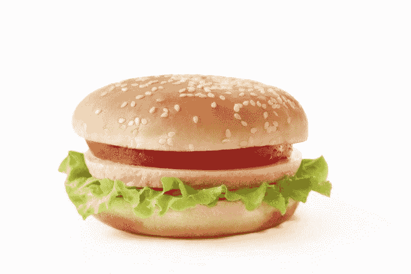

# 盒子里的杰克能在汉堡大战中赚钱吗？—市场疯人院

> 原文：<https://medium.datadriveninvestor.com/can-jack-in-the-box-make-money-in-the-burger-wars-market-mad-house-7901286dea4c?source=collection_archive---------16----------------------->

盒子里的杰克公司(NASDAQ: JACK) 在美国无休止的汉堡大战中损失最大。

Statista 估计，盒子里的杰克在 2019 年经营了 137 家公司所有的餐厅和 2，106 家特许快餐店。对于非加州人来说，盒子里的杰克是一家老派汉堡连锁店，经营着 2200 家餐厅。

盒子里的杰克的主要市场是西海岸，但它在远至关岛、辛辛那提、北卡罗来纳州的夏洛特和纳什维尔的地方都有分店。然而，盒子里的杰克的重点仍然是加州，它在那里经营着 943 家餐馆。

# 盒子里的杰克能活下来吗？

盒子里的杰克的问题是难以置信的竞争。除了巨头**麦当劳(纽约证券交易所代码:MCD)** 和汉堡王，盒子里的杰克不得不与各种各样的新贵竞争。

一些盒中插孔竞争对手包括:In-n-Out Burger、 **Shake Shack (NYSE: SHAK)** 、**Wendy ' s co .(NASDAQ:WEN)**Carl ' s Jr .、Hardee's、A & W、 **Robin (NASDAQ: RRGB)** 、Berkshire Hathaway's Dairy Queen、Five Guys 和许多地区分店。因此，现在在美国的许多街角都有两三个汉堡摊。

事实上，Burgerweb 声称 2015 年 75%的美国餐馆是汉堡店。此外，Burgerweb 声称 2015 年汉堡占美国牛肉消费的 71%，占美国三明治销售的 60%。此外，Burgerweb 估计，2015 年美国人每年在汉堡上的花费约为 500 亿美元。

 [## 数据驱动投资的兴起|数据驱动投资者

### 当 JCPenney 报告其 2015 年 2Q 的财务结果时，市场感到非常震惊。美国零售巨头…

www.datadriveninvestor.com](https://www.datadriveninvestor.com/2019/02/28/the-rise-of-data-driven-investing/) 

因此，市场是巨大的，而且还在增长。然而，愤世嫉俗者会问，美国能支持多少家汉堡连锁店？即使有各种各样的“优质汉堡”和所有麦当劳的憎恨者。

# 盒子里的杰克在赚钱吗？

相反，对汉堡和杰克在盒子里的收入的需求正在增长。

例如，盒子里的杰克报告了截至 2019 年 12 月 31 日的季度收入增长率为 5.81%。令人印象深刻的是，Stockrow 在截至 2019 年 9 月 30 日的季度中给了《盒子里的杰克》24.66%的收入增长率。

然而，你能从汉堡中赚到的钱很少。例如，盒子里的杰克报告称，截至 2019 年 12 月 31 日，季度毛利为 1.0406 亿美元，收入为 3.0767 亿美元。

因此，盒子里的杰克报告上一季度的营业收入为 6996 万美元，净共同收益为 790 万美元。因此，盒子里的杰克从汉堡中赚了一小笔钱。

# 盒子里的杰克赚了多少钱？

重要的是，盒子里的杰克正从其业务中产生一些现金。例如，盒子里的杰克报告 2019 年最后一个季度的营业现金流为 2269 万美元，期末现金流为 3829 万美元，投资现金流为 3236 万美元。

因此，盒子里的杰克在 2019 年 12 月 31 日报告了 3829 万美元的现金和短期投资。这一数字低于 2019 年 9 月 30 日的 1.5156 亿美元。

因此，我认为**Jack in the Box(NASDAQ:Jack)**是一个糟糕的投资，因为它的现金很少，安全边际很低。因此，我认为盒子里的杰克可能会没钱而崩溃。

具体来说，我认为盒子里的杰克可能在一个糟糕的季度后就没钱了。这可能会迫使 Jack in the Box 的管理层将公司出售给一家私人股本公司。

# 盒子里的杰克和其他快餐连锁店能从冠状病毒中赚钱吗？

令人不安的是，盒子里的杰克和其他快餐连锁店可以从冠状病毒歇斯底里症中赚钱。

解释一下，很多人不敢去公共场所；比如静坐餐厅，因为冠状病毒。相反，这些人可以去“得来速”餐厅或使用诸如 [**GrubHub**](https://marketmadhouse.com/is-grubhub-losing-money/) **(纽约证券交易所代码:GRUB)** 或 DoorDash 等交付应用程序。

饥饿的偏执狂会使用免下车服务或送货应用程序来避免与人接触。商业内幕*[声称，偏执狂可以避免餐馆疾病控制和预防中心(CDC)建议人们与潜在的新冠肺炎病毒携带者保持六英尺的距离。解释一下，新冠肺炎是冠状病毒的另一个名字。此外，疾控中心建议大家避免与有流感样症状的人密切接触。](https://www.businessinsider.com/coronavirus-passes-between-people-6-feet-apart-2020)*

*因此，像 Jack in the Box 和 GrubHub 这样的快餐店可以从冠状病毒中赚钱。然而，我认为，随着媒体驱动的歇斯底里消退，新冠肺炎对《盒子里的杰克》的任何推动都将消退。*

# *盒子里的杰克是好的分红股票吗？*

*我认为市场先生在 2020 年 3 月 11 日将**盒子里的杰克(NASDAQ: JACK)** 定价过高，为 47.11 美元。*

**

*我认为这个价格太高了，因为盒子里有一个小小的现金盒。澄清一下，我认为 Jack in the Box stock 太贵了，因为它的安全边际低。*

*相反，我认为盒子里的杰克支付了不错的股息。例如，盒子里的杰克在 2020 年 3 月 2 日支付了 40₵股息。因此，你可以从杰克的箱股中赚钱。*

*总体而言，2020 年 3 月 9 日，Jack in the Box 股票的股息收益率为 2.57%，年化派息为 1.60 美元，派息率为 36.13%。不幸的是，Dividend.com[报道](https://marketmadhouse.com/can-jack-in-the-box-make-money-in-the-burger-wars/#tm=3-comparison-center&r=ES::DividendStock::Stock%23JACK--NASDAQ&only=meta,data,thead)，盒子里的杰克去年的股息没有增长。*

*归根结底，我不认为**盒子里的杰克(纳斯达克代码:JACK)** 是价值投资，因为它的价格。然而，如果价格下跌，盒子里的杰克可能是一个值得购买的东西。*

*【https://marketmadhouse.com】原载于 2020 年 3 月 11 日**。***