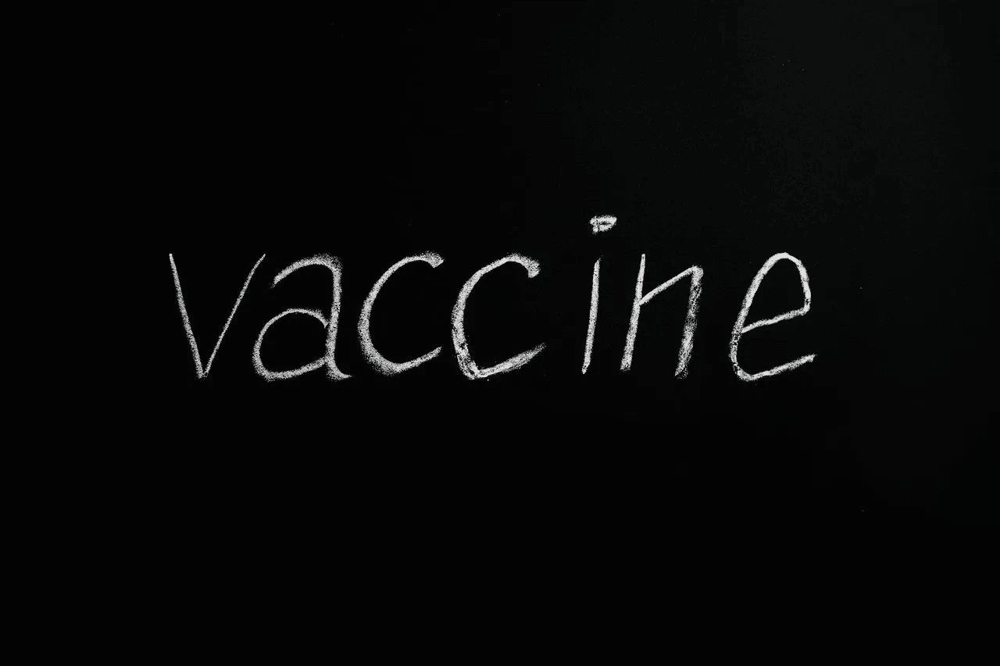
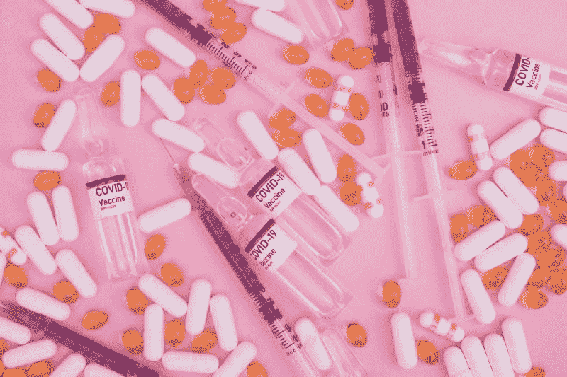
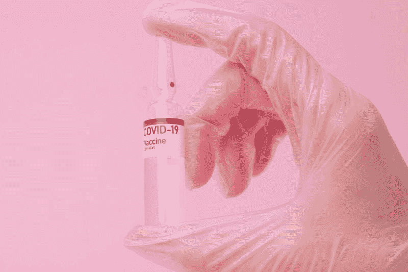
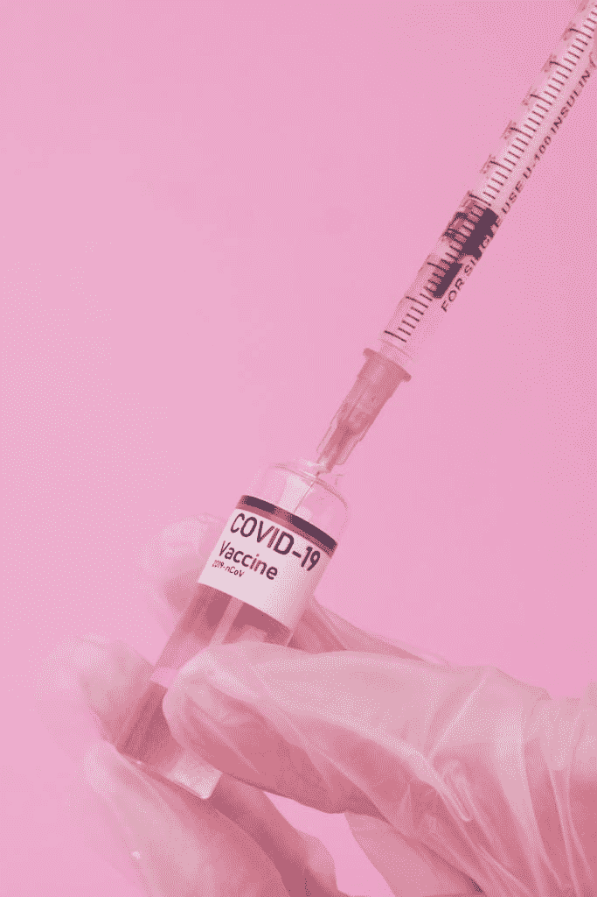
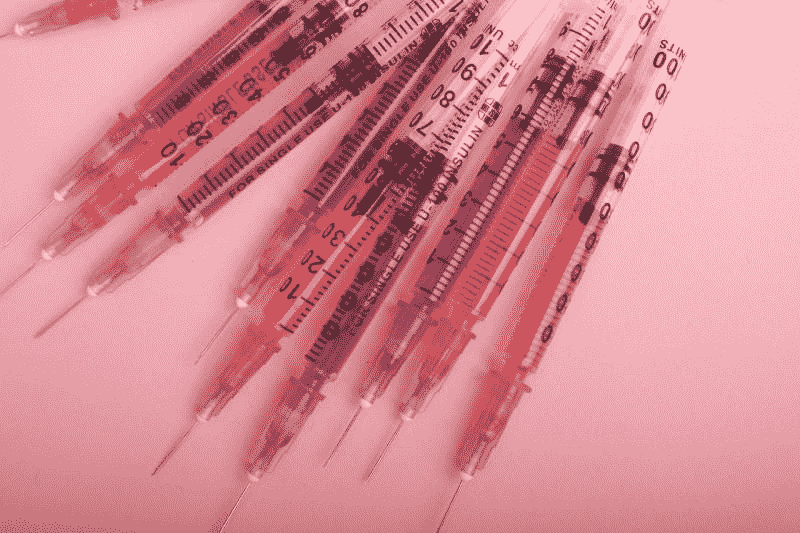
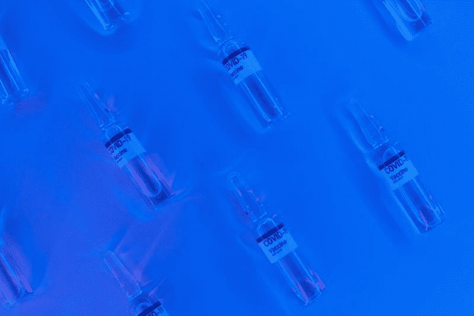
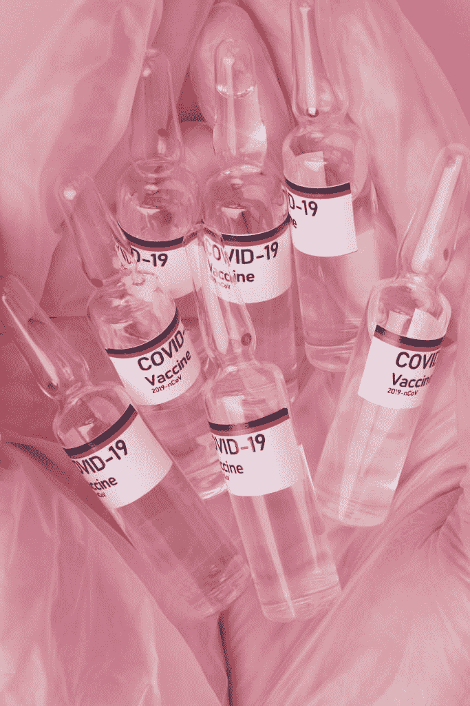

# 强生做疫苗能赚钱吗？—市场疯人院

> 原文：<https://medium.datadriveninvestor.com/can-johnson-johnson-make-money-with-vaccines-market-mad-house-11e7c9256776?source=collection_archive---------22----------------------->

强生公司(纽约证券交易所:JNJ)可能成为第三家在美国发布冠状病毒疫苗的公司。

强生公司。或者 J&J，注射，[是两种新冠肺炎疫苗中的一种，*政治*推测，食品药品管理局(FDA)](https://www.politico.com/news/2020/12/14/more-vaccine-developers-fda-approval-445194) 可能会在二月或三月批准在美国上市。Moncef Slaoui 说，强生公司在美国的后期试验结果可能会在 1 月下旬公布，这使得 FDA 批准的可能性更大。斯拉维负责联邦政府的冠状病毒疫苗开发项目“曲速行动”。

如果关于它的说法是真的，强生公司的新冠肺炎疫苗可能优于辉瑞(PFE)公司的产品和现代基因公司的产品。为了解释，他们需要在非常低的温度下储存 Moderna 和辉瑞疫苗。

事实上，新闻报道称，你不能将辉瑞和 Moderna 疫苗储存在普通的冰箱和冰柜中。例如，你需要将 Moderna 疫苗储存在温度介于-25 摄氏度和-15 摄氏度之间的环境中。因此，医疗服务提供者需要一个特殊的冰箱来储存 Moderna 疫苗。

# 强生疫苗更好吗？

相比之下，强生公司(JNJ)声称它的新冠肺炎疫苗可以在 35 到 46 华氏度(1.66 到 7.77 摄氏度)下储存三个月。因此，你可以将 J 疫苗储存在普通的厨房冰箱里。

此外，强生公司声称，你可以在零下 4 华氏度(-20 摄氏度)的环境下储存冠状病毒疫苗三年。因此，将 J&J 疫苗储存在常规的深度冷冻中是可能的。强生疫苗的一个显而易见的优势是，医疗服务提供者不需要为其购买特殊的存储单元。

J&J 疫苗更稳定，因为他们是用经过验证的腺病毒技术制造的。腺病毒疫苗是一种无害的感冒病毒，它携带冠状病毒基因进入人体细胞。

希望这种基因能使细胞产生一种冠状病毒刺突蛋白。刺突蛋白可以激发免疫系统对抗冠状病毒。

另一个优势是强生疫苗可以一针就给新冠肺炎提供免疫力。Moderna & Pfizer 疫苗需要注射两次。

相比之下，Moderna 和辉瑞公司的疫苗使用新的 rna 信使策略来产生免疫反应。因此，强生新冠肺炎疫苗理论上是更好的产品。

# 强生能生产多少疫苗？

不幸的是，**强生&强生(纽约证券交易所:JNJ)** 可能难以生产足够数量的疫苗。

*政治*声称强生公司无法实现其疫苗接种目标。更详细地说，约翰逊承诺在 2021 年 3 月前为 T4 提供 1200 万剂疫苗。然而，J & J 并没有达到这些目标。约翰逊的生产遇到了很多问题，已经向联邦政府寻求帮助。

“曲速行动正在与强生公司合作，以扩大和最大限度地生产让桑疫苗，”美国卫生与公众服务部承诺。曲速行动是联邦政府的疫苗生产项目。

在“曲速行动”中，健康与人类服务部将支付 10 亿美元用于疫苗研究，并为美国所有 3.31 亿居民支付疫苗费用。强生公司可以通过向美国和其他政府出售疫苗来赚取巨额利润。

# 疫苗能帮助强生公司吗

可以预见的是，强生的股价从 2021 年 1 月 4 日的 156.40 美元涨到 2021 年 1 月 14 日的 160.65 美元，再涨到 2020 年 1 月 19 日的 162.78 美元。因此，市场先生喜欢新冠肺炎疫苗的想法。

过去一年，强生股价从 2020 年 1 月 16 日的 148.21 美元上涨至 2021 年 1 月 15 日的 160.30 美元。于是，[约翰逊&约翰逊(JNJ)](https://marketmadhouse.com/is-johnson-johnson-making-money/) 从冠状病毒中获利。

J&J 在 2020 年赚了更多的钱。例如，强生的季度收入从 2019 年 12 月 31 日的 207.47 亿美元上升至 2020 年 9 月 30 日的 210.82 亿美元。

# 强生公司赚多少钱？

此外，J&J 的季度毛利从 2019 年 12 月 31 日的 136.13 亿美元上升至 2020 年 9 月 30 日的 141.10 亿美元。此外，季度运营收入从 2019 年 12 月 31 日的 42.18 亿美元上升至 2020 年 9 月 30 日的 44.01 亿美元。

值得注意的是，强生的季度运营现金流从 2019 年 12 月 31 日的 63.98 亿美元上升至 2020 年 9 月 30 日的 83.83 亿美元。此外，季度末现金流从 2019 年 12 月 31 日的 10.56 亿美元上升至 2020 年 9 月 30 日的 77.91 亿美元。

相反，约翰逊(JNJ)借了很多钱。值得注意的是，J & J 报告 2020 年 9 月 30 日的季度融资现金流为 41.96 亿美元。季度融资现金流从 2020 年 6 月 30 日的-3.57 亿美元上升至 2020 年 3 月 31 日的-43.15 亿美元。

2020 年，强生公司的长期债务从 2019 年 12 月 31 日的 264.94 亿美元增长到 2020 年 9 月 30 日的 326.8 亿美元。因此，约翰逊负债更多。

# 强生有什么价值？

强生的价值在 2020 年大幅增长。例如，J&J 的总资产从 2019 年 12 月 31 日的 1577.28 亿美元增长到 2020 年 9 月 30 日的 1706.93 亿美元。

此外，**强生&强生(纽约证券交易所代码:JNJ)** 拥有更多的现金。J & J 的现金和短期投资从 2019 年 12 月 31 日的 192.87 亿美元上升至 2020 年 9 月 30 日的 307.81 亿美元。

我认为强生公司是一个优秀的价值和增长投资，因为它的现金、收入和资产在没有新冠肺炎疫苗的情况下增长了。因此，我认为即使没有冠状病毒疫苗，J&J 的经济增长也会加快。另外，我认为市场先生在 2021 年 1 月 15 日对强生公司的定价是 160.20 美元。

# 强生公司是一家股息丰厚的公司

此外，**约翰逊&约翰逊(JNJ)** 是一只股息丰厚的股票。例如，J & J 将在 2020 年 3 月 9 日支付 1.01 美元的季度股息。2020 年，股息于 2 月 24 日从 95₵开始增长。

总体而言，截至 2021 年 1 月 15 日，强生公司支付了 4.04 美元的[年化股息，股息收益率为 2.51%](https://www.dividend.com/stocks/health-care/biotech-pharma/large-pharma/jnj-johnson-and-johnson/) 。因此，我认为强生公司是一只股息和收益都很高的股票。

如果你在寻找新冠肺炎疫苗股票，J&J 可能是一个明智的选择。它赚钱、成长、增值，并在没有新冠肺炎疫苗的情况下获得巨大的红利。我预测强生公司将在 2021 年获得价值，不管有没有疫苗。

*原载于 2021 年 1 月 19 日 https://marketmadhouse.com**的* [*。*](https://marketmadhouse.com/can-johnson-johnson-make-money-with-vaccines/)