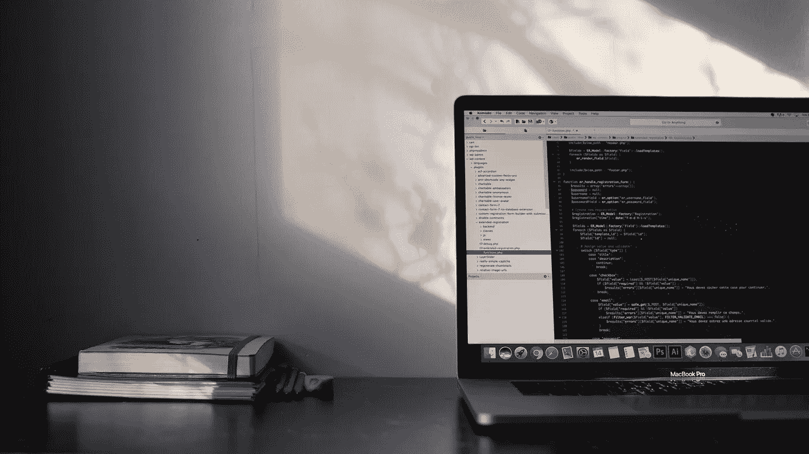

# 冥想能让你精神健康，成为一个有条理的更好的程序员吗？

> 原文：<https://medium.datadriveninvestor.com/can-meditation-make-you-mentally-fit-an-organized-and-better-programmer-bab67fad8dbe?source=collection_archive---------15----------------------->

Photo by [Matteo Di Iorio](https://unsplash.com/@shootbyteo?utm_source=unsplash&utm_medium=referral&utm_content=creditCopyText) on [Unsplash](https://unsplash.com/s/photos/meditation?utm_source=unsplash&utm_medium=referral&utm_content=creditCopyText)

# 什么是冥想？

当我问人们关于冥想的问题时，他们对冥想有不同的解释。他们中的许多人对它有正确的解释，许多人把它看作是当你变老了，你无事可做，有很多时间冥想时要做的事情。我得到的一个答案是——睡觉就是冥想。

冥想是一种解放思想、发展意识、忘记日常焦虑、带来快乐、专注于精神治疗和放松的方式。

这不仅可以提高生产力和参与度，还可以成功地管理工作。根据认知心理学家和神经科学家的说法，冥想通过物理重组大脑来改善大脑。

# 现实

Photo by [Nik Shuliahin](https://unsplash.com/@tjump?utm_source=unsplash&utm_medium=referral&utm_content=creditCopyText) on [Unsplash](https://unsplash.com/s/photos/mental-illness?utm_source=unsplash&utm_medium=referral&utm_content=creditCopyText)

当我们谈论健康时，我们总是关注身体健康。但我们忘记或很少谈论心理健康。

根据世界卫生组织的数据:

— *世界上每四个人中就有一个人会在一生中的某个时候受到精神或神经疾病的影响。目前，超过 33%的国家将不到 1%的卫生总预算用于精神卫生，另有 33%的国家仅将 1%的预算用于精神卫生。*

冥想的知识，如何训练我们的头脑和自我治愈精神疾病的能力，对个人、社会和公共卫生团体如何处理精神疾病有着巨大的影响。

 [## 2019 年最值得学习的编码语言|数据驱动的投资者

### 在我读大学的那几年，我跳过了很多次夜游去学习 Java，希望有一天它能帮助我在…

www.datadriveninvestor.com](https://www.datadriveninvestor.com/2019/02/21/best-coding-languages-to-learn-in-2019/) 

我们应该对心理健康和身体健康同等重视。

# 怎么做冥想？

Photo by [Mitchell Griest](https://unsplash.com/@griestprojects?utm_source=unsplash&utm_medium=referral&utm_content=creditCopyText) on [Unsplash](https://unsplash.com/s/photos/meditation-pose?utm_source=unsplash&utm_medium=referral&utm_content=creditCopyText)

冥想需要经常练习，就像发展其他技能一样。

你可以从 2 分钟开始，慢慢地，你可以每天冥想 10-15 分钟。

## **平稳与静止**

保持稳定的冥想姿势，头部、颈部和躯干保持一致。让自己身体静止下来。这将有助于身体的稳定和静止，也有助于头脑的平静。

## 放松呼吸

意识到你的呼吸流动。感受你呼吸的深度，让它平静而自然，而不是强迫。随着时间的延长，呼吸会变得更加放松，你会感觉到你的头脑开始平静下来，焦虑和杂念也会平静下来。

## 焦点

专注于身体如何随着每次吸气和呼气而运动。观察肩膀、胸部、肋骨和腹部的运动。只考虑现在。

# **为正**

Photo by [David Siglin](https://unsplash.com/@dsiglin?utm_source=unsplash&utm_medium=referral&utm_content=creditCopyText) on [Unsplash](https://unsplash.com/s/photos/happy-face?utm_source=unsplash&utm_medium=referral&utm_content=creditCopyText)

在你完成冥想之后，走向现实世界之前，说一些关于自己的积极的事情。我们在生活中都会面临失败，但每个人从内心来说都是一个美丽的人，都有很多关于自己的优点，并为此感到自豪。我们很少听到别人对我们的赞美，甚至我们也很少欣赏自己。抓住这一刻，提醒自己你的善良，你是一个多么美好、体贴和积极的人。这样你不仅会从内心感到快乐，而且会让你一整天都充满动力，让你准备好微笑着面对现实世界。

# 冥想与程序员的关系

Photo by [Émile Perron](https://unsplash.com/@emilep?utm_source=unsplash&utm_medium=referral&utm_content=creditCopyText) on [Unsplash](https://unsplash.com/s/photos/programming?utm_source=unsplash&utm_medium=referral&utm_content=creditCopyText)

作为一名程序员，在做我们的工作和写代码时，你需要大量的注意力和焦点。你只是想到现在，类似于冥想，你只是关注和观察现在。

作为一名程序员，你花了很多时间来学习这门手艺，这需要专注和注意力。每天进行冥想和练习可以帮助我们实现目标。它可以帮助您释放创造力并提高性能。

# 利益

1.  增加能量和活力
2.  缓解压力、焦虑和抑郁
3.  更好的决策和解决问题
4.  白天更多的精神力量
5.  更好的沟通
6.  更加乐观
7.  更好的人生观
8.  改善呼吸和心率
9.  提高免疫系统
10.  更多福祉