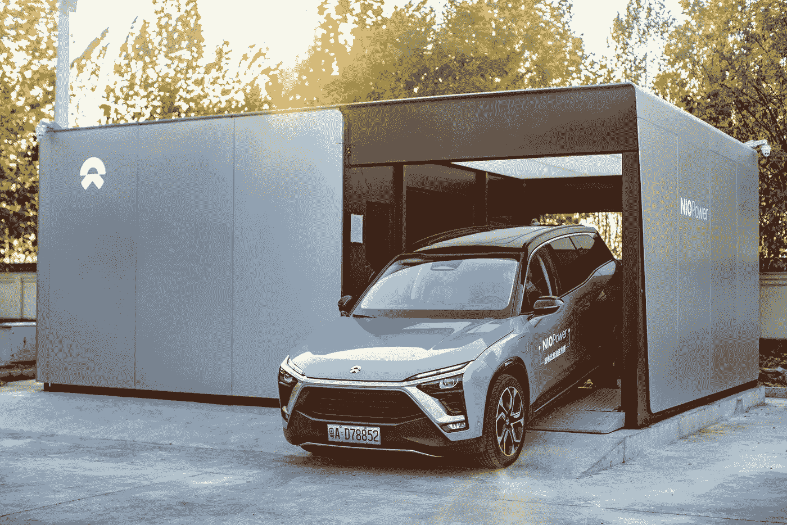
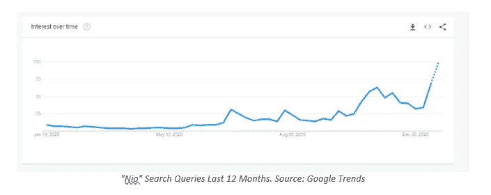
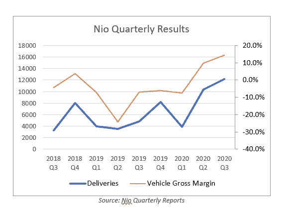
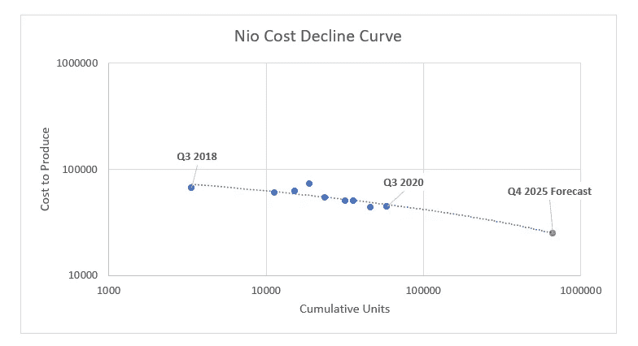
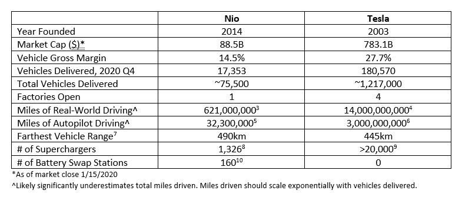
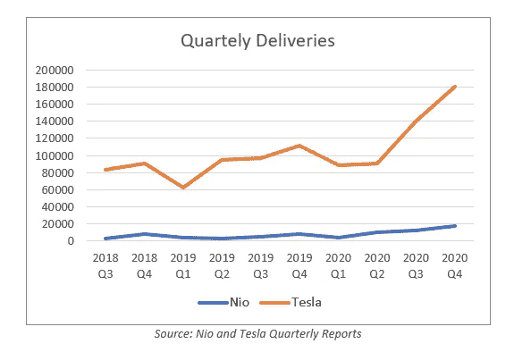

# Nio 能和特斯拉抗衡吗？

> 原文：<https://medium.datadriveninvestor.com/can-nio-compete-with-tesla-45ac8e36401c?source=collection_archive---------8----------------------->

电动汽车市场正在升温。只有少数公司会幸存下来——这就是 Nio 可能是其中之一的原因。

## **总结**

Nio 去年的交付量增长强劲，可能正处于重要的转折点。最近的融资表明 Nio 正在对其未来进行大量投资。

成本快速下降，到 2025 年毛利率可能高达 30%。

尽管在产量和数据方面仍远远落后于特斯拉，但 Nio 正通过其独特的电池即服务模式脱颖而出。这可以为赢得市场份额提供竞争优势。

*本系列的第一部分将评估 Nio 的独立运营，并将关键指标与 Tesla 进行比较。第二部分将特别关注 Nio 的电池即服务模型，并分析其作为需求规模的可行性(此处阅读***)。第三部分将通过预测电动汽车市场的规模、考虑供应链和产能限制以及探索更广泛的竞争动态来分析 Nio 和特斯拉是否能够成功。**

**

## ***简介***

*电动汽车制造商 Nio 最近一直是一个热门话题，尤其是在投资者寻找“下一个特斯拉”的时候。随着主要商业新闻媒体——包括《美国消费者新闻与商业频道》、《华尔街日报》和《彭博》——发布了比较这两家公司的文章，相关的搜索查询激增，人们的兴趣也有所增加。*

**

*Nio 的市值为 885 亿美元，约为特斯拉的 1/9。即使 Nio 的规模能达到特斯拉的三分之一，投资者也能获得 3 倍的回报。但是 Nio 到底是竞争力强，还是特斯拉太超前了？而且，如果 Nio 能够赶上，两家公司还有空间吗？*

*让我们开始吧。*

## ***Nio 基本面***

*2020 年是 Nio 创纪录的一年。尽管在 Q1 险些破产，这家汽车制造商在 Q2 的交付量同比增长 190%，第三季度增长 154%，第四季度增长 111%。汽车毛利率大幅提高，从 Q1 的-7.4%上升至第三季度的 14.5%。*

**

*车辆毛利润与季度交付情况类似，交付的车辆越多，毛利润越好。这可能至少部分是由于规模经济和工厂及劳动力的更高利用率。对 Nio 来说幸运的是，未来看起来令人鼓舞。最近的一份新闻稿显示，Nio 在 2020 年第四季度交付了 17，300 辆汽车，2021 年的预测预计将继续增长。*

*Nio 交付量的增长也可能代表着一个重要的转折点。预计 2020 年总交付量约为 43，700 辆，是该公司 7 年历史中累计交付车辆数量的两倍多。特斯拉交付在 2015 年取得了类似的成就。自那以后，特斯拉的年交付量以 135%或以上的年增长率稳步增长。Nio 很可能会效仿。*

*假设 Nio 每年增加 135%的产量，他们将在 2025 年生产大约 20 万辆汽车。所以让我们考虑一下 20 万辆是否有意义。2020 年，Nio 拥有约 1.5%的电动汽车市场份额(市场包括电池电动汽车和插电式混合电动汽车)。每年大约售出 7000 万辆新车，目前其中只有不到 5%是电动汽车。我将在本系列的第三部分保存完整的市场规模分析，但假设 Nio 保持 1.5%的市场份额，2025 年全球电动汽车市场将达到 1330 万辆左右，占汽车市场总量的 19%。19%可能过于保守，但 Nio 也有可能失去市场份额(例如，输给现有的汽车制造商、苹果、索尼等。).考虑到这些因素，Nio 在 2025 年销售 20 万辆汽车似乎是合理的。*

*在年产量增加 135%的情况下，Nio 的累计产量将达到约。2025 年 66.5 万辆。根据莱特定律(Wright's Law ),产量每增加一倍，成本就会下降一个固定的百分比，我预测 Nio 在 2025 年的预期每辆车成本将下降到大约 2.5 万美元(见下图)。如果我们假设 Nio 的平均汽车零售价为 36，000 美元，类似于美国新车的平均建议零售价[【1】](#_ftn1)，即使 Nio 的汽车目前处于高端市场，价格可能会更高，Nio 也将实现约 30%的毛利率。如果 Nio 的生产规模以每年 135%的速度增长——这是一个很大的可能性，因为 Nio 的首席执行官表示，他们计划在 2021 年实现 150，000 的年产能，到 2022 年将这一数字翻一番，达到 300，000[【2】](#_ftn2)——成本可能会下降得更快。*

**

*上述成本分析假设 Nio 将继续专注于高档 SUV。然而，Nio 的产品组合表明，Nio 可能会瞄准更广泛的消费者群体。2018 年，Nio 以 ES8 一款顶级 7 座 SUV 作为他们的旗舰车。然而，自 2019 年 6 月推出 ES6 (Nio 更新、更便宜的 5 座 SUV)以来，它一直主导着销售，平均占产品组合的 83%。最近 Nio 还推出了两款新车:EC6(一款 coupe，于 7 月推出)，以及新的 ET7(一款轿车，于 2021 年 1 月初在 Nio Day 上发布)。这些汽车代表着沿着特斯拉的 Model S、Model X 和 Model 3 的轨迹向更实惠的汽车转变。*

## ***Nio vs. Tesla***

**

****制造能力****

*毫无疑问，特斯拉拥有更大的制造能力。拥有四个运营工厂(弗里蒙特、内华达、纽约和上海；请注意，目前只有弗里蒙特和上海生产汽车，而其他两个生产太阳能/电池技术)，还有两个(柏林，奥斯汀)正在建设中，特斯拉声称每年可以生产大约 84 万辆汽车。另一方面，Nio 只经营一家工厂，目前年产量约为 90，000 辆。请注意，虽然比较绝对数字提供了特斯拉领先规模的视角，但它确实掩盖了 Nio 的快速增长速度。*

*最近的事件表明 Nio 正在计划扩张。Nio 在去年 12 月通过二次发行筹集了 26 亿美元，并在今年 1 月通过发行可转换债券筹集了 13 亿美元。[【12】](#_ftn2)管理层表示，收益将用于扩大制造能力和开发更好的自动驾驶技术[【13】](#_ftn3)——这些能力将使 Nio 能够更好地扩展、竞争和利用电动汽车采用和自动驾驶汽车的增长。*

**

****充电站:增压器与电池即服务****

*特斯拉的超级充电站网络也有助于加强其竞争优势。拥有超过 2000 个超级充电站，包括超过 20000 个独立充电器，特斯拉的网络旨在方便可靠。增压器也是特斯拉汽车专用的。任何希望与特斯拉竞争的电动汽车公司不仅要开发高质量的电动汽车，还要投资建设自己的充电站网络。*

*重要的是，人们对特斯拉的增压器感到失望。由于路上有超过 120 万辆特斯拉，高密度地区(如加利福尼亚州)的车主受到充电器供不应求的长队困扰。每次充电平均需要 45-50 分钟，这进一步加剧了拥堵。[【14】](#_ftn1)*

*另一方面，Nio 正在投资电池交换，作为他们首选的车辆充电形式——这种模式被称为电池即服务(BaaS)。每月 150 美元，Nio 用户可以在一个月内最多更换六次电池。更换时间从 3-5 分钟不等，并提供充满电的 380 英里里程的电池——比在超级充电站给特斯拉充满电需要 75 分钟快得多。通过更快的“充电”服务，这些加油站正试图解决目前困扰特斯拉许多超级充电站的拥堵问题。此外，Nio 的 BaaS 目前的 100 千瓦时电池组价值为 0.25 美元/千瓦时，略低于特斯拉超级充电器的 0.28 美元/千瓦时价格。Nio 在 1 月 9 日宣布，他们计划在 2022 年开始交付 150 千瓦时的电池组，这应该会进一步降低充电成本。*

*但是，交换站能满足需求吗？目前约有 75，500 辆 Nio 汽车上路，假设车主使用所有六种置换，Nio 预计每年将完成 540 万辆置换。那太多了。Nio 目前有 160 个电力交换站。为了实现 540 万次交换/年，每个电站平均每天必须交换 94 块电池——鉴于 Nio 已经表示每个电站每天最多可以处理 312 次交换，这似乎不是问题。[【15】](#_ftn1)然而，94/天的数字假设需求在一天内和跨地理区域均匀分布，这是不现实的。本系列的第二部分将解决这些假设，并通过评估单位经济性、容量限制、库存管理和需求规模的可行性，尝试对不同的 BaaS 场景进行严格建模。如果你有兴趣看的话，一定要跟着我。*

*除了减少拥堵，BaaS 还可能在帮助 Nio 赢得市场份额方面发挥重要作用。目前，Nio 允许消费者选择购买带电池或不带电池的汽车，后者的零售价约低 1 万美元。通过提高汽车的价格竞争力，Nio 可能会占领更大的潜在市场份额。*

****自主可能性****

*特斯拉在全自动驾驶汽车的竞赛中遥遥领先。每辆特斯拉在路上平均记录了 10，850 英里的真实世界里程和 2，325 英里的自动驾驶里程，而每辆 Nio 分别为 8，220 英里的真实世界里程和 430 英里的自动驾驶里程(使用 2020 年的可用数据；这些很可能低估了真实值)。这种差距只会继续扩大:特斯拉目前的产量是 Nio 的 10 倍，而他们的汽车上路时间更长。更多的车意味着更多的里程，更多的时间在路上意味着每辆车更多的里程。这是指数增长。从这个角度来看，特斯拉花了四年时间达到他们的第一个十亿自动驾驶里程，不到一年就达到了下一个十亿英里，而在那之后几个月就达到了*下一个*额外的十亿英里。[【17】](#_ftn2)鉴于特斯拉在 2020 年初达到了 30 亿英里的自动驾驶里程，加上数据的加速增长速度，特斯拉很可能已经记录了 50-60 亿英里的自动驾驶里程(如果不是更多)。Elon Musk 表示，他预计监管机构的批准将需要大约 60 亿英里。如果这是真的，我们可以看到特斯拉在未来一两年内开始推出完全自主的车队。*

*这并不是说所有其他电动汽车公司都在劫难逃。Nio 宣布与人工智能芯片制造商英伟达(Nvidia)建立合作伙伴关系，这可能会加快自动驾驶的进展。此外，未来可能会存在这样一个世界，特斯拉将他们的自动驾驶软件许可给其他电动汽车，类似于英特尔将他们的芯片出售给戴尔和联想等电脑制造商。在这种情况下，特斯拉将成为硬件和软件公司(想想苹果)，而大多数其他汽车制造商将主要生产硬件。*

*但总的来说，在完全自主车队的竞赛中，很难想象有人能赶上特斯拉。*

## *那么 Nio 将何去何从？*

*尽管特斯拉遥遥领先，但监管机构不太可能允许一家公司控制市场。还会有其他成功的电动汽车公司，Nio——凭借强劲的增长前景、不断提高的利润率、指数级的成本下降曲线和有前途的电池技术——将成为这些赢家之一。*

*如果你喜欢这篇文章，请在这里和 twitter @AlanaDLevin 上关注我。请继续关注第二和第三部分，我将深入研究 Nio 的 BaaS 模型的经济学以及整个电动汽车市场的前景，包括市场规模、增长和整合潜力。*

*来源:*

*[【1】](#_ftnref1)[https://www . statista . com/statistics/274927/new-vehicle-average-selling-price-in-the-United States/](https://www.statista.com/statistics/274927/new-vehicle-average-selling-price-in-the-united-states/)*

*[【2】](#_ftnref2)[https://wccftech . com/nio-shares-in-the-spot light-in-the-CEO-indicated-plans-to-address-the-year-capacity-to-300000-EVS/](https://wccftech.com/nio-shares-in-the-spotlight-as-the-ceo-indicates-plans-to-increase-the-annual-production-capacity-to-300000-evs/)*

*[3][https://cntechpost . com/2020/09/23/nio-says-users-已经累计超过 10 亿公里/](https://cntechpost.com/2020/09/23/nio-says-users-have-accumulated-more-than-1-billion-kilometers/)*

*[4][https://www . Bloomberg quint . com/牛虻/cathie-wood-s-Tesla-bet-puts-ark-invest-in-spot light](https://www.bloombergquint.com/gadfly/cathie-wood-s-tesla-bet-puts-ark-invest-in-spotlight)*

*[5][https://inside EVS . com/news/434504/nio-EVS-5 亿英里距离/](https://insideevs.com/news/434504/nio-evs-500-million-miles-distance/)*

*[6][https://electr ek . co/2020/04/22/Tesla-auto pilot-data-30 亿英里/#:~:text = Out %20 of % 20 the % 203% 200 亿，changes % 2C %根据%20to%20Karpathy 的% 20 演示。](https://electrek.co/2020/04/22/tesla-autopilot-data-3-billion-miles/#:~:text=Out%20of%20the%203%20billion,changes%2C%20according%20to%20Karpathy's%20presentation.)*

*【7】[https://www . scmp . com/business/companies/article/3117106/China-ev-war-Tesla-faces-rival-record-621-mile-range-NIOS-et7](https://www.scmp.com/business/companies/article/3117106/chinas-ev-war-tesla-faces-rival-record-621-mile-range-nios-et7)*

*[8][https://cntechpost . com/2020/09/27/nio-30000-目的地-充电站-这是什么意思/](https://cntechpost.com/2020/09/27/nio-30000-destination-charging-stations-what-does-that-mean/)*

*[9][https://www.tesla.com/supercharger](https://www.tesla.com/supercharger)*

*[https://www.nio.com/nio-power](https://www.nio.com/nio-power)*

*[【11】](#_ftnref1)[https://www . barrons . com/articles/nio-stock-is-falling-following-a-secondary-offering-at-39-a-share-51607955425](https://www.barrons.com/articles/nio-stock-is-falling-following-a-secondary-offering-at-39-a-share-51607955425)*

*[【12】](#_ftnref2)[https://finance . Yahoo . com/news/nio-raise-1-3b-convertible-084812724 . html](https://finance.yahoo.com/news/nio-raise-1-3b-convertible-084812724.html)*

*[【13】](#_ftnref3)[https://IR . nio . com/news-events/news-releases/news-release-details/nio-Inc-announces-proposed-offering-60000000-0](https://ir.nio.com/news-events/news-releases/news-release-details/nio-inc-announces-proposed-offering-60000000-0)*

*[【14】](#_ftnref1)[https://www.tesla.com/support/supercharging](https://www.tesla.com/support/supercharging)*

*[【15】](#_ftnref1)[https://inside EVS . com/news/465195/nio-launch-power-swap-station-20/](https://insideevs.com/news/465195/nio-launch-power-swap-station-20/)*

*[【16】](#_ftnref1)[https://electr ek . co/2018/11/28/特斯拉-自动驾驶-10 亿英里/](https://electrek.co/2018/11/28/tesla-autopilot-1-billion-miles/)*

*[【17】](#_ftnref2)[https://Tesla-cdn . thron . com/static/o7 wxqa _ TSLA _ 更新 _ 信件 _2019-4Q_BPWOH4.pdf](https://tesla-cdn.thron.com/static/O7WXQA_TSLA_Update_Letter_2019-4Q_BPWOH4.pdf)*