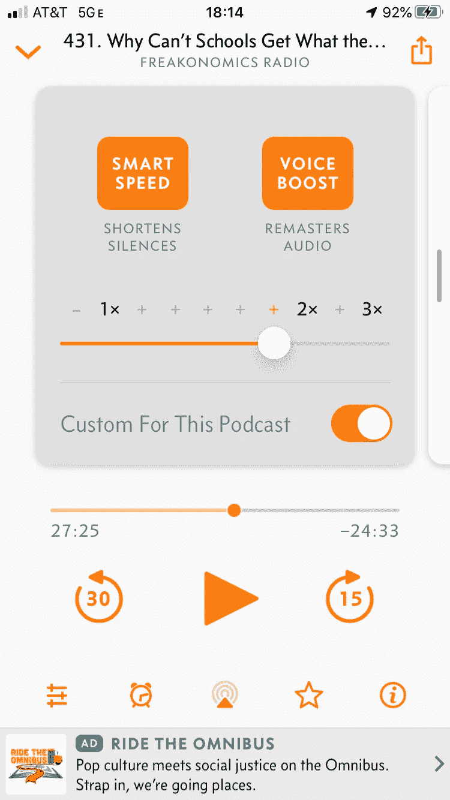

# 单凭一个产品功能就能让用户想下载你的 App 吗？—产品特性审查

> 原文：<https://medium.datadriveninvestor.com/can-one-product-feature-alone-make-users-want-to-download-your-app-4350576803b2?source=collection_archive---------22----------------------->

Photo by [Rami Al-zayat](https://unsplash.com/@rami_alzayat?utm_source=medium&utm_medium=referral) on [Unsplash](https://unsplash.com?utm_source=medium&utm_medium=referral)

[*原载 www.Ben-Staples.com*](https://www.ben-staples.com/post/can-one-product-feature-alone-make-users-want-to-download-your-app-a-product-feature-review)

一个单一的功能能让你下载并保留一个应用吗？我想是的。

播客领域就是一个很好的例子。我喜欢播客。我上瘾了。我订阅了超过 10 个不同的播客，虽然自从 COVID 以来我的收听习惯已经改变，但我仍然不断地试图找到时间来听我最喜欢的话题。

像任何人一样，我在知识贫乏的情况下开始了我的播客之旅。我不知道我应该使用什么应用程序。作为一名 iPhone 用户，在我的旅程开始时，我只有默认的播客应用。

有[吨的事情是错误的](https://medium.com/post-street/i-know-the-apple-podcasts-app-sucks-but-i-still-use-it-every-single-day-d2c4518faa33)像[特里贝恩](https://medium.com/u/5ebd185fc1b3?source=post_page-----4350576803b2--------------------------------)提到的应用程序。

核心用户故事没有得到满足！

1.  作为一名播客听众，我希望能够选择播客播放的顺序。
2.  作为一个想下载新剧集的播客听众，我应该能够一键下载新剧集。
3.  作为一个为数据付费的手机用户，我应该能够决定什么时候下载新剧集(WiFi)，什么时候不下载。

这些用例当然至关重要。对任何播客应用程序都至关重要。但是，假设每个播客应用程序都可以为您提供相同的功能，我可以下载新的播客，我可以收听它们，我可以访问所有主要的播客剧集，什么用例应该是最重要的？

Photo by [Alireza Attari](https://unsplash.com/@alireza_attari?utm_source=medium&utm_medium=referral) on [Unsplash](https://unsplash.com?utm_source=medium&utm_medium=referral)

我关心的事情太多了:

*   **应用的观感/可用性:**绝对重要，但具有讽刺意味的是，在我使用它的大部分时间里，我并没有主动与应用互动；我听着呢。
*   **内容的排他性:**到目前为止，我推荐的每一个播客都可以在我尝试过的任何播客应用程序上使用，所以到目前为止这还不是一个问题。
*   **音频质量:**不幸的是，作为一名音响发烧友，我还没有足够的技术来理解(并因此关心)通过使用不同的应用程序可以实现何种音频优化。我猜想，你用来听播客的设备(比如你选择的耳机)比你用来播放播客的应用程序会产生更大的影响。
*   **离线收听的能力:**每个播客平台似乎都允许你在 WiFi 下下载播客，这样你就可以在旅途中收听它们，而不会耗尽你的数据。一切就绪。

 [## DeFi 正在蓬勃发展，但对这位黑仔 DApp |数据驱动的投资者有一些警告

### 加密货币可能在 DeFi(去中心化金融)找到了一个杀手 DApp。它开辟了加密货币的空间…

www.datadriveninvestor.com](https://www.datadriveninvestor.com/2020/09/22/defi-is-booming-but-there-are-caveats-to-this-killer-dapp/) 

**对我来说，决定我选择哪个播客应用的一个用例是:**

*作为一名工作繁忙、播客收听时间有限的专业人士，我希望能够在不丢失任何信息的情况下，尽可能快地消费尽可能多的播客内容。*

酷，那么一旦我决定我能消耗的信息的比率是我清单上最高的，那会把我留在哪里呢？

当然，我可以加快播客的播放速度。但当这种情况发生时，播客角色开始听起来像花栗鼠，每个播客主持人都有自己的自然语速。

但当然，我可以加快我的播客。

然而，有一个特点很突出，它让我下载了一个新的播客应用程序，并长期坚持使用。

这是来自[阴天](https://apps.apple.com/us/app/overcast/id888422857)的“智能速度”。对于任何希望加快播客消费速度的人来说，这是一个真正的优势，因此，可以在更短的时间内听到更多精彩的内容。

*(顺便说一句，我绝不是《乌云》的赞助商)*

这一功能可以在没有人说话的对话中自然停顿，并将其删除！

当然，在正常对话中，当某人在思考或另一个人在单独回答一个问题时，每个停顿都不会很长。但是就像詹姆斯·克利尔在《原子习惯》中写的那样，随着时间的推移，即使是 1%的微小变化也会带来难以置信的好处。

我最喜欢的部分是，应用程序显示你的证据，告诉你多少小时智能速度已经节省了你。对我来说，在我的阴天旅程中，仅 smart speed 一项就节省了 230 小时的时间。世界上有什么比时间更宝贵？！我已经能够听 230 个小时的额外播客，否则我将无法访问。9 天半的内容！这没什么可嘲笑的。谢阴！

现在，结合提高播放速度的播客可以有巨大的好处。

我最喜欢的应用程序的一部分，不是超级独特的，但在 UX 以一种非常容易理解的方式呈现，就是你可以为每个播客定制速度。

虽然我不再是订户，但当我是克拉克·霍华德播客的听众时，我根据克拉克的语速将他的播客速度提高到正常速度的 3 倍。然而，当我听播客学习普通话时，我经常需要放慢一点速度，甚至喜欢关闭智能速度，以获得更多关于他们谈话的时间和节奏的信息。

当然，不是每个人都需要速度。每当我的车里有客人时(pre COVID)，他们都无法忍受我选择的播客播放速度。人们抱怨说，这实际上让他们头疼。刚开始我也受不了非常快的播放速度。

但是就像任何技能一样，播客快速听力是你可以逐步提高的。阴使这很容易与非常小的额外播放速度增量您可以添加。

# 关于产品管理，这给了我们什么启示？

## 仔细思考你想要追求什么样的用户

明确你的目标市场会让你获得一个非常有价值的资源:专注。你给予你的团队、工程师、设计伙伴的关注越多，你就能更好地执行和推进优先事项。当团队过于分散时，速度就会失败，客户价值就会下降。

## 一旦定义好了，更努力地思考你的目标用户真正看重的是什么

很好，您已经定义了您的目标用户。但是，你有多了解他们呢？你能站在他们的立场上生活一天/一周/一个月吗？你[喂过你的产品](https://www.ben-staples.com/post/apartment-rental-sites-are-missing-the-most-important-feature-a-product-feature-review)吗？你知道他们看重什么吗？你最后一次与顾客交谈是什么时候？

理解播客应用的所有潜在用例是一回事。了解你的目标用户最重视的几千个用例中的哪一个是产品管理的黄金所在。

当您将正确的用户定位与对该用户的首要任务的清晰理解结合起来时，您对工程团队应该关注的事情的优先化活动就简单多了。

我知道，说起来容易做起来难，对吗？我建议迈出第一步，与你的客户多交流。当你与客户有一条清晰的沟通路线时，你就更容易了解他们的优先事项，并使他们与产品路线图保持一致。

## 利用你现有的优势

最后，当你谈论一个真正让你与众不同的特性时，它将意味着构建一些别人没有的东西。这如何与贵公司的价值主张或独特的销售主张保持一致？从价值、工程或设计的角度来看，你的优势在哪里？

例如，Nordstrom 提供了令人难以置信的服务水平、出色的造型权威和出色的产品。作为产品经理，我们必须将这些结合起来，因为我们知道我们对目标客户的了解。这样做可以使我们的产品与众不同，并增强用户体验。

播客应用空间是一个高流量、竞争非常激烈的空间。很多人满足于默认设置(苹果播客应用)，因为他们不知道什么更好。对哪些领域更加好奇会让你受益？如果你最近推出了一个很棒的功能，你是如何让它出现在客户面前的？让我知道！

## **关于作者:**

Ben Staples 拥有超过 7 年的产品管理和产品营销电子商务经验。他目前受雇于诺德斯特龙公司，担任高级产品经理，负责他们在 Nordstrom.com 的产品页面。之前，Ben 是 Trunk Club 的高级产品经理，负责 iOS 和 Android 应用程序。Ben 最初在 Vistaprint 担任产品经理，负责他们的购物车和结账体验。在离开 Vistaprint 之前，Ben 创建了 Vistaprint 产品管理协会，有 40 多个成员。在 www.Ben-Staples.com[了解更多信息](http://www.ben-staples.com/)

我是做产品管理咨询的！有兴趣了解更多吗？我想在我的下一篇产品文章发表时得到通知吗？对产品管理感兴趣但不知道如何做？想要更多的书籍推荐吗？！[联系我！](http://www.ben-staples.com/contact)

## 访问专家视图— [订阅 DDI 英特尔](https://datadriveninvestor.com/ddi-intel)