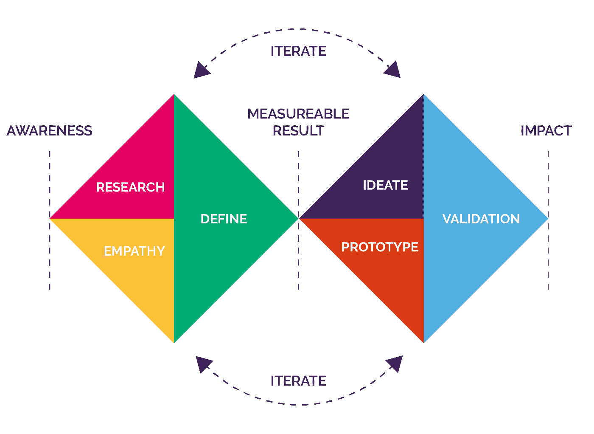
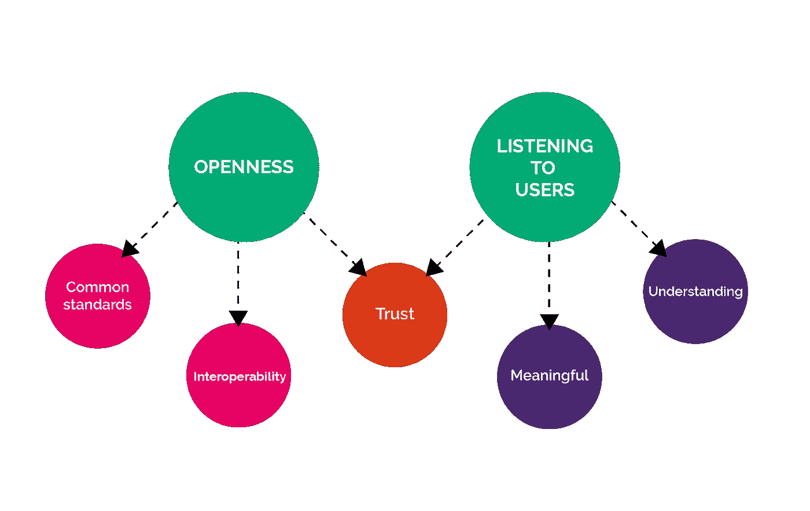

# 开放和听取用户意见能帮助人工智能在 NHS 中的采用吗？

> 原文：<https://medium.datadriveninvestor.com/can-openness-and-listening-to-users-help-ai-adoption-in-the-nhs-c206158e53fa?source=collection_archive---------6----------------------->

*作者* [*贾纳克博士*](https://medium.com/u/e18d5e5578f3?source=post_page-----c206158e53fa--------------------------------)*[*米兰塔·贾亚蒂拉卡*](https://medium.com/u/9be8b9ff653d?source=post_page-----c206158e53fa--------------------------------) *和* [*CD《阿图拉利亚》*](https://medium.com/u/68deefdc5a6b?source=post_page-----c206158e53fa--------------------------------)*

*在节日期间，我们有机会思考 NHSX 的报告[人工智能:如何做对](https://www.nhsx.nhs.uk/assets/NHSX_AI_report.pdf)。我们想重点谈谈出现的两个非技术性的主题，即*和 ***倾听用户*** 。**

**在 Mindwave，我们坚信对开放性的关注和投资和倾听*将使人工智能在 NHS 中得到更快和更广泛的采用。在这篇文章中，我们讨论了三个关键因素:**以用户为中心的设计**；**开放技术标准和数据格式，**实现数据的可移植性和互操作性；**算法如何做出决策的可解释性**，包括每个利益相关群体在“基本原理”和“信息”方面希望看到什么。***

****NHSX 报告****

**这份全面的报告着眼于人工智能技术在 NHS 中的现状，并考虑了需要做哪些进一步的工作，包括政策工作，以安全，道德和有效的方式扩大影响和效益。它详细阐述了开发 NHS 人工智能实验室的基本原则，包括为测试人工智能技术和检查 NHS 已经在使用的算法创造一个安全的环境。**

**该报告考虑了这样做的挑战，并建议在五个关键领域采取缓解行动——领导和社会；技能和天赋；获取数据；支持收养；和国际参与。**

** [## 今年值得关注的 5 大人工智能趋势|数据驱动的投资者

### 预计 2019 年人工智能将取得广泛的重大进展。从谷歌搜索到处理复杂的工作，如…

www.datadriveninvestor.com](https://www.datadriveninvestor.com/2019/02/19/artificial-intelligence-trends-to-watch-this-year/) 

**医疗保健领域的信任和技术采用**

医疗保健中的技术采用总是超越技术或解决方案，以考虑利益相关者和用户如何看待它对他们的影响和/或帮助。

AI 也没什么不同；例如，医疗保健专业人员认为它如何帮助/阻碍他们？医护人员信任它吗？病人认为它公平地对待他们吗，等等？

***图 1:信任是医疗保健技术采用的关键*** *图片由* [*SeppH*](https://pixabay.com/users/SeppH-1859049/?utm_source=link-attribution&utm_medium=referral&utm_campaign=image&utm_content=1681181) *转自* [*Pixabay*](https://pixabay.com/?utm_source=link-attribution&utm_medium=referral&utm_campaign=image&utm_content=1681181)

在 Mindwave，我们认为信任是在 NHS 和更广泛的医疗保健领域成功采用基于人工智能的解决方案的关键成功因素。引人注目的失败，如 care.data 项目的关闭，凸显了信任的至关重要性[1]。

基于我们从 NHS 前线、全球健康技术行业以及人工智能技术和研究角色中获得的经验，我们希望检查报告中强调的上述五个关键领域中与信任和分享我的想法特别相关的两个领域。两个关键领域是*访问数据*和*支持采用*。

这也与[数据驱动医疗保健技术行为准则](https://www.gov.uk/government/publications/code-of-conduct-for-data-driven-health-and-care-technology)中规定的许多行为直接相关(NHSX 报告中也有提及)。其中最相关的列举如下:

*   原则 1——理解用户、他们的需求和环境
*   原则 4——对所使用的数据保持公平、透明和负责
*   原则 5 —利用开放标准
*   原则 7——展示正在开发或部署的算法类型，如何使用数据的伦理审查，如何验证其性能，以及如何将其整合到医疗保健服务中。

**报告中的关键区域 1 |获取数据**

回到上面的第一个焦点，访问数据；在 NHSX 的文章中进一步描述为促进合法，公平，道德和安全的数据共享，可扩展和可移植，以刺激人工智能技术创新。

个人健康记录(PHR)解决方案支持用户访问和开发他们的健康和幸福数据。我们在最近的一篇[文章](https://medium.com/datadriveninvestor/how-can-personal-health-records-help-maximise-value-from-mental-health-open-data-6f8152aa1bd4#aaec-4a6503eea4f4)中强调了我们认为 phr 如何帮助实现健康数据价值的最大化——要点包括:

*   **信任** —动态许可使用户能够提供和更新共享临床、研究和商业研发数据的权限。此外，诸如“联合学习”等更新的技术使数据能够在本地组织进行处理，而不必转移到中央处理单元
*   **激励** —对用户有意义的数据分析和见解展示，以及基于共同兴趣和背景创建在线社区的能力，为用户参与 PHR 平台创造了强大的激励
*   **支持和基础设施** —荷兰有各种技术框架和标准( [MedMij](https://www.medmij.nl/en/) )以及已发布的最佳实践和其他资源(如 [NHS 数字 PHR 采用工具包](https://digital.nhs.uk/services/personal-health-records-adoption-service/personal-health-records-adoption-toolkit))，支持 PHR 的更广泛采用和扩展。

NHSX 已经为促进开放数据和技术标准奠定了基础，包括[快速医疗互通资源](https://www.hl7.org/fhir/overview.html) (FHIR)。语义网技术，如[资源描述框架](https://www.w3.org/RDF/) (RDF)提供了一个有趣的角度，即如何开发通用词汇和数据模型，以实现更有效的数据共享和链接[2]。此外，像 [BioPortal](https://bioportal.bioontology.org/) 这样的存储库收集生物医学本体，旨在使知识和数据能够互操作，以促进生物医学科学和临床护理。重要的是，我们要摆脱专有的数据存储格式，采用标准化的结构。例如，数据原型[3]——需要捕获的各种数据元素的规范——可以提供一致性并提高跨系统共享数据的能力。

Panch 等人最近的一篇文章简洁地总结了我们当前面临的一些关键问题[4]。首先是有限的可用数据来验证和概括在狭窄数据集(例如，高加索患者)上训练的算法。第二，电子健康记录(医疗保健中最有价值的数据存储)中的数据质量参差不齐，以及在链接和传输数据时互操作性的挑战(缺乏)。

**报告中的关键领域 2 |支持采用**

第二个重点领域是支持采用，这被进一步描述为推动公共和私营部门采用对社会有益的人工智能技术。这与上述行为准则中的“算法可解释性”(原则 7)紧密相关。

我们认为支持这种采用需要两个关键的子元素:

***(一)用户洞察***

首先是**用户洞察。**

从报告中强调的进程来看，我们认为有几点非常重要；例如，确定对每个利益相关方群体有意义的解释、开发有意义的语言、通过适当的活动参与(例如，与用户交谈、公民评审团)以及监控用户反应(例如，用户测试)。

设计可以比作一种算法，例如你如何做某事或者“下面有什么”。使用迭代的、以人为中心的方法来设计和开发基于人工智能的解决方案有助于获得有价值的见解。例如，在 Mindwave，我们遵循设计委员会的双钻石方法。

***图 2:迭代的以人为中心的设计***

整合产生的工具也需要深思熟虑的设计，以确保诊断的准确性，并尽量减少对工作流程效率的任何不利影响[5]。如前所述，要问的关键问题可能包括“医疗专业人员会将这些工具视为威胁吗？”以及“这些工具对他们日常工作的干扰有多大？”。

***(b)可说明性***

二是**可交代性。**

最近发表在《科学》[6]上的一项研究表明，算法偏差可能是医疗保健人工智能解决方案中的一个重大问题。这项研究回顾了美国卫生系统中广泛使用的一种算法，其中卫生成本被用作需求的代理。由于花在黑人患者身上的钱较少，该算法识别出需要护理的黑人患者不到 40%。

我们认为 NHSX 报告中缺少的是算法如何做出决定的重要性。这种“理解”变得越来越重要。例如，美国最近的一项研究利用人工智能审查了近 40 万人的 177 万份心电图(ECG)结果，以识别可能面临更高死亡风险的患者[7]。尽管它的表现比医生更好，但这项研究没有强调该算法的预测基于什么模式，以使这种洞察力能够融入临床实践，从而改善预测。

***图 3:可解释性促进对进一步解决方案的接受和认同*** *形象 by* [*LinkedIn 销售导航*](https://www.pexels.com/)*from*[*Pexels*](https://www.pexels.com/)

现在有跨行业的倡议，如人工智能合作伙伴关系，旨在促进机器学习模型的透明度。该计划包含的模型包括[谷歌模型卡](https://modelcards.withgoogle.com/about)和[微软人脸 API](https://azure.microsoft.com/en-gb/resources/transparency-note-azure-cognitive-services-face-api/) 。这些都很好，但是，它们没有解决各种解决方案中使用的“定制”模型和算法，包括那些由医疗技术初创公司开发的解决方案。

IBM research 对可解释性的理解非常清楚[8]；

> “当谈到理解和解释算法的内部工作时，不同的利益相关者出于不同的目的和目标需要解释。解释必须适合他们的需要。医生可能对看到与他们的病人相似的病人数据的例子反应最好。另一方面，训练神经网络的开发人员将从了解信息如何通过算法流动中受益。虽然监管者的目标是了解整个系统并探究其逻辑，但受具体决定影响的消费者只会对影响其案例的因素感兴趣。”

目前，简单的可视化技术，如谷歌的 People + AI Research (PAIR)开发的“假设”工具，提供了一个易于使用的可视化界面，只需最少的编码即可了解更多关于所用机器学习模型的信息[9]。例如，它支持各种功能，包括比较两个不同的模型，了解数据集的各种“属性”对输出的重要性，以及修改或删除数据集中的数据点对输出的影响。另一种技术解释了如何在视觉上结合不同的可解释性元素，例如算法正在寻找的特征(特征可视化)以及它们对输出的重要性(属性)，可以提供关于算法如何识别可能性的强大洞察力[10]。

根据目前的研究，提高“黑盒”人工智能算法可解释性的一个有希望的途径是将显式结构化知识与基于数据驱动的学习算法相结合。这也可以看作是调整算法，使预测基于其设计者奠定的基础理论/规则。因此，算法的决策可以用明确教授的知识来解释。

在可解释性的研究前沿，另一个令人感兴趣的领域通常被称为解开表征的研究。该区域着眼于分解预测空间以识别不同的特征，从而使算法用户了解算法在做出决策时识别了哪些特定特征。

总之，以上所有要点可以归纳为两个“主题”——开放性和倾听用户意见:

***图 4:开放和倾听用户——对 NHS 中人工智能采用的影响***

**未来**

在 Mindwave，我们相信对上述两个主题的关注和投资将使人工智能在 NHS 中得到更快和更广泛的采用。

我们建议如下:

1.  强调**以用户为中心的设计**的重要性及其对 NHS 组织、医疗保健专业人员和行业(包括初创企业)的益处；支持和促进最终用户(医疗保健专业人员、患者和服务用户)参与解决方案的共同设计(包括考虑资金、获得培训和资源、休假等)
2.  继续创建(通过政策和简化的采购流程)和促进(通过认证和资助)符合并进一步开发**开放技术标准和数据格式的提供商和解决方案生态系统，实现数据可移植性和互操作性**
3.  认识到**可解释性**对算法如何做出决策的重要性，包括每个利益相关群体在“基本原理”和“信息”方面希望看到什么。应该为这一重要主题的更多研究提供资金和支持资源，包括为行业提供专家指导，包括正在着手实施可解释倡议的初创公司

如果您有任何反馈或想就以上任何一点进行交流，请通过 janak@mindwaveventures.com[发送电子邮件给 Janak](mailto:janak@mindwaveventures.com)

**参考文献**

[1][https://www . wired . co . uk/article/care-data-NHS-England-closed](https://www.wired.co.uk/article/care-data-nhs-england-closed)

[https://yosemiteproject.org/webinars/why-rdf.pdf](https://yosemiteproject.org/webinars/why-rdf.pdf)

[3][https://open EHR . atlassian . net/wiki/spaces/health mod/pages/2949191/Introduction+to+原型+和+原型+类](https://openehr.atlassian.net/wiki/spaces/healthmod/pages/2949191/Introduction+to+Archetypes+and+Archetype+classes)

[4]t .潘奇，h .马蒂和洛杉矶切利，2019 年。医疗保健中人工智能的“难以忽视的真相”。 *Npj 数字医学*， *2* (1)，第 1–3 页

[5][https://ai . Google blog . com/2019/12/lessons-learn-from-developing-ml-for . htm](https://ai.googleblog.com/2019/12/lessons-learned-from-developing-ml-for.html)

[6] Obermeyer，z .，Powers，b .，Vogeli，c .和 Mullainathan，s .，2019 年。剖析用于管理人口健康的算法中的种族偏见。*科学*， *366* (6464)，第 447–453 页

[7][https://www . new scientist . com/article/2222907-ai-can-predict-if-you-will-die-soon-but-we ve-no-idea-how-works/# ixzz 69 qe3 K9 XO](https://www.newscientist.com/article/2222907-ai-can-predict-if-youll-die-soon-but-weve-no-idea-how-it-works/#ixzz69Qe3K9Xo)

【8】[https://www . research . IBM . com/artificial-intelligence/trusted-ai/](https://www.research.ibm.com/artificial-intelligence/trusted-ai/)

[https://pair-code.github.io/what-if-tool/](https://pair-code.github.io/what-if-tool/)

[https://distill.pub/2018/building-blocks/](https://distill.pub/2018/building-blocks/)**