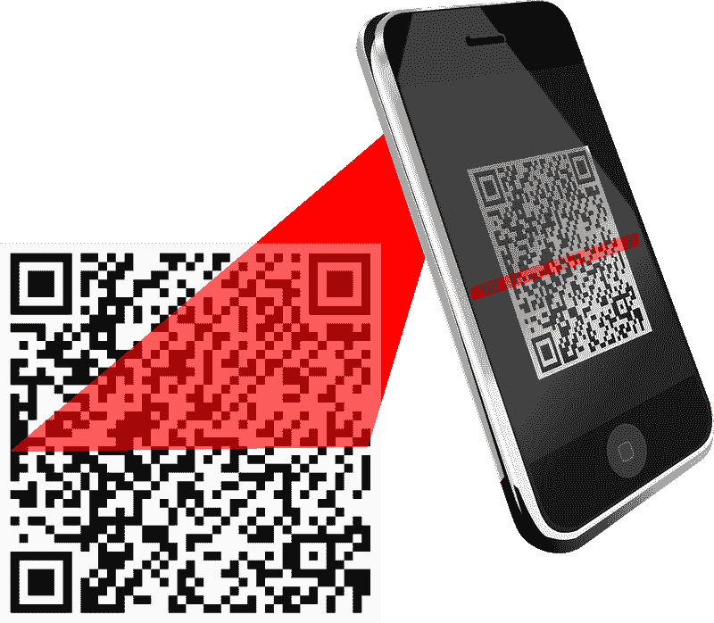
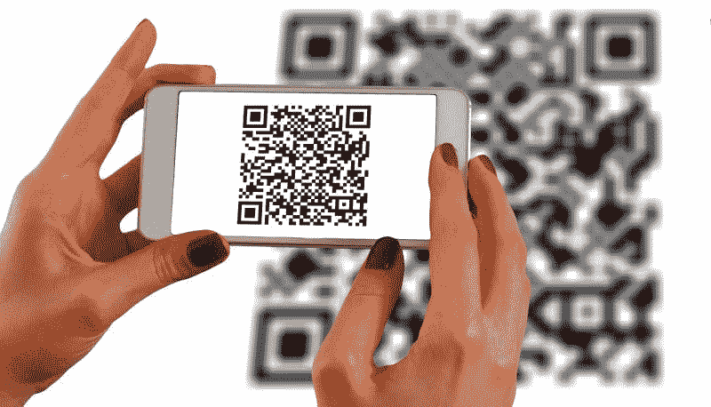
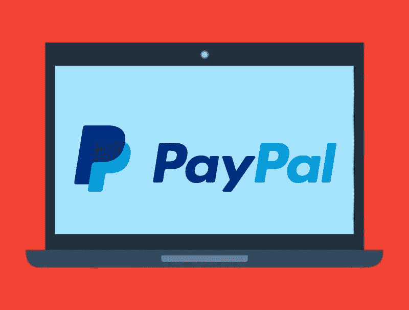

# PayPal 能从冠状病毒中获利吗？—市场疯人院

> 原文：<https://medium.datadriveninvestor.com/can-paypal-profit-from-coronavirus-market-mad-house-50a2380a41ab?source=collection_archive---------18----------------------->

奇怪的是，疫情冠状病毒可能对 PayPal(纳斯达克股票代码:PYPL)有利。例如，PayPal 的股价从 2020 年 1 月 2 日的 110.75 美元上涨到 2020 年 5 月 22 日的 150.86 美元，并在 2020 年 5 月 28 日跌至 148.79 美元。

相反，PayPal 的收入和毛利在 2020 年的前三个月下降了。特别是，PayPal 的季度收入从 2019 年 12 月 31 日的 49.61 亿美元降至 2020 年 3 月 31 日的 46.18 亿美元。此外，PayPal 同期的季度毛利从 22.29 亿美元降至 18.89 亿美元。

 [## 银行和金融科技初创公司的未来|数据驱动的投资者

### 银行的概念没有太大变化，但随着技术的发展，旧的概念也在更新。不相信我？拿一个…

www.datadriveninvestor.com](https://www.datadriveninvestor.com/2019/10/22/the-future-of-banks-and-fintech-startups/) 

此外，PayPal 赚的钱越来越少。值得注意的是，PayPal 的季度运营收入从 2020 年 12 月 31 日的 7.99 亿美元降至 2020 年 3 月 31 日的 3.98 亿美元。引人注目的是，PayPal 同期的季度净收入从 5.07 亿美元降至 8400 万美元。

# PayPal 赚钱更少

然而，PayPal 有能力实现令人印象深刻的增长。例如，Stockrow [估计](https://stockrow.com/PYPL/financials/income/quarterly) PayPal 在截至 2020 年 3 月 31 日的季度收入增长率为 11.87%。

PayPal 增长的一个原因是它利用了新的机会。例如，CNET [报道](https://www.cnet.com/news/paypal-looks-to-make-it-easier-for-you-to-use-contactless-payments-in-stores/)，PayPal 在其移动应用中增加了一个快速阅读(QR)码阅读器。

详细地说， [QR 码](https://marketmadhouse.com/big-payment-app-battle-nfc-vs-qr-code/)是一个应用程序通过手机摄像头读取的条形码。因此，二维码可以实现无接触和无现金支付，而无需收银机等复杂的支付技术。

因此，小商户和低收入企业家可以接受贝宝支付。例如，跳蚤市场或农贸市场的卖家或个体户水管工可以接受贝宝支付。

# PayPal 可以用二维码套现吗？

为了演示，如果你想向商家付款，你可以在手机上显示 PayPal 二维码的图片。商家可以拍下 QR 码的照片，告诉 PayPal 将付款发送给商家。

二维码的一个优点是，一些大型商家，如 [**沃尔玛**](https://marketmadhouse.com/walmart-pay-far-just-simple-payment-app/) **(纽约证券交易所代码:WMT)** 接受二维码支付，但不接受 NFC 支付。为了解释，近场通信(NFC)应用程序，如 Apple Pay，使用无线信号与收银机通信。

理论上，二维码可能比 NFC 应用更安全。二维码不使用黑客可以拦截的无线信号。然而，骗子可以窃取二维码，并利用它们进入支付系统。

# PayPal 是一家现金充裕的公司

PayPal Holdings Inc .(纳斯达克代码:PYPL) 是一家现金充裕的公司。例如，PayPal 的季度末现金流从 2019 年 12 月 31 日的 7.59 亿美元增长到 2020 年 3 月 31 日的 167.42 亿美元。

此外，PayPal 的季度运营现金流同期从 12.64 亿美元增长至 15.04 亿美元。此外，PayPal 同期的运营现金流从-1.49 亿美元增长至 22.41 亿美元。

然而，PayPal 的现金和短期投资从 2020 年 12 月 31 日的 107.61 亿美元下降到 3 个月后的 101.86 亿美元。此外，PayPal 的现金和短期投资从 2020 年 3 月 31 日的 78.49 亿美元增长到一年后的 101.86 亿美元。

因此，我认为贝宝有巨大的价值。例如，PayPal 在 2020 年 3 月 31 日拥有 542.66 亿美元的总资产。

# PayPal 不断发展壮大

PayPal 的平台正在快速扩张。例如，Statista [估计](https://www.statista.com/statistics/218493/paypals-total-active-registered-accounts-from-2010/)PayPal 活跃用户账户数量从 2018 年第四季度的 2.67 亿增长到 2019 年第四季度的 3.05 亿。

PayPal 的点对点(P2P)转账应用 Venmo 发展迅速。Statista [估计，Venmo 的总支付量从 2020 年第一季度的 68 亿美元增长到 2020 年第一季度的 310 亿美元。](https://www.statista.com/statistics/763617/venmo-total-payment-volume/)

因此，我认为 PayPal 有很高的安全边际，因为它有着惊人的增长。澄清一下，增长通过增加公司的赚钱潜力创造了安全性。PayPal 变得更安全，因为它有了一个额外的赚钱手段。

# PayPal 是好股票吗？

我认为市场先生在 2020 年 5 月 29 日低估了 PayPal(纳斯达克:PYPL)每股 148.79 美元的价格。

因此，我认为 PayPal 是一只很好的成长股，可以为你的投资组合增值。然而，我认为需要收入的投资者需要避免 PayPal，因为它不支付股息。

即使没有股息，PayPal 也是一支优秀的股票。然而，现在需要收入的投资者应该避免 PayPal。

*原载于 2020 年 5 月 28 日 https://marketmadhouse.com**的* [*。*](https://marketmadhouse.com/can-paypal-profit-from-coronavirus/)