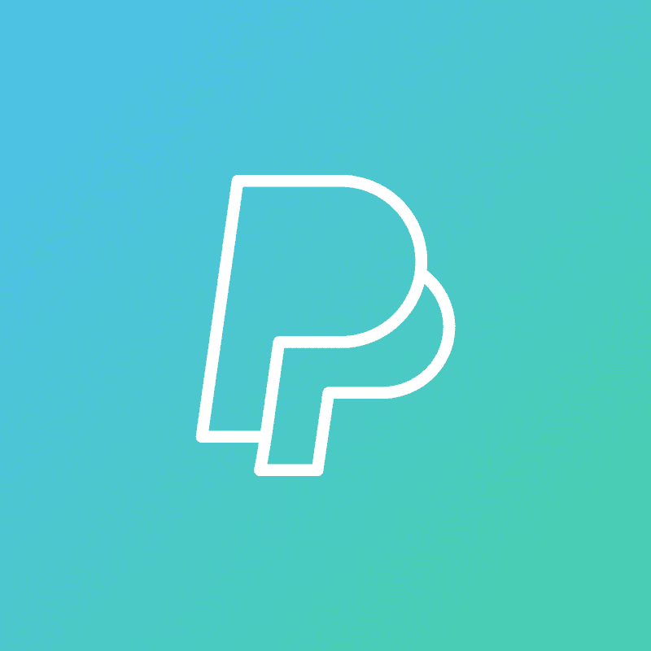
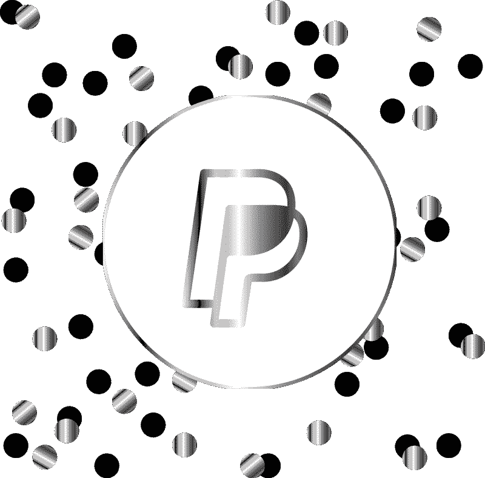
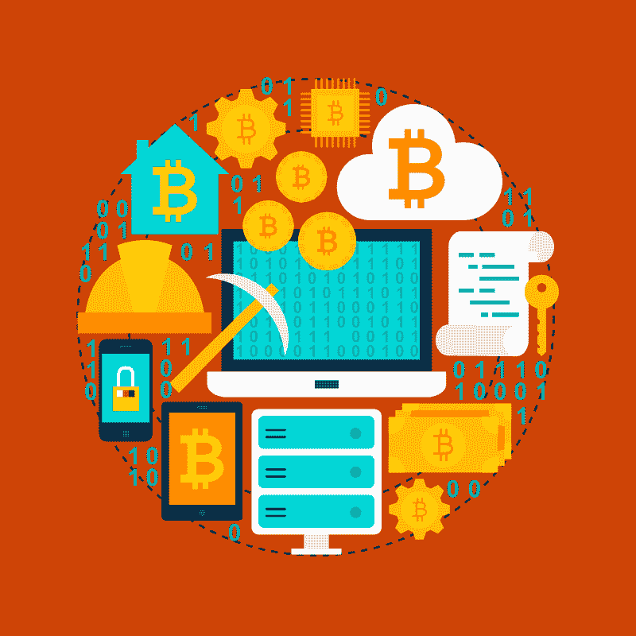

# PayPal 无止境的增长还能继续吗？—市场疯人院

> 原文：<https://medium.datadriveninvestor.com/can-paypals-endless-growth-continue-market-mad-house-6c415393f2e8?source=collection_archive---------6----------------------->

PayPal 无止境的增长正在加速，但这种增长是可持续的吗？PayPal(纳斯达克股票代码:PYPL) 活跃用户账户的数量在过去一年增长了 6000 万。

具体来说，Statista 估计 **PayPal (PYPL)** 在 2020 年第二季度拥有 2.86 亿用户账户。这个数字在 2020 年第二季度末增长到[3 . 46 亿。同样，Stockrow 估计 PayPal 的收入在截至 2020 年 6 月 30 日的季度增长了 22.21%。](https://marketmadhouse.com/can-paypals-endless-growth-continue/#:~:text=In%20the%20second%20quarter%20of,year-on-year%20growth.)

相比之下，在截至 2020 年 3 月 31 日的季度中，PayPal 的收入增长了 11.87%。同样，PayPal 的季度毛利从 2020 年 3 月 31 日的 18.89 亿美元增长到 3 个月后的 25.55 亿美元。

# PayPal 的增长获得了回报

PayPal 的增长正以收入增加的形式得到回报。例如，PayPal 的季度运营收入从 2020 年 3 月 31 日的 3.98 亿美元增长到三个月后的 9.51 亿美元。

引人注目的是，PayPal 的季度共同净收入从 2020 年 3 月 31 日的 8400 万美元增长到 2020 年 6 月 30 日的 15.3 亿美元。因此，贝宝正在成长，并从这种成长中赚了更多的钱。

例如，PayPal 的季度运营现金流从 2020 年 3 月 31 日的 15.04 亿美元增长到 2020 年 6 月 30 日的 23.83 亿美元。有趣的是，PayPal 的季度融资现金从 2020 年 3 月 31 日的 22.41 亿美元增长到三个月后的 62.78 亿美元。

相反，PayPal 的季度末现金流从 3 月份的 167.42 亿美元降至 2020 年 6 月 30 日的 12.62 亿美元。此外，PayPal 的现金和短期投资从 2020 年 3 月 31 日的 101.86 亿美元增长到 2020 年 6 月 30 日的 130.48 亿美元。

因此，PayPal 从其业务中产生了大量的现金。我喜欢 PayPal 的增长，因为它带来了现金。

# 贝宝更有价值

最后，最近几个月，PayPal 的价值大幅增长。事实上，PayPal 的总资产价值从 2020 年 3 月 31 日的 542.66 亿美元上升至 2020 年 6 月 30 日的 631.66 亿美元。

同样，2020 年 PayPal 的股价从 1 月 2 日的 110.75 美元上涨到 2020 年 9 月 1 日的 207.71 美元。令人震惊的是，PayPal 的市值从 2019 年 12 月 31 日的 1268.8 亿美元升至 2020 年 9 月 3 日的 2408.7 亿美元。

我认为市场先生在 2020 年 9 月 3 日对贝宝的准确定价是 205.66 美元。另外，我认为 **PayPal (PYPL)** 的安全边际很高。因此，我认为贝宝是一只好股票，然而，许多人会想知道贝宝的未来。

 [## 让你成为更好的营销者的 5 个思维技巧|数据驱动的投资者

### 凭借 20 多年围绕品牌营销的企业和小型企业咨询经验，我逐渐认识到…

www.datadriveninvestor.com](https://www.datadriveninvestor.com/2020/09/02/5-mindset-tips-to-make-you-a-better-marketer/) 

# PayPal 有什么前途？

PayPal 服务于一个不断增长的市场。例如，Statista 估计全球移动非接触式支付用户的数量从 2018 年的[4.4 亿增长到 2020 年的](https://www.statista.com/topics/982/mobile-payments/)7.6 亿。

可以预见的是， **PayPal(纳斯达克股票代码:PYPL)** 有很多竞争对手。这些竞争对手中最危险的是 **Square 的**现金应用。例如， *Ark Invest* 估计现金应用的月活跃用户数量从 2017 年的[700 万增长到 2019 年底的](https://marketmadhouse.com/can-paypals-endless-growth-continue/#:~:text=Square's%20Cash%20App%20seems%20to,at%20the%20end%20of%202019.)2400 万。

此外，我认为 Cash App 使 Square 能够开拓新的市场。例如， [Square 声称，现金应用比特币(BTC)](https://marketmadhouse.com/is-square-sq-making-money-from-bitcoin/) 的收入在 2020 年第二季度增长了 600%。如果 Square 能从比特币中获得那样的增长水平，如果 Square 增加更好的加密货币会发生什么；如**ether uem(ETH)**或 [stablecoins](https://geekcrunch.reviews/xdb-foundation-among-the-first-entrants-of-newly-formed-world-stablecoin-association/) 如[系绳(USDT)](https://marketmadhouse.com/why-tether-usdt-is-the-most-valuable-digital-currency/) **、**到现金 App。

# 为什么 PayPal 需要加密货币

值得注意的是， [CoinMarketCap](https://coinmarketcap.com/) 估计 **Tether (USDT)** 在 2020 年 9 月 1 日有 4663.7 万美元的 24 小时市场交易量。

相比之下，CoinMarketCap 当天给予**比特币(BTC)**2620.4 万美元的 24 小时市场成交量，以太坊(ETH)1794.5 万美元的 24 小时市场成交量。然而，CoinMarketCap 在 2020 年 9 月 1 日给出了**EOS(EOS)**24 小时的市场成交量为 231.6 万美元。

24 小时市场交易量是人们在特定一天在加密货币上花费的金额。CoinMarketCap 的数据显示，人们每天在缓慢、笨重、难以使用的加密货币上花费数千万美元。

我想知道，如果 Cash 应用推出一种快速、易用的加密货币，PayPal 的 Venmo 会发生什么？幸运的是，对于 PayPal 来说，今天的加密货币速度慢、笨重且难以使用。

# 为什么 PayPal 现在需要稳定的收入

例如，Blockchain.com 估计 2020 年 9 月 1 日比特币(BTC) 每秒处理 [5.167 笔交易。这意味着，如果一个比特币支付应用试图每秒处理五次以上的支付，它可能会崩溃。](https://coinmarketcap.com/)

因此，游戏接受比特币支付可能需要 20 或 30 分钟或 1 小时。我不认为玩家愿意等一个小时来购买游戏或武器。

因此，唯一保护 PayPal 免受加密货币影响的是加密货币的局限性。我认为 PayPal 现在需要开始试验加密货币，并开发自己的 stablecoin。

我相信[稳定币](https://marketmadhouse.com/stablecoins-versus-centralized-exchanges-who-drives-mass-adoption/)是加密货币的未来，因为稳定币可以用替代硬币在法定货币中快速支付。解释一下，稳定币是一种加密货币，它使用数字机器人以法定货币进行支付。因此，一个或现金应用[品牌的 stablecoin](https://marketmadhouse.com/can-digitalbits-make-money-from-branded-stablecoins/) 可能会对 PayPal 和 Venmo 构成危险的威胁。

# PayPal 的发展方向

我认为 PayPal 最大的优势之一是其进行明智收购的能力。最好的 PayPal 收购是点对点(P2P)解决方案 Venmo。

Statista 估计，Venmo 在 2020 年第二季度实现了 370 亿美元的总支付额。Venmo 的总支付量从 2020 年第二季度的 240 亿美元上升。其他值得注意的 PayPal 收购包括、Braintree、和 Tradera。

鉴于这段历史，我认为 PayPal 需要进行更多的收购，并加以利用。我认为 **PayPal (PYPL)** 需要考虑的一些收购包括:比特币基地，美国抖音， **Twitter(纽约证券交易所:TWTR)** ，，，以及 EOS 所有者。

具体来说，我认为比特币基地、泰瑟和 BlockOne 可以给贝宝带来加密货币区块链和稳定币的体验，而这正是贝宝所缺乏的。我相信抖音美国或 Twitter 可以给贝宝社交媒体杠杆。

# 为什么 PayPal 需要抖音

我认为贝宝需要一个社交媒体来对抗 Telegram 和脸书的支付努力。我推测，脸书的 Libra stablecoin 计划和 [WhatsApp Pay](https://tether.to/about-us/?__cf_chl_jschl_tk__=211d7d241e29efe8d29a73d5b86722c8ea39aa6e-1598987103-0-Aama6742x2oa_jALnKsvYzfBYFk9e7IMHe_Dqy98jdsz2JiSwGXiwZgGC4WYxCRk9FmTYbK5WcPR4Mzqu7BWlWH_LereWTJ45fLD2naFOrvVpe2B033lI-getW_QlwpWH2alyAWhkHdSOy2R7fzMz4aee1_x5bf5wog69dPaQ-rdbFC9wk7me4ZKhFb__CIowm-iFRsZXgOfpZFToFBtSJqlzWrY-aXnTg01yWelfrHn3pcdBYIrHmM-PVmRiLLi3hCY_AsnRfPHTvXqmLw4CESEI5mypqs53itEYfCuN5S8) 可能会让扎克伯格帝国成为 PayPal 的危险竞争对手。

收购抖音美国公司，该公司声称拥有 [1 亿美国会员](https://newsroom.tiktok.com/en-us/tiktok-files-lawsuit)，可以给 PayPal 提供对抗脸书所需的社交媒体。此外，PayPal 可以与**(纳斯达克代码:MSFT)** 和/或 [**沃尔玛(纽约证券交易所代码:WMT)**](https://marketmadhouse.com/why-walmart-wants-tiktok/) 合作收购美国抖音公司。

我认为把 Venmo 建成抖音可能是 PayPal 的一个明智之举。我认为 PayPal 的另一个明智之举是同时收购抖音和 Twitter。我认为贝宝需要抖音或另一个社交网络，因为我相信社交媒体是支付的未来。

PayPal 的另一个潜在威胁是沃尔玛旗下的抖音美国公司。我认为沃尔玛可以利用抖音来推动其支付应用 [Walmart Pay](https://marketmadhouse.com/walmart-pay-far-just-simple-payment-app/) 的大规模采用。同样，PayPal 可以利用抖音来推动 Venmo 的大规模采用。

# PayPal 是一项好的投资吗？

我认为 PayPal Holdings Inc .(纳斯达克股票代码:PYPL) 对普通人来说是一个很好的投资，因为它有很高的安全边际。此外，我认为市场先生在 2020 年 9 月 30 日将 PayPal 的价格定为 205.66 美元是正确的。

PayPal 的增长和现金使得 PYPL 成为一个安全的投资。如果你可以不分红，你需要调查贝宝，因为这个支付巨头是一个快速增长的赚钱机器。

*原载于 2020 年 9 月 3 日*[*https://marketmadhouse.com*](https://marketmadhouse.com/can-paypals-endless-growth-continue/)T22。

**访问专家视图—** [**订阅 DDI 英特尔**](https://datadriveninvestor.com/ddi-intel)