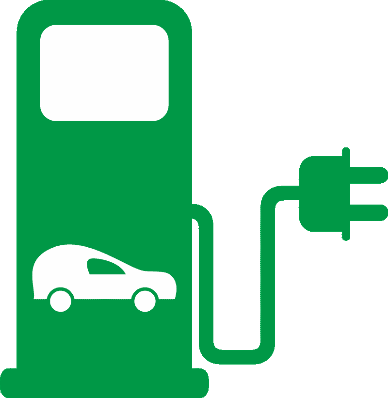
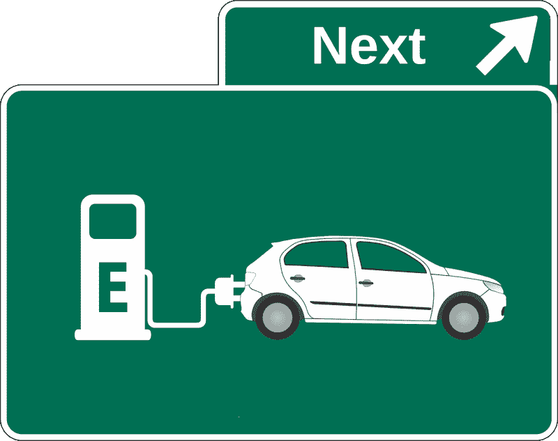
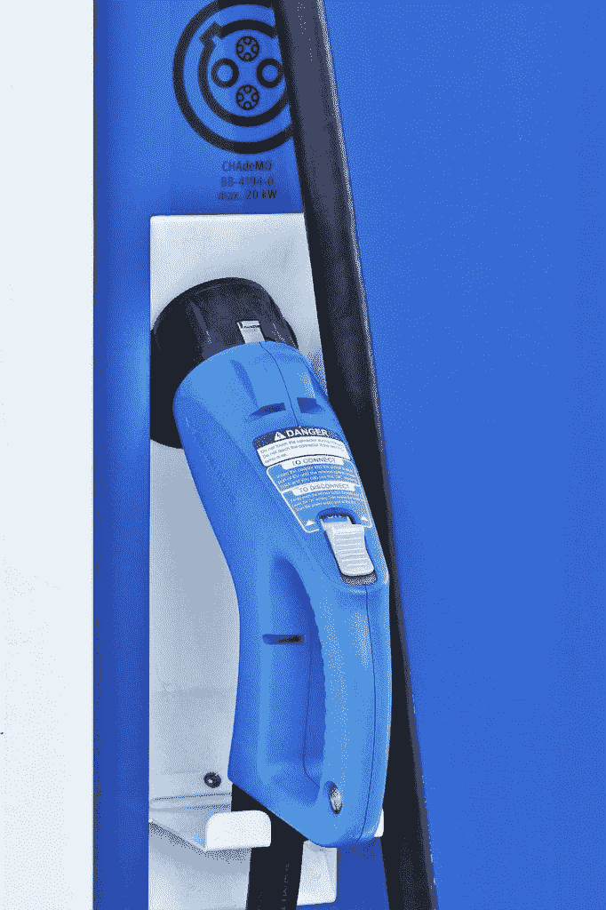
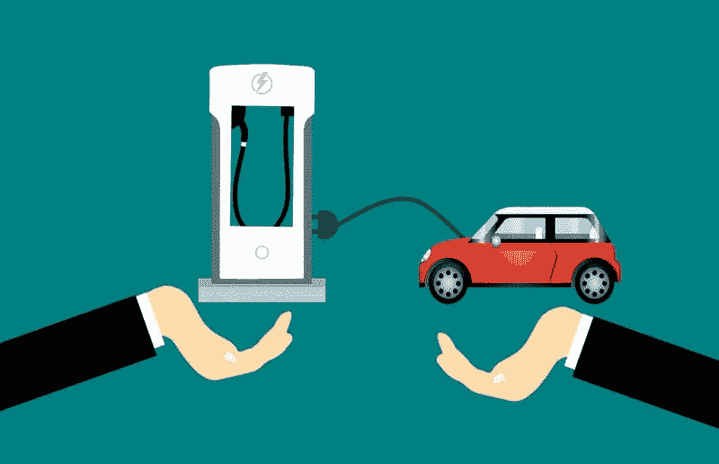
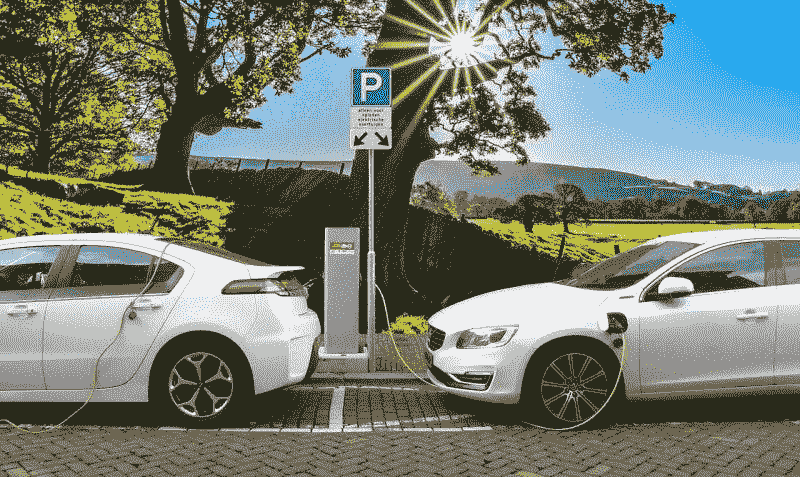

# QuantumScape 能从固态电池中赚钱吗？—市场疯人院

> 原文：<https://medium.datadriveninvestor.com/can-quantumscape-make-money-from-solid-state-batteries-market-mad-house-10ccf890530e?source=collection_archive---------4----------------------->

**quantum scape 公司(QS)** 可能成为最好的电动汽车股之一。

**QuantumScape (QS)** 声称拥有比汽车制造商目前使用的更好的锂电池。如果它的说法是真的，QuantumScape 的固态锂电池比传统电池更小，更安全，更简单，更快，密度更大。

QuantumScape 声称，[固态锂电池充电速度更快](https://www.quantumscape.com/)，续航里程更长。例如，QuantumScape 可以在 15 分钟内给电池充电。他们还声称固态电池将持续更长时间。

QuantumScape 电池设计的另一个优势是它没有有机隔膜。[锂离子电池中的有机隔膜会着火](https://www.businessinsider.com/why-tesla-cars-catch-on-fire-2019-4)，因为锂会产生热量。工程师声称 QuantumScape 的电池不容易着火，因为它们在较低的温度下运行。

人们希望 QuantumScape 的电池会更便宜，因为它更简单。更简单的设计和更少的部件可以降低电池的生产成本。更低的价格创造了更高的需求，因为更多的人买得起电池。

# 电动汽车生产蓬勃发展

投资者正在购买 QuantumScape 公司(纽约证券交易所:QS)的股票，因为电动汽车市场正在爆炸。

例如，Rivian 正在营销一款电动 [SUV、RIvian R1S、](https://marketmadhouse.com/home/dan/Documents%5Cx/%C2%A0SUV,%20the%20RIvian%20R1S,)和一款皮卡；Rivian R1T*凯利蓝皮书*报道。Rivian 展示了它将在 10 月份卖给亚马逊的电动货车。

The Verge 声称，亚马逊计划到 2022 年有 10，000 辆 Rivian 电动送货车上路，到 2030 年有 100，000 辆电动送货车投入使用。福特(纽约证券交易所代码:F) 向 Rivian 投资了 5 亿美元。

与此同时，亚马逊是 Rivian 另一轮 21.5 亿美元融资的一部分。据 The Verge 估计，自 2019 年初以来，Rivian 已经吸引了 53.5 亿美元的资金。

# 福特转向电动

重要的是，历史悠久的汽车制造商福特将很快推出两款全电动汽车。

E-Transit 是美国最畅销货车福特 Transit 的全电动版本。[野马马赫-E](https://www.ford.com/suvs/mach-e/?gnav=header-suvs-vhp) 是福特标志性肌肉车的电动版。我认为 Mach-E 可以成为电子警察和出租的模板。特别是，Mach-E 类似于许多美国警察驾驶的追捕车。

由 2，100 家福特电动汽车认证经销商和超过 13，500 个充电站组成的网络将支持 E-Transit 和 Mach-E。此外，还有 13 家公司可以改造 E-Transit，用于送货等特殊用途。

# 令人难以置信的福特 F 系列

此外，福特计划在 2022 年推出其广受欢迎的 F-150 皮卡的全电动版本[，电动汽车声称*。全电动的 F-150 可能是迄今为止最强大的福特皮卡，因为它将有双电机。*](https://insideevs.com/reviews/377328/ford-f150-electric-truck-details/)

我认为全电动 F-150 可能会成为电动汽车的主流，因为 F 系列皮卡是美国最受欢迎的汽车。福特在 2019 年销售了 [909，330 辆 F 系列](https://www.freep.com/story/money/cars/ford/2020/06/24/ford-f-150-super-duty-pickups-economic-impact/3246206001/)，在 2020 年第一季度销售了*186，562 辆 F 系列卡车，底特律自由新闻*估计。

《底特律自由报》声称，F 系列如此受欢迎，以销售额计算，它可能是美国第 80 大公司。福特声称，f 系列的收入超过了耐克、可口可乐、星巴克、特斯拉、万事达卡、网飞、维萨、优步、CapitalOne、Twitter 和西南航空。

我认为福特正在为电动 F 系列皮卡的全国推广奠定基础。超过 2，100 家经销商和超过 13，500 个充电站的网络可以支持电动皮卡。如果电动 F 系列像汽油和柴油 F 系列一样受欢迎，它可能会成为最受欢迎的电动汽车。

# 福特的电动汽车对 QuantumScape 来说可能是个好消息

这对 QuantumScape 来说可能是个好消息，因为福特将需要电池为所有这些皮卡提供动力。QuantumScape 可以通过向福特出售电池来赚钱。

福特可以购买 QuantumScape 的固态电池，因为它们密度更大，体积更小。使用更小的电池可以使福特制造出有更多货物空间的电动皮卡和货车，这将是一个卖点。

更小的电池也可以帮助福特使皮卡和货车更加强劲。我认为动力是电动汽车最有力的卖点之一。人们喜欢马力更大的汽车，并愿意为此支付额外的费用。

福特 F-150 的套索变种现在的价格约为 6 万美元。底特律自由报声称[福特无法生产足够多的 F-150](https://www.freep.com/story/money/cars/ford/2020/12/09/2021-ford-f-150-arrives-dealerships/6496598002/)来满足消费者的需求。

 [## 移动网络 O2 发布英国首个无人驾驶汽车实验室测试使用 5G 和…

### 随着时间的推移，技术越来越强大。我们不仅成功地登上了月球，我们现在…

www.datadriveninvestor.com](https://www.datadriveninvestor.com/2020/11/24/mobile-network-o2-launch-uks-first-driverless-car-lab-testing-driverless-cars-using-5g-and-satellite-technology/) 

# QuantumScape 与大众汽车合作

福特的电动计划对 **QuantumScape (QS)** 来说可能是个好消息，因为它们表明一家老牌汽车制造商对电动汽车是认真的。

市场先生相信电动汽车的潜力。2020 年，QuantumScape 的股价从 2020 年 8 月 14 日(IPO 后)的 4.40 美元上涨到 2020 年 12 月 22 日的 120.88 美元。2020 年 12 月 24 日，QuantumScape 的股价跌至 114.77 美元。

汽车公司分享了市场先生对 QuantumScape 的信任，世界上最大的汽车制造商[大众集团在 QuantumScape 投资了超过 3 亿美元](https://www.volkswagen-newsroom.com/en/press-releases/volkswagen-increases-stake-in-quantumscape-6136)，一份新闻稿声称。大众汽车公司计划成立一家合资企业，从事固态电池的工业级生产。

一份新闻稿称，大众和福特正在合作生产商用和电动汽车，包括货车。特别是，从 2023 年开始，福特和大众将基于大众的模块化电动驱动工具包打造一款新的电动汽车

此外，大众汽车计划于 2020 年在福特的 Ranger 平台上生产一款电动皮卡。除此之外，我认为福特和大众可以一起在欧洲销售 E-Transit。

因此，QuantumScape 可能拥有世界上最大和第六大汽车制造商的客户。Wheels.ca 估计大众汽车公司是世界上最大的汽车制造商，2019 年[年销量为 1080 万辆](https://www.wheels.ca/top-ten/these-are-ten-biggest-automakers-in-the-world/)。福特是第六大汽车制造商，2019 年年销量为 570 万辆。

# QuantumScape 能赚钱吗？

不幸的是，我不知道 QuantumScape (QS)是否赚钱。Stockrow 在 2020 年 12 月 24 日没有为 QuantumScape 提供财务数据。

因此，我不能推荐 QuantumScape，也不能说它不好，因为没有财务数据。然而，有两家与 QuantumScape 关系密切的优秀公司你可以投资。

首先是福特。【2020 年 12 月 24 日，市场先生仅支付 8.86 美元购买福特股票。截至 2020 年 9 月 30 日，[报告季度收入 375.01 亿美元](https://marketmadhouse.com/is-ford-f-the-best-way-to-invest-in-electric-vehicles/)，季度毛利 62.78 亿美元，季度营业收入 23.51 亿美元。

福特也是一家现金充裕的公司，在 2020 年 9 月 30 日拥有 448.31 亿美元的现金和短期投资。此外，福特支付 15₵的季度股息，直至 2020 年 1 月 29 日。

# 福特是最好的电动汽车股

我认为**福特汽车公司**是目前最好的电动汽车股票。福特汽车价格便宜，现金充裕，而且支付股息，它拥有地球上最有价值的汽车品牌之一 F 系列。

[**大众汽车公司(VOW。2020 年 12 月 24 日，DE)**](https://finance.yahoo.com/quote/VOW.DE/) 在欧洲交易所的交易价格为每股 169.70 美元。大众在 2019 年 12 月 31 日报告的年收入为 2154.20 亿美元，年度运营亏损为 211.94 亿美元，年度毛利为 119.30 亿美元。

大众也是一家现金充裕的公司，2019 年 12 月 31 日的运营现金流为 179.83 亿美元。不幸的是，自 2018 年 5 月 4 日支付 4.67 美元的年度股息以来，大众汽车一直没有支付股息。

我建议想投资电动汽车革命的人去调查福特。聪明的投资者会避开 QuantumScape，因为关于该公司的信息很少。

*原载于 2020 年 12 月 24 日 https://marketmadhouse.com***。**

## *访问专家视图— [订阅 DDI 英特尔](https://datadriveninvestor.com/ddi-intel)*