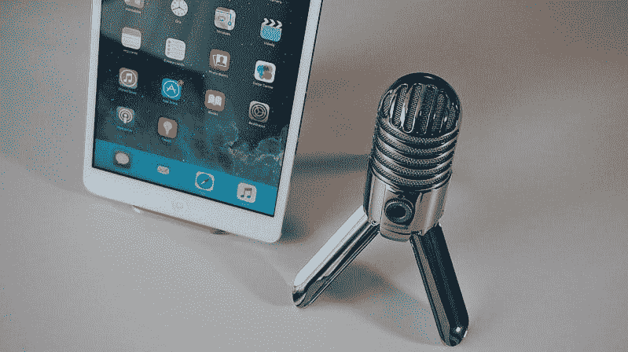

# 没有霍华德·斯特恩，天狼星 XM 能生存吗？—市场疯人院

> 原文：<https://medium.datadriveninvestor.com/can-sirius-xm-survive-without-howard-stern-market-mad-house-33144aa019c1?source=collection_archive---------8----------------------->

天狼星 XM 控股有限公司(NASDAQ: SIRI) 面临一个没有最大明星的未来；霍华德·斯特恩。

详细来说，斯特恩的天狼星合同将于今年结束，所有媒体之王没有新的天狼星协议。相反，天狼星和霍华德仍在商谈新合同，[的最后期限](https://deadline.com/2020/06/sirius-xm-ceo-james-meyer-howard-stern-contract-renewal-1202961399/)声称。

我怀疑斯特恩不会签署天狼星 XM 合同，直到他看到他是否能在其他地方得到更多的钱。斯特恩最有可能的目的地是**Spotify**。我认为斯特恩正在与 Spotify 交谈，因为媒体声称瑞典数字音频平台与乔·罗根签署了 1 亿美元的合同。

我认为播客之王罗根不是斯特恩的直接竞争对手。解释一下，罗根吸引了比斯特恩更年轻、更有智慧的观众。本质上，斯特恩是一个老式的音乐节目主持人，一个无线电波中快乐的恶作剧者。

相比之下，罗根是一个自作聪明的科技兄弟，也是一个自命不凡的综合格斗运动员。例如，当罗根在 F-bomb 之间与客人进行严肃的谈话时，斯特恩在一旁扮演小丑。

 [## 使用谷歌搜索趋势预测首次申请失业救济人数|数据驱动的投资者

### 几年来，我的重点一直是使用多种替代数据来预测宏观经济统计数据…

www.datadriveninvestor.com](https://www.datadriveninvestor.com/2020/03/25/using-google-search-trends-to-predict-initial-jobless-claims/) 

# 为什么斯特恩可以去 Spotify

我认为斯特恩可以去 Spotify，因为 Spotify 可以为他提供更多的观众。记住，霍华德是一个自大狂，他自称是所有媒体之王。因此，斯特恩想要尽可能多的观众。

**Sirius XM(纳斯达克股票代码:SIRI)** [声称](http://investor.siriusxm.com/investor-overview/press-releases/press-release-details/2020/SiriusXM-Beats-2019-Subscriber-Guidance-and-Issues-2020-Guida)其平台在 2020 年第四季度拥有 3490 万用户。相比之下， [Spotify 声称](https://adstudio.spotify.com/meet-your-audience)截至 2019 年 9 月 30 日，它拥有 2.48 亿月活跃用户。

因此，Spotify 可以为 Stern 提供 Sirius 无法提供的更多受众。因此，Spotify 可以通过类似罗根协议的交易吸引斯特恩加入其平台。

# 斯特恩会去哪里？

天狼星不是斯特恩唯一的潜在追求者。斯特恩的另一个潜在归宿是苹果公司(纳斯达克股票代码:AAPL)。 Statista [估计](#:~:text=Number of Apple Music subscribers worldwide 2015-2019&text=Estimates suggest that Apple Music,introduced at Apple's WWDC 2015.)苹果音乐在 2019 年 12 月拥有 6800 万用户，高于 2019 年 6 月的 6000 万。

与斯特恩签约可能有助于苹果从音乐领域转向语音音频节目(播客)。例如，苹果可以让 Stern 成为独家播客库的基石。苹果可以轻松满足斯特恩的薪资要求，因为它在 2020 年 3 月 31 日拥有 940.51 亿美元的现金和短期投资。

# 斯特恩会去网飞吗？

除了苹果，斯特恩的另一个潜在的家是**网飞(纳斯达克代码:NFLX)** 。从历史上看，网飞对音频没什么兴趣。

然而，Spotify 证明了你可以通过数字音频赚钱。Spotify 报告称，截至 2020 年 3 月 31 日的季度末现金流为 10.49 亿美元。因此，网飞可以通过音频赚钱。

如果网飞，或者迪士尼的 Hulu，想要进入播客业务，签下 Stern 可能是一个好的开始。给斯特恩一大笔薪水将会给其他潜在的播客超级巨星如大卫·查普尔、郑秀晶·鲍尔和塔克·卡尔森传递一个信息。

这条信息是“如果你想要自由和一个大的发薪日来我们的平台。”我认为提供播客对 Hulu、HBO Max、**亚马逊(NASDAQ: AMZN)** 或 Peacock 来说可能是一个明智之举。详细来说，网飞现在不提供播客。播客可以提供主要竞争对手缺乏的优质内容。

雇用斯特恩可能是亚马逊的一个明智之举。值得注意的是，亚马逊可以让 Alexa 成为霍华德·斯特恩的专属主页。

# 天狼星 XM 还买得起霍华德·斯特恩吗？

在目前的情况下，斯特恩对于小天狼星来说可能太贵了。这可能会威胁到天狼星 XM 的存在，因为斯特恩是它的明星吸引力。

Sirius XM 在 2020 年 3 月 31 日只有 4000 万美元的现金和短期投资。相比之下，同一天，网飞有 51.51 亿美元的现金和短期投资，亚马逊有 492.92 亿美元的现金和短期投资。然而，截至 2020 年 3 月 31 日，Spotify 只有 18.57 亿美元的现金和短期投资。

天狼星可能不会保持严厉，因为它的竞争对手能提供更多的钱和更多的观众。例如，Spotify、亚马逊、苹果、网飞，可能还有迪士尼之间对 Stern 的竞购战可能会让 Howard 对 Sirius XM 来说过于昂贵。在这种情况下，天狼星 XM 可能买不起任何主要的音频明星。

# 天狼星 XM 赚钱吗？

**Sirius XM(纳斯达克股票代码:SIRI)**2020 年 3 月 31 日报告的季度收入为 19.52 亿美元，低于 2019 年 12 月 31 日的 20.62 亿美元。

令人印象深刻的是，Sirius XM 在 2020 年 3 月 31 日报告的季度毛利为 11.02 亿美元，低于 2019 年 12 月 31 日的 11.46 亿美元。然而，天狼星的季度共同净收入从 2019 年 12 月 31 日的 2.43 亿美元上升到 2020 年 3 月 31 日的 2.93 亿美元。

因此，Sirius 赚了钱，而且它的收入还在增长。Stockrow [估计](https://stockrow.com/SIRI/financials/income/quarterly) Sirius XM 在截至 2020 年 3 月 31 日的季度收入增长率为 11.93%。相比之下，天狼星 XM 在 2019 年最后一个季度的增长率为 37.74%。

天狼星也产生现金。Sirius XM 报告 2020 年 3 月 31 日的季度运营现金流为 4.16 亿美元。该季度运营现金流低于 2019 年 12 月 31 日的 5.32 亿美元。

然而，Sirius XM 在 2020 年 3 月 31 日报告了 5200 万美元的季度末现金流。有趣的是，该期末现金流从 2019 年 12 月 31 日的 3000 万美元开始增长。

我怀疑 Sirius 的现金流很低，因为它必须支付巨额费用才能让霍华德·斯特恩等明星留在它的平台上。因此，Sirius XM 对网飞和 Spotify 等依靠明星效应销售订阅和广告的平台来说，可能是一个警告。这些平台产生的任何现金都可能直接流向明星和他或她的经纪人。

# 天狼星 XM 是好股票吗？

因此，Sirius XM 可以赚钱，也有增长的能力，但这是价值投资吗？

我认为 **Sirius XM(纳斯达克代码:SIRI)** 可能是一只糟糕的股票，因为市场先生在 2020 年 6 月 19 日支付了 5.96 美元。2020 年，Sirius XM 的股票从 2020 年 1 月 2 日的 5.74 美元上涨到 2020 年 6 月 19 日的 5.96 美元，再到 2020 年 6 月 23 日的 5.90 美元。2020 年，Sirius 在 2 月 21 日触及 7.24 美元的高点，但在 2020 年 3 月 20 日跌至 4.44 美元的低点。

因此，Sirius 很便宜，但我认为它的股价太低，投资者赚不到钱。另一方面，天狼星可能是一个很好的廉价股息股票。

# 天狼星 XM 是好的廉价分红股票吗？

天狼星在 2020 年 5 月 7 日支付了 1.33₵的季度股息。因此，在 2020 年 5 月 7 日，100 股 **Sirius (NASDAQ: SIRI)** 股票的所有者可以获得 1.33 美元的股息。

总体而言，Dividend.com[估计](#tm=3-ticker-best-div-capture&r=ES::DividendStock::Stock%23SIRI--NASDAQ&f_28=true&only=meta,data,thead) Sirius XM 在 2020 年 6 月 19 日和 6 月 22 日提供了 0.83%的远期股息收益率，23.55%的远期派息率，以及 9.1%的三年平均年股息增长率。Dividend.com 声称 Sirius XM 的股息已经连续三年增长。

因此，天狼星 XM 可能是一个很好的廉价股息股票。然而，我认为 Sirius XM 面临着残酷的生存竞争和昂贵的人才竞争，这可能会摧毁其业务。

# 天狼星 XM 有什么价值？

另一方面，Sirius XM 仍然拥有一个拥有 3490 万订户的平台，并有能力吸引霍华德·斯特恩等顶级明星。因此，Sirius XM 有一定的价值，但这种价值可能会在一夜之间消失。

鉴于这种情况，我认为 Sirius XM 生存的最佳机会可能是被一个更大的平台收购。例如，将 Sirius XM 出售给 Spotify。Spotify 可以用其 3490 万订户和拥有成熟观众的巨星收购 Sirius XM。

归根结底，天狼星 XM 有一点价值，这将很难维持。我建议投资者避开 **Sirius XM(纳斯达克代码:SIRI)** 因为它没什么价值。

*原载于 2020 年 6 月 23 日*[*【https://marketmadhouse.com】*](https://marketmadhouse.com/can-sirius-xm-survive-without-howard-stern/)*。*

**访问专家视图—** [**订阅 DDI 英特尔**](https://datadriveninvestor.com/ddi-intel)