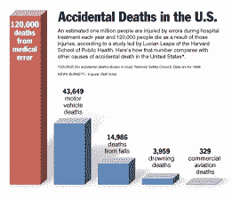
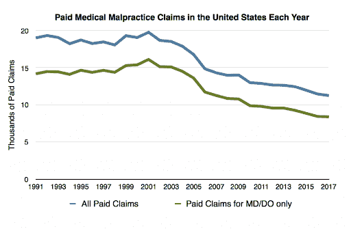
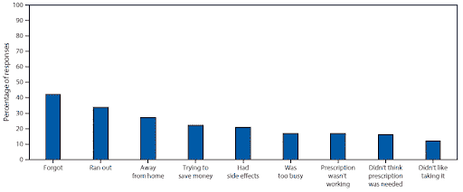

# 创业公司能扰乱医疗差错吗？

> 原文：<https://medium.datadriveninvestor.com/can-startups-disrupt-medical-errors-a4486690813f?source=collection_archive---------14----------------------->

primum non nocere——拉丁语意为“首先，不要伤害”,自希波克拉底誓言时代起就被医疗实践奉为神圣。不幸的是，犯错是人类状况的一部分，尽管有各种制衡，但医学也有相当一部分犯错。事实上，多年来，医疗错误被报道为美国第三大死亡原因，下图是约翰霍普金斯大学 2016 年的一项研究。

从这个角度来看，医疗差错比其他类型的意外死亡更为普遍:

根据作者 David Belk(医学博士)提供的数字，近年来医疗事故索赔的数量实际上一直在下降:

患者对他们的情况也没有帮助，不遵守药物治疗是 50%的病例的标志，估计每年花费 3000 亿美元，即几乎占年度医疗费用的 10%。2017 年 CDC 的一项研究显示了不合规的许多原因:

那么企业家是如何解决这些问题的呢？医疗差错显然是一个很大的话题，远远超出了一篇短文的范围，但是如果把它分成三个主要部分，每个部分都有一个案例研究，我们就可以说明其中的机会。

 [## 医疗保健的垂直化==初创公司的机会|数据驱动的投资者

### 诸如此类的头条新闻体现了美国医疗保健业的发展趋势——大公司越来越少。它已经发生了很多…

www.datadriveninvestor.com](https://www.datadriveninvestor.com/2020/10/18/verticalization-of-healthcare-opportunities-for-startups/) 

**1)沟通** — [RubiconMD](https://www.rubiconmd.com/) 有助于初级保健医生在进行实际转诊之前收集专家的初步意见。该公司节省了时间和金钱，并提高了患者满意度。最终结果可以说是改善了结果，毕竟在美国，沟通不畅是我们在需要时治疗不足、在不需要时治疗过度的一个重要原因。这里的关键是意见是众包的——最优秀的群体智慧。

**2)疲劳** — RecoverX 从音频(患者声音)和文本/图像(患者的 EHR)中自动生成诊断见解，帮助医生区分真正的问题和转移注意力的问题。想想在美国，由于诉讼文化，医疗专业人员如何生活在恐惧中，如何有越来越多的数据需要分析，以及如何花在患者身上的时间越来越少，人们可以体会 RecoverX 带来的价值。这里的关键是产品集成在工作流程中——疲劳的解决方案本身不应该导致疲劳。

**3)技术故障** — [铁健康](http://ferrumhealth.com/)使用人工智能来监控肿瘤学、血管和创伤患者旅程中的关键护理缺口。通过在整个医疗系统中执行的诊断成像和非结构化放射科医师报告的后台运行算法，它可以检测可能发生错误的研究。质量委员会审查标记的研究，确保出现错误时有第二种意见。正如许多其他人所写的那样，我们离通用人工智能还很远，更不用说我们的社会法规和人类期望了。这里的关键是，人工智能不是真理的最终仲裁者——它是一种提高医生表现的工具。

在 Tau Ventures，我们认为某种程度的错误是不可避免的，但看到初创公司取得真正的进展，我们感到鼓舞。我们的观点是，挑战是分散的，也是巨大的，因此需要许多专门的解决方案，并且存在多个赢家的空间。

*我是 RubiconMD 的小投资者；感谢* [*吉尔阿多*](https://www.linkedin.com/in/giladdo)*[*詹妮弗李*](https://www.linkedin.com/in/jennifer-may-lee-917869196/) *和* [*佩卢特兰*](https://www.linkedin.com/in/pelutran/) *的反馈。原载于“* [*”数据驱动投资人*](https://www.datadriveninvestor.com/2020/11/01/can-startups-disrupt-medical-errors/) *，“我很乐意在其他平台上辛迪加。我是 Tau Ventures*[*Tau Ventures*](https://www.linkedin.com/pulse/announcing-tau-ventures-amit-garg/)*的管理合伙人和联合创始人，在硅谷工作了 20 年，涉足企业、自己的初创公司和风险投资基金。这些都是专注于实践见解的有目的的短文(我称之为 GL；dr —良好的长度；确实读过)。我的许多文章都在*[*https://www . LinkedIn . com/in/am garg/detail/recent-activity/posts*](https://www.linkedin.com/in/amgarg/detail/recent-activity/posts/)*上，如果它们能让人们对某个话题产生足够的兴趣，从而进行更深入的探讨，我会感到非常兴奋。如果这篇文章有对你有用的见解，请对这篇文章和 Tau Ventures 的 LinkedIn 页面* *的* [*给予评论和/或赞，感谢你对我们工作的支持。这里表达的所有观点都是我自己的。*](https://www.linkedin.com/company/tauventures)*

## *访问专家视图— [订阅 DDI 英特尔](https://datadriveninvestor.com/ddi-intel)*