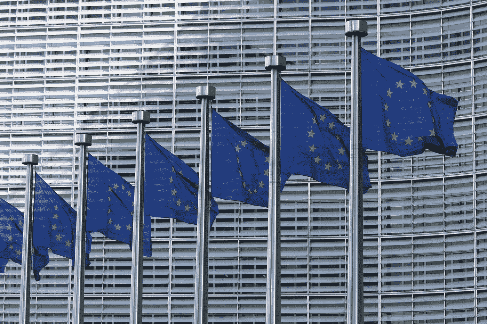
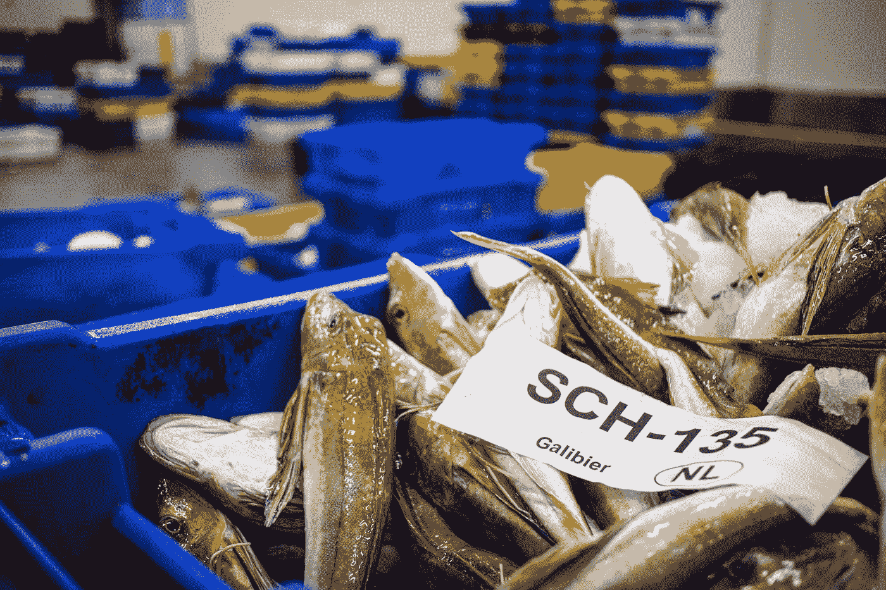

# 英国退出欧盟僵局能被打破吗？

> 原文：<https://medium.datadriveninvestor.com/can-the-brexit-deadlock-be-broken-b47ac84388?source=collection_archive---------11----------------------->

## 随着 EU-与英国的谈判陷入僵局，无协议的英国退出欧盟真的会出现吗？

Photo by [Guillaume Périgois](https://unsplash.com/@guillaumeperigois?utm_source=medium&utm_medium=referral) on [Unsplash](https://unsplash.com?utm_source=medium&utm_medium=referral)

鉴于 EU-与英国关系的复杂性，确保后英国退出欧盟时代的贸易协议将始终是一项艰巨的挑战。从制药到金融服务，作为谈判的一部分，双方不得不讨论一份详尽的行业清单，EU-与英国贸易的几乎每个方面都需要考虑在内。然而，在伦敦和布鲁塞尔之间进行了数月的激烈讨论后，双方现在发现自己陷入了僵局——这使得英国退出欧盟达成无协议的前景非常现实。

由于疫情，谈判最近几个月经常通过视频链接进行，双方对未来贸易协议缺乏进展越来越失望。僵局导致了一场政治指责游戏的爆发，双方都指责对方造成了僵局。欧盟首席谈判代表米歇尔·巴尼耶(Michel Barnier)本周表示，他对这一僵局“感到失望、担忧和惊讶”，并指责英国试图挑选欧盟单一市场的准入资格。

 [## 不是数据驱动的政治辩论投资者

### 《纽约时报》在 2020 年 6 月 3 日在线发表了阿肯色州参议员汤姆…

www.datadriveninvestor.com](https://www.datadriveninvestor.com/2020/06/08/the-political-debate-that-has-not-been/) 

在英国方面，英国谈判负责人大卫·弗罗斯特强调了他对他所认为的欧盟缺乏灵活性的失望——他上个月警告说，[提供的协议代表着](https://www.politicshome.com/news/article/uk-heading-for-nodeal-brexit-unless-boris-johnson-keeps-his-promises-michel-barnier-warns)“低质量的贸易协定，伴随着欧盟对我们法律和机构的前所未有的监督”。

鉴于任何一方都无法提供解决僵局的方法，欧盟和英国现在都发现自己站在贸易协议的悬崖边缘。由于任何协议都必须在新年前得到双方的批准，因此理想情况下最迟需要在 10 月前达成一致，一个无协议的英国退出欧盟现在变得越来越有可能出现，在这种情况下，英国将没有协议，并将按照世界贸易组织(WTO)的条款与欧盟进行贸易。

随着无协议英国退出欧盟的经济后果对欧盟和英国产生严重影响，最近的突破可能会挽救局面吗——或者无协议现在是新的政治现实吗？

**责备游戏**

谈判团队之间爆发的口水战，突显出双方对于 EU-与英国之间的贸易协议应该是什么样的看法不同。简而言之，欧盟希望达成一项涵盖 EU-与英国关系所有方面的全面贸易协议，但英国对这种安排持谨慎态度。

英国政府认为，一项全面的协议代表着试图锁定英国，使其即使在离开欧盟后也要遵守欧盟的规则和法规。更具体地说，僵局围绕着两个主要症结。

首先，国家援助和监管的作用。双方在国家援助方面应该制定什么规则的问题上发生了冲突——欧盟尤其担心英国政府可能会补贴某些行业，以在未来获得竞争优势。欧盟希望在英国退出欧盟会议之后确保一个公平的竞争环境，在这个环境中，任何一方都不能为了获得经济优势而大规模放松对本国产业的管制。因此，布鲁塞尔渴望看到英国在环境保护、工人权利和国家援助规则方面符合自己的规定。

谈到国家援助，新冠肺炎疫情无疑加剧了紧张局势。作为英国经济复苏的一部分，鲍里斯·约翰逊(Boris Johnson)希望利用政府资源保护就业，防止公司破产——欧洲大陆的欧洲国家也在这么做。此外，自 2019 年英国大选以来，首相还热情地支持他的“拉平”议程，在这场大选中，约翰逊将寻求通过政府支出对英格兰北部的部分地区进行大规模投资。

约翰逊先生本人[表示有兴趣](https://www.ft.com/content/67a72110-314d-11ea-9703-eea0cae3f0de)重塑英国政府干预和采购合同的现有规则，首相希望通过国家投资提高英国的竞争力。鉴于鲍里斯·约翰逊(Boris Johnson)对英国经济进行大规模投资的计划，布鲁塞尔方面越来越坚持认为，任何贸易协议都必须以确保两国经济之间的“公平竞争环境”为基础。

第二个症结也许不是经济问题，而是政治问题。乍一看，捕鱼似乎不是双方最紧迫的问题，但关于捕鱼权的争论使谈判陷入了僵局。简而言之，英国希望其渔民进入欧盟市场。作为回报，欧盟希望确保自己的渔船能够进入英国水域。

从表面上看，这似乎是一个简单的问题。毕竟，英国渔业仅占经济总量的 0.12%，仅雇佣了约 0.1%的劳动力。此外，英国的捕鱼业并不代表一个食品安全问题。总的来说，英国最终进口了超过 70%的鱼类，而超过 80%的国内渔业资源被出口到国外。

Photo by [Paul Einerhand](https://unsplash.com/@pauleinerhand?utm_source=medium&utm_medium=referral) on [Unsplash](https://unsplash.com?utm_source=medium&utm_medium=referral)

如果捕鱼不是一个经济问题，它肯定已经成为英国的一个政治问题。英国的渔业在 2016 年公投前的脱欧运动中占据显著地位，此后成为英国退出欧盟运动的象征性表达。《快报》等支持脱欧的报纸刊登了标题[暗示鲍里斯·约翰逊如果屈服于欧盟的捕鱼要求，就有“政治自杀”的风险](https://www.express.co.uk/news/politics/1325733/brexit-latest-news-today-eu-trade-talks-boris-johnson-brexit-eu-news)，奈杰尔·法拉奇本人[将死鱼倒入泰晤士河](https://news.sky.com/story/nigel-farage-dumps-dead-fish-in-thames-in-protest-over-brexit-transition-deal-11298733)作为 2018 年的一种抗议形式。

渔业准入方面持续的政治压力使得鲍里斯·约翰逊在这个问题上几乎没有回旋的余地，今年早些时候首相坚持认为“保持对英国渔业水域的控制”仍将是未来的优先事项。随着达成妥协的时间越来越少，渔业似乎很可能不会成为任何 EU--英国贸易协议的绊脚石。

**无交易即将出现？**

鉴于双方之间的僵局，许多人担心谈判最终会失败——导致英国在年底前无法达成协议。的确，布鲁塞尔和伦敦都有理由担忧。从英国的角度来看，鲍里斯·约翰逊没有太多的喘息空间。政治上，他几乎没有妥协的余地——他自己党内的左派对谈判采取强硬立场。已经为最坏的情况制定了应急计划，其中包括利用皇家海军拦截欧盟渔船(尽管政府很快淡化了这种情况实际发生的可能性)。

欧盟也发现自己没有进一步妥协的胃口。布鲁塞尔显然认为自己是两党中的强者，米歇尔·巴尼耶(Michel Barnier)早在 5 月份就强调，“我们受到的影响较小，因为我们 7%的出口流向英国，而英国 47%的出口流向欧盟”。欧盟热衷于保护其单一市场的完整性，并对英国在实际上不在欧盟内部的情况下获得欧盟成员资格优势的任何尝试持反对态度。

过渡期进一步延长的可能性之前已经浮出水面，这将使双方从悬崖边缘回来——至少在短期内。然而，鲍里斯·约翰逊非常明确地表示，他反对英国退出欧盟进程的任何形式的扩展。在 2019 年大选中以“完成英国退出欧盟”为平台赢得多数席位后，首相强烈反对任何进一步的拖延，并警告说，如果无法达成协议，英国愿意按照世界贸易组织的条款进行贸易。

那么，达成交易的可能性有多大？当然，欧盟和英国内部都有达成协议的意愿。同意一项协议，即使这意味着在一些更棘手的问题上妥协，如国家援助，对双方都有好处——贸易协议增加了经济稳定性，减少了企业的不确定性。尽管欧盟的地位更强，但欧洲大陆的国家[仍然会从无协议的英国退出欧盟中失去很多](https://www.ft.com/content/46087061-3fa7-4bd2-9f0d-d130fa58a409)，如果谈判失败，欧盟可能会失去一个亲密的战略盟友和一个主要的贸易伙伴。

尽管双方言辞激烈，但交易仍有可能达成。然而，时间很快就要过去了——欧盟和英国的妥协能力都受到其内部政治的严重制约。如果要达成协议，肯定会在当天晚些时候达成，最终结果可能会让一些更强硬的派系不高兴。

最终，在没有交易的情况下，任何一方都不会获胜——这很可能是 EU--英国协议最终能否通过的决定性因素。然而，我们很可能要等到最后一刻，直到英国退出欧盟僵局被打破。

**访问专家视图—** [**订阅 DDI 英特尔**](https://datadriveninvestor.com/ddi-intel)