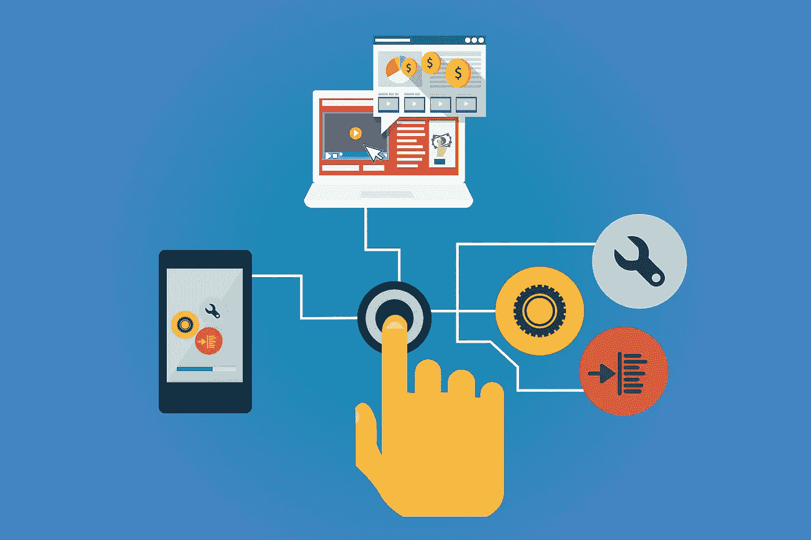

# 没有数字智能，企业还能生存吗？

> 原文：<https://medium.datadriveninvestor.com/can-the-enterprise-survive-without-digital-intelligence-105c0ef5895?source=collection_archive---------7----------------------->

Image by [Gerd Altmann](https://pixabay.com/users/geralt-9301/?utm_source=link-attribution&utm_medium=referral&utm_campaign=image&utm_content=3706562) from [Pixabay](https://pixabay.com/?utm_source=link-attribution&utm_medium=referral&utm_campaign=image&utm_content=3706562)

今天，大多数组织已经开始将他们的传统业务流程转变为全自动的数字交易…许多组织并没有看到他们所希望的结果。这是为什么呢？

如果你今天开始创业，你会把生意建立在当今最创新的技术基础上。这些将是人工智能支持的流程智能、营销自动化、内容智能解决方案、云部署、客户关系管理系统、企业资源规划系统，以及其他新的、创造性的和有效解决问题的解决方案。不幸的是，现有的公司没有这种奢侈，并且经常依赖旧的遗留系统，团队似乎总是慢节奏地采用新技术，并且通常不利于变革。我希望那不是你。

> 遗产，遗产，遗产！

当这些组织想要改进时，他们需要弄清楚他们的旧系统中发生了什么，以便可以推出新的系统和流程。不幸的是，这些组织中有许多都失败了，因为他们不了解哪些数据和内容推动了他们的运营。但这是为什么呢？问题是他们缺乏适当的工具来开始转型计划，以发现和分析数字解决方案和自动化将在哪里提供价值。因此，组织最终自动化了错误的过程。

 [## 不管准备好了没有，革命就在我们面前|数据驱动的投资者

### “对于技术如何影响我们的生活和重塑经济，我们必须形成全面的全球共识……

www.datadriveninvestor.com](https://www.datadriveninvestor.com/2019/02/12/ready-or-not-the-revolution-is-upon-us/) 

俗话说:

> “不懂的东西是不可能提高的”。

您是否在努力维持企业范围内成功且可持续的数字化转型？你不是一个人！麦肯锡发现，不到三分之一的组织变革能够成功提高公司的业绩并保持这些收益。

Photo by [Joshua Sortino](https://unsplash.com/@sortino?utm_source=medium&utm_medium=referral) on [Unsplash](https://unsplash.com?utm_source=medium&utm_medium=referral)

**真正的数字智能**意味着深入了解您的业务如何跨每个系统、数据仓库、办公室和地区运营。为了让数字化转型和流程改进真正影响客户体验和盈利能力，战略必须基于事实。它需要数字智能。这意味着您需要能够访问有关流程如何工作的实时信息，发现瓶颈在哪里以及数据是如何驱动它们的，然后确定以最有影响力的方式实施自动化的合适机会。这只有通过透明地查看推动业务的流程以及推动这些流程的大量数据才能实现。

**精通技术的客户正在推动数字化转型**

我们正在见证公司经营方式的前所未有的变化。创新型公司正在寻找新的富有想象力的方法，通过采用变革性的数字技术来改善他们的业务和客户互动。这使得许多公司努力在日益激烈的竞争环境中保持相关性。埃森哲前首席执行官 [Pierre Nanterme](https://en.wikipedia.org/wiki/Pierre_Nanterme) 称，这方面的证据是“数字是财富 500 强中超过一半的公司自 2000 年以来消失的主要原因。”这些公司不复存在，因为他们不知道如何利用新的创新技术和适应席卷每个行业的数字化转变。总体而言，他们未能提供高效和有效的客户体验，或者输给了那些更精简、更快速、更好和更具成本效益的客户。他们未能理解推动其组织发展的内容和流程，结果错过了执行更好的运营流程和更好地为客户服务的机会。

Image by [Mudassar Iqbal](https://pixabay.com/users/kreatikar-8562930/?utm_source=link-attribution&utm_medium=referral&utm_campaign=image&utm_content=3407232) from [Pixabay](https://pixabay.com/?utm_source=link-attribution&utm_medium=referral&utm_campaign=image&utm_content=3407232)

当组织考虑他们对其流程和驱动流程的内容的实际了解程度时，更好的客户体验和更具成本效益的运营是可能的。数字智能技术是解决这些数字问题的解决方案。

Process intelligence 技术可以分析您企业中的每个流程，并为您准备一个数字流程模型，以便您可以准确地了解您的流程是如何执行的。

我们不都在努力更好地理解一些事情吗？

*   自动化如何改善客户体验？
*   哪些员工最高效、最稳定？
*   您的瓶颈在哪里，它们如何影响合规性和服务交付？

通过完全透明，您可以提高整个公司的效率、质量和生产率。考虑改进每一个流程的能力—从端到端—不管用于存储数据的系统数量有多少。将来自任意数量 IT 系统的流程数据转换为可操作的洞察，可以更快、更低成本地做出更准确的自动化决策。

简而言之，它建立了你的实时互动过程数字孪生。它是业务运营和流程的虚拟模型。虚拟世界和现实世界的这种配对允许分析数据和监控系统，以在问题发生之前阻止问题，防止停机，开发新的机会，甚至提前计划:具有预测和预测未来结果的能力。

将对内容的洞察融入到流程中，使新的数字员工具备必要的技能和理解，从而做出明智的业务决策。您的组织的智能位于您的内容中，但您需要智商来驾驭它，需要在任何地方部署技术的能力，并与您的所有业务功能保持一致。

今天的应用程序从数字和物理来源产生了难以想象的大量内容。经过适当的消化、合并和分析后，这些丰富的数据可用于发现模式和见解，从而照亮通往更好的客户体验和新的运营效率的道路。

随着数字技术重塑并彻底重新定义全球各行业，公司正在对大规模变革努力进行测试，以便他们能够抓住最新技术趋势的好处并击败竞争对手。

组织面临着与数字劳动力的崛起相关的新挑战，需要关于如何成功将人工智能与人类智能结合的指导和解决方案。这里的关键是不仅要在未来几年生存下来，而且要茁壮成长，保持领先地位，并因为您的数字智能而成为行业领导者。你和你的组织会在哪里？

如果你喜欢这篇文章，你可能也会喜欢其他的阅读！：

 [## 2020 年十大技术技能

### 重塑和重新定义工作场所的技能

towardsdatascience.com](https://towardsdatascience.com/top-10-technology-skills-for-2020-9eac27e0839c)  [## 2020 年十大技术趋势

### 改变我们思考和工作方式的策略和事物

towardsdatascience.com](https://towardsdatascience.com/top-10-technology-trends-for-2020-4a179fdd53b1)  [## 数据挖掘的 5 个误区

### 什么是数据挖掘？

towardsdatascience.com](https://towardsdatascience.com/5-myths-of-data-mining-70d49f0abd18)  [## 你的团队中有数据英雄吗？

### 商业分析和商业智能

towardsdatascience.com](https://towardsdatascience.com/do-you-have-a-data-hero-on-your-team-e4ddc318926e) 

**RYAN M. RAIKER，MBA //** Ryan Raiker 是 [ABBYY](http://www.abbyy.com/) 的高级产品营销经理，ABBYY 是一家业务流程和数字智商解决方案的全球供应商。作为常驻的“流程智商人员”，Ryan 在流程发现、分析、监控和预测/说明性分析、业务战略管理、业务发展方面拥有专业知识，专注于帮助公司了解其业务流程并从中获得价值。他获得了威得恩大学的工商管理硕士学位、商业分析/信息学学士学位和运营管理辅修学位，并继续在该大学担任兼职教授。