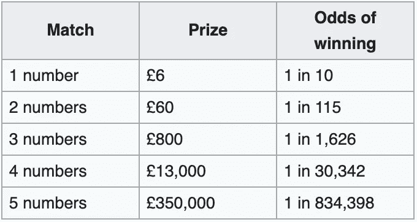
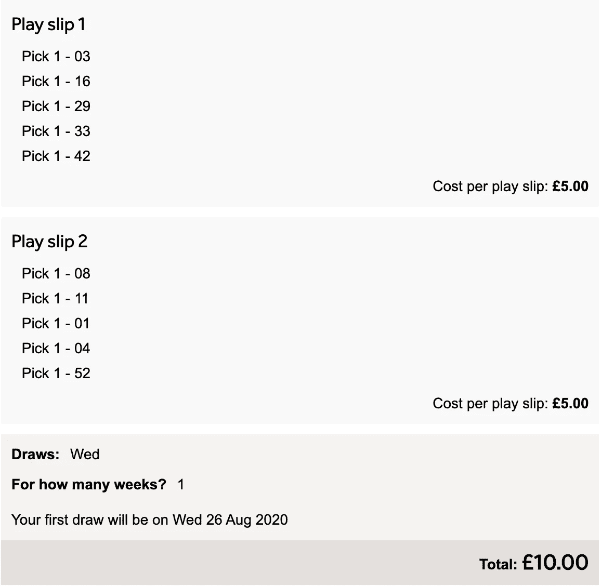
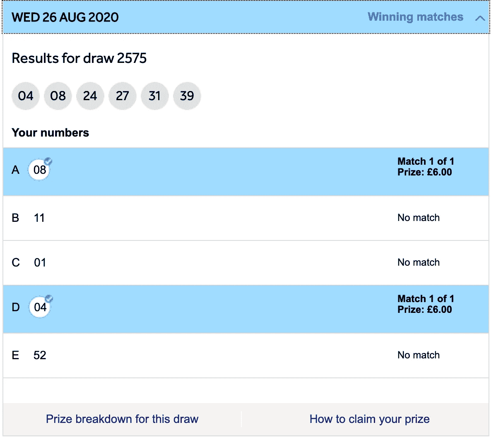
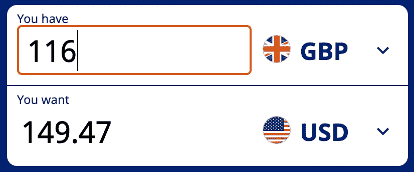
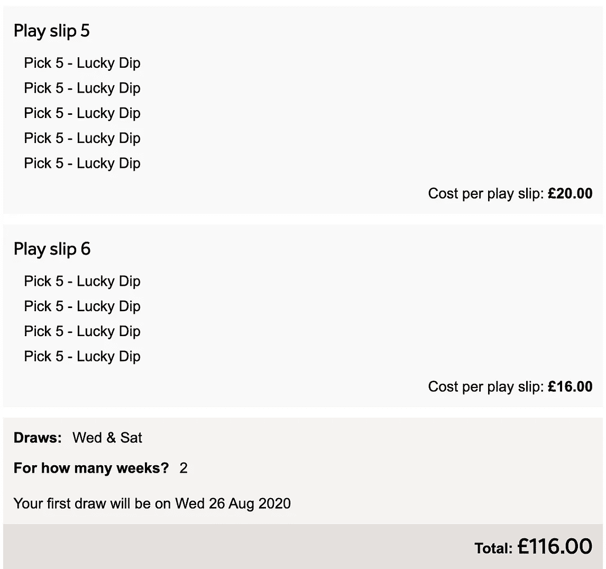
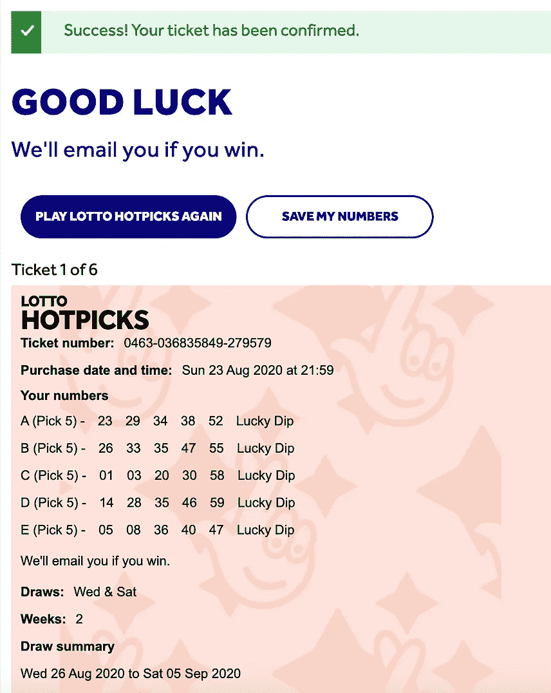

# 彩票可以玩吗？

> 原文：<https://medium.datadriveninvestor.com/can-the-lottery-be-gamed-49d6c2df38f5?source=collection_archive---------5----------------------->

## 我买了 150 美元的票来寻找答案

Photo by [dylan nolte](https://unsplash.com/@dylan_nolte?utm_source=medium&utm_medium=referral) on [Unsplash](https://unsplash.com?utm_source=medium&utm_medium=referral)

> 声明:每个国家的彩票抽奖都被视为赌博。请遵守您当地的法律，并理解所有赌博都需要负责任地进行。如果你觉得你可能有赌博的问题，请在这里寻求建议。

你死于飞机失事的可能性是中英国乐透头奖的 219 倍。然而[英国有 3200 万人定期玩彩票。](https://www.telegraph.co.uk/finance/personalfinance/11228989/National-Lottery-20-amazing-facts-from-20-years-of-creating-millionaires.html)

那么，有没有一种玩法可以让你的机会最大化？可以‘游戏化’吗？

即使你不在英国，这里的教训和故障仍然可以应用于你自己国家的同等抽签。

## 这篇文章的灵感来源

每天晚上我和我的女朋友带着狗在同一个地方散步，至少每周一次，我们开始谈论梦想中的房子、汽车、假期和用我们自己的避难所拯救所有的狗——所有这些都是由彩票中奖资助的。

我们都梦想赢得彩票头奖，但是奖金越大，可能性就越小。“谢谢你队长明显”我听到你哭了。

不是人不赢，是人赢。只是几率太小了，这使得数千万玩家无法赢得头奖。

所以我决定回顾一下所有[英国国家彩票](https://www.national-lottery.co.uk/)游戏的赔率，看看哪些游戏最有可能真的中奖。然后，我用自己的钱来检验这一点。

下面是事情的经过和我赢得的东西…

# 哪些游戏赔率最高？

基于[彩票的](https://www.national-lottery.co.uk/games/lotto?icid=-:mm:-:mdg:lo:dbg:pl:co)网站，以下是每场官方游戏的赔率:

*   乐透头奖——45，057，474 分之一
*   欧洲百万大奖——1/139，838，160
*   终身大奖——15，339，390 分之一
*   Thunderball 最高奖——8060598 分之一
*   热门精选头奖—834，398 中的 1

赔率最低时，热门选择给你最好的获胜机会。

> 事实上，根据票价的差异进行调整后，你赢得热门彩票头奖的可能性几乎是标准乐透头奖的 27 倍。

赔率增加了 27 倍，您预计奖金会增加 27 倍(945 万美元/1230 万美元)。然而，最近 [10 场游戏](https://www.national-lottery.co.uk/results/lotto/draw-history)的平均乐透头奖是 5，230，686.60 英镑——或者大约 680 万美元。大约是它应该有的一半。

这意味着从数学上来说，玩乐透不如玩热门选股。

> 欧洲百万游戏更糟糕，当调整票价差异时，赢得头奖的难度是热门彩票的 67 倍。

 [## 这么说一家大型风投基金正在投资你的初创公司？4 实际考虑|数据驱动的投资者

### 首先，恭喜你。融资总是需要努力的，一个大的风险投资基金当然是一个大的…

www.datadriveninvestor.com](https://www.datadriveninvestor.com/2020/08/09/so-a-big-vc-fund-is-investing-in-your-startup-4-practical-considerations/) 

# 我们有了游戏，接下来呢？

知道热门人选在游戏中有最好的赔率，很明显这是唯一值得关注的。

Screenshot of lotto Hot Picks odds. Source: [Wikipedia](https://en.wikipedia.org/wiki/National_Lottery_(United_Kingdom))

首先，我通过在 2020 年 8 月 26 日星期三购买 10 张彩票来测试 1/10 的赔率。

Screenshot of Hot Picks ticket by [Geraint Clarke](https://medium.com/u/5467d3aef1ca?source=post_page-----49d6c2df38f5--------------------------------)

我随机选了 10 个号码。期望，根据赔率，赢得 6。

我的实际赢款 = 12(这是从一点点运气和更好的赔率中获利 2 英镑。*证明如下……*

Screenshot of two winning numbers by [Geraint Clarke](https://medium.com/u/5467d3aef1ca?source=post_page-----49d6c2df38f5--------------------------------)

# 赌博永远不会有商业意义

现在是我打破你幻想的时候了。赌博永远不会有商业意义。这些人不傻。庄家总是赢。所以他们依靠大多数人赔钱来产生利润。

最大的收获是玩赔率。如果你真的赌博，要确保胜算很大。如果你赢了，这可能意味着小得多的奖金，但任何高于你的赌注的东西都是利润。

这可能没有那么迷人，但我的 2 美元利润比我点击按钮前多了 3-4 美元。老实说，这超过了我在标准储蓄账户中获得的回报。

# 加大赌注

我想测试更大的数量。显然，我怎么强调都不为过，你应该只赌你能放心输掉的东西，所以我很乐意用 150 美元，或 116 美元(以我的当地货币计算)来冒险。

这个游戏的上限实际上是 120 英镑，所以我不可能花更多的钱，即使我想。

Conversion from GBP into USD. Source: [Xe.com](https://www.xe.com/)

在赔率最低的游戏中，150 美元可以为我购买 116 张赔率最高的彩票，也就是 5 个热门号码。获胜的几率是 834398 分之一。

从统计数据来看，要想确保获胜，我需要再这样玩 7192 次。

Screenshots of ticket purchases by [Geraint Clarke](https://medium.com/u/5467d3aef1ca?source=post_page-----49d6c2df38f5--------------------------------)

## **当然，结果是输了**

十分之一的赔率要有利得多，让我一下子赢了两次。

然而，将几率提高了 83，000 倍，几乎可以肯定我的钱会没了。

毫不奇怪，赌博带来的改变生活的乐趣几乎总是伴随着毁灭性的损失。

# 你的钱有什么更好的用途？

以 1/10 的赔率玩这个单位数游戏，你预计每周两次游戏会让你在一整年中获得 62.40 英镑的奖金。净亏损 40%。

然而，通过投资而不是赌博，你可能会有更好的机会。标准普尔 500 的平均年化收益率为 [9.8%](https://www.cnbc.com/2017/06/18/the-sp-500-has-already-met-its-average-return-for-a-full-year.html#:~:text=The%20average%20annualized%20total%20return,90%20years%20is%209.8%20percent.) 。

同样的钱，在标准普尔 500 的花费可能会从 104 英镑增长到 114.20 英镑——净收益 10.20 英镑。大约是 13 美元。

房地产也是如此。我刚刚以 43，000 英镑(55，000 美元)的利润卖掉了我的房子，距离我第一次购买它只有两年时间。21.8%的投资收益。击败赌博和指数基金投资策略。

# 这里的教训是什么？

如果你要赌一把，确保你在权衡你的赌注和更有利的风险，即使最终的奖励没有那么有吸引力。

你更有可能赢得 1/10 的彩票游戏，或者正确选择 1/8 的赛马结果。随着时间的推移，累积的奖金将大大超过玩高赌注游戏的损失。

然而，通过选择不赌博而投资，你就不太可能遭遇统计上的损失，或者可以分散风险。

彩票非常有趣，但从数学上来说，它是不可战胜的。你可以一直走运，也可以成为其他 45，057，473 名每周都没有中奖的人中的一员。

通过投资多样化的资产组合，你将能够用更有可能的长期收益来抵消赌博的短期损失。

## 获得专家视图— [订阅 DDI 英特尔](https://datadriveninvestor.com/ddi-intel)