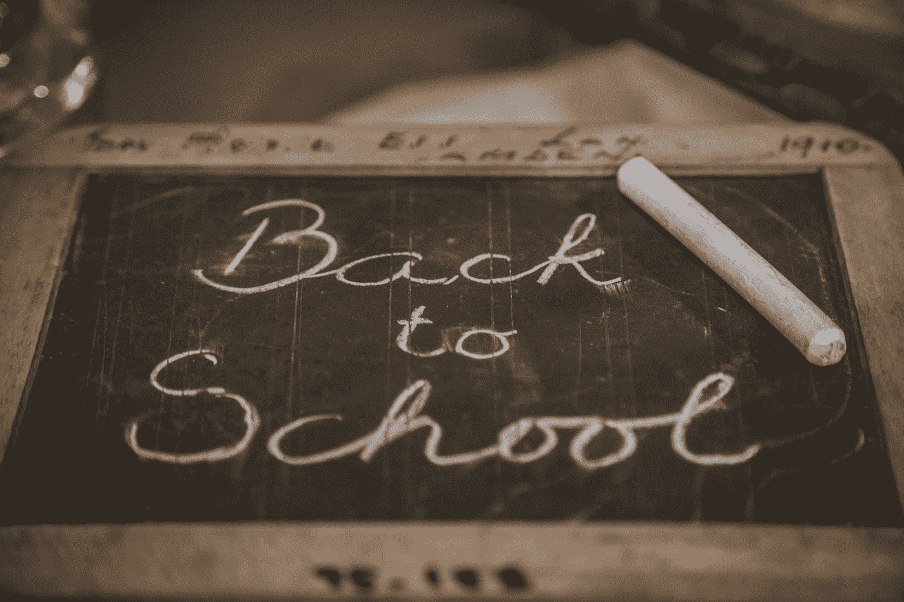
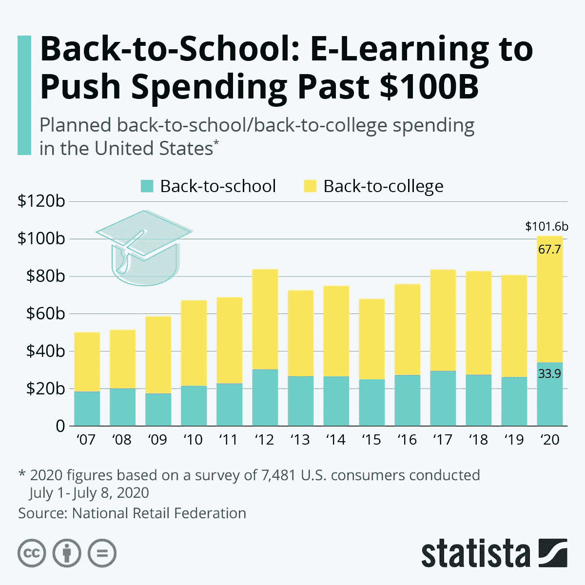

# 疫情能给公司带来积极的一面吗？

> 原文：<https://medium.datadriveninvestor.com/can-there-be-a-positive-side-to-the-pandemic-for-companies-d6343e56990f?source=collection_archive---------29----------------------->

## 对于零售商和其他展望未来的公司来说，在冠状病毒爆发期间的返校销售季创下纪录意味着什么

Photo by [Deleece Cook](https://unsplash.com/@deleece?utm_source=medium&utm_medium=referral) on [Unsplash](https://unsplash.com?utm_source=medium&utm_medium=referral)

在冠状病毒的不确定性中，赢家——也许是唯一的赢家——可能是学生在线学习所需的所有小工具的卖家。随着疫情的到来，这对于你的公司来说意味着什么——为疫情的影响做好准备可以吗？

Photo by [Chalo Garcia](https://unsplash.com/@photosbychalo?utm_source=medium&utm_medium=referral) on [Unsplash](https://unsplash.com?utm_source=medium&utm_medium=referral)

# 概观

在商业中，无论聚会是在大公司的豪华会议室，还是在小企业主可能举行会议的小后台办公室，谈论对人们来说不好的事件和条件*有时真的不好*——实际上可能对你的企业有益，这种感觉从来都不正确！然而，我们知道，对于许多零售商和许多产品线来说，这绝对是*的情况。在大多数情况下，这样的事件是非常可预测的，尽管天气事件的确切位置可能不可知。*

Photo by [NASA](https://unsplash.com/@nasa?utm_source=medium&utm_medium=referral) on [Unsplash](https://unsplash.com?utm_source=medium&utm_medium=referral)

例如，每年当飓风威胁沿海地区时，我们都会看到杂货店里排起长队，人们试图储备瓶装水和容易准备的食物来抵御风暴。

风暴过后，像 Lowes 和 Home Depot 这样的家居装修商店知道，就像他们在风暴前忙着向准备应对飓风的人们出售电池和胶合板等物品一样，他们将在飓风过后向进行风暴相关维修的个人和承包商出售大量建筑材料和用品。

因此，无论我们谈论的是天气还是每年的感冒和流感季节等最终可预测的事情，特定产品类别的零售商和供应商都知道，从更大的环境中发生的“事情”来看，特定月份的销售将会出现峰值——对他们的供应链造成*和*压力。他们可以为这些事件制定计划。他们可以与供应商合作，在需求高峰期增加库存。当“事情”发生并引发顾客激增时，他们可以培训员工修改他们的程序，以处理他们商店中的额外流量，这些顾客通常会惊慌失措地找到他们的“事情”来对抗正在发生的“事情”。

Photo by [Fusion Medical Animation](https://unsplash.com/@fusion_medical_animation?utm_source=medium&utm_medium=referral) on [Unsplash](https://unsplash.com?utm_source=medium&utm_medium=referral)

然而，现在我们有了一些来自威胁图表雷达之外的东西，不仅是对最大的公司，而是对我们所有人(嗯，除了流行病学家说“我试图告诉你们所有人！”)—一个疫情。是的，一个多世纪以来从未在全球范围内发生过的事情发生了，冠状病毒的影响已经对我们生活的几乎每个方面都产生了深远的影响。是的，虽然我们中的许多人[觉得疫情](https://www.sciencealert.com/it-s-okay-to-feel-lonely-right-now-here-s-how-to-recognise-the-symptoms)已经“完了”，但我们对新冠肺炎却一点也不厌倦。事实上，[许多公共卫生专家警告说](https://www.globalhealthnow.org/2020-02/coronavirus-expert-reality-check)，我们真的只是处于疾病的早期阶段。

是的，我们已经看到零售商和公司拥有我们所有人都需要的产品——或者更正确地说是*认为*我们需要的——来应对冠状病毒的威胁，有时却难以满足消费者的需求。现在回想起来可能有点可笑，但还记得人们在准备三月份自我隔离时对必需品的抢购吗？

随着疫情疫情的发展，消费者对洗手液、消毒湿巾，是的，还有口罩等物品的需求仍在持续，这是很容易“预测”的，但冠状病毒的爆发也创造了其他，嗯，没有其他方式可以说，但在某些产品类别中，许多零售商和供应商有“更大的销售机会”。正如我们已经看到的，随着人们出于对外出的谨慎，尤其是不愿意去餐馆吃饭，更多地在家做饭，网上食品杂货销售和做饭工具的需求迅速增加…

…随着时间一周周、一月月地过去，在我们共同的新冠肺炎体验中，零售商已经有了— *和*更多独特的机会。其中一个不幸的(*但*对一些人来说是幸运的)“机会”是冠状病毒对以前非常可预测的年度事件零售商返校季的惊人影响。简而言之，对于返校销售来说，疫情一直很好——非常好——因为家长们不仅急于购买“正常”的返校物品，还购买能让他们的学生——从小学到中学再到大学——更好地应对虚拟学习需求的设备。简而言之，对于零售商和许多科技公司来说，这是继疫情之后的又一个返校季。

Photo by [Jess Bailey](https://unsplash.com/@jessbaileydesigns?utm_source=medium&utm_medium=referral) on [Unsplash](https://unsplash.com?utm_source=medium&utm_medium=referral)

# 2020 年重返校园购物:一个全新的游戏

今年的返校季对零售商来说到底有多大？国家零售联盟最近的一份报告显示，即使在史无前例的经济衰退中，家长们在返校商品上的花费也比以往任何时候都多，主要是因为他们为所有学生不确定的学年所购买的东西与常规的、疫情时代之前的时代大不相同。

Photo by [visuals](https://unsplash.com/@visuals?utm_source=medium&utm_medium=referral) on [Unsplash](https://unsplash.com?utm_source=medium&utm_medium=referral)

是什么推动了返校支出的增长？一个字: *Tech！*这是因为，根据 NRF 对全国 7600 个返校购物家庭的调查显示，大约四分之三的学生家长——从幼儿园小朋友到大学生——不希望整个学年都有面对面的课程(用今天的教育行话来说就是 F2F)。因此，家长们已经在技术设备和配件上投入大量资金，以使他们的孩子能够更好地处理虚拟学习。他们的报告标题抓住了一切，因为 NRF 将其命名为“[冠状病毒可能推动返校支出达到创纪录水平，因为不确定的家庭准备在家学习](https://nrf.com/media-center/press-releases/coronavirus-could-push-back-school-spending-record-level-uncertain)

> “无论以何种标准衡量，这都是前所未有的一年，充满了巨大的不确定性，包括学生们今年秋天将如何接受教育，无论他们是在幼儿园还是在大学。大多数父母不知道他们的孩子会坐在教室里还是在餐厅的电脑前，或者两者兼而有之。但他们确实知道教育的价值，并在不确定性和未知性中航行，以便学生做好准备。”
> 
> *—马修·谢伊，美国零售联合会主席兼首席执行官*

总的来说，美国零售联合会估计，今年返校消费将首次超过 1000 亿美元，打破 2012 年创下的购物季记录(*见图 1:返校消费总额，2007-2020，低于*)。总体而言，今年返校季，中小学儿童的父母预计将花费 339 亿美元，高于 2019 年的 262 亿美元，同比增长近 30% (29.4%)！同样，大学生家长(加上学生自己的支出)今年预计将支出 677 亿美元——比去年返校大学支出总额 545 亿美元增长 24.2%。总体而言，今年从 K-12 到大学返校的总支出预计将首次突破 1000 亿美元大关，1016 亿美元的总额将比 2019 年的 807 亿美元增加近 200 亿美元——一年的增幅略低于 26% (25.9%)！

**图 1:2007-2020 年返校总支出**

**Source:** [Statista](https://www.statista.com/), August 2020 ([https://www.statista.com/chart/15211/total-expected-back-to-school-or-college-spending/](https://www.statista.com/chart/15211/total-expected-back-to-school-or-college-spending/)); Used with permission.

那么，NRF 的发现是如何在每个家庭的基础上分解的呢？首先，让我们从去年为 K-12 学生和大学生的父母在每个家庭上的花费创造新的记录水平的背景开始！对于中小学生的家长来说，今年中小学生家长的预计平均家庭支出预计将达到 789.49 美元，比 2019 年的创纪录水平增长 13.31%，2019 年学龄儿童的平均家庭支出为 696.70 美元(*见图 2:计划返校支出，2007-2020，低于*)。

**图 2:2007-2020 年返校计划支出**

**Source:** National Retail Federation, August 2020 ([https://nrf.com/media-center/press-releases/coronavirus-could-push-back-school-spending-record-level-uncertain](https://nrf.com/media-center/press-releases/coronavirus-could-push-back-school-spending-record-level-uncertain)); Used with Permission.

对于大学生的父母来说，每个家庭在返校物品上的支出总额将首次超过 1000 美元(平均每个家庭 1059.20 美元)。因此，与去年相比，每户返校支出增加了 80 多美元，高于去年平均每户花费在大学生身上的 976.78 美元，再次表明每户比去年创纪录的支出水平增加了 8.44%*(见图 3:2007-2020 年计划返校支出，见下文)*。

**图 3:2007-2020 年返校计划支出**

**Source:** National Retail Federation, August 2020 ([https://nrf.com/media-center/press-releases/coronavirus-could-push-back-school-spending-record-level-uncertain](https://nrf.com/media-center/press-releases/coronavirus-could-push-back-school-spending-record-level-uncertain)); Used with Permission.

根据全国零售联合会的报告，推动返校支出增长的是所有父母的信念，即即使他们孩子的学校教育可能以一些面对面的方式开始，他们学年的全部或大部分时间将用于以这种或那种形式进行虚拟学习。除了中小学生返校购买主要办公用品和各年龄段学生购买服装之外，每个家庭支出的增加主要集中在可用于帮助学生参与在线学习的科技产品上。事实上，NRF 的数据显示，在返校期间，K-12 学生(2020 年为 63%，2019 年为 54%)和大学生(2020 年为 60%，2019 年为 53%)的父母购买和/或打算购买电脑和其他电子产品的人数大幅增加。从下面的图 4 ( *消费者计划购买的主要物品，因为电子学习*)中可以看出，家长在该领域所有年龄段学生的支出都集中在移动设备(笔记本电脑和平板电脑)上，以及帮助孩子进行虚拟学习所需的各种电子和物理附件上。

**图 4:消费者因网络学习而计划购买的主要商品**

**Source:** National Retail Federation, August 2020 ([https://nrf.com/media-center/press-releases/coronavirus-could-push-back-school-spending-record-level-uncertain](https://nrf.com/media-center/press-releases/coronavirus-could-push-back-school-spending-record-level-uncertain)); Used with Permission.

总体而言，小学生和中学生的家长今年计划在每个家庭的电脑和电子产品上花费 274.44 美元，比去年 203.44 美元的平均水平高出约 35% (34.9%)。同样，大学生的父母也被发现在电子设备上花费更多，这种支出从 2019 年的每户 234.69 美元增加到这个返校季的平均 261.52 美元，增长了 11.43%。

Photo by [Isaac Smith](https://unsplash.com/@isaacmsmith?utm_source=medium&utm_medium=referral) on [Unsplash](https://unsplash.com?utm_source=medium&utm_medium=referral)

# 分析

总而言之，全国零售联合会的报告不仅戏剧性地显示了疫情冠状病毒如何以可论证的方式影响返校消费。它接着指出，就像今天的所有零售一样，消费者越来越多地在网上购物，并利用一些新的零售交付模式(BOPIS、路边取货等)。)作为零售商店内购物和更传统的电子商务渠道的替代选择。因此，问题变成了，随着返校季的过去，日历转向秋季——甚至展望假期，随着疫情(不幸的是)似乎没有减弱，预计只有在大肆宣传的[“第二波”](https://thehill.com/policy/healthcare/493973-cdc-director-warns-second-wave-of-coronavirus-might-be-more-difficult)在今年晚些时候来袭时，返校消费的转变对更大的零售图景意味着什么？

作为一名管理顾问和教授，对我来说，这是真正有趣的一点。当然，我们可以分析发生了什么。是的，对于 2020 年的零售业来说，返校季无疑是一个罕见的亮点，否则这一年将相当悲惨。当然，这种返校“反弹”的主要受益者将再次是大公司中的最大者，即[沃尔玛](https://www.walmart.com/)、[塔吉特](https://www.target.com/)、[亚马逊](https://www.amazon.com/)、[好市多](https://www.costco.com/)等公司的“通常嫌疑人”。，以及那些为家长和学生寻找更好地为在线学习做准备的技术设备的现成来源的大盒子商店，如 [Best Buy](https://www.bestbuy.com/) 和 [Office Depot](https://www.officedepot.com/) 。但更重要的问题是:尽管我们都希望明天就能看到疫苗以及更有效的治疗方法，但现实是，新冠肺炎将伴随我们好几个月，也许是几年。

因此，无论是最大的公司还是小型零售商，管理层都有责任开始从这些方面考虑问题。是的，*日历上会有*机会，就像返校季一样，甚至可能变得*可预测*它们可能会呈现非常真实的——或许非常大的——机会，你可以从今天开始定位你的公司。例如，随着感恩节和圣诞节的临近，人们不得不考虑冠状病毒威胁将如何影响零售环境，影响家庭如何“聚集”在一起庆祝节日，以及这对他们今年晚些时候将参与的零售支出的种类和类型意味着什么。同样，由于新冠肺炎，大学甚至职业橄榄球都岌岌可危，足球和其他秋季运动的缺乏将如何影响零售支出，特别是你的客户将如何购买以及购买什么。如果我们进入新的一年，那么我们有像情人节、狂欢节甚至复活节这样的节日。冠状病毒形势不变(或恶化)将如何影响你在零售市场中的份额，你能否——你是否应该——你是否必须——现在就做好准备，应对越来越有可能——而且可以预见的——新冠肺炎疫情，以及在这种情况下，你的公司如何才能最好地定位自己，既服务客户，又赚钱。

Photo by [Drew Hays](https://unsplash.com/@drew_hays?utm_source=medium&utm_medium=referral) on [Unsplash](https://unsplash.com?utm_source=medium&utm_medium=referral)

最后，这些都是奇怪的日子——非常奇怪的日子。但是，正如返校购物季数据所显示的那样，在新冠肺炎疫情事件之后，消费者对当今几乎所有事物的变化状况的反应方式中，可以看到一些积极的结果。也许现在是时候把冠状病毒视为一种不受欢迎的力量，但它对你的业务有相当大的影响。无论你是在零售业还是其他行业，你都应该开始为未来制定战略，并想方设法更好地为你的客户服务，同时在我们今天共同面对的陌生日子里生存下来，甚至发展壮大。在疫情问题上积极主动，而不是被动反应，可能是帮助你的公司渡过这场风暴的最佳方式，这场风暴是我们正在经历的，而新冠肺炎助长了可能即将到来的风暴。因此，在你的管理方法中变得更聪明——实际上，更现实——是在当今所有的不确定性中管理的最好和最谨慎的方法。现在是开始这样做的时候了。

# **和我一起在媒体上写作**

想开始自己的写作之旅吗？想通过发布自己创作的文章来更好地建立个人品牌？考虑今天和我一起在媒体上写作，并使用这个链接:【https://davidwyld.medium.com/membership。这样做，你将帮助支持我的写作，因为我收到你的媒介会员费的一部分。

 [## 通过我的推荐链接加入媒体-大卫·怀尔德

### 作为一个媒体会员，你的会员费的一部分会给你阅读的作家，你可以完全接触到每一个故事…

davidwyld.medium.com](https://davidwyld.medium.com/membership) 

# 关于大卫·怀尔德

大卫·c·怀尔德([dwyld@selu.edu](http://dwyld@selu.edu/))是路易斯安那州哈蒙德市[东南路易斯安那大学](https://www.southeastern.edu/)的战略管理教授。他是管理顾问、研究员/作家、出版商、执行教育家和经验丰富的专家证人。他是[The IDEA Publishing](http://www.theideapublishing.com/)*The Best in News，Information and Content Marketing*和[Modern Business Press](http://www.modernbusinesspress.com/)*The Best in Academic Journals*的创始人和出版人。

**大卫·怀尔德的社交媒体链接:**

上[脸书](https://www.facebook.com/david.wyld)

在 [LinkedIn](https://www.linkedin.com/in/david-wyld-4923707/)

在[推特上](https://twitter.com/GoodAdvicePub)