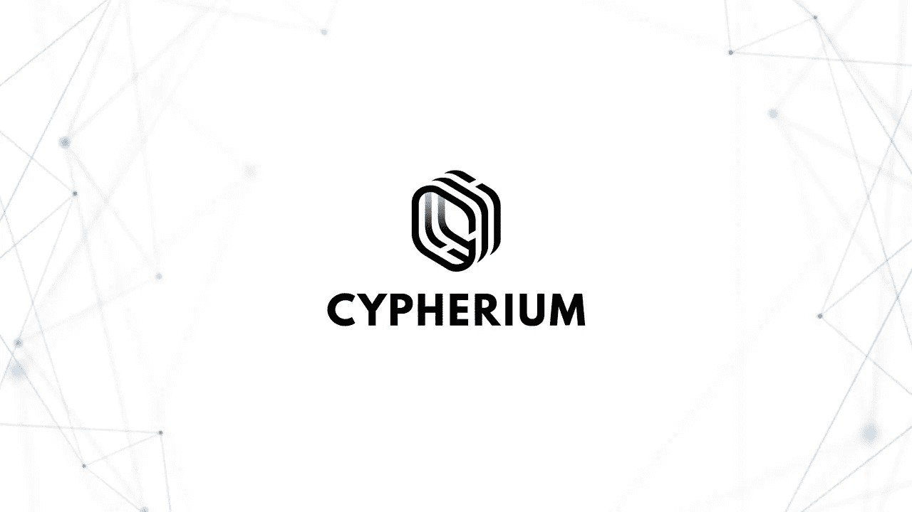
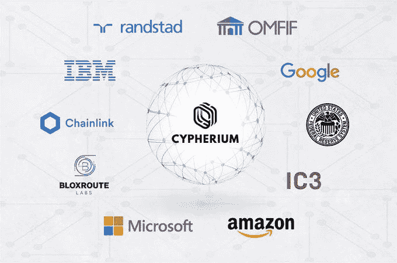
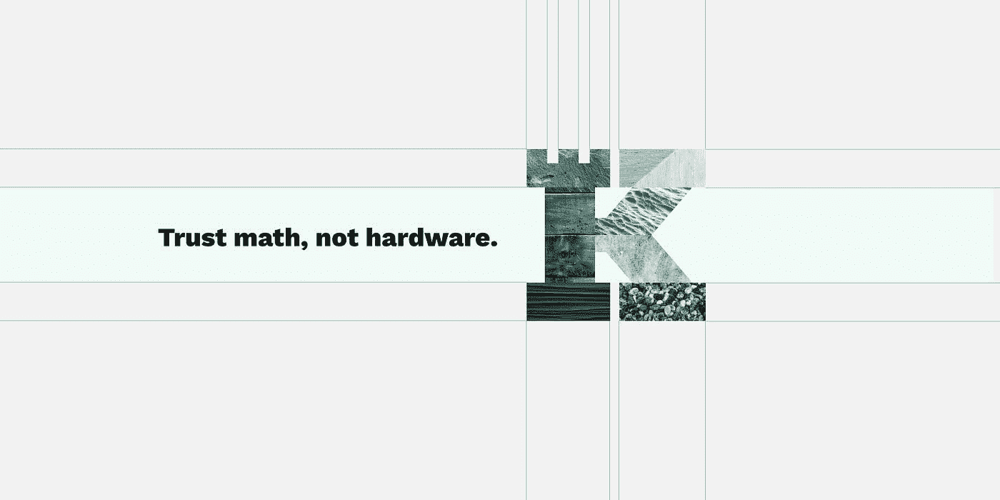
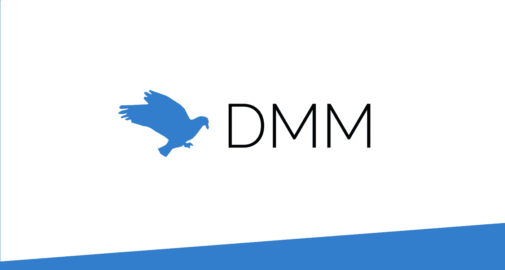
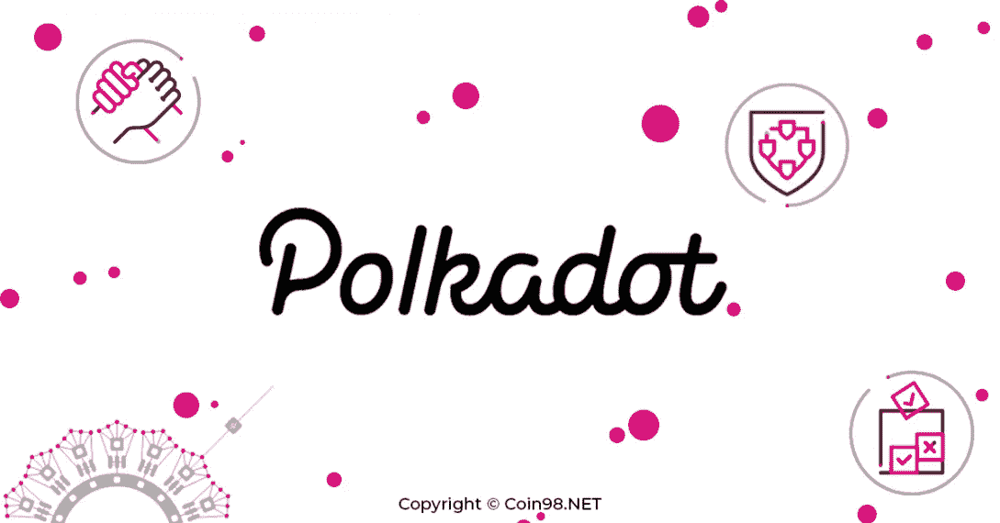

# 这些会是 2020 年最热门的项目吗？

> 原文：<https://medium.datadriveninvestor.com/can-these-be-the-hottest-upcoming-projects-of-2020-289c90f281ea?source=collection_archive---------5----------------------->

先说免责声明。本文基于我的个人观点，不建议投资、买卖任何加密货币项目。加密市场是高度不稳定的，你可能会失去所有的投资。所以在投资之前，总是 DYOR

# Altseason 开始了吗？

我们在上周看到了 dogecoin 的大规模激增。这股热潮是由一个名叫詹姆斯·加兰特的抖音用户发布的一个病毒视频引发的，他鼓励其他抖音用户投资 dogecoin，声称他们可以通过将 doge coin 的价值推高到每枚硬币 1 美元来“致富”。这导致了 dogecoin 中巨大泵。这个泵被大多数秘密军政府视为替代季节开始的象征

根据 OKEx 首席执行官 Jay Hao 的说法，

> 在牛市期间，大多数人会先购买比特币，但他们后来会卖掉自己的比特币来购买替代币。在牛市期间，altcoins 的交易量持续上升，而比特币的交易量开始下降。

如果真正的 Alt 赛季已经开始，我们可以看到 altcoin 的数量增加，可以看到基本面强劲的项目显示出巨大的表现。

 [## 冠状病毒疫情正在重塑区块链吗？该技术如何帮助应对该病毒|数据…

### 当前的冠状病毒疫情已经严重影响了区块链和加密货币行业的方方面面…

www.datadriveninvestor.com](https://www.datadriveninvestor.com/2020/07/15/is-the-coronavirus-pandemic-reshaping-blockchain-and-how-can-the-tech-help-tackle-the-virus/) 

在这篇文章中，我列出了几个即将上市的项目(还没有在任何地方正式上市),这些项目具有很强的基础，一旦上市，可能会表现良好。我故意省略了脸书的 Libra 项目，因为不清楚加密货币是否会在今年推出。

# 柏树属

Cypherium 是一个企业级的区块链项目，它被设计成高度可扩展和健壮的，利用了一种混合设计，该设计具有联合工作证明(PoW)和 HotStuff(也被脸书的 [Libra](https://www.forbes.com/sites/francescoppola/2019/06/30/the-real-threat-from-facebooks-libra-coin/) 采用)共识机制，据称可以在不牺牲去中心化的情况下实现每秒数千个事务。Cypherium 旨在实现可伸缩性、分散化和商业化。

Cypherium 已经在 2016 年开始了该项目的开发，他们都准备在未来几个月推出他们的 mainnet。他们最近完成了第一轮 Mainnet 初始发行(IMO ),现在正在进行最后一轮 IMO。他们还通过[谷歌](https://cloud.google.com/)、[亚马逊](https://aws.amazon.com/)、[微软](https://azure.microsoft.com/en-us/)和 [IBM](https://www.ibm.com/cloud) 的堆栈平台，将 Cypherium Enterprise 作为区块链即服务提供给企业客户。

Cypherium 还与谷歌、IBM、Randstad、亚马逊、微软等公司建立了合作关系。在这些合作关系中，Randstand 拿走了蛋糕，因为 Randstad 将使用 Cypherium 区块链和谷歌云的组合来更有效地将人才与企业需求相匹配，并解放团队来做更多增值工作。

除了是企业领域的领跑者之外，Cypherium 还是全球中央银行智库 OMFIF 数字货币研究所(DMI)的创始成员，目前还在积极开发数字货币互操作性框架(DCIF)，该框架旨在解决采用中央银行数字货币(CBDCs)所面临的各种挑战。

Cypherium 预计将于第三季度初面向散户投资者发售，无论是作为 IEO 还是直接通过集中交易所推出，都将是 once 投资组合的一大补充。

# 保持网络

[Keep Network](https://keep.network/) 由 Matt Luongo 和 Corbin Pon 于 2017 年创立。Keep Network 已经完成了由 Paradigm、Fenbushi Capital、ParaFI Capital、A.Capital 和 Collaborative Fund 牵头的 770 万美元的私人代币销售。

Keep Network 是 tBTC 项目的开源贡献者，该项目使基于比特币的资产能够部署在以太坊区块链上。它的特点是为私有数据提供称为 keeps 的外链容器。网络随机地将 keeps 分配给一个被称为签名者的参与者系统，该系统帮助存储和管理这些数据容器。Keep 的核心应用程序 Random Beacon 提供了这种随机性来源，旨在确保个人签名者无法解码存储在网络中的信息。每个参与者都持有令牌作为签名者，以换取服务费。

最近,[比特币基地](https://blog.coinbase.com/coinbase-continues-to-explore-support-for-new-digital-assets-2c5b84813fcf)正式通知说，它正在研究一批将在 Coinsbase 上市的新资产，其中也包括 KEEP Network。到目前为止，该项目尚未在任何交易所上市，仅在 Uniswap、Loopring 等指数中交易。

# Aleph.im (ALEPH)

[Aleph.im](https://aleph.im/) 由 Moshe Malawach 创立，是一个分布式云平台，为其用户提供无服务器可信计算服务、文件存储和数据库托管。Aleph 提供了一个分散的解决方案，可以与传统的集中式云计算相媲美。由于其可扩展的对等网络和程序语言无关的接口，它提供了任何链的 dApps 对数据库解决方案的即时访问。

Aleph.im 旨在通过成为第一个云原生区块链，彻底改变我们所知的物联网、网络和云。Aleph 的吸引力在于，它是第一个允许任何开发人员构建大型应用程序硬件设备的同类项目，这些设备可以与强大的分布式云(aleph.im！)等等很多。

到目前为止，还没有一个正式的上市，但令牌是在 Uniswap 和其他 DEX 交易，并有一个从加密社区的巨大粉丝。

# Defi 货币市场

[DMM](https://defimoneymarket.com/) 是一个即将到来的 DeFi 项目，旨在建立一个分散的协议，通过将以太坊数字资产借给现实世界的资产，如车辆、房地产等，来赚取利息(收益)..作为抵押品。DMM 建立在以太坊区块链的基础上，以透明、信任最小化、过度抵押和无许可的方式将产生利息的真实世界资产连接到分散金融(DeFi)生态系统中

投资者将能够在 DMM 协议中锁定他们的基金(ETH、戴、)，DMM 将把它们借给借款人，以获得真实资产作为抵押，产生的利润将作为利息分配给投资者。

在亿万富翁风险投资家蒂姆·德雷珀的支持下，DMM 最近完成了其 ICO，在 48 小时内筹集了 650 万美元。到目前为止，还没有正式上市，但在 Uniswap 上，代币的交易价格是 1.2 美元，是 0.36 美元初始售价的 4 倍多。

# 波尔卡多特

Polkadot 和 Cosmos 一样，寻求解决众所周知的可伸缩性和互操作性问题。该项目将自己描述为比特币或以太坊等网络的补充性和非竞争性技术。Polkadot 寻求实现一个独立的区块链可以通过“中继链”交换信息和交易的互联网，遵循可伸缩性、治理和互操作性的原则。

构成网络的可以是私有的、联盟的或公共的。Polkadot 使用一个利益相关证明实现来提供一个经济激励来保护系统。

Polkadot 并不是一个新项目。在 2017 年 ICO rush 的高峰期，它已经筹集了 1.45 亿美元。Polkadot 最大的优势是 Polkadot，这个团队拥有以太坊联合创始人 Gavin Wood、Web3 基金会技术总监 Peter Czaban 和 Thiel Fellow Robert Haber Meier 等人才。

经过漫长的等待后，Polkadot 预计将在市场上推出，并将成为 once 投资组合的一个有趣补充。

## 结论

上面提到的项目都是新一季 Altcoin 的最前沿。这将在未来几个月内席卷加密世界

**访问专家视图—** [**订阅 DDI 英特尔**](https://datadriveninvestor.com/ddi-intel)