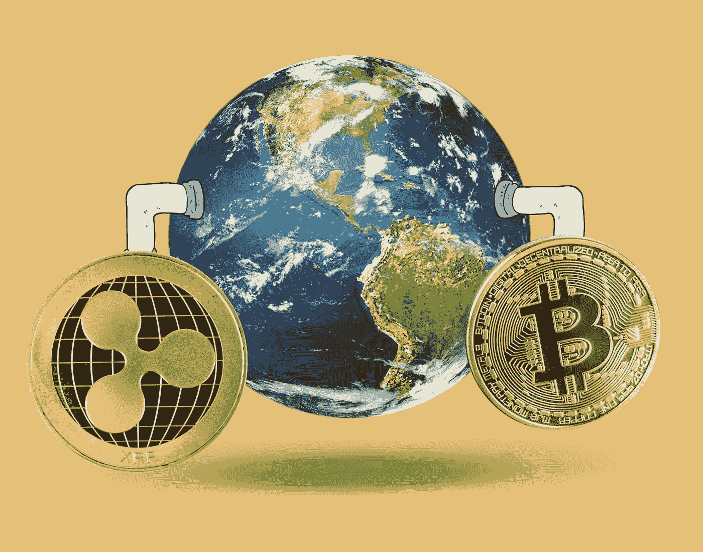
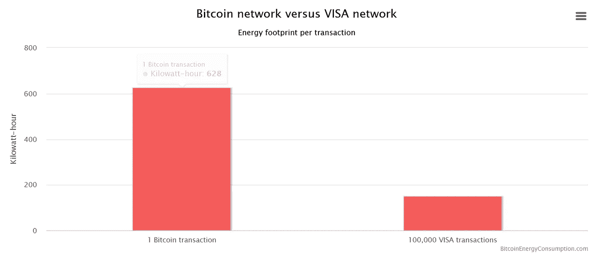
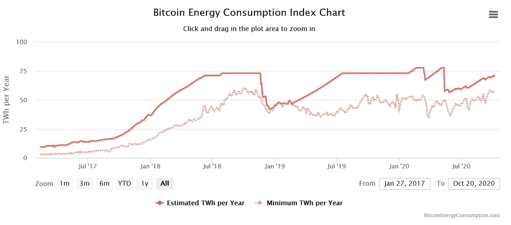

# 这种加密货币能让 fintech 变绿吗？

> 原文：<https://medium.datadriveninvestor.com/can-this-cryptocurrency-turn-fintech-green-253000234959?source=collection_archive---------10----------------------->

## 比特币震撼了世界，这枚硬币试图修复世界。

[Sustainable Review Media](http://sustainablereview.com)

我已经被数字货币的世界吞没了，我承认我倾向于使用像比特币这样的去中心化的区块链网络。事实上，我一整天的工作都依赖以太坊网络的可靠性。但就连我都知道，比特币(以及其他密码)并非没有缺点。

首先，加密货币之母需要大量能量。

# 即使是数字硬币也需要化石燃料

是的，历史上(在 cryptos 的上下文中使用‘历史性’很奇怪，但话说回来，比特币与任何主流社交媒体的年龄差不多)，比特币一直因其高能量输出而受到批评。

随着价格(在一定程度上)稳定，比特币挖矿已经成为一个可靠的收入来源。像任何正常运转的资本主义者一样，硬币矿工正在建设最强大的数据中心，以获得更大的蛋糕。许多这样的数据中心依赖于一些传统的化石燃料。

结果呢？你可以把两个和两个放在一起。现在整个比特币网络消耗的能源比一些国家还多。

下图比较了一笔比特币交易与 10 万笔 visa 交易的能源足迹。请记住，签证办公室的能源输出没有计入这一指标，这使得比较远非完美，但它确实为开采和交易硬币需要多少能源提供了一个参考点。

 [## 完美的加密交易策略|数据驱动的投资者

### 如果你在交易游戏中已经有一段时间了，你可能听说过“支点”和“VWAP”前者听起来像…

www.datadriveninvestor.com](https://www.datadriveninvestor.com/2020/08/31/the-perfect-crypto-trading-strategy/) 

如果你想更多地了解比特币和 Visa 的足迹，你可以阅读 [Hackernoon 对这种比较的批评](https://sustainablereview.com?mailpoet_router&endpoint=track&action=click&data=WyI0NiIsInFmcDhndTRyd2lvazQ0Z2c0ZzA0a3Nra2djODQwNHNjIiwiNzIiLCJlOGI1YzM5OGE4NjIiLGZhbHNlXQ)。我认为他们解释得很好。

不管是不是团队加密，事实是比特币的能耗已经达到或接近峰值水平。价格目标是坚定的。可信的投资者认为比特币前景光明。彭博情报部门认为，到 2025 年，这个数字可能会达到[10 万美元。随着它变得越来越诱人，比特币矿工将会尽可能地生产更多的比特币，而环境因素将会被搁置一旁。](https://sustainablereview.com?mailpoet_router&endpoint=track&action=click&data=WyI0NiIsInFmcDhndTRyd2lvazQ0Z2c0ZzA0a3Nra2djODQwNHNjIiwiNzIiLCI2YmI4OWRkMDNkNzgiLGZhbHNlXQ)

好消息是什么？有更多可持续的选择。并非所有的密码都使用相同的过程。

# Ripple 能改变金融科技的能源游戏吗？

好吧，所以比特币消耗大量能源，而加密技术将会继续存在。那么，热爱自然的人能做些什么呢？

嗯，碰巧市场上还有许多其他加密的非法定货币。其中之一就是瑞波(XRP)。相比于挖掘比特币所需的 45.1 亿个灯泡小时，《XRP 纪事报》只用了 7.9 万个小时。

正如区块链技术所说，

> 运行一台 XRP 总账服务器相当于运行一台小型电子邮件服务器，但仍有能力支持全球支付交易。

这是很强大的东西。全球银行都在关注此事。全球银行业每年消耗约 100 太瓦时，如果数字支付替代品打绿卡，可爱的市场机会可能很快变成威胁。他们知道。

上周，Ripple 的首席执行官做出了一个雄心勃勃的承诺，与保护落基山研究所和 REBA 合作，到 2030 年实现碳净零，并迫使其他加密公司也这样做。要实现这一目标还需要做很多事情，但 Ripple 希望到 2030 年实现三个主要目标:

*   全面衡量和减少其碳足迹，并在 Ripple 有办事处和员工的市场购买清洁的可再生能源
*   资助创新的碳去除技术，目标是去除所有剩余的排放
*   扩大与创新保护组织和学术界的伙伴关系

当我写这篇文章时，XRP 的定价是 0.25 美元。与比特币不同，Ripple 在成立之初就有有限的供应量(1000 亿)，这使得它更容易控制采矿活动并减轻其环境足迹。

不知道 Ripple，以太坊，比特币有没有一天会取代欧元，美元，人民币。话虽如此，为什么不赌上一美元，赌他们有朝一日能做到呢？*

*   *免责声明:此内容仅用于信息和教育目的，不应被理解为专业的财务建议。如果你需要这样的建议，请咨询有执照的财务或税务顾问。*

## 获得专家视图— [订阅 DDI 英特尔](https://datadriveninvestor.com/ddi-intel)